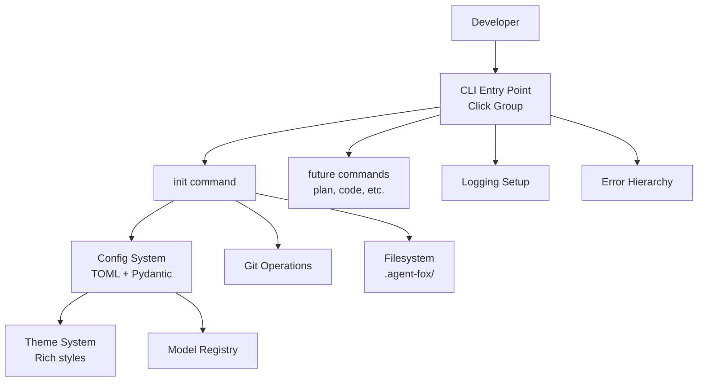

# Design Document: Core Foundation

## Overview

This spec establishes the project skeleton for agent-fox v2. It creates the
package structure, CLI framework, configuration system, init command, error
hierarchy, model registry, logging, and terminal theme. All subsequent specs
import from and extend this foundation.

## Architecture



### Module Responsibilities

1. `agent_fox/cli/app.py` — Click group, banner display, global options
2. `agent_fox/cli/init.py` — `agent-fox init` command implementation
3. `agent_fox/core/config.py` — TOML loading, pydantic config models, defaults
4. `agent_fox/core/types.py` — Shared domain dataclasses (NodeStatus, etc.)
5. `agent_fox/core/errors.py` — Exception hierarchy
6. `agent_fox/core/models.py` — AI model registry with pricing
7. `agent_fox/infra/logging.py` — Logging configuration
8. `agent_fox/ui/theme.py` — Rich theme with configurable color roles
9. `agent_fox/ui/banner.py` — CLI banner rendering

## Components and Interfaces

### CLI Entry Point

```python
# agent_fox/cli/app.py
import click

class BannerGroup(click.Group):
    """Custom Click group that displays a themed banner."""
    def invoke(self, ctx: click.Context) -> None: ...

@click.group(cls=BannerGroup)
@click.version_option()
@click.option("--verbose", "-v", is_flag=True, help="Enable debug logging")
@click.option("--quiet", "-q", is_flag=True, help="Suppress info messages")
@click.pass_context
def main(ctx: click.Context, verbose: bool, quiet: bool) -> None:
    """agent-fox: autonomous coding-agent orchestrator."""
    ctx.ensure_object(dict)
    setup_logging(verbose=verbose, quiet=quiet)
    ctx.obj["config"] = load_config()
```

### Configuration Models

```python
# agent_fox/core/config.py
from pydantic import BaseModel, Field

class OrchestratorConfig(BaseModel):
    parallel: int = Field(default=1, ge=1, le=8)
    sync_interval: int = Field(default=5, ge=0)
    hot_load: bool = True
    max_retries: int = Field(default=2, ge=0)
    session_timeout: int = Field(default=30, ge=1)  # minutes
    inter_session_delay: int = Field(default=3, ge=0)  # seconds
    max_cost: float | None = None
    max_sessions: int | None = None

class ModelConfig(BaseModel):
    coding: str = "ADVANCED"
    coordinator: str = "STANDARD"
    memory_extraction: str = "SIMPLE"
    embedding: str = "voyage-3"

class HookConfig(BaseModel):
    pre_code: list[str] = Field(default_factory=list)
    post_code: list[str] = Field(default_factory=list)
    sync_barrier: list[str] = Field(default_factory=list)
    timeout: int = Field(default=300, ge=1)
    modes: dict[str, str] = Field(default_factory=dict)  # script -> "abort"|"warn"

class SecurityConfig(BaseModel):
    bash_allowlist: list[str] | None = None      # replaces defaults
    bash_allowlist_extend: list[str] = Field(default_factory=list)

class ThemeConfig(BaseModel):
    playful: bool = True
    header: str = "bold #ff8c00"
    success: str = "bold green"
    error: str = "bold red"
    warning: str = "bold yellow"
    info: str = "#daa520"
    tool: str = "bold #cd853f"
    muted: str = "dim"

class PlatformConfig(BaseModel):
    type: str = "none"  # "none" | "github"
    pr_granularity: str = "session"  # "session" | "spec"
    wait_for_ci: bool = False
    wait_for_review: bool = False
    auto_merge: bool = False
    ci_timeout: int = Field(default=600, ge=0)
    labels: list[str] = Field(default_factory=list)

class MemoryConfig(BaseModel):
    model: str = "SIMPLE"

class KnowledgeConfig(BaseModel):
    store_path: str = ".agent-fox/knowledge.duckdb"
    embedding_model: str = "all-MiniLM-L6-v2"
    embedding_dimensions: int = 384
    ask_top_k: int = Field(default=20, ge=1)
    ask_synthesis_model: str = "STANDARD"

class AgentFoxConfig(BaseModel):
    orchestrator: OrchestratorConfig = Field(default_factory=OrchestratorConfig)
    models: ModelConfig = Field(default_factory=ModelConfig)
    hooks: HookConfig = Field(default_factory=HookConfig)
    security: SecurityConfig = Field(default_factory=SecurityConfig)
    theme: ThemeConfig = Field(default_factory=ThemeConfig)
    platform: PlatformConfig = Field(default_factory=PlatformConfig)
    memory: MemoryConfig = Field(default_factory=MemoryConfig)
    knowledge: KnowledgeConfig = Field(default_factory=KnowledgeConfig)

def load_config(path: Path | None = None) -> AgentFoxConfig:
    """Load config from TOML, validate, merge with defaults."""
    ...
```

### Error Hierarchy

```python
# agent_fox/core/errors.py

class AgentFoxError(Exception):
    """Base exception for all agent-fox errors."""
    def __init__(self, message: str, **context: Any) -> None:
        super().__init__(message)
        self.context = context

class ConfigError(AgentFoxError): ...
class InitError(AgentFoxError): ...
class PlanError(AgentFoxError): ...
class SessionError(AgentFoxError): ...
class WorkspaceError(AgentFoxError): ...
class IntegrationError(AgentFoxError): ...
class HookError(AgentFoxError): ...
class SessionTimeoutError(AgentFoxError): ...
class CostLimitError(AgentFoxError): ...
class SecurityError(AgentFoxError): ...
class KnowledgeStoreError(AgentFoxError): ...
```

### Model Registry

```python
# agent_fox/core/models.py
from dataclasses import dataclass
from enum import Enum

class ModelTier(str, Enum):
    SIMPLE = "SIMPLE"
    STANDARD = "STANDARD"
    ADVANCED = "ADVANCED"

@dataclass(frozen=True)
class ModelEntry:
    model_id: str
    tier: ModelTier
    input_price_per_m: float   # USD per million input tokens
    output_price_per_m: float  # USD per million output tokens

MODEL_REGISTRY: dict[str, ModelEntry] = {
    "claude-haiku-4-5-20251001": ModelEntry("claude-haiku-4-5", ModelTier.SIMPLE, 1.00, 5.00),
    "claude-sonnet-4-6": ModelEntry("claude-sonnet-4-6", ModelTier.STANDARD, 3.00, 15.00),
    "claude-opus-4-6": ModelEntry("claude-opus-4-6", ModelTier.ADVANCED, 5.00, 25.00),
}

TIER_DEFAULTS: dict[ModelTier, str] = {
    ModelTier.SIMPLE: "claude-haiku-4-5-20251001",
    ModelTier.STANDARD: "claude-sonnet-4-6",
    ModelTier.ADVANCED: "claude-opus-4-6",
}

def resolve_model(name: str) -> ModelEntry:
    """Resolve a tier name or model ID to a ModelEntry."""
    ...

def calculate_cost(input_tokens: int, output_tokens: int, model: ModelEntry) -> float:
    """Calculate estimated cost in USD."""
    ...
```

### Theme System

```python
# agent_fox/ui/theme.py
from rich.console import Console
from rich.theme import Theme

@dataclass
class AppTheme:
    config: ThemeConfig
    console: Console

    def styled(self, text: str, role: str) -> str: ...
    def print(self, text: str, role: str = "info") -> None: ...
    def success(self, text: str) -> None: ...
    def error(self, text: str) -> None: ...
    def warning(self, text: str) -> None: ...
    def header(self, text: str) -> None: ...
    def playful(self, key: str) -> str:
        """Return playful or neutral message based on config."""
        ...

def create_theme(config: ThemeConfig) -> AppTheme: ...
```

## Data Models

### Project Directory Structure

```
.agent-fox/
  config.toml          # Project configuration (git-tracked)
  hooks/               # User hook scripts
  worktrees/           # Session workspaces (gitignored)
  memory.jsonl         # Structured facts (git-tracked)
  state.jsonl          # Execution state (git-tracked)
  knowledge.duckdb     # Knowledge store (gitignored)
```

### .gitignore Entries

```gitignore
# agent-fox
.agent-fox/*
!.agent-fox/config.toml
!.agent-fox/memory.jsonl
!.agent-fox/state.jsonl
```

### pyproject.toml (Key Sections)

```toml
[project]
name = "agent-fox"
requires-python = ">=3.12"
dependencies = [
    "click>=8.1",
    "pydantic>=2.0",
    "rich>=13.0",
    "anthropic>=0.40",
    "claude-code-sdk>=0.1",
]

[project.scripts]
agent-fox = "agent_fox.cli.app:main"

[build-system]
requires = ["hatchling"]
build-backend = "hatchling.build"

[tool.ruff]
target-version = "py312"
select = ["E", "F", "W", "I", "UP"]

[tool.mypy]
python_version = "3.12"
check_untyped_defs = true

[tool.pytest.ini_options]
testpaths = ["tests"]
```

## Correctness Properties

### Property 1: Config Defaults Completeness

*For any* valid but empty TOML file, the `load_config()` function SHALL return
an `AgentFoxConfig` instance where every field has its documented default value.

**Validates:** 01-REQ-2.1, 01-REQ-2.3

### Property 2: Config Validation Rejects Invalid Types

*For any* TOML file where a field value has the wrong type (e.g., a string where
an integer is expected), `load_config()` SHALL raise a `ConfigError` identifying
the invalid field.

**Validates:** 01-REQ-2.2

### Property 3: Config Merge Precedence

*For any* configuration where a value is set in both the TOML file and as a
CLI option, the CLI option value SHALL be the one present in the loaded config.

**Validates:** 01-REQ-2.5

### Property 4: Init Idempotency

*For any* project directory, running `init` twice SHALL produce the same
filesystem state as running it once, and the second run SHALL not overwrite
any file that existed after the first run.

**Validates:** 01-REQ-3.3, 01-REQ-3.E1

### Property 5: Model Registry Completeness

*For any* model tier in the `ModelTier` enum, `resolve_model(tier.value)` SHALL
return a `ModelEntry` with a non-empty `model_id` and non-negative prices.

**Validates:** 01-REQ-5.1, 01-REQ-5.3

### Property 6: Cost Calculation Non-Negativity

*For any* non-negative token counts and any valid `ModelEntry`, `calculate_cost()`
SHALL return a non-negative float.

**Validates:** 01-REQ-5.4

### Property 7: Error Hierarchy Completeness

*For any* exception class in the error hierarchy, it SHALL be a subclass of
`AgentFoxError`, and catching `AgentFoxError` SHALL catch it.

**Validates:** 01-REQ-4.1, 01-REQ-4.2

### Property 8: Numeric Config Clamping

*For any* numeric configuration value outside its valid range, `load_config()`
SHALL clamp it to the nearest valid bound rather than rejecting the file.

**Validates:** 01-REQ-2.E3

## Error Handling

| Error Condition | Behavior | Requirement |
|----------------|----------|-------------|
| Config file missing | Use all defaults | 01-REQ-2.E1 |
| Config file invalid TOML | Exit with parse error, code 1 | 01-REQ-2.E2 |
| Config field wrong type | Raise ConfigError with details | 01-REQ-2.2 |
| Config numeric out of range | Clamp to valid bound, log warning | 01-REQ-2.E3 |
| Unrecognized config keys | Log warning, ignore | 01-REQ-2.6 |
| Init outside git repo | Exit with error, code 1 | 01-REQ-3.E1 |
| Unknown CLI subcommand | Print error identifying unknown command, exit code 2 | 01-REQ-1.E1 |
| Unknown model ID | Raise ConfigError with valid options | 01-REQ-5.E1 |
| Invalid theme color | Fall back to default, log warning | 01-REQ-7.E1 |
| Unhandled exception at CLI | Log traceback at DEBUG, print message, exit 1 | 01-REQ-4.E1 |

## Technology Stack

| Technology | Version | Purpose |
|-----------|---------|---------|
| Python | 3.12+ | Runtime |
| uv | latest | Package management |
| hatchling | latest | Build backend |
| Click | 8.1+ | CLI framework |
| Pydantic | 2.0+ | Configuration validation |
| Rich | 13.0+ | Terminal UI |
| ruff | 0.15+ | Linting and formatting |
| mypy | 1.10+ | Type checking |
| pytest | 8.0+ | Test framework |
| hypothesis | 6.0+ | Property-based testing |

## Definition of Done

A task group is complete when ALL of the following are true:

1. All subtasks within the group are checked off (`[x]`)
2. All spec tests (`test_spec.md` entries) for the task group pass
3. All property tests for the task group pass
4. All previously passing tests still pass (no regressions)
5. No linter warnings or errors introduced
6. Code is committed on a feature branch and pushed to remote
7. Feature branch is merged back to `develop`
8. `tasks.md` checkboxes are updated to reflect completion

## Testing Strategy

- **Unit tests** validate individual functions: config loading, model resolution,
  cost calculation, error construction, theme creation.
- **Property tests** (Hypothesis) verify invariants: config defaults completeness,
  numeric clamping, cost non-negativity, error hierarchy.
- **Integration tests** verify the init command end-to-end in a temporary git
  repository: directory creation, config generation, branch creation, idempotency.
