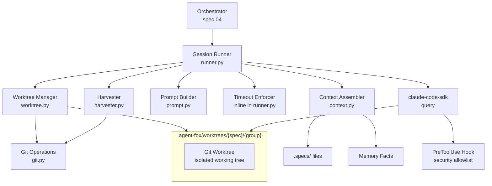

# Design Document: Session and Workspace

## Overview

This spec implements the execution layer for agent-fox v2: the isolated git
worktree workspaces, the async session runner backed by the claude-code-sdk,
context assembly, prompt construction, timeout enforcement, and the harvester
that merges completed work into the development branch.

## Architecture



### Module Responsibilities

1. `agent_fox/workspace/worktree.py` -- Create and destroy git worktrees at
   `.agent-fox/worktrees/{spec}/{group}`, manage feature branches
2. `agent_fox/workspace/git.py` -- Git operations: branch create/delete,
   checkout, merge, rebase, commit detection
3. `agent_fox/workspace/harvester.py` -- Validate and merge worktree changes
   back to develop; handle conflicts via rebase retry
4. `agent_fox/session/runner.py` -- Execute a coding session: assemble
   context, build prompt, invoke SDK, enforce timeout, capture outcome
5. `agent_fox/session/context.py` -- Assemble task-specific context from spec
   docs and memory facts
6. `agent_fox/session/prompt.py` -- Build system and task prompts for the
   coding agent
7. `agent_fox/session/runner.py` also defines `with_timeout()` inline --
   wraps async coroutines with `asyncio.wait_for()` timeout enforcement
   (there is no separate `timeout.py` module)

## Components and Interfaces

### Worktree Manager

```python
# agent_fox/workspace/worktree.py
from dataclasses import dataclass
from pathlib import Path


@dataclass(frozen=True)
class WorkspaceInfo:
    """Metadata about a created workspace."""
    path: Path
    branch: str
    spec_name: str
    task_group: int


async def create_worktree(
    repo_root: Path,
    spec_name: str,
    task_group: int,
    base_branch: str = "develop",
) -> WorkspaceInfo:
    """Create an isolated git worktree for a coding session.

    Creates a worktree at .agent-fox/worktrees/{spec_name}/{task_group}
    with a feature branch named feature/{spec_name}/{task_group}.

    If a stale worktree or branch exists, it is removed first.

    Raises:
        WorkspaceError: If worktree creation fails.
    """
    ...


async def destroy_worktree(
    repo_root: Path,
    workspace: WorkspaceInfo,
) -> None:
    """Remove a git worktree and its feature branch.

    Removes the worktree directory, prunes the worktree registry,
    and deletes the feature branch. Cleans up empty spec directories.

    Does not raise if the worktree or branch is already gone.
    """
    ...
```

### Git Operations

```python
# agent_fox/workspace/git.py
from pathlib import Path


async def create_branch(
    repo_path: Path,
    branch_name: str,
    start_point: str,
) -> None:
    """Create a new git branch at the given start point.

    Raises:
        WorkspaceError: If branch creation fails.
    """
    ...


async def delete_branch(
    repo_path: Path,
    branch_name: str,
    force: bool = False,
) -> None:
    """Delete a local git branch.

    Logs a warning and returns if the branch does not exist.

    Raises:
        WorkspaceError: If deletion fails for reasons other than
            the branch not existing.
    """
    ...


async def checkout_branch(
    repo_path: Path,
    branch_name: str,
) -> None:
    """Check out a branch in the given working directory.

    Raises:
        WorkspaceError: If checkout fails.
    """
    ...


async def has_new_commits(
    repo_path: Path,
    branch: str,
    base: str,
) -> bool:
    """Check if branch has commits not in base.

    Returns True if there are commits on `branch` that are not
    reachable from `base`.
    """
    ...


async def get_changed_files(
    repo_path: Path,
    branch: str,
    base: str,
) -> list[str]:
    """Return list of files changed between base and branch."""
    ...


async def merge_fast_forward(
    repo_path: Path,
    branch: str,
) -> None:
    """Attempt a fast-forward-only merge of branch into HEAD.

    Raises:
        IntegrationError: If fast-forward is not possible.
    """
    ...


async def rebase_onto(
    repo_path: Path,
    branch: str,
    onto: str,
) -> None:
    """Rebase branch onto the given target.

    Raises:
        IntegrationError: If rebase fails (conflicts).
    """
    ...


async def abort_rebase(repo_path: Path) -> None:
    """Abort an in-progress rebase."""
    ...


async def run_git(
    args: list[str],
    cwd: Path,
    check: bool = True,
) -> tuple[int, str, str]:
    """Run a git command and return (returncode, stdout, stderr).

    When check=True and the command fails, raises WorkspaceError.
    """
    ...
```

### Harvester

```python
# agent_fox/workspace/harvester.py
from pathlib import Path

from agent_fox.workspace.worktree import WorkspaceInfo


async def harvest(
    repo_root: Path,
    workspace: WorkspaceInfo,
    dev_branch: str = "develop",
) -> list[str]:
    """Integrate a workspace's changes into the development branch.

    Steps:
    1. Check if the feature branch has new commits relative to
       dev_branch. If not, return an empty list (no-op).
    2. Checkout dev_branch in the main repo.
    3. Attempt a fast-forward merge of the feature branch.
    4. If fast-forward fails, rebase the feature branch onto
       dev_branch and retry the merge.
    5. If rebase fails, abort and raise IntegrationError.
    6. Return the list of changed files.

    Raises:
        IntegrationError: If merge fails after rebase retry.
    """
    ...
```

### Session Runner

```python
# agent_fox/session/runner.py
import asyncio
from dataclasses import dataclass, field
from pathlib import Path

from agent_fox.core.config import AgentFoxConfig
from agent_fox.workspace.worktree import WorkspaceInfo


@dataclass(frozen=True)
class SessionOutcome:
    """Result of a coding session."""
    spec_name: str
    task_group: int
    node_id: str
    status: str  # "completed" | "failed" | "timeout"
    files_touched: list[str] = field(default_factory=list)
    input_tokens: int = 0
    output_tokens: int = 0
    duration_ms: int = 0
    error_message: str | None = None


async def run_session(
    workspace: WorkspaceInfo,
    node_id: str,
    system_prompt: str,
    task_prompt: str,
    config: AgentFoxConfig,
) -> SessionOutcome:
    """Execute a coding session in the given workspace.

    1. Build ClaudeAgentOptions with:
       - cwd = workspace.path
       - model = resolved coding model
       - system_prompt = provided system prompt
       - permission_mode = "bypassPermissions"
       - hooks = PreToolUse allowlist hook
    2. Call query(prompt=task_prompt, options=options)
    3. Iterate messages, collecting the final ResultMessage
    4. Wrap the entire query in asyncio.wait_for with the
       configured session_timeout
    5. Build and return a SessionOutcome

    Raises:
        SessionTimeoutError: Propagated if caller does not catch.
        SessionError: On SDK errors.
    """
    ...


def build_allowlist_hook(
    config: AgentFoxConfig,
) -> dict:
    """Build a PreToolUse hook configuration for the command allowlist.

    Returns a dict suitable for ClaudeAgentOptions.hooks with a
    PreToolUse matcher that intercepts Bash tool invocations and
    blocks commands not on the effective allowlist.

    The effective allowlist is:
    - config.security.bash_allowlist (if set, replaces defaults)
    - OR: DEFAULT_ALLOWLIST + config.security.bash_allowlist_extend
    """
    ...
```

### Context Assembler

```python
# agent_fox/session/context.py
from pathlib import Path


def assemble_context(
    spec_dir: Path,
    task_group: int,
    memory_facts: list[str] | None = None,
) -> str:
    """Assemble task-specific context for a coding session.

    Reads the following files from spec_dir (if they exist):
    - requirements.md
    - design.md
    - test_spec.md
    - tasks.md

    Appends relevant memory facts (if provided).

    Returns a formatted string with section headers.

    Logs a warning for any missing spec file but does not raise.
    """
    ...
```

### Prompt Builder

```python
# agent_fox/session/prompt.py


def build_system_prompt(
    context: str,
    task_group: int,
    spec_name: str,
) -> str:
    """Build the system prompt for a coding session.

    The system prompt instructs the agent to:
    - Act as an expert developer implementing a spec
    - Follow the acceptance criteria in the provided context
    - Work only on the specified task group
    - Commit changes on the current branch
    - Run tests and linters before committing

    Returns the complete system prompt string.
    """
    ...


def build_task_prompt(
    task_group: int,
    spec_name: str,
) -> str:
    """Build the task prompt for a coding session.

    The task prompt tells the agent specifically which task group
    to implement, referencing the tasks.md structure.

    Returns the task prompt string.
    """
    ...
```

### Timeout Enforcer (inline in runner.py)

```python
# Defined inline in agent_fox/session/runner.py (no separate timeout module)
import asyncio
from collections.abc import Coroutine
from typing import TypeVar

T = TypeVar("T")


async def with_timeout(
    coro: Coroutine[None, None, T],
    timeout_minutes: int,
) -> T:
    """Run a coroutine with a timeout.

    Wraps the coroutine in asyncio.wait_for() with the timeout
    converted from minutes to seconds.

    Raises:
        asyncio.TimeoutError: If the coroutine exceeds the timeout.
    """
    return await asyncio.wait_for(coro, timeout=timeout_minutes * 60)
```

## Data Models

### SessionOutcome

```python
@dataclass(frozen=True)
class SessionOutcome:
    spec_name: str           # e.g., "03_session_and_workspace"
    task_group: int          # e.g., 2
    node_id: str             # DAG node identifier, e.g., "03:2"
    status: str              # "completed" | "failed" | "timeout"
    files_touched: list[str] # relative paths of changed files
    input_tokens: int        # from ResultMessage.usage
    output_tokens: int       # from ResultMessage.usage
    duration_ms: int         # from ResultMessage.duration_ms
    error_message: str | None  # None on success
```

### WorkspaceInfo

```python
@dataclass(frozen=True)
class WorkspaceInfo:
    path: Path               # e.g., /repo/.agent-fox/worktrees/03_session/2
    branch: str              # e.g., "feature/03_session/2"
    spec_name: str           # e.g., "03_session_and_workspace"
    task_group: int          # e.g., 2
```

### Workspace Layout

```
.agent-fox/
  worktrees/                  # gitignored
    03_session_and_workspace/
      1/                      # worktree for task group 1
        .git -> /repo/.git/worktrees/...
        agent_fox/
        tests/
        ...
      2/                      # worktree for task group 2
    04_orchestrator/
      1/
```

### Feature Branch Naming

```
feature/{spec_name}/{task_group}

Examples:
  feature/03_session_and_workspace/1
  feature/03_session_and_workspace/2
  feature/04_orchestrator/1
```

### Default Command Allowlist

```python
DEFAULT_BASH_ALLOWLIST: list[str] = [
    # Version control
    "git",
    # Package management
    "uv", "pip", "npm", "npx", "yarn", "pnpm",
    # Build and test
    "python", "python3", "pytest", "mypy", "ruff",
    "make", "cargo", "go", "node",
    # File utilities
    "cat", "head", "tail", "less", "wc", "sort", "uniq",
    "find", "grep", "rg", "sed", "awk", "tr", "cut",
    "ls", "tree", "pwd", "basename", "dirname", "realpath",
    "cp", "mv", "rm", "mkdir", "rmdir", "touch", "chmod",
    # System info
    "echo", "printf", "date", "env", "which", "whoami",
    "uname", "diff", "patch", "tee", "xargs",
]
```

## Correctness Properties

### Property 1: Worktree Isolation

*For any* two concurrently created worktrees for different (spec, group) pairs,
they SHALL have disjoint filesystem paths and distinct git branches, ensuring
no shared mutable state.

**Validates:** 03-REQ-1.1, 03-REQ-1.2

### Property 2: Worktree Cleanup Completeness

*For any* workspace that was created and then destroyed, the worktree path
SHALL no longer exist on disk and the feature branch SHALL no longer exist in
the git repository.

**Validates:** 03-REQ-2.1

### Property 3: Session Outcome Completeness

*For any* invocation of `run_session()`, the returned `SessionOutcome` SHALL
have a non-empty `spec_name`, a non-negative `task_group`, a `status` that is
one of `completed`, `failed`, or `timeout`, and non-negative token counts and
duration.

**Validates:** 03-REQ-3.3

### Property 4: Timeout Enforcement

*For any* session with a configured timeout of T minutes, `run_session()` SHALL
return or raise within T minutes plus a small scheduling tolerance (at most 5
seconds).

**Validates:** 03-REQ-6.1, 03-REQ-6.2

### Property 5: Allowlist Enforcement

*For any* Bash tool invocation during a session, if the command's first token is
not in the effective allowlist, the hook SHALL block it and the command SHALL
not execute.

**Validates:** 03-REQ-8.1, 03-REQ-8.2

### Property 6: Harvest Idempotency

*For any* feature branch with no new commits relative to the development branch,
calling `harvest()` SHALL be a no-op and return an empty file list, leaving the
development branch unchanged.

**Validates:** 03-REQ-7.E2

### Property 7: Context Assembly Resilience

*For any* spec directory where one or more expected files are missing, the
context assembler SHALL still return a non-empty string containing the files
that do exist, without raising an exception.

**Validates:** 03-REQ-4.E1

## Error Handling

| Error Condition | Behavior | Requirement |
|----------------|----------|-------------|
| Git worktree creation fails | Raise `WorkspaceError` with git stderr | 03-REQ-1.E3 |
| Stale worktree exists | Remove and re-create | 03-REQ-1.E1 |
| Stale feature branch exists | Delete and re-create | 03-REQ-1.E2 |
| Worktree path does not exist during cleanup | No-op, no error | 03-REQ-2.E1 |
| Branch deletion fails during cleanup | Log warning, continue | 03-REQ-2.E2 |
| claude-code-sdk raises ClaudeSDKError | Catch, wrap in SessionError, return failed outcome | 03-REQ-3.E1 |
| ResultMessage.is_error is True | Return failed outcome with error details | 03-REQ-3.E2 |
| Session exceeds timeout | Cancel query, return timeout outcome with partial metrics | 03-REQ-6.1, 03-REQ-6.E1 |
| Fast-forward merge fails | Rebase and retry | 03-REQ-7.2 |
| Rebase fails (conflicts) | Abort rebase, raise IntegrationError | 03-REQ-7.E1 |
| No new commits on feature branch | No-op, return empty file list | 03-REQ-7.E2 |
| Bash command not on allowlist | Block via hook, return decision: block | 03-REQ-8.2 |
| Empty or unparseable command | Block via hook | 03-REQ-8.E1 |
| Spec document file missing | Skip, log warning | 03-REQ-4.E1 |

## Technology Stack

| Technology | Version | Purpose |
|-----------|---------|---------|
| claude-code-sdk | >=0.1 | Async coding agent execution via `query()` |
| asyncio | stdlib | Timeout enforcement, async execution |
| git | 2.15+ | Worktree management, branch operations, merge/rebase |
| Python | 3.12+ | Runtime |
| pytest | 8.0+ | Test framework |
| pytest-asyncio | latest | Async test support |

## Testing Strategy

- **Unit tests** validate individual functions in isolation: context assembly,
  prompt building, timeout wrapping, allowlist hook logic. SDK calls and git
  operations are mocked.

- **Integration tests** validate git operations end-to-end in temporary
  repositories: worktree creation/destruction, branch management, merge,
  rebase, conflict handling.

- **Property tests** (Hypothesis) verify invariants: worktree path uniqueness,
  outcome field constraints, allowlist enforcement on random command strings.

- **Mocking strategy:** The claude-code-sdk `query()` function is mocked in
  session runner tests to return predetermined message sequences. Git
  operations use real temporary repositories where feasible, with subprocess
  mocks only when simulating git failures.

## Definition of Done

A task group is complete when ALL of the following are true:

1. All subtasks within the group are checked off (`[x]`)
2. All spec tests (`test_spec.md` entries) for the task group pass
3. All property tests for the task group pass
4. All previously passing tests still pass (no regressions)
5. No linter warnings or errors introduced
6. Code is committed on a feature branch and pushed to remote
7. Feature branch is merged back to `develop`
8. `tasks.md` checkboxes are updated to reflect completion
