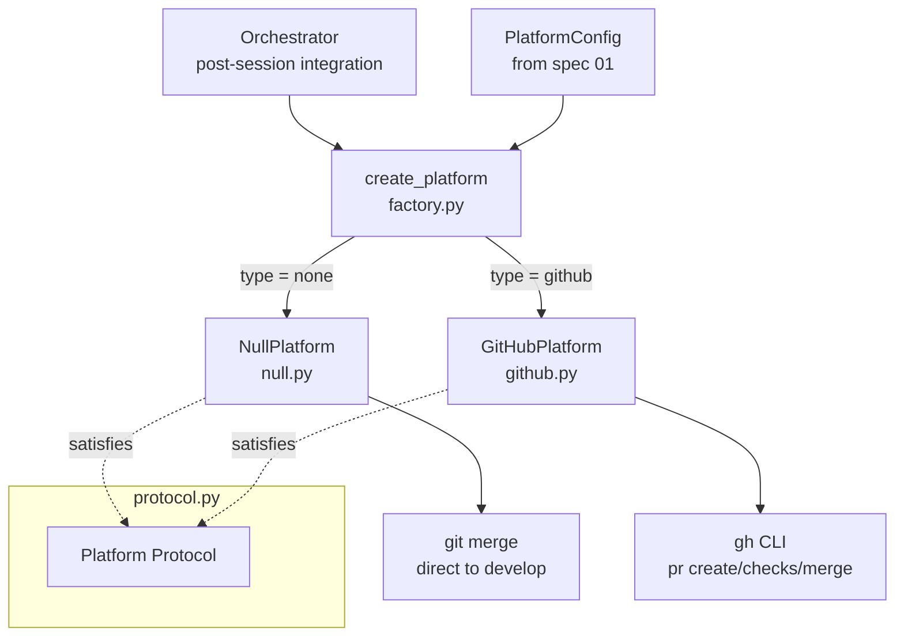

**SUPERSEDED** by spec `19_git_and_platform_overhaul`.
> This spec is retained for historical reference only.

# Design Document: Platform Integration

## Overview

This spec implements the platform integration layer for agent-fox v2. It
provides a `Platform` protocol that abstracts forge-specific PR operations, a
`NullPlatform` for direct-merge behavior (the default), a `GitHubPlatform`
that uses the `gh` CLI for pull request lifecycle operations, and a factory
function that selects the correct implementation based on configuration.

## Architecture



### Module Responsibilities

1. `agent_fox/platform/protocol.py` -- Platform Protocol (abstract interface
   for PR operations)
2. `agent_fox/platform/github.py` -- GitHubPlatform implementation using `gh`
   CLI
3. `agent_fox/platform/null.py` -- NullPlatform: direct merge to develop (no
   PRs)
4. `agent_fox/platform/factory.py` -- `create_platform(config)` factory
   function
5. `agent_fox/platform/__init__.py` -- Package init, re-exports

## Components and Interfaces

### Platform Protocol

```python
# agent_fox/platform/protocol.py
from typing import Protocol


class Platform(Protocol):
    """Abstract interface for forge integration.

    Implementations handle pull request lifecycle operations. The orchestrator
    calls these methods without knowing whether PRs are being created or
    whether work is being merged directly.
    """

    async def create_pr(
        self,
        branch: str,
        title: str,
        body: str,
        labels: list[str],
    ) -> str:
        """Create a pull request or merge directly.

        Args:
            branch: The feature branch to create a PR from.
            title: PR title.
            body: PR body/description.
            labels: Labels to apply to the PR.

        Returns:
            The PR URL as a string, or empty string if no PR was created.

        Raises:
            IntegrationError: If PR creation fails.
        """
        ...

    async def wait_for_ci(self, pr_url: str, timeout: int) -> bool:
        """Wait for CI checks to pass on a pull request.

        Args:
            pr_url: The PR URL returned by create_pr.
            timeout: Maximum seconds to wait for CI completion.

        Returns:
            True if all CI checks passed, False if any failed or timed out.
        """
        ...

    async def wait_for_review(self, pr_url: str) -> bool:
        """Wait for PR review approval.

        Args:
            pr_url: The PR URL returned by create_pr.

        Returns:
            True if approved, False if changes requested.
        """
        ...

    async def merge_pr(self, pr_url: str) -> None:
        """Merge a pull request.

        Args:
            pr_url: The PR URL returned by create_pr.

        Raises:
            IntegrationError: If merge fails (conflict, branch protection).
        """
        ...
```

### NullPlatform

```python
# agent_fox/platform/null.py
import asyncio
import logging
import subprocess

from agent_fox.core.errors import IntegrationError

logger = logging.getLogger(__name__)


class NullPlatform:
    """Direct-merge platform. No PRs, no gates.

    Used when platform type is "none" (the default). Merges the feature branch
    directly into the development branch using git commands.
    """

    def __init__(self, develop_branch: str = "develop") -> None:
        self._develop_branch = develop_branch

    async def create_pr(
        self,
        branch: str,
        title: str,
        body: str,
        labels: list[str],
    ) -> str:
        """Merge branch directly into develop. Returns empty string."""
        logger.info("NullPlatform: merging %s into %s", branch, self._develop_branch)
        result = await asyncio.to_thread(
            subprocess.run,
            ["git", "checkout", self._develop_branch],
            capture_output=True,
            text=True,
        )
        if result.returncode != 0:
            raise IntegrationError(
                f"Failed to checkout {self._develop_branch}: {result.stderr}",
                branch=self._develop_branch,
            )
        result = await asyncio.to_thread(
            subprocess.run,
            ["git", "merge", "--no-ff", branch],
            capture_output=True,
            text=True,
        )
        if result.returncode != 0:
            raise IntegrationError(
                f"Failed to merge {branch}: {result.stderr}",
                branch=branch,
            )
        return ""

    async def wait_for_ci(self, pr_url: str, timeout: int) -> bool:
        """No CI to wait for. Always returns True."""
        return True

    async def wait_for_review(self, pr_url: str) -> bool:
        """No review to wait for. Always returns True."""
        return True

    async def merge_pr(self, pr_url: str) -> None:
        """No-op. Merge already happened in create_pr."""
        pass
```

### GitHubPlatform

```python
# agent_fox/platform/github.py
import asyncio
import json
import logging
import shutil
import subprocess
import time

from agent_fox.core.errors import IntegrationError

logger = logging.getLogger(__name__)

_CI_POLL_INTERVAL = 30   # seconds between CI check polls
_REVIEW_POLL_INTERVAL = 60  # seconds between review status polls


class GitHubPlatform:
    """GitHub platform using the gh CLI.

    Creates pull requests, polls for CI status and review approval,
    and merges PRs through the gh command-line tool.
    """

    def __init__(
        self,
        ci_timeout: int = 600,
        auto_merge: bool = False,
        base_branch: str = "develop",
    ) -> None:
        self._ci_timeout = ci_timeout
        self._auto_merge = auto_merge
        self._base_branch = base_branch
        self._verify_gh_available()

    def _verify_gh_available(self) -> None:
        """Check that gh CLI is installed and authenticated."""
        if shutil.which("gh") is None:
            raise IntegrationError(
                "The 'gh' CLI is not installed. Install it from "
                "https://cli.github.com/ and run 'gh auth login'.",
            )
        result = subprocess.run(
            ["gh", "auth", "status"],
            capture_output=True,
            text=True,
        )
        if result.returncode != 0:
            raise IntegrationError(
                "The 'gh' CLI is not authenticated. Run 'gh auth login' first.",
                details=result.stderr,
            )

    async def _run_gh(self, args: list[str]) -> subprocess.CompletedProcess[str]:
        """Run a gh CLI command asynchronously."""
        return await asyncio.to_thread(
            subprocess.run,
            ["gh", *args],
            capture_output=True,
            text=True,
        )

    async def create_pr(
        self,
        branch: str,
        title: str,
        body: str,
        labels: list[str],
    ) -> str:
        """Create a GitHub PR using gh pr create."""
        cmd = [
            "pr", "create",
            "--head", branch,
            "--base", self._base_branch,
            "--title", title,
            "--body", body,
        ]
        for label in labels:
            cmd.extend(["--label", label])
        result = await self._run_gh(cmd)
        if result.returncode != 0:
            raise IntegrationError(
                f"Failed to create PR for branch {branch}: {result.stderr}",
                branch=branch,
                command="gh pr create",
            )
        pr_url = result.stdout.strip()
        logger.info("Created PR: %s", pr_url)
        if self._auto_merge:
            await self._run_gh(["pr", "merge", pr_url, "--auto", "--merge"])
        return pr_url

    async def wait_for_ci(self, pr_url: str, timeout: int) -> bool:
        """Poll gh pr checks until all pass, any fail, or timeout."""
        deadline = time.monotonic() + timeout
        while time.monotonic() < deadline:
            result = await self._run_gh(
                ["pr", "checks", pr_url, "--json", "name,state,conclusion"],
            )
            if result.returncode != 0:
                logger.warning("Failed to fetch CI checks: %s", result.stderr)
                await asyncio.sleep(_CI_POLL_INTERVAL)
                continue
            try:
                checks = json.loads(result.stdout)
            except json.JSONDecodeError:
                logger.warning("Failed to parse CI checks output")
                await asyncio.sleep(_CI_POLL_INTERVAL)
                continue
            if not checks:
                # No checks configured; treat as pass
                return True
            all_complete = all(c.get("state") == "completed" for c in checks)
            if all_complete:
                any_failed = any(
                    c.get("conclusion") not in ("success", "skipped", "neutral")
                    for c in checks
                )
                return not any_failed
            await asyncio.sleep(_CI_POLL_INTERVAL)
        logger.warning("CI timeout after %d seconds for %s", timeout, pr_url)
        return False

    async def wait_for_review(self, pr_url: str) -> bool:
        """Poll gh pr view until approved or changes requested."""
        while True:
            result = await self._run_gh(
                ["pr", "view", pr_url, "--json", "reviewDecision"],
            )
            if result.returncode != 0:
                logger.warning("Failed to fetch review status: %s", result.stderr)
                await asyncio.sleep(_REVIEW_POLL_INTERVAL)
                continue
            try:
                data = json.loads(result.stdout)
            except json.JSONDecodeError:
                logger.warning("Failed to parse review status output")
                await asyncio.sleep(_REVIEW_POLL_INTERVAL)
                continue
            decision = data.get("reviewDecision", "")
            if decision == "APPROVED":
                return True
            if decision == "CHANGES_REQUESTED":
                return False
            await asyncio.sleep(_REVIEW_POLL_INTERVAL)

    async def merge_pr(self, pr_url: str) -> None:
        """Merge a PR using gh pr merge."""
        result = await self._run_gh(["pr", "merge", pr_url, "--merge"])
        if result.returncode != 0:
            raise IntegrationError(
                f"Failed to merge PR {pr_url}: {result.stderr}",
                pr_url=pr_url,
                command="gh pr merge",
            )
        logger.info("Merged PR: %s", pr_url)
```

### Factory Function

```python
# agent_fox/platform/factory.py
import logging

from agent_fox.core.config import PlatformConfig
from agent_fox.core.errors import ConfigError
from agent_fox.platform.github import GitHubPlatform
from agent_fox.platform.null import NullPlatform
from agent_fox.platform.protocol import Platform

logger = logging.getLogger(__name__)

_VALID_TYPES = ("none", "github")


def create_platform(config: PlatformConfig) -> Platform:
    """Create a Platform implementation based on configuration.

    Args:
        config: Platform configuration from the project config.

    Returns:
        A Platform implementation (NullPlatform or GitHubPlatform).

    Raises:
        ConfigError: If config.type is not a recognized platform type.
    """
    if config.type == "none":
        logger.info("Platform: none (direct merge)")
        return NullPlatform()
    if config.type == "github":
        logger.info("Platform: GitHub (gh CLI)")
        return GitHubPlatform(
            ci_timeout=config.ci_timeout,
            auto_merge=config.auto_merge,
        )
    raise ConfigError(
        f"Unrecognized platform type: {config.type!r}. "
        f"Valid types: {', '.join(_VALID_TYPES)}",
        field="platform.type",
        value=config.type,
    )
```

### Package Init

```python
# agent_fox/platform/__init__.py
from agent_fox.platform.factory import create_platform
from agent_fox.platform.protocol import Platform

__all__ = ["Platform", "create_platform"]
```

## Data Models

### PlatformConfig (from spec 01)

```python
class PlatformConfig(BaseModel):
    type: str = "none"              # "none" | "github"
    pr_granularity: str = "session" # "session" | "spec"
    wait_for_ci: bool = False
    wait_for_review: bool = False
    auto_merge: bool = False
    ci_timeout: int = Field(default=600, ge=0)  # seconds
    labels: list[str] = Field(default_factory=list)
```

### Orchestrator Integration Flow

The orchestrator uses the platform as follows after a session completes:

```
1. Session completes successfully
2. Push feature branch to remote (if GitHub)
3. Call platform.create_pr(branch, title, body, labels)
4. If config.wait_for_ci and pr_url:
      passed = platform.wait_for_ci(pr_url, config.ci_timeout)
      if not passed: mark task as failed, retry
5. If config.wait_for_review and pr_url:
      approved = platform.wait_for_review(pr_url)
      if not approved: mark task as blocked
6. If config.auto_merge and pr_url:
      platform.merge_pr(pr_url)
7. Mark task as completed
```

For "spec" granularity, steps 2-6 are deferred until all task groups in the
spec have completed. The branches are accumulated and a single PR is created
containing all changes.

## Correctness Properties

### Property 1: NullPlatform Always Succeeds Gates

*For any* call to `NullPlatform.wait_for_ci()` or `NullPlatform.wait_for_review()`,
the return value SHALL be `True`.

**Validates:** 10-REQ-2.3, 10-REQ-2.4

### Property 2: NullPlatform Returns Empty PR URL

*For any* call to `NullPlatform.create_pr()`, the return value SHALL be an
empty string.

**Validates:** 10-REQ-2.2

### Property 3: Factory Exhaustive Type Coverage

*For any* value of `config.type` that is not in `{"none", "github"}`,
`create_platform()` SHALL raise `ConfigError`.

**Validates:** 10-REQ-5.E1

### Property 4: Factory Returns Correct Implementation

*For* `config.type == "none"`, `create_platform()` SHALL return an instance
of `NullPlatform`. *For* `config.type == "github"`, it SHALL return an instance
of `GitHubPlatform`.

**Validates:** 10-REQ-5.2, 10-REQ-5.3

### Property 5: Protocol Structural Conformance

*For any* class implementing `Platform`, it SHALL define all four protocol
methods (`create_pr`, `wait_for_ci`, `wait_for_review`, `merge_pr`) with
matching signatures.

**Validates:** 10-REQ-1.1

### Property 6: CI Timeout Respected

*For any* call to `GitHubPlatform.wait_for_ci()` where checks never complete,
the method SHALL return `False` within `timeout + polling_interval` seconds.

**Validates:** 10-REQ-3.3, 10-REQ-3.E4

## Error Handling

| Error Condition | Behavior | Requirement |
|----------------|----------|-------------|
| `gh` CLI not installed | Raise `IntegrationError` on `GitHubPlatform.__init__` | 10-REQ-3.E1 |
| `gh` CLI not authenticated | Raise `IntegrationError` on `GitHubPlatform.__init__` | 10-REQ-3.E1 |
| `gh pr create` fails | Raise `IntegrationError` with command output | 10-REQ-3.E2 |
| CI checks fail | `wait_for_ci` returns `False` | 10-REQ-3.E3 |
| CI timeout expires | `wait_for_ci` returns `False` | 10-REQ-3.E4 |
| Review rejected | `wait_for_review` returns `False` | 10-REQ-3.E5 |
| `gh pr merge` fails | Raise `IntegrationError` with command output | 10-REQ-3.E6 |
| NullPlatform merge conflict | Raise `IntegrationError` (git merge failure) | 10-REQ-2.2 |
| Unrecognized platform type | Raise `ConfigError` listing valid types | 10-REQ-5.E1 |

## Technology Stack

| Technology | Version | Purpose |
|-----------|---------|---------|
| Python | 3.12+ | Runtime |
| asyncio | stdlib | Async execution of platform operations |
| subprocess | stdlib | Executing `git` and `gh` CLI commands |
| shutil | stdlib | Checking for `gh` CLI availability |
| json | stdlib | Parsing `gh` JSON output |
| typing.Protocol | stdlib | Platform interface definition |

## Testing Strategy

- **Unit tests** validate each platform implementation in isolation. The `gh`
  CLI is mocked using `subprocess.run` patches (no real GitHub interaction).
  Git commands in NullPlatform are also mocked.
- **Property tests** verify invariants: NullPlatform always returns True for
  gates, factory raises on unknown types, both implementations satisfy the
  Protocol structurally.
- **Edge case tests** cover error conditions: missing `gh`, failed PR creation,
  CI timeout, merge conflicts.
- **No integration tests against real GitHub** -- all `gh` interactions are
  mocked. Real GitHub testing is done manually during acceptance.
- **Test location:** `tests/unit/platform/`

## Definition of Done

A task group is complete when ALL of the following are true:

1. All subtasks within the group are checked off (`[x]`)
2. All spec tests (`test_spec.md` entries) for the task group pass
3. All property tests for the task group pass
4. All previously passing tests still pass (no regressions)
5. No linter warnings or errors introduced
6. Code is committed on a feature branch and pushed to remote
7. Feature branch is merged back to `develop`
8. `tasks.md` checkboxes are updated to reflect completion
