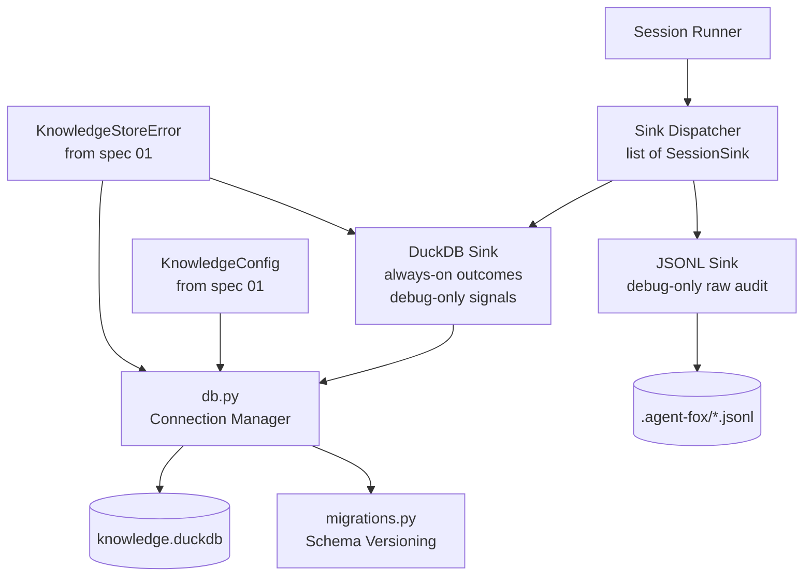

# Design Document: DuckDB Knowledge Store

## Overview

This spec establishes the DuckDB-backed persistence layer for agent-fox v2:
database connection management, schema creation and versioning, the SessionSink
protocol, the DuckDB sink, the JSONL sink, and graceful degradation. All
subsequent knowledge specs (Fox Ball, Time Vision) build on this foundation.

## Architecture



### Module Responsibilities

1. `agent_fox/knowledge/db.py` -- DuckDB connection management, schema
   initialization, VSS extension setup
2. `agent_fox/knowledge/migrations.py` -- Schema version table, forward-only
   migration runner, migration registry
3. `agent_fox/knowledge/sink.py` -- SessionSink Protocol definition, sink
   dispatcher, event dataclasses
4. `agent_fox/knowledge/duckdb_sink.py` -- DuckDB sink: session outcomes
   (always-on), tool signals (debug-only)
5. `agent_fox/knowledge/jsonl_sink.py` -- JSONL sink: raw audit trail
   (debug-only), preserves v1 behavior

## Components and Interfaces

### Database Connection Manager

```python
# agent_fox/knowledge/db.py
import duckdb
from pathlib import Path
from agent_fox.core.config import KnowledgeConfig
from agent_fox.core.errors import KnowledgeStoreError
import logging

logger = logging.getLogger("agent_fox.knowledge.db")


class KnowledgeDB:
    """Manages the DuckDB knowledge store lifecycle."""

    def __init__(self, config: KnowledgeConfig) -> None:
        self._config = config
        self._conn: duckdb.DuckDBPyConnection | None = None

    @property
    def connection(self) -> duckdb.DuckDBPyConnection:
        """Return the active connection, raising if closed."""
        if self._conn is None:
            raise KnowledgeStoreError("Knowledge store is not open")
        return self._conn

    def open(self) -> None:
        """Open the database, install/load VSS, run migrations.

        Creates the parent directory if it does not exist. On first
        open, installs the VSS extension and creates the full schema.
        On subsequent opens, loads VSS and applies pending migrations.

        Raises:
            KnowledgeStoreError: If the database cannot be opened or
                schema initialization fails.
        """
        ...

    def close(self) -> None:
        """Close the database connection, releasing file locks."""
        ...

    def _ensure_parent_dir(self) -> None:
        """Create the parent directory for the database file."""
        ...

    def _setup_vss(self) -> None:
        """Install (first time) or load the VSS extension."""
        ...

    def _initialize_schema(self) -> None:
        """Create all tables if schema_version does not exist."""
        ...

    def __enter__(self) -> "KnowledgeDB":
        self.open()
        return self

    def __exit__(self, *exc: object) -> None:
        self.close()


def open_knowledge_store(config: KnowledgeConfig) -> KnowledgeDB | None:
    """Open the knowledge store with graceful degradation.

    Returns a KnowledgeDB instance on success, or None if the store
    cannot be opened (logs a warning and continues).
    """
    ...
```

### Schema Migration System

```python
# agent_fox/knowledge/migrations.py
import duckdb
from dataclasses import dataclass
from typing import Callable
from agent_fox.core.errors import KnowledgeStoreError
import logging

logger = logging.getLogger("agent_fox.knowledge.migrations")

MigrationFn = Callable[[duckdb.DuckDBPyConnection], None]


@dataclass(frozen=True)
class Migration:
    """A forward-only schema migration."""
    version: int
    description: str
    apply: MigrationFn


# Registry of all migrations, ordered by version.
MIGRATIONS: list[Migration] = [
    # Migration(version=2, description="add foo column", apply=migrate_v2),
]


def get_current_version(conn: duckdb.DuckDBPyConnection) -> int:
    """Return the current schema version, or 0 if no version table."""
    ...


def apply_pending_migrations(conn: duckdb.DuckDBPyConnection) -> None:
    """Apply all migrations newer than the current schema version.

    Each migration runs in its own transaction. On failure, raises
    KnowledgeStoreError with the failing version and cause.
    """
    ...


def record_version(
    conn: duckdb.DuckDBPyConnection,
    version: int,
    description: str,
) -> None:
    """Insert a row into schema_version."""
    ...
```

### SessionSink Protocol and Dispatcher

```python
# agent_fox/knowledge/sink.py
from typing import Protocol, runtime_checkable
from dataclasses import dataclass, field
from datetime import datetime
from uuid import UUID, uuid4
import logging

logger = logging.getLogger("agent_fox.knowledge.sink")


@dataclass(frozen=True)
class SessionOutcome:
    """Structured record of a completed coding session."""
    id: UUID = field(default_factory=uuid4)
    spec_name: str = ""
    task_group: str = ""
    node_id: str = ""
    touched_paths: list[str] = field(default_factory=list)
    status: str = ""          # "completed" | "failed" | "timeout"
    input_tokens: int = 0
    output_tokens: int = 0
    duration_ms: int = 0
    created_at: datetime = field(default_factory=datetime.utcnow)


@dataclass(frozen=True)
class ToolCall:
    """Structured record of a tool invocation."""
    id: UUID = field(default_factory=uuid4)
    session_id: str = ""
    node_id: str = ""
    tool_name: str = ""
    called_at: datetime = field(default_factory=datetime.utcnow)


@dataclass(frozen=True)
class ToolError:
    """Structured record of a failed tool invocation."""
    id: UUID = field(default_factory=uuid4)
    session_id: str = ""
    node_id: str = ""
    tool_name: str = ""
    failed_at: datetime = field(default_factory=datetime.utcnow)


@runtime_checkable
class SessionSink(Protocol):
    """Protocol for recording session events.

    Implementations must handle their own error suppression -- a sink
    failure must never prevent the session runner from continuing.
    """

    def record_session_outcome(self, outcome: SessionOutcome) -> None:
        """Record a session outcome. Called after every session."""
        ...

    def record_tool_call(self, call: ToolCall) -> None:
        """Record a tool invocation. May be a no-op in non-debug mode."""
        ...

    def record_tool_error(self, error: ToolError) -> None:
        """Record a tool error. May be a no-op in non-debug mode."""
        ...

    def close(self) -> None:
        """Release any resources held by this sink."""
        ...


class SinkDispatcher:
    """Dispatches events to multiple SessionSink implementations.

    The orchestrator builds a SinkDispatcher with the appropriate sinks
    based on configuration and debug mode. The session runner calls
    dispatcher methods without knowing which sinks are active.
    """

    def __init__(self, sinks: list[SessionSink] | None = None) -> None:
        self._sinks: list[SessionSink] = sinks or []

    def add(self, sink: SessionSink) -> None:
        """Add a sink to the dispatch list."""
        ...

    def record_session_outcome(self, outcome: SessionOutcome) -> None:
        """Dispatch to all sinks. Logs and swallows individual failures."""
        ...

    def record_tool_call(self, call: ToolCall) -> None:
        """Dispatch to all sinks. Logs and swallows individual failures."""
        ...

    def record_tool_error(self, error: ToolError) -> None:
        """Dispatch to all sinks. Logs and swallows individual failures."""
        ...

    def close(self) -> None:
        """Close all sinks."""
        ...
```

### DuckDB Sink

```python
# agent_fox/knowledge/duckdb_sink.py
import duckdb
from agent_fox.knowledge.sink import SessionOutcome, ToolCall, ToolError
import logging

logger = logging.getLogger("agent_fox.knowledge.duckdb_sink")


class DuckDBSink:
    """SessionSink implementation backed by DuckDB.

    Session outcomes are always written. Tool signals (tool_calls,
    tool_errors) are only written when debug=True.
    """

    def __init__(
        self,
        conn: duckdb.DuckDBPyConnection,
        *,
        debug: bool = False,
    ) -> None:
        self._conn = conn
        self._debug = debug

    def record_session_outcome(self, outcome: SessionOutcome) -> None:
        """Insert a row into session_outcomes for each touched path.

        If touched_paths is empty, inserts one row with NULL touched_path.
        All writes are best-effort: failures are logged, not raised.
        """
        ...

    def record_tool_call(self, call: ToolCall) -> None:
        """Insert a row into tool_calls. No-op if debug=False."""
        ...

    def record_tool_error(self, error: ToolError) -> None:
        """Insert a row into tool_errors. No-op if debug=False."""
        ...

    def close(self) -> None:
        """No-op. Connection lifecycle is managed by KnowledgeDB."""
        ...
```

### JSONL Sink

```python
# agent_fox/knowledge/jsonl_sink.py
import json
from pathlib import Path
from datetime import datetime
from agent_fox.knowledge.sink import SessionOutcome, ToolCall, ToolError
import logging

logger = logging.getLogger("agent_fox.knowledge.jsonl_sink")


class JsonlSink:
    """SessionSink implementation that appends JSON lines to a file.

    Preserves the v1 debug audit trail behavior. All events are written
    as JSON objects, one per line. The file is opened on first write and
    closed when close() is called.
    """

    def __init__(self, directory: Path, session_id: str = "") -> None:
        self._directory = directory
        self._session_id = session_id
        self._file_handle: object | None = None  # typing.IO[str]
        self._path: Path | None = None

    def _ensure_file(self) -> Path:
        """Create the JSONL file on first write. Returns the file path."""
        ...

    def _write_event(self, event_type: str, data: dict) -> None:
        """Write a single JSON line to the audit file."""
        ...

    def record_session_outcome(self, outcome: SessionOutcome) -> None:
        """Write session outcome as a JSON line."""
        ...

    def record_tool_call(self, call: ToolCall) -> None:
        """Write tool call as a JSON line."""
        ...

    def record_tool_error(self, error: ToolError) -> None:
        """Write tool error as a JSON line."""
        ...

    def close(self) -> None:
        """Flush and close the JSONL file handle."""
        ...
```

## Data Models

### Full SQL Schema

```sql
-- Schema versioning for forward-compatible migrations
CREATE TABLE schema_version (
    version     INTEGER PRIMARY KEY,
    applied_at  TIMESTAMP NOT NULL DEFAULT CURRENT_TIMESTAMP,
    description TEXT
);

-- Knowledge facts with provenance (populated by Fox Ball spec)
CREATE TABLE memory_facts (
    id            UUID PRIMARY KEY,
    content       TEXT NOT NULL,
    category      TEXT,              -- gotcha, pattern, decision, convention, anti_pattern, fragile_area
    spec_name     TEXT,
    session_id    TEXT,
    commit_sha    TEXT,              -- provenance: which commit produced this fact
    confidence    TEXT DEFAULT 'high',
    created_at    TIMESTAMP,
    superseded_by UUID               -- tracks fact replacement chain
);

-- Vector embeddings for semantic search (populated by Fox Ball spec)
CREATE TABLE memory_embeddings (
    id        UUID PRIMARY KEY REFERENCES memory_facts(id),
    embedding FLOAT[384]             -- dimension from KnowledgeConfig.embedding_dimensions
);

-- Session outcomes (always-on, not gated by --debug)
CREATE TABLE session_outcomes (
    id            UUID PRIMARY KEY,
    spec_name     TEXT,
    task_group    TEXT,
    node_id       TEXT,
    touched_path  TEXT,              -- one row per path touched (normalized)
    status        TEXT,              -- completed | failed | timeout
    input_tokens  INTEGER,
    output_tokens INTEGER,
    duration_ms   INTEGER,
    created_at    TIMESTAMP
);

-- Temporal causal graph (populated by Time Vision spec)
CREATE TABLE fact_causes (
    cause_id  UUID,
    effect_id UUID,
    PRIMARY KEY (cause_id, effect_id)
);

-- Tool invocations extracted from message stream (debug-only)
CREATE TABLE tool_calls (
    id         UUID PRIMARY KEY,
    session_id TEXT,
    node_id    TEXT,
    tool_name  TEXT,
    called_at  TIMESTAMP
);

-- Tool errors extracted from message stream (debug-only)
CREATE TABLE tool_errors (
    id        UUID PRIMARY KEY,
    session_id TEXT,
    node_id    TEXT,
    tool_name  TEXT,
    failed_at  TIMESTAMP
);
```

### Event Dataclass Summary

| Dataclass | Fields | Written To |
|-----------|--------|------------|
| `SessionOutcome` | id, spec_name, task_group, node_id, touched_paths, status, input_tokens, output_tokens, duration_ms, created_at | DuckDB (always), JSONL (debug) |
| `ToolCall` | id, session_id, node_id, tool_name, called_at | DuckDB (debug), JSONL (debug) |
| `ToolError` | id, session_id, node_id, tool_name, failed_at | DuckDB (debug), JSONL (debug) |

## Correctness Properties

### Property 1: Schema Initialization Idempotency

*For any* knowledge store path, calling `open()` twice in sequence SHALL
produce the same schema state as calling it once. The second call SHALL not
duplicate tables or version rows.

**Validates:** 11-REQ-2.1, 11-REQ-2.2

### Property 2: Migration Monotonicity

*For any* sequence of migrations applied to a database, the schema version
SHALL be strictly increasing. No migration SHALL decrease or repeat a version
number.

**Validates:** 11-REQ-3.1, 11-REQ-3.3

### Property 3: Sink Protocol Compliance

*For any* class implementing `SessionSink`, `isinstance(instance, SessionSink)`
SHALL return True. Both `DuckDBSink` and `JsonlSink` SHALL satisfy this check.

**Validates:** 11-REQ-4.1, 11-REQ-5.1, 11-REQ-6.1

### Property 4: Session Outcome Always-On

*For any* session outcome written through a `DuckDBSink`, the row SHALL appear
in the `session_outcomes` table regardless of whether debug mode is enabled
or disabled.

**Validates:** 11-REQ-5.2

### Property 5: Debug Gating of Tool Signals

*For any* `DuckDBSink` with `debug=False`, calling `record_tool_call` or
`record_tool_error` SHALL not insert any rows into `tool_calls` or
`tool_errors`.

**Validates:** 11-REQ-5.3, 11-REQ-5.4

### Property 6: Graceful Degradation

*For any* corrupted or inaccessible DuckDB file, `open_knowledge_store()` SHALL
return None without raising an exception. The session runner SHALL continue
operating without the knowledge store.

**Validates:** 11-REQ-7.1, 11-REQ-7.2

### Property 7: Dispatcher Fault Isolation

*For any* SinkDispatcher containing N sinks where sink K raises an exception,
sinks K+1 through N SHALL still be called. The dispatcher SHALL never propagate
a sink exception to the caller.

**Validates:** 11-REQ-4.3, 11-REQ-5.E1

## Error Handling

| Error Condition | Behavior | Requirement |
|----------------|----------|-------------|
| Database file cannot be created | Raise `KnowledgeStoreError` with cause | 11-REQ-1.E2 |
| Parent directory does not exist | Create it automatically | 11-REQ-1.E1 |
| VSS extension install fails (no network) | Raise `KnowledgeStoreError`; VSS required for schema | 11-REQ-1.2 |
| Database corrupted at startup | `open_knowledge_store()` returns None, logs warning | 11-REQ-7.1 |
| DuckDB write fails mid-run | Sink logs warning, continues without raising | 11-REQ-5.E1, 11-REQ-7.2 |
| Migration fails | Raise `KnowledgeStoreError` with version and cause | 11-REQ-3.E1 |
| JSONL file cannot be created | Sink logs warning, skips write | 11-REQ-6.2 |
| Database locked by another process | Sink logs warning, continues | 11-REQ-5.E1 |

## Technology Stack

| Technology | Version | Purpose |
|-----------|---------|---------|
| duckdb | >=1.0 | Embedded analytical database |
| Python | 3.12+ | Runtime |
| pytest | 8.0+ | Test framework |
| hypothesis | 6.0+ | Property-based testing |

## Definition of Done

A task group is complete when ALL of the following are true:

1. All subtasks within the group are checked off (`[x]`)
2. All spec tests (`test_spec.md` entries) for the task group pass
3. All property tests for the task group pass
4. All previously passing tests still pass (no regressions)
5. No linter warnings or errors introduced
6. Code is committed on a feature branch and pushed to remote
7. Feature branch is merged back to `develop`
8. `tasks.md` checkboxes are updated to reflect completion

## Testing Strategy

- **Unit tests** validate individual functions: connection open/close, schema
  creation, migration application, sink recording, event serialization.
- **Property tests** (Hypothesis) verify invariants: schema idempotency,
  migration monotonicity, sink protocol compliance, debug gating.
- **All DuckDB tests use in-memory databases** (`duckdb.connect(":memory:")`)
  or temp files via `tmp_path` to avoid polluting the real knowledge store.
- **JSONL tests use `tmp_path`** to write to temporary directories.
- **No network dependencies** in tests: VSS extension tests use mocks or
  skip if the extension is unavailable in the test environment.
