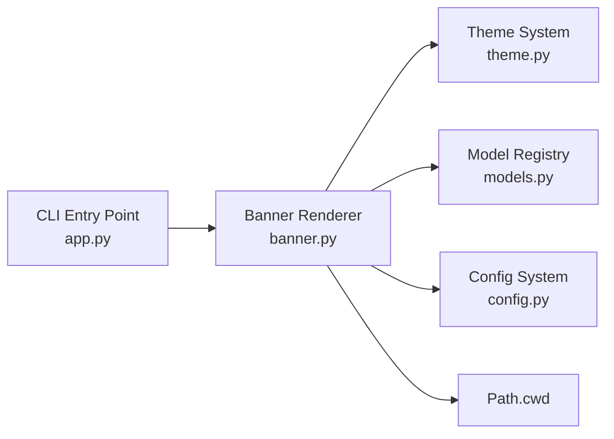

# Design Document: CLI Banner Enhancement

## Overview

This spec enhances the existing CLI banner (`agent_fox/ui/banner.py`) to
display fox ASCII art, the resolved coding model, and the current working
directory. It also modifies the CLI entry point (`agent_fox/cli/app.py`) to
render the banner on every invocation instead of only when no subcommand is
specified.

## Architecture



### Module Responsibilities

1. `agent_fox/ui/banner.py` — Renders the full banner (fox art, version +
   model, working directory) using the theme system.
2. `agent_fox/cli/app.py` — Calls `render_banner()` on every invocation
   (moved out of the no-subcommand conditional), suppressed by `--quiet`.

## Components and Interfaces

### Banner Renderer

```python
# agent_fox/ui/banner.py

FOX_ART: str  # Multi-line constant with the fox ASCII art

def render_banner(
    theme: AppTheme,
    model_config: ModelConfig,
    quiet: bool = False,
) -> None:
    """Render the CLI banner with fox art, version, model, and cwd.

    Args:
        theme: The app theme for styled output.
        model_config: The model configuration to resolve the coding model.
        quiet: If True, suppress all banner output.
    """
```

### CLI Entry Point Changes

```python
# agent_fox/cli/app.py — main() changes

# Before (current):
#   if ctx.invoked_subcommand is None:
#       render_banner(theme)
#       click.echo(ctx.get_help())

# After:
#   render_banner(theme, config.models, quiet=quiet)
#   if ctx.invoked_subcommand is None:
#       click.echo(ctx.get_help())
```

### Fox ASCII Art Constant

```python
FOX_ART = r"""   /\_/\  _
  / o.o \/ \
 ( > ^ < )  )
  \_^/\_/--'"""
```

### Model Resolution for Banner

```python
def _resolve_coding_model_display(model_config: ModelConfig) -> str:
    """Resolve the coding model to a display string.

    Returns the model ID (e.g., 'claude-opus-4-6') on success,
    or the raw config value (e.g., 'ADVANCED') on failure.
    """
    try:
        entry = resolve_model(model_config.coding)
        return entry.model_id
    except ConfigError:
        return model_config.coding
```

## Data Models

No new data models. Uses existing `ModelConfig` and `ThemeConfig`.

## Operational Readiness

- **Observability:** No new logging; banner output is visible on stdout.
- **Rollout:** No migration needed. The banner change is purely additive.
- **Compatibility:** Existing `--quiet` flag suppresses the banner.

## Correctness Properties

### Property 1: Fox Art Integrity

*For any* invocation of `render_banner` with `quiet=False`, the rendered output
SHALL contain all four lines of `FOX_ART` unchanged.

**Validates: Requirements 14-REQ-1.1**

### Property 2: Version and Model Format

*For any* valid `ModelConfig` where `models.coding` resolves to a known model,
the banner output SHALL contain a line matching the pattern
`agent-fox v{__version__}  model: {model_id}`.

**Validates: Requirements 14-REQ-2.1, 14-REQ-2.2**

### Property 3: Model Resolution Fallback

*For any* `ModelConfig` where `models.coding` is set to an unrecognized value,
the banner output SHALL contain `model: {raw_value}` instead of raising an
exception.

**Validates: Requirements 14-REQ-2.E1**

### Property 4: Quiet Suppression

*For any* invocation of `render_banner` with `quiet=True`, the function
SHALL produce no output.

**Validates: Requirements 14-REQ-4.2**

### Property 5: Working Directory Display

*For any* invocation of `render_banner` with `quiet=False`, the banner output
SHALL contain the string representation of `Path.cwd()`.

**Validates: Requirements 14-REQ-3.1**

## Error Handling

| Error Condition | Behavior | Requirement |
|----------------|----------|-------------|
| Invalid header theme style | Fall back to default header style | 14-REQ-1.E1 (via 01-REQ-7.E1) |
| Coding model not resolvable | Display raw config value | 14-REQ-2.E1 |
| `Path.cwd()` raises OSError | Display `(unknown)` | 14-REQ-3.E1 |
| `--quiet` flag set | Suppress banner entirely | 14-REQ-4.2 |
| `--version` flag used | Click handles; banner not reached | 14-REQ-4.E1 |

## Technology Stack

- **Python 3.12+** — project language
- **Click** — CLI framework (existing)
- **Rich** — terminal styling via `AppTheme` (existing)
- **Pydantic** — config models (existing)

## Definition of Done

A task group is complete when ALL of the following are true:

1. All subtasks within the group are checked off (`[x]`)
2. All spec tests (`test_spec.md` entries) for the task group pass
3. All property tests for the task group pass
4. All previously passing tests still pass (no regressions)
5. No linter warnings or errors introduced
6. Code is committed on a feature branch and pushed to remote
7. Feature branch is merged back to `develop`
8. `tasks.md` checkboxes are updated to reflect completion

## Testing Strategy

- **Unit tests:** Verify `render_banner()` output contains expected content
  (fox art, version/model line, cwd) by capturing Rich console output with
  `Console(file=StringIO())`.
- **Property tests:** Use Hypothesis to generate arbitrary `ModelConfig`
  values and verify the banner always produces valid output (never crashes,
  always contains version line).
- **Edge case tests:** Verify model fallback with invalid model names, cwd
  fallback with monkeypatched `Path.cwd()`, and quiet suppression.
- **Integration tests:** Invoke the CLI via `CliRunner` and verify banner
  content appears in the output.
