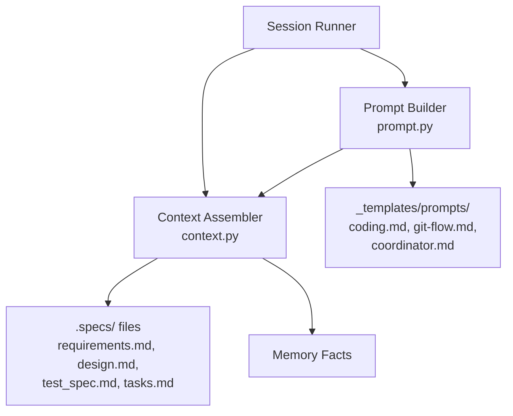

# Design Document: Coding Session Prompt Overhaul

## Overview

This spec modifies two files in the session module: `context.py` gains
`test_spec.md` in its spec file list, and `prompt.py` is rewritten to load
and compose templates from `agent_fox/_templates/prompts/` with placeholder
interpolation and frontmatter stripping.

## Architecture



### Module Responsibilities

1. `agent_fox/session/context.py` — Assembles spec documents (now including
   `test_spec.md`) and memory facts into a context string.
2. `agent_fox/session/prompt.py` — Loads prompt templates, strips frontmatter,
   interpolates placeholders, composes system and task prompts.

## Components and Interfaces

### Context Assembler (Updated)

```python
# agent_fox/session/context.py

_SPEC_FILES: list[tuple[str, str]] = [
    ("requirements.md", "## Requirements"),
    ("design.md", "## Design"),
    ("test_spec.md", "## Test Specification"),   # NEW
    ("tasks.md", "## Tasks"),
]
```

No other changes to `context.py`. The `assemble_context()` function
signature and behavior remain the same.

### Prompt Builder (Rewritten)

```python
# agent_fox/session/prompt.py

from pathlib import Path

# Template directory relative to this file
_TEMPLATE_DIR = Path(__file__).resolve().parent.parent / "_templates" / "prompts"

# Role-to-template mapping
_ROLE_TEMPLATES: dict[str, list[str]] = {
    "coding": ["coding.md", "git-flow.md"],
    "coordinator": ["coordinator.md"],
}


def _strip_frontmatter(content: str) -> str:
    """Strip YAML frontmatter from template content.

    Removes content between leading --- delimiters.
    Returns content unchanged if no frontmatter is present.
    """


def _load_template(name: str) -> str:
    """Load a template file from the templates directory.

    Strips frontmatter and returns the template content.

    Raises:
        ConfigError: If the template file does not exist.
    """


def _interpolate(template: str, variables: dict[str, str]) -> str:
    """Interpolate placeholders in template content.

    Uses string.Template with safe_substitute to avoid KeyError
    on unrecognized or literal-brace placeholders.
    """


def build_system_prompt(
    context: str,
    task_group: int,
    spec_name: str,
    role: str = "coding",
) -> str:
    """Build the system prompt from templates and context.

    Args:
        context: Assembled spec documents and memory facts.
        task_group: The target task group number.
        spec_name: The specification name (e.g., "03_session_and_workspace").
        role: Prompt role — "coding" or "coordinator".

    Returns:
        Complete system prompt string.

    Raises:
        ValueError: If role is not recognized.
        ConfigError: If a template file is missing.
    """


def build_task_prompt(
    task_group: int,
    spec_name: str,
) -> str:
    """Build an enriched task prompt.

    Includes spec name, task group, instructions to update checkbox states,
    commit on the feature branch, and run quality gates.

    Raises:
        ValueError: If task_group < 1.
    """
```

### Interpolation Strategy

Templates use `$`-style substitution via `string.Template.safe_substitute()`
to avoid conflicts with literal braces in JSON examples and Markdown code
blocks.

Before interpolation, convert `{spec_name}` and `{task_group}` style
placeholders to `$spec_name` and `$task_group` respectively. This handles
the existing template format while preserving literal braces.

Alternatively, use a regex-based approach that only replaces known
placeholders and leaves everything else untouched.

**Variables provided:**

| Placeholder | Value | Example |
|-------------|-------|---------|
| `spec_name` | The full spec folder name | `03_session_and_workspace` |
| `task_group` | The task group number as string | `2` |
| `number` | The spec number prefix | `03` |
| `specification` | The spec name without number | `session_and_workspace` |

### Frontmatter Stripping

```python
import re

_FRONTMATTER_RE = re.compile(r"\A---\s*\n.*?\n---\s*\n", re.DOTALL)

def _strip_frontmatter(content: str) -> str:
    return _FRONTMATTER_RE.sub("", content, count=1)
```

### Template Composition for Coding Role

For the `coding` role, the system prompt is composed as:

```
{coding.md content (interpolated)}

---

{git-flow.md content (frontmatter stripped, interpolated)}

---

## Context

{assembled context}
```

### Template Composition for Coordinator Role

For the `coordinator` role:

```
{coordinator.md content (interpolated)}

---

## Context

{assembled context}
```

## Data Models

No new data models. Uses existing `AgentFoxConfig` and error types.

## Operational Readiness

- **Observability:** Template loading failures are reported via `ConfigError`.
- **Rollout:** No migration needed. Prompt changes take effect on next session.
- **Compatibility:** Existing tests for `build_system_prompt` and
  `build_task_prompt` must be updated to match new signatures and output.

## Correctness Properties

### Property 1: Test Spec Inclusion

*For any* spec directory containing `test_spec.md`, the context assembler
SHALL include its content in the assembled context string, between the
design and tasks sections.

**Validates: Requirements 15-REQ-1.1, 15-REQ-1.2**

### Property 2: Template Content Presence

*For any* valid role and spec name, the system prompt SHALL contain
recognizable content from the corresponding template file(s).

**Validates: Requirements 15-REQ-2.1, 15-REQ-2.2, 15-REQ-2.3**

### Property 3: Placeholder Interpolation

*For any* spec name and task group, all known placeholders in the system
prompt output SHALL be replaced with their actual values, and no
`{spec_name}` or `{task_group}` literal placeholders SHALL remain.

**Validates: Requirements 15-REQ-3.1**

### Property 4: Literal Brace Preservation

*For any* template containing literal braces (e.g., JSON examples), the
prompt builder SHALL preserve them without raising an interpolation error.

**Validates: Requirements 15-REQ-3.E1**

### Property 5: Frontmatter Stripping

*For any* template with YAML frontmatter, the output SHALL NOT contain the
frontmatter delimiters (`---`) or the metadata content between them (at the
start of the template).

**Validates: Requirements 15-REQ-4.1, 15-REQ-4.2**

### Property 6: Task Prompt Completeness

*For any* valid task group and spec name, the task prompt SHALL contain the
spec name, task group number, and instructions for checkbox updates, commits,
and quality gates.

**Validates: Requirements 15-REQ-5.1, 15-REQ-5.2, 15-REQ-5.3**

### Property 7: Invalid Role Rejection

*For any* role string not in the valid set (`coding`, `coordinator`), the
prompt builder SHALL raise a `ValueError`.

**Validates: Requirements 15-REQ-2.E2**

## Error Handling

| Error Condition | Behavior | Requirement |
|----------------|----------|-------------|
| test_spec.md missing | Skip with warning | 15-REQ-1.E1 (via 03-REQ-4.E1) |
| Template file missing | Raise ConfigError | 15-REQ-2.E1 |
| Unknown role | Raise ValueError | 15-REQ-2.E2 |
| Literal braces in template | Preserve unchanged | 15-REQ-3.E1 |
| task_group < 1 | Raise ValueError | 15-REQ-5.E1 |

## Technology Stack

- **Python 3.12+** — project language
- **`re`** — frontmatter stripping
- **`pathlib`** — template path resolution
- **`string.Template`** or regex — placeholder interpolation

## Definition of Done

A task group is complete when ALL of the following are true:

1. All subtasks within the group are checked off (`[x]`)
2. All spec tests (`test_spec.md` entries) for the task group pass
3. All property tests for the task group pass
4. All previously passing tests still pass (no regressions)
5. No linter warnings or errors introduced
6. Code is committed on a feature branch and pushed to remote
7. Feature branch is merged back to `develop`
8. `tasks.md` checkboxes are updated to reflect completion

## Testing Strategy

- **Unit tests:** Verify `assemble_context()` includes `test_spec.md` content.
  Verify `build_system_prompt()` loads templates, interpolates placeholders,
  strips frontmatter, and composes correctly for each role. Verify
  `build_task_prompt()` output contains required elements.
- **Property tests:** Use Hypothesis to fuzz spec names and task group numbers,
  verifying placeholder interpolation never crashes and literal braces are
  preserved.
- **Edge case tests:** Missing templates, unknown roles, invalid task groups,
  templates with and without frontmatter, templates with JSON literal braces.
