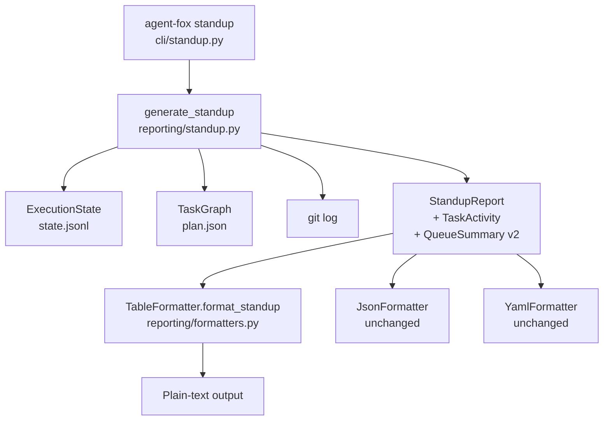

# Design Document: Standup Report Plain-Text Formatting

## Overview

Replace the Rich table rendering of `agent-fox standup --format table` with
compact, indented plain text matching the agent-fox v1 style. This requires
enriching the `StandupReport` data model with per-task session breakdowns,
ready task IDs, queue totals, and all-time cost, then rewriting
`TableFormatter.format_standup()` to emit plain text instead of Rich tables.

## Architecture



### Module Responsibilities

1. `agent_fox/reporting/standup.py` — Data models (`TaskActivity`,
   `QueueSummary` enrichment, `StandupReport` enrichment) and
   `generate_standup()` logic to populate per-task breakdowns.
2. `agent_fox/reporting/formatters.py` — `TableFormatter.format_standup()`
   rewritten for plain-text output; `format_tokens()` and
   `_display_node_id()` utility functions added.
3. No changes to `JsonFormatter`, `YamlFormatter`, `format_status()`, CLI
   argument handling, or any other modules.

## Components and Interfaces

### New Data Model: TaskActivity

```python
# agent_fox/reporting/standup.py

@dataclass(frozen=True)
class TaskActivity:
    """Per-task session summary within the reporting window."""
    task_id: str                # internal format "spec:group"
    current_status: str         # from ExecutionState node_states
    completed_sessions: int     # sessions with status "completed"
    total_sessions: int         # all sessions for this task in window
    input_tokens: int
    output_tokens: int
    cost: float
```

### Modified Data Model: QueueSummary

```python
@dataclass(frozen=True)
class QueueSummary:
    """Current task queue status."""
    total: int                  # NEW: sum of all tasks
    ready: int
    pending: int
    in_progress: int            # NEW: tasks currently executing
    blocked: int
    failed: int
    completed: int
    ready_task_ids: list[str]   # NEW: IDs of ready tasks (internal format)
```

### Modified Data Model: StandupReport

```python
@dataclass(frozen=True)
class StandupReport:
    """Complete standup report data model."""
    window_hours: int
    window_start: str           # ISO 8601
    window_end: str             # ISO 8601
    agent: AgentActivity
    task_activities: list[TaskActivity]  # NEW: per-task breakdown
    human_commits: list[HumanCommit]
    file_overlaps: list[FileOverlap]
    cost_breakdown: list[CostBreakdown]
    queue: QueueSummary
    total_cost: float           # NEW: all-time total from ExecutionState
```

### Utility Functions

```python
# agent_fox/reporting/formatters.py

def format_tokens(count: int) -> str:
    """Format token count for human readability.

    Args:
        count: Raw token count.

    Returns:
        "12.9k" for counts >= 1000, "345" for counts < 1000.
    """
    if count >= 1000:
        return f"{count / 1000:.1f}k"
    return str(count)


def _display_node_id(node_id: str) -> str:
    """Convert internal node ID to display format.

    Args:
        node_id: Internal format "spec_name:group_number".

    Returns:
        Display format "spec_name/group_number".
    """
    return node_id.replace(":", "/")
```

### Modified: TableFormatter.format_standup()

```python
def format_standup(self, report: StandupReport) -> str:
    """Render standup report as indented plain text.

    Output structure:
        Standup Report — last {hours}h
        Generated: {timestamp}

        Agent Activity
          {task_id}: {status}. {completed}/{total} sessions. tokens {in} in / {out} out. ${cost}
          ...

        Human Commits
          {sha7} {author}: {subject}
          ...

        Queue Status
          {total} total: {done} done | {in_progress} in progress | ...
          Ready: {id1}, {id2}

        Heads Up — File Overlaps
          {path} — commits: {sha1}, {sha2} | agents: {task1}, {task2}

        Total Cost: ${all_time}
    """
    ...
```

## Data Models

### Token Formatting Rules

| Range | Format | Example |
|-------|--------|---------|
| 0 | `"0"` | `0` |
| 1–999 | `str(n)` | `345` |
| 1000+ | `f"{n/1000:.1f}k"` | `12.9k` |

### Display Node ID Rules

| Internal Format | Display Format |
|----------------|---------------|
| `01_core_foundation:1` | `01_core_foundation/1` |
| `fix_01_ruff_format:1` | `fix_01_ruff_format/1` |

## Correctness Properties

### Property 1: Token Format Consistency

*For any* non-negative integer `n`, `format_tokens(n)` SHALL return a string
matching `r"^\d+$"` when `n < 1000` and `r"^\d+\.\d{1}k$"` when `n >= 1000`.

**Validates: 15-REQ-7.1**

### Property 2: Display Node ID Roundtrip

*For any* valid node ID string of the form `{alpha}:{digit}`,
`_display_node_id(node_id)` SHALL return a string where every colon is
replaced by a slash and no other characters are changed.

**Validates: 15-REQ-8.1**

### Property 3: Per-Task Activity Coverage

*For any* set of windowed session records, the generated `task_activities`
list SHALL contain exactly one `TaskActivity` entry per unique `node_id`
present in the windowed sessions, and the sum of `total_sessions` across all
entries SHALL equal the total number of windowed sessions.

**Validates: 15-REQ-2.2, 15-REQ-2.3**

### Property 4: Queue Summary Integrity

*For any* task graph and execution state, the `QueueSummary.total` SHALL
equal `ready + pending + in_progress + blocked + failed + completed`, and
`len(ready_task_ids)` SHALL equal `ready`.

**Validates: 15-REQ-4.1, 15-REQ-4.3**

### Property 5: Plain-Text Section Ordering

*For any* `StandupReport`, the plain-text output SHALL contain section
headers in this exact order: `"Standup Report"`, `"Agent Activity"`,
`"Human Commits"`, `"Queue Status"`, then optionally `"Heads Up"`, then
`"Total Cost"`.

**Validates: 15-REQ-1.1, 15-REQ-2.1, 15-REQ-3.1, 15-REQ-4.1, 15-REQ-5.1, 15-REQ-6.1**

### Property 6: Empty Sections Handling

*For any* `StandupReport` with zero agent activity and zero human commits,
the output SHALL contain `"(no agent activity)"` and `"(no human commits)"`.
For any report with zero file overlaps, the output SHALL NOT contain
`"Heads Up"`.

**Validates: 15-REQ-2.E1, 15-REQ-3.E1, 15-REQ-5.E1**

## Error Handling

| Error Condition | Behavior | Requirement |
|----------------|----------|-------------|
| No agent activity in window | Print `(no agent activity)` | 15-REQ-2.E1 |
| No human commits in window | Print `(no human commits)` | 15-REQ-3.E1 |
| No file overlaps | Omit File Overlaps section | 15-REQ-5.E1 |
| No ready tasks | Omit `Ready:` line | 15-REQ-4.E1 |
| No execution state (total_cost) | Show `$0.00` | 15-REQ-6.E1 |
| Hours = 1 | Header reads `last 1h` | 15-REQ-1.E1 |

## Technology Stack

| Technology | Version | Purpose |
|-----------|---------|---------|
| Python | 3.12+ | Runtime |
| pytest | 8.0+ | Testing |
| hypothesis | 6.0+ | Property-based testing |

No new dependencies are introduced. Rich is still imported by `formatters.py`
but not used by the rewritten `format_standup()`. It remains used by
`format_status()`.

## Definition of Done

A task group is complete when ALL of the following are true:

1. All subtasks within the group are checked off (`[x]`)
2. All spec tests (`test_spec.md` entries) for the task group pass
3. All property tests for the task group pass
4. All previously passing tests still pass (no regressions)
5. No linter warnings or errors introduced
6. Code is committed on a feature branch and pushed to remote
7. Feature branch is merged back to `develop`
8. `tasks.md` checkboxes are updated to reflect completion

## Testing Strategy

- **Unit tests** validate: `format_tokens()`, `_display_node_id()`,
  `_compute_task_activities()`, enriched `_build_queue_summary()`,
  `TableFormatter.format_standup()` output structure and content.
- **Property tests** (Hypothesis) verify: token format consistency, node ID
  roundtrip, per-task coverage, queue summary integrity, section ordering,
  empty section handling.
- **Regression tests**: All existing spec 07 tests must continue to pass
  after model enrichment (new fields have defaults where possible; tests that
  construct models directly are updated to include new fields).
