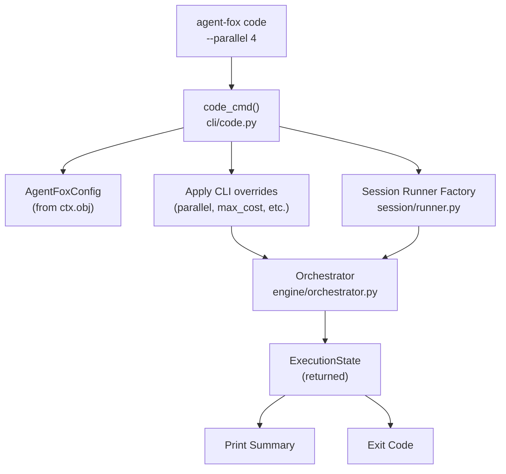

# Design Document: Code Command

## Overview

The `agent-fox code` command is a thin CLI wrapper that connects the Click
command group to the fully-implemented orchestrator engine. It reads
configuration, applies CLI overrides, constructs the orchestrator with its
dependencies, runs execution, prints a summary, and exits with a meaningful
code. The command lives in a single module: `agent_fox/cli/code.py`.

## Architecture



### Module Responsibilities

1. `agent_fox/cli/code.py` — Click command definition. Reads config from
   context, applies CLI overrides, constructs orchestrator, runs it, prints
   summary, returns exit code.

## Components and Interfaces

### CLI Command

```python
# agent_fox/cli/code.py

@click.command("code")
@click.option("--parallel", type=int, default=None,
              help="Override parallelism (1-8)")
@click.option("--no-hooks", is_flag=True, default=False,
              help="Skip all hook scripts")
@click.option("--max-cost", type=float, default=None,
              help="Cost ceiling in USD")
@click.option("--max-sessions", type=int, default=None,
              help="Session count limit")
@click.pass_context
def code_cmd(
    ctx: click.Context,
    parallel: int | None,
    no_hooks: bool,
    max_cost: float | None,
    max_sessions: int | None,
) -> None:
    """Execute the task plan."""
    ...
```

### Config Override Logic

CLI options override the corresponding `OrchestratorConfig` fields. The
override is applied by copying the config and replacing fields:

```python
def _apply_overrides(
    config: OrchestratorConfig,
    parallel: int | None,
    max_cost: float | None,
    max_sessions: int | None,
) -> OrchestratorConfig:
    """Return a new OrchestratorConfig with CLI overrides applied."""
    overrides = {}
    if parallel is not None:
        overrides["parallel"] = parallel
    if max_cost is not None:
        overrides["max_cost"] = max_cost
    if max_sessions is not None:
        overrides["max_sessions"] = max_sessions
    if overrides:
        return config.model_copy(update=overrides)
    return config
```

### Summary Printing

```python
def _print_summary(state: ExecutionState) -> None:
    """Print a compact execution summary."""
    ...
```

Uses the same `_format_tokens` helper from `agent_fox/reporting/formatters.py`.

### Exit Code Mapping

```python
_EXIT_CODES: dict[str, int] = {
    "completed": 0,
    "stalled": 2,
    "cost_limit": 3,
    "session_limit": 3,
    "interrupted": 130,
}
```

## Data Models

No new data models. The command uses existing types:

- `AgentFoxConfig` — project configuration (spec 01)
- `OrchestratorConfig` — orchestrator settings (spec 01)
- `Orchestrator` — execution engine (spec 04)
- `ExecutionState` — execution outcome (spec 04)

## Correctness Properties

### Property 1: Exit Code Consistency

*For any* `ExecutionState` returned by the orchestrator, the exit code
produced by the code command SHALL match the mapping: `completed` → 0,
`stalled` → 2, `cost_limit` → 3, `session_limit` → 3, `interrupted` → 130,
unknown → 1.

**Validates:** 16-REQ-4.1, 16-REQ-4.2, 16-REQ-4.3, 16-REQ-4.4, 16-REQ-4.5, 16-REQ-4.E1

### Property 2: Override Preservation

*For any* combination of CLI option overrides, the `OrchestratorConfig` passed
to the `Orchestrator` SHALL reflect those overrides while preserving all
non-overridden fields from the original config.

**Validates:** 16-REQ-2.1, 16-REQ-2.3, 16-REQ-2.4, 16-REQ-2.5

### Property 3: Summary Completeness

*For any* `ExecutionState` with non-zero task counts, the printed summary SHALL
contain the task done count, total count, token usage, cost, and run status.

**Validates:** 16-REQ-3.1, 16-REQ-3.2

## Error Handling

| Error Condition | Behavior | Requirement |
|----------------|----------|-------------|
| Plan file missing | Print error, exit 1 | 16-REQ-1.E1 |
| Unexpected exception | Log traceback, print error, exit 1 | 16-REQ-1.E2 |
| Parallel value out of range | Clamped by OrchestratorConfig validator | 16-REQ-2.E1 |
| Zero tasks in plan | Print "No tasks to execute.", exit 0 | 16-REQ-3.E1 |
| Unrecognized run status | Exit 1 | 16-REQ-4.E1 |

## Technology Stack

- Python 3.12+
- Click (CLI framework, already used by all commands)
- asyncio (for `orchestrator.run()`)
- Pydantic (for `OrchestratorConfig.model_copy()`)

## Definition of Done

A task group is complete when ALL of the following are true:

1. All subtasks within the group are checked off (`[x]`)
2. All spec tests (`test_spec.md` entries) for the task group pass
3. All property tests for the task group pass
4. All previously passing tests still pass (no regressions)
5. No linter warnings or errors introduced
6. Code is committed on a feature branch and pushed to remote
7. Feature branch is merged back to `develop`
8. `tasks.md` checkboxes are updated to reflect completion

## Testing Strategy

- **Unit tests** validate the command in isolation using Click's `CliRunner`
  with the orchestrator mocked. No real sessions are dispatched.
- **Property tests** (Hypothesis) verify exit code mapping and config override
  preservation for arbitrary inputs.
- All tests mock the orchestrator and session runner — no LLM calls.
- Test command: `.venv/bin/python -m pytest tests/unit/cli/test_code.py -q`
