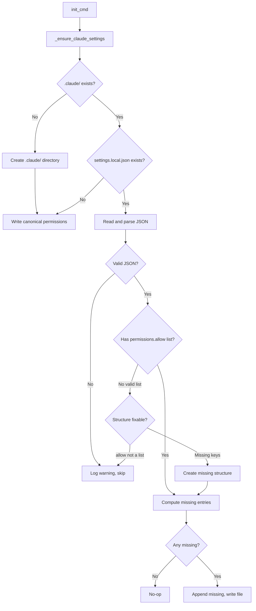

# Design Document: Init Claude Settings

## Overview

Extends the `agent-fox init` command to create and maintain
`.claude/settings.local.json` with pre-approved tool permissions for
autonomous Claude Code session execution. The implementation adds a single
helper function to the existing init module and a canonical permissions
constant.

## Architecture



### Module Responsibilities

1. **`agent_fox/cli/init.py`** — Houses the `_ensure_claude_settings()`
   helper and the `CANONICAL_PERMISSIONS` constant. Called from `init_cmd()`
   after existing init steps.

## Components and Interfaces

### Constants

```python
CANONICAL_PERMISSIONS: list[str] = [
    "Bash(bash:*)",
    "Bash(wc:*)",
    "Bash(git:*)",
    "Bash(python:*)",
    "Bash(python3:*)",
    "Bash(uv:*)",
    "Bash(make:*)",
    "Bash(sort:*)",
    "Bash(awk:*)",
    "Bash(ruff:*)",
    "Bash(gh:*)",
    "Bash(claude:*)",
    "Bash(source .venv/bin/activate:*)",
    "WebSearch",
    "WebFetch(domain:pypi.org)",
    "WebFetch(domain:github.com)",
    "WebFetch(domain:raw.githubusercontent.com)",
    "Grep",
    "Read",
    "Glob",
    "Edit",
    "Write",
]
```

### Functions

```python
def _ensure_claude_settings(project_root: Path) -> None:
    """Create or update .claude/settings.local.json with canonical permissions.

    - Creates .claude/ directory if needed.
    - Creates settings.local.json with canonical permissions if it doesn't exist.
    - If the file exists, merges missing canonical entries into permissions.allow.
    - Preserves existing user-added entries and their ordering.
    - Logs a warning and skips on invalid JSON or unexpected structure.
    """
```

### Integration Point

`init_cmd()` calls `_ensure_claude_settings(project_root)` after the existing
steps (directory creation, config.toml, develop branch, gitignore). The call
is made in both the fresh-init path and the already-initialized path, since
the merge behavior is idempotent.

## Data Models

### File Format: `.claude/settings.local.json`

```json
{
  "permissions": {
    "allow": [
      "<permission-entry>",
      ...
    ]
  }
}
```

The file is standard JSON. The `permissions.allow` array contains string
entries. Each entry is either a tool name (e.g., `"Read"`) or a parameterized
tool permission (e.g., `"Bash(git:*)"`, `"WebFetch(domain:github.com)"`).

## Correctness Properties

### Property 1: Canonical Coverage

*For any* initial state of `.claude/settings.local.json` (including
non-existent), after `_ensure_claude_settings()` runs successfully, the
resulting `permissions.allow` array SHALL contain every entry in
`CANONICAL_PERMISSIONS`.

**Validates: Requirements 17-REQ-1.1, 17-REQ-1.3, 17-REQ-2.1**

### Property 2: User Entry Preservation

*For any* `.claude/settings.local.json` containing a valid `permissions.allow`
list with arbitrary user-added entries, after `_ensure_claude_settings()` runs,
every entry that was present before the call SHALL still be present in the
resulting `permissions.allow` array.

**Validates: Requirements 17-REQ-2.2**

### Property 3: Idempotency

*For any* valid `.claude/settings.local.json`, calling
`_ensure_claude_settings()` twice in succession SHALL produce the same file
content as calling it once.

**Validates: Requirements 17-REQ-1.E1**

### Property 4: Order Preservation

*For any* `.claude/settings.local.json` with existing entries in
`permissions.allow`, after `_ensure_claude_settings()` runs, the relative
order of previously existing entries SHALL be unchanged, and new entries
SHALL appear after all existing entries.

**Validates: Requirements 17-REQ-2.3**

## Error Handling

| Error Condition | Behavior | Requirement |
|----------------|----------|-------------|
| File is not valid JSON | Log warning, skip settings update | 17-REQ-2.E1 |
| Missing `permissions` or `permissions.allow` keys | Create missing structure, populate with canonical entries | 17-REQ-2.E2 |
| `permissions.allow` is not a list | Log warning, skip settings update | 17-REQ-2.E3 |

## Technology Stack

- Python standard library: `json`, `pathlib`
- No additional dependencies required

## Definition of Done

A task group is complete when ALL of the following are true:

1. All subtasks within the group are checked off (`[x]`)
2. All spec tests (`test_spec.md` entries) for the task group pass
3. All property tests for the task group pass
4. All previously passing tests still pass (no regressions)
5. No linter warnings or errors introduced
6. Code is committed on a feature branch and pushed to remote
7. Feature branch is merged back to `develop`
8. `tasks.md` checkboxes are updated to reflect completion

## Testing Strategy

- **Unit tests:** Mock the filesystem to test `_ensure_claude_settings()` in
  isolation — file creation, merge logic, error handling.
- **Property tests:** Use Hypothesis to generate arbitrary existing permission
  lists and verify canonical coverage, preservation, idempotency, and ordering.
- **Integration tests:** Extend the existing `test_init.py` to verify that
  `agent-fox init` produces the expected `.claude/settings.local.json` file
  in a real temporary git repository.
