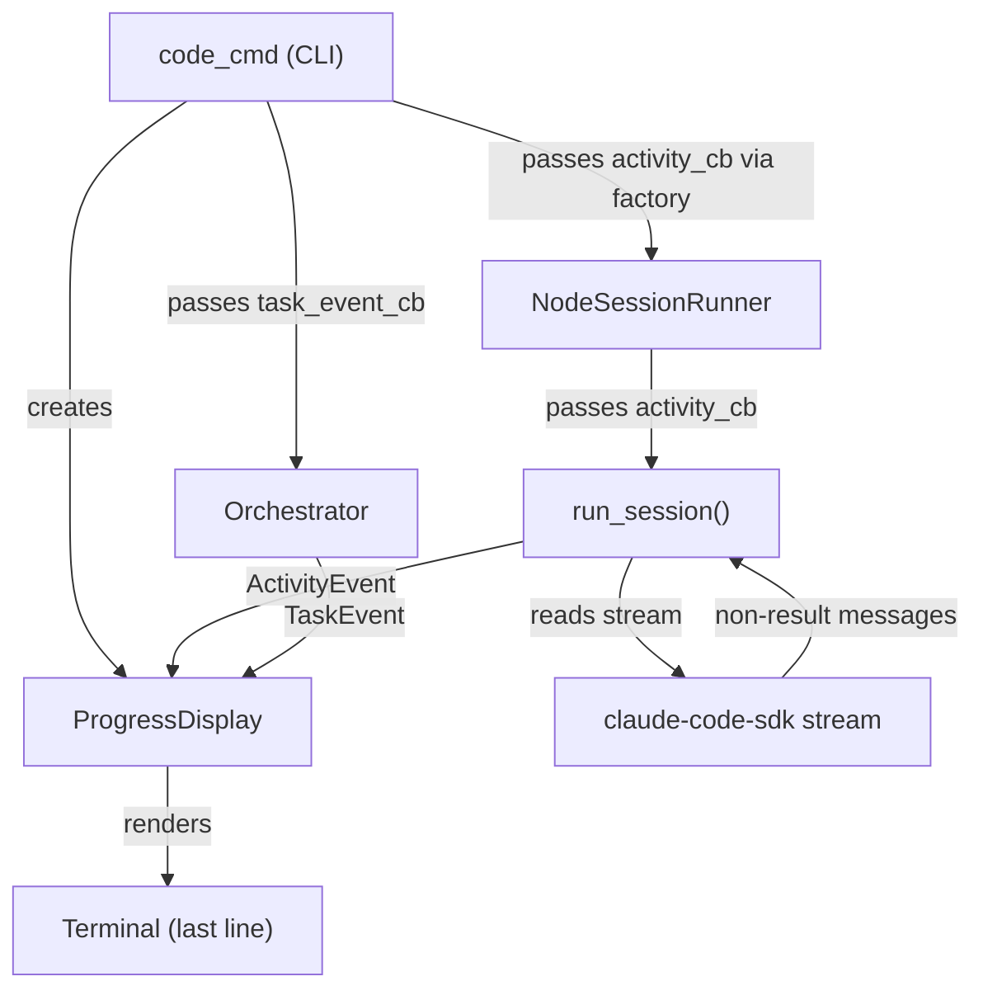

# Design Document: Live Progress Line

## Overview

Adds a real-time progress indicator to `agent-fox code` that shows a spinning
cursor and abbreviated SDK tool activity on a single, continuously-overwritten
terminal line. Task completion and failure events produce permanent lines that
scroll above the spinner.

The design introduces three components:

1. **`ProgressDisplay`** -- the UI renderer (Rich Live, spinner, permanent lines).
2. **`ActivityEvent` / `TaskEvent`** -- lightweight event types flowing from the
   session runner and orchestrator to the display.
3. **Callback wiring** -- optional callbacks threaded through the existing
   session runner and orchestrator without changing their return types.

## Architecture



### Module Responsibilities

1. **`agent_fox/ui/progress.py`** -- `ProgressDisplay` class: manages the
   spinner line, permanent lines, terminal width, TTY detection, quiet mode.
2. **`agent_fox/ui/events.py`** -- `ActivityEvent` and `TaskEvent` dataclasses
   plus the `abbreviate_arg()` helper.
3. **`agent_fox/session/runner.py`** (modified) -- emits `ActivityEvent`s from
   the SDK message stream via an optional callback.
4. **`agent_fox/engine/orchestrator.py`** (modified) -- emits `TaskEvent`s on
   task completion/failure via an optional callback.
5. **`agent_fox/cli/code.py`** (modified) -- creates `ProgressDisplay`, wires
   callbacks, starts/stops the display around `orchestrator.run()`.

## Components and Interfaces

### Event Types (`agent_fox/ui/events.py`)

```python
from dataclasses import dataclass
from collections.abc import Callable

@dataclass(frozen=True, slots=True)
class ActivityEvent:
    """SDK tool-use activity from a coding session."""
    node_id: str          # e.g. "03_session:2"
    tool_name: str        # e.g. "Read", "Bash", "Edit"
    argument: str         # abbreviated first argument

@dataclass(frozen=True, slots=True)
class TaskEvent:
    """Orchestrator task state change."""
    node_id: str
    status: str           # "completed" | "failed" | "blocked"
    duration_s: float     # wall-clock seconds for the task
    error_message: str | None = None

ActivityCallback = Callable[[ActivityEvent], None]
TaskCallback = Callable[[TaskEvent], None]

def abbreviate_arg(raw: str, max_len: int = 30) -> str:
    """Shorten a tool argument for display.

    - File paths: return basename only.
    - Other strings: truncate to max_len with ellipsis.
    """
```

### Progress Display (`agent_fox/ui/progress.py`)

```python
import asyncio
from agent_fox.ui.events import ActivityEvent, TaskEvent
from agent_fox.ui.theme import AppTheme

class ProgressDisplay:
    """Single-line spinner with permanent milestone lines.

    Thread-safe: all public methods can be called from any asyncio task.
    The display owns a `rich.live.Live` context that renders to the
    theme's console.
    """

    def __init__(self, theme: AppTheme, *, quiet: bool = False) -> None: ...

    def start(self) -> None:
        """Start the spinner. No-op if quiet or non-TTY."""

    def stop(self) -> None:
        """Stop the spinner and clear the line."""

    def on_activity(self, event: ActivityEvent) -> None:
        """Update the spinner line with new activity. Serialized via lock."""

    def on_task_event(self, event: TaskEvent) -> None:
        """Print a permanent line and continue the spinner below."""

    @property
    def activity_callback(self) -> Callable[[ActivityEvent], None]:
        """Callback suitable for passing to session runner."""
        return self.on_activity

    @property
    def task_callback(self) -> Callable[[TaskEvent], None]:
        """Callback suitable for passing to orchestrator."""
        return self.on_task_event
```

**Rendering strategy:**

- Uses `rich.live.Live` with `refresh_per_second=10` for smooth spinner animation.
- The Live renderable is a custom `_SpinnerLine` that composes a `rich.spinner.Spinner`
  with the current activity text.
- `on_activity()` updates the stored text and calls `live.refresh()`.
- `on_task_event()` calls `live.console.print(...)` to emit a permanent line
  above the Live area, then resumes the spinner.
- An `asyncio.Lock` serializes writes from concurrent tasks.
- When `not console.is_terminal`, `Live` is not started; `on_task_event` falls
  back to plain `console.print()`.

### Session Runner Modifications (`agent_fox/session/runner.py`)

Add an optional `activity_callback` parameter to `run_session()`:

```python
async def run_session(
    config: AgentFoxConfig,
    workspace: WorkspaceInfo,
    system_prompt: str,
    task_prompt: str,
    *,
    activity_callback: ActivityCallback | None = None,
) -> SessionOutcome:
```

Inside `_execute_query()`, the existing loop that discards non-result messages
is modified to inspect them:

```python
async for message in _query_messages(...):
    if activity_callback is not None and not _is_result_message(message):
        event = _extract_activity(node_id, message)
        if event is not None:
            activity_callback(event)
    if not _is_result_message(message):
        continue
    # ... existing result processing ...
```

`_extract_activity()` inspects the SDK message type:
- `ToolUseMessage` or similar: extract `tool_name` and first argument,
  call `abbreviate_arg()`.
- `ThinkingMessage` or unknown: emit `ActivityEvent(node_id, "thinking...", "")`.

### Orchestrator Modifications (`agent_fox/engine/orchestrator.py`)

Add an optional `task_callback` parameter to `Orchestrator.__init__()`:

```python
def __init__(
    self,
    config: OrchestratorConfig,
    *,
    plan_path: Path,
    state_path: Path,
    session_runner_factory: ...,
    hook_config: HookConfig | None = None,
    specs_dir: Path | None = None,
    no_hooks: bool = False,
    task_callback: TaskCallback | None = None,
) -> None:
```

In `_process_session_result()`, after updating state, emit a `TaskEvent`:

```python
if self._task_callback is not None:
    self._task_callback(TaskEvent(
        node_id=node_id,
        status=record.status,
        duration_s=record.duration_ms / 1000,
        error_message=record.error_message,
    ))
```

Also emit for cascade-blocked tasks in `_block_task()`.

### Code Command Modifications (`agent_fox/cli/code.py`)

```python
# Create progress display
progress = ProgressDisplay(theme, quiet=quiet)

# Wire activity callback through session runner factory
def session_runner_factory(node_id: str) -> NodeSessionRunner:
    return NodeSessionRunner(
        ...,
        activity_callback=progress.activity_callback,
    )

# Wire task callback to orchestrator
orchestrator = Orchestrator(
    ...,
    task_callback=progress.task_callback,
)

# Wrap execution
progress.start()
try:
    state = asyncio.run(orchestrator.run())
finally:
    progress.stop()
```

## Data Models

### Spinner Characters

Use Rich's built-in `"dots"` spinner (Braille dot pattern, 10 frames,
100ms interval). This is smooth, compact, and widely supported in modern
terminals.

### Permanent Line Format

```
{icon} {node_id} {status_text}
```

- Completed: `\u2714 03_session:2 done (45s)` styled with `success` role.
- Failed: `\u2718 03_session:2 failed` styled with `error` role.
- Blocked: `\u2718 03_session:2 blocked` styled with `error` role.

Duration formatting: `Xs` for < 60s, `Xm Ys` for >= 60s.

## Operational Readiness

- **Observability:** Progress events are ephemeral display-only; no
  persistence or logging beyond existing orchestrator logging.
- **Rollout:** Feature is always-on (no feature flag). `--quiet` and non-TTY
  are the suppression mechanisms.
- **Compatibility:** Requires a terminal supporting carriage return and ANSI
  escape codes. Degrades gracefully on non-TTY (permanent lines only).

## Correctness Properties

### Property 1: Spinner Never Wraps

*For any* activity text and terminal width, the rendered spinner line
SHALL have length <= terminal width.

**Validates:** 18-REQ-3.3

### Property 2: Abbreviation Idempotence

*For any* string input, `abbreviate_arg(abbreviate_arg(s))` SHALL
equal `abbreviate_arg(s)`.

**Validates:** 18-REQ-2.E2, 18-REQ-2.E3

### Property 3: Quiet Produces No Output

*For any* sequence of activity and task events, a `ProgressDisplay`
created with `quiet=True` SHALL produce zero bytes of terminal output.

**Validates:** 18-REQ-1.E1

### Property 4: Permanent Lines Are Complete

*For any* `TaskEvent` with status "completed", "failed", or "blocked",
the emitted permanent line SHALL contain the node_id and status text.

**Validates:** 18-REQ-4.1, 18-REQ-4.2

### Property 5: Activity Callback Is Optional

*For any* call to `run_session()` without an `activity_callback`,
session execution SHALL complete identically to the current behavior.

**Validates:** 18-REQ-2.3

## Error Handling

| Error Condition | Behavior | Requirement |
|----------------|----------|-------------|
| Terminal width unavailable | Default to 80 columns | 18-REQ-3.E1 |
| stdout not a TTY | Disable Live, print permanent lines only | 18-REQ-1.E2 |
| `--quiet` flag set | Suppress all progress output | 18-REQ-1.E1 |
| Activity callback raises | Catch, log warning, continue session | 18-REQ-2.E1 |
| Exception during orchestrator run | `finally` block stops display | 18-REQ-5.E1 |
| Non-TTY permanent lines | Plain text, no ANSI | 18-REQ-4.E1 |

## Technology Stack

- **Rich >= 13.0** (`rich.live.Live`, `rich.spinner.Spinner`) -- already a
  project dependency.
- **asyncio.Lock** -- for serializing concurrent writes from parallel sessions.
- No new dependencies.

## Definition of Done

A task group is complete when ALL of the following are true:

1. All subtasks within the group are checked off (`[x]`)
2. All spec tests (`test_spec.md` entries) for the task group pass
3. All property tests for the task group pass
4. All previously passing tests still pass (no regressions)
5. No linter warnings or errors introduced
6. Code is committed on a feature branch and pushed to remote
7. Feature branch is merged back to `develop`
8. `tasks.md` checkboxes are updated to reflect completion

## Testing Strategy

- **Unit tests:** Test `abbreviate_arg()`, `ActivityEvent`/`TaskEvent`
  construction, `ProgressDisplay` in quiet mode and non-TTY mode using
  `Console(file=StringIO())`.
- **Property tests (Hypothesis):** Test abbreviation truncation for arbitrary
  strings and paths, spinner line length invariant for arbitrary text + width.
- **Integration tests:** Test that `run_session()` with a mock SDK stream
  invokes the activity callback with expected events. Test that the code
  command wires progress display correctly.
