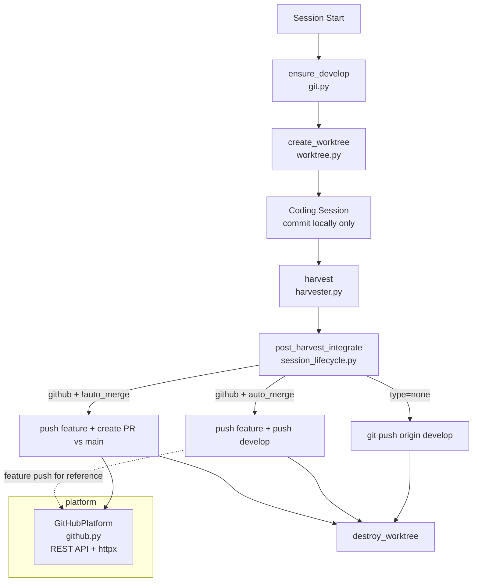
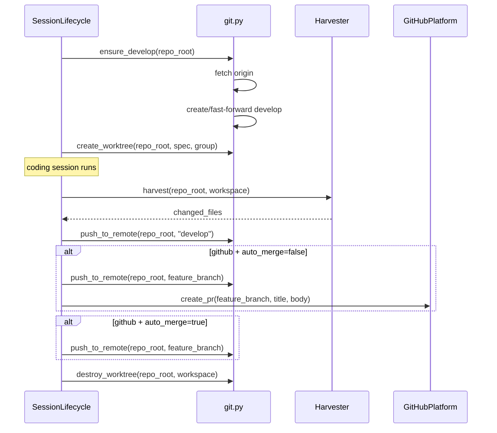

# Design Document: Git and Platform Overhaul

## Overview

This spec overhauls three areas of agent-fox: (1) robust develop branch
management, (2) post-harvest remote integration, and (3) a simplified GitHub
platform using the REST API. It removes the `NullPlatform`, the `gh` CLI
dependency, the `create_platform` factory, and dead platform methods
(`wait_for_ci`, `wait_for_review`, `merge_pr`). It also strips push
instructions from the coding agent's prompt templates.

## Architecture





### Module Responsibilities

1. `agent_fox/workspace/git.py` — Git operations: branch management, merge,
   rebase, commit detection. Extended with `ensure_develop()`,
   `push_to_remote()`, `detect_default_branch()`, and
   `remote_branch_exists()`.
2. `agent_fox/workspace/harvester.py` — Unchanged. Merges feature branch into
   local develop.
3. `agent_fox/engine/session_lifecycle.py` — Session lifecycle. Extended with
   `_post_harvest_integrate()` that runs after harvest, before worktree
   cleanup.
4. `agent_fox/platform/github.py` — Rewritten. Uses GitHub REST API via httpx.
   Only provides `create_pr()`.
5. `agent_fox/platform/protocol.py` — Simplified to a single `create_pr`
   method.
6. `agent_fox/platform/__init__.py` — Updated exports.
7. `agent_fox/core/config.py` — `PlatformConfig` simplified to `type` +
   `auto_merge`.
8. `agent_fox/cli/init.py` — Updated `_ensure_develop_branch()` to use the
   new async `ensure_develop()` logic.
9. `agent_fox/_templates/prompts/git-flow.md` — Push instructions removed.
10. `agent_fox/_templates/prompts/coding.md` — Push instructions removed.

### Removed Modules

- `agent_fox/platform/null.py` — Deleted.
- `agent_fox/platform/factory.py` — Deleted.

## Components and Interfaces

### New git.py Functions

```python
# agent_fox/workspace/git.py

async def ensure_develop(repo_root: Path) -> None:
    """Ensure a local develop branch exists and is up-to-date.

    1. Fetch origin (warn and continue on failure).
    2. If local develop exists:
       a. If origin/develop exists and local is behind, fast-forward.
       b. If diverged, warn and use local as-is.
    3. If local develop does not exist:
       a. If origin/develop exists, create tracking branch.
       b. Otherwise, create from default branch.

    Raises:
        WorkspaceError: If no suitable base branch can be found.
    """
    ...

async def detect_default_branch(repo_root: Path) -> str:
    """Detect the repository's default branch name.

    Tries git symbolic-ref refs/remotes/origin/HEAD, then falls back
    to 'main', then 'master'. Returns the first that exists locally.

    Raises:
        WorkspaceError: If no default branch can be determined.
    """
    ...

async def remote_branch_exists(
    repo_root: Path,
    branch: str,
    remote: str = "origin",
) -> bool:
    """Check if a branch exists on the given remote."""
    ...

async def push_to_remote(
    repo_root: Path,
    branch: str,
    remote: str = "origin",
) -> bool:
    """Push a branch to the remote. Returns True on success, False on failure.

    Does not raise — logs a warning on failure.
    """
    ...

async def local_branch_exists(repo_root: Path, branch: str) -> bool:
    """Check if a local branch exists."""
    ...
```

### Simplified Platform Protocol

```python
# agent_fox/platform/protocol.py
from typing import Protocol, runtime_checkable


@runtime_checkable
class Platform(Protocol):
    """Interface for remote forge integration."""

    async def create_pr(
        self,
        branch: str,
        title: str,
        body: str,
    ) -> str:
        """Create a pull request.

        Args:
            branch: The feature branch (head).
            title: PR title.
            body: PR body/description.

        Returns:
            The PR URL as a string.

        Raises:
            IntegrationError: If PR creation fails.
        """
        ...
```

### Rewritten GitHubPlatform

```python
# agent_fox/platform/github.py
import httpx
import logging
import os
import re
from pathlib import Path

from agent_fox.core.errors import IntegrationError

logger = logging.getLogger(__name__)

_GITHUB_API = "https://api.github.com"


class GitHubPlatform:
    """GitHub platform using the REST API.

    Creates pull requests via the GitHub REST API, authenticated
    with a GITHUB_PAT environment variable.
    """

    def __init__(self, owner: str, repo: str, token: str) -> None:
        self._owner = owner
        self._repo = repo
        self._token = token

    async def create_pr(
        self,
        branch: str,
        title: str,
        body: str,
    ) -> str:
        """Create a GitHub PR via REST API."""
        url = f"{_GITHUB_API}/repos/{self._owner}/{self._repo}/pulls"
        headers = {
            "Authorization": f"Bearer {self._token}",
            "Accept": "application/vnd.github+json",
            "X-GitHub-Api-Version": "2022-11-28",
        }
        # Detect the default branch for the PR base
        default_branch = await self._get_default_branch(headers)
        payload = {
            "title": title,
            "body": body,
            "head": branch,
            "base": default_branch,
        }
        async with httpx.AsyncClient() as client:
            resp = await client.post(url, json=payload, headers=headers)
        if resp.status_code == 201:
            pr_url = resp.json().get("html_url", "")
            logger.info("Created PR: %s", pr_url)
            return pr_url
        raise IntegrationError(
            f"GitHub PR creation failed ({resp.status_code}): {resp.text}",
            branch=branch,
        )

    async def _get_default_branch(self, headers: dict) -> str:
        """Get the repository's default branch from the GitHub API."""
        url = f"{_GITHUB_API}/repos/{self._owner}/{self._repo}"
        async with httpx.AsyncClient() as client:
            resp = await client.get(url, headers=headers)
        if resp.status_code == 200:
            return resp.json().get("default_branch", "main")
        return "main"


def parse_github_remote(remote_url: str) -> tuple[str, str] | None:
    """Extract (owner, repo) from a GitHub remote URL.

    Supports HTTPS and SSH formats:
      - https://github.com/owner/repo.git
      - git@github.com:owner/repo.git

    Returns None if the URL is not a recognized GitHub URL.
    """
    patterns = [
        r"github\.com[:/]([^/]+)/([^/.]+?)(?:\.git)?$",
    ]
    for pattern in patterns:
        match = re.search(pattern, remote_url)
        if match:
            return match.group(1), match.group(2)
    return None
```

### Post-Harvest Integration in Session Lifecycle

```python
# Added to agent_fox/engine/session_lifecycle.py

async def _post_harvest_integrate(
    self,
    repo_root: Path,
    workspace: WorkspaceInfo,
    platform_config: PlatformConfig,
) -> None:
    """Push changes to remote after harvest.

    Behavior depends on platform configuration:
    - type="none": push develop to origin
    - type="github", auto_merge=true: push feature + push develop
    - type="github", auto_merge=false: push feature + create PR vs main
    """
    ...
```

## Data Models

### Simplified PlatformConfig

```python
class PlatformConfig(BaseModel):
    model_config = ConfigDict(extra="ignore")

    type: str = "none"        # "none" | "github"
    auto_merge: bool = False  # only meaningful when type = "github"
```

### Default config.toml Template

```toml
# [platform]
# type = "none"
# auto_merge = false
```

## Operational Readiness

### Observability

- `ensure_develop` logs at INFO level when creating/fast-forwarding develop.
- `push_to_remote` logs at INFO on success, WARNING on failure.
- `_post_harvest_integrate` logs the integration strategy chosen.
- `GitHubPlatform.create_pr` logs the PR URL on success.
- All fallback paths (missing GITHUB_PAT, API errors) log at WARNING.

### Migration

- Existing `config.toml` files with old `[platform]` fields (`wait_for_ci`,
  `wait_for_review`, `ci_timeout`, `pr_granularity`, `labels`) continue to
  load without error due to `extra = "ignore"`.
- No database or state migration required.

### Rollback

- Revert to previous commit. No persistent state changes.

## Correctness Properties

### Property 1: Develop Branch Always Exists After Ensure

*For any* repository state (with or without local develop, with or without
remote develop), after `ensure_develop()` completes without raising,
`develop` SHALL exist as a local branch.

**Validates: 19-REQ-1.1, 19-REQ-1.2, 19-REQ-1.3, 19-REQ-1.E1**

### Property 2: Develop Is Not Behind Remote After Ensure

*For any* repository where `origin/develop` exists and is fetchable, after
`ensure_develop()` completes, the local `develop` SHALL contain all commits
from `origin/develop` (i.e., local is at or ahead of remote).

**Validates: 19-REQ-1.6**

### Property 3: No Push Instructions In Templates

*For any* template file in `_templates/prompts/`, the content SHALL NOT
contain the string `git push`.

**Validates: 19-REQ-2.1, 19-REQ-2.4, 19-REQ-2.E1**

### Property 4: Post-Harvest Push Strategy Matches Config

*For any* platform config, post-harvest integration SHALL push develop to
origin if and only if `type = "none"` or `auto_merge = true`.

**Validates: 19-REQ-3.1, 19-REQ-3.2, 19-REQ-3.3**

### Property 5: Platform Fallback on Missing Token

*For any* GitHub platform configuration where `GITHUB_PAT` is unset or
invalid, the system SHALL fall back to no-platform behavior (push develop
only) without raising an exception.

**Validates: 19-REQ-4.E1, 19-REQ-4.E2**

### Property 6: Remote URL Parsing Correctness

*For any* valid GitHub remote URL (HTTPS or SSH format),
`parse_github_remote()` SHALL return the correct `(owner, repo)` tuple.
*For any* non-GitHub URL, it SHALL return `None`.

**Validates: 19-REQ-4.4, 19-REQ-4.E4**

### Property 7: Config Backward Compatibility

*For any* TOML configuration containing removed platform fields
(`wait_for_ci`, `wait_for_review`, `ci_timeout`, `pr_granularity`, `labels`),
`PlatformConfig` SHALL parse without error, ignoring the unknown fields.

**Validates: 19-REQ-5.E1**

## Error Handling

| Error Condition | Behavior | Requirement |
|----------------|----------|-------------|
| Local develop missing, no remote develop, no default branch | Raise `WorkspaceError` | 19-REQ-1.E2 |
| `git fetch origin` fails | Warn, continue with local state | 19-REQ-1.E3 |
| Local and remote develop diverged | Warn, use local as-is | 19-REQ-1.E4 |
| Push to origin fails | Warn, continue (local merge preserved) | 19-REQ-3.E1 |
| PR creation fails | Warn, continue (local merge preserved) | 19-REQ-3.E2 |
| Feature branch already deleted | Warn, skip push | 19-REQ-3.E3 |
| `GITHUB_PAT` not set | Warn, fall back to no-platform | 19-REQ-4.E1 |
| GitHub API 401/403 | Warn, fall back to no-platform | 19-REQ-4.E2 |
| GitHub API other error | Warn, skip PR | 19-REQ-4.E3 |
| Non-GitHub remote URL | Warn, fall back to no-platform | 19-REQ-4.E4 |
| Unknown platform type in config | Raise `ConfigError` | 19-REQ-5.2 |

## Technology Stack

| Technology | Version | Purpose |
|-----------|---------|---------|
| Python | 3.12+ | Runtime |
| asyncio | stdlib | Async git and HTTP operations |
| httpx | >=0.27 | GitHub REST API calls |
| pydantic | >=2.0 | Configuration validation |
| re | stdlib | Remote URL parsing |
| os | stdlib | Environment variable access |

## Definition of Done

A task group is complete when ALL of the following are true:

1. All subtasks within the group are checked off (`[x]`)
2. All spec tests (`test_spec.md` entries) for the task group pass
3. All property tests for the task group pass
4. All previously passing tests still pass (no regressions)
5. No linter warnings or errors introduced
6. Code is committed on a feature branch and pushed to remote
7. Feature branch is merged back to `develop`
8. `tasks.md` checkboxes are updated to reflect completion

## Testing Strategy

- **Unit tests** validate `ensure_develop`, `push_to_remote`,
  `detect_default_branch`, `parse_github_remote`, `GitHubPlatform.create_pr`,
  and `_post_harvest_integrate` in isolation. Git commands are mocked via
  `run_git` patches. HTTP calls are mocked via `httpx` respx or monkeypatch.
- **Property tests** verify invariants: template content has no push
  instructions, remote URL parsing handles all formats, config backward
  compatibility with old fields.
- **Integration tests** are not required — all git and HTTP interactions are
  mocked.
- **Test location:** `tests/unit/workspace/`, `tests/unit/platform/`,
  `tests/property/platform/`, `tests/unit/engine/`
