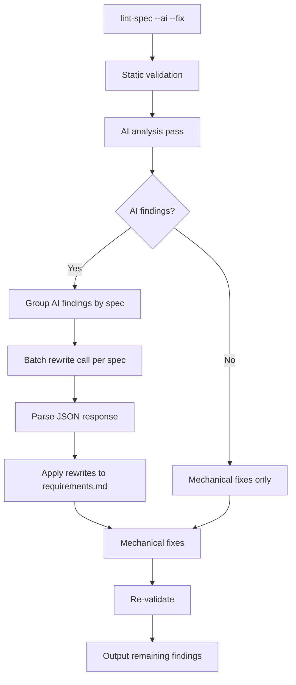

# Design Document: AI-Powered Criteria Auto-Fix

## Overview

This spec adds an AI-powered rewrite step to the `lint-spec --fix` pipeline.
When `--ai --fix` are combined, the system takes AI analysis findings for
`vague-criterion` and `implementation-leak` rules, sends a batched rewrite
request to the STANDARD-tier model, and applies the returned replacement text
directly to `requirements.md`.

## Architecture



### Module Responsibilities

1. **`agent_fox.spec.ai_validator`** — Extended with `rewrite_criteria()`
   function that sends the batched rewrite prompt and returns structured
   replacements.
2. **`agent_fox.spec.fixer`** — Extended with `fix_ai_criteria()` function
   that locates and replaces criterion text in `requirements.md`.
3. **`agent_fox.cli.lint_spec`** — Extended to call AI rewrite before
   mechanical fixes when both `--ai` and `--fix` are active.

## Components and Interfaces

### AI Rewrite Function

```python
# agent_fox/spec/ai_validator.py

async def rewrite_criteria(
    spec_name: str,
    requirements_text: str,
    findings: list[Finding],
    model: str,
) -> dict[str, str]:
    """Send a batched rewrite request for flagged criteria.

    Args:
        spec_name: Name of the spec being fixed.
        requirements_text: Full content of requirements.md.
        findings: AI findings with rule vague-criterion or implementation-leak.
        model: Model ID for the STANDARD tier.

    Returns:
        Mapping of criterion_id -> replacement_text.
        Empty dict on failure.
    """
```

### Criteria Fixer Function

```python
# agent_fox/spec/fixer.py

def fix_ai_criteria(
    spec_name: str,
    req_path: Path,
    rewrites: dict[str, str],
) -> list[FixResult]:
    """Apply AI-generated criterion rewrites to requirements.md.

    For each criterion_id in rewrites:
    1. Locate the line containing the criterion ID in the file.
    2. Replace the criterion text (everything after the ID prefix)
       with the rewrite text.
    3. Record a FixResult.

    Args:
        spec_name: Spec name for FixResult metadata.
        req_path: Path to requirements.md.
        rewrites: Mapping of criterion_id -> replacement_text.

    Returns:
        List of FixResult for each successfully applied rewrite.
    """
```

### CLI Integration

```python
# agent_fox/cli/lint_spec.py (modified lint_spec function)

# After AI analysis, before mechanical fixes:
if ai and fix:
    ai_fix_results = _apply_ai_fixes(findings, discovered, specs_dir)
    all_fix_results.extend(ai_fix_results)
```

## Data Models

### Rewrite Prompt Response Schema

```json
{
  "rewrites": [
    {
      "criterion_id": "09-REQ-1.1",
      "original": "THE system SHALL be fast.",
      "replacement": "THE system SHALL respond to API requests within 200ms at the 95th percentile under normal load."
    }
  ]
}
```

### Criterion Location

The fixer locates a criterion by searching for its ID pattern in
`requirements.md`. Two formats are supported:

- Bracket format: `[09-REQ-1.1]`
- Bold format: `**09-REQ-1.1:**`

The replacement covers the text from the ID to the end of the criterion
(either the next numbered criterion, the next heading, or a blank line).

## Correctness Properties

### Property 1: Requirement ID Preservation

*For any* rewritten criterion, the output text SHALL contain the same
requirement ID as the original criterion.

**Validates: Requirements 22-REQ-1.3**

### Property 2: File Integrity

*For any* `requirements.md` file processed by the fixer, the output file
SHALL be valid UTF-8 and SHALL contain every requirement heading and
requirement ID present in the original file.

**Validates: Requirements 22-REQ-1.2, 22-REQ-1.3**

### Property 3: Batch Efficiency

*For any* set of N fixable AI findings across M specs, the system SHALL make
at most M rewrite API calls (one per spec with findings).

**Validates: Requirements 22-REQ-3.1, 22-REQ-3.2**

### Property 4: Graceful Degradation

*For any* AI rewrite call that fails, the system SHALL leave the original
`requirements.md` unchanged and log a warning.

**Validates: Requirements 22-REQ-1.E1**

### Property 5: EARS Syntax in Prompt

*For any* rewrite call, the prompt text SHALL contain the EARS keyword list
(SHALL, WHEN, WHILE, IF/THEN, WHERE).

**Validates: Requirements 22-REQ-2.1**

### Property 6: No-Op Without AI Flag

*For any* invocation with `--fix` but without `--ai`, zero AI rewrite calls
SHALL be made.

**Validates: Requirements 22-REQ-1.4**

## Error Handling

| Error Condition | Behavior | Requirement |
|----------------|----------|-------------|
| AI rewrite call fails (network/auth/timeout) | Log warning, skip rewrite, leave file unchanged | 22-REQ-1.E1 |
| Criterion ID not found in requirements.md | Skip that criterion, log warning | 22-REQ-1.E2 |
| AI response not valid JSON | Try code-fence extraction, then skip | 22-REQ-2.E1 |
| AI response omits a criterion ID | Skip that criterion, no error | 22-REQ-2.E2 |
| More than 20 findings for one spec | Split into batches of 20 | 22-REQ-3.E1 |
| Re-validation flags same criterion after rewrite | Report as remaining finding, no re-rewrite | 22-REQ-4.E1 |

## Technology Stack

- Python 3.12+
- Anthropic Python SDK (`anthropic` package) for AI calls
- STANDARD-tier model via `agent_fox.core.models.resolve_model`
- Existing `_extract_json` helper for response parsing

## Operational Readiness

- **Observability:** Rewrite calls are logged at INFO level with spec name
  and criterion count. Failures logged at WARNING.
- **Cost control:** Batching ensures at most one extra API call per spec.
  The 20-criterion batch limit prevents oversized prompts.
- **Rollback:** Since rewrites modify `requirements.md` on disk, users can
  revert with `git checkout` if the result is unsatisfactory.

## Definition of Done

A task group is complete when ALL of the following are true:

1. All subtasks within the group are checked off (`[x]`)
2. All spec tests (`test_spec.md` entries) for the task group pass
3. All property tests for the task group pass
4. All previously passing tests still pass (no regressions)
5. No linter warnings or errors introduced
6. Code is committed on a feature branch and pushed to remote
7. Feature branch is merged back to `develop`
8. `tasks.md` checkboxes are updated to reflect completion

## Testing Strategy

- **Unit tests:** Mock the Anthropic client to test `rewrite_criteria()` with
  known responses (valid JSON, fenced JSON, missing IDs, failures).
- **Unit tests:** Test `fix_ai_criteria()` with fixture `requirements.md`
  files in both bracket and bold ID formats.
- **Property tests:** Use Hypothesis to generate criterion IDs and verify
  they are preserved through the rewrite pipeline.
- **Integration tests:** Test the full `lint-spec --ai --fix` CLI flow with
  mocked AI responses to verify end-to-end behavior.
