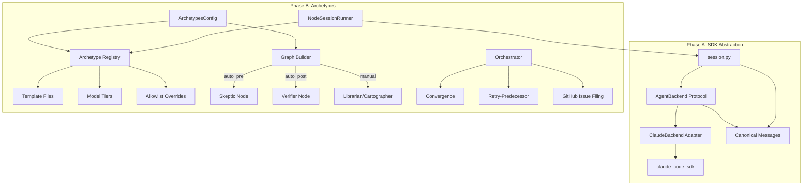

# Design Document: Agent Archetypes

## Overview

This design introduces two sequential changes to the agent-fox session
execution layer:

**Phase A — SDK Abstraction.** An `AgentBackend` protocol decouples
`session.py` from Claude SDK types. A `ClaudeBackend` adapter encapsulates all
SDK interaction. The session runner and orchestrator depend only on the protocol
and canonical message types. This is a mechanical refactor with no behavioral
change.

**Phase B — Archetypes.** An archetype registry maps named configurations
(template files, model tier, allowlist, injection mode) to task graph nodes.
The graph builder auto-injects review/verification nodes. The orchestrator
dispatches multi-instance sessions and handles retry-predecessor logic.

## Architecture



### Module Responsibilities

1. **`agent_fox/session/backends/protocol.py`** — `AgentBackend` protocol,
   canonical message dataclasses, permission callback type alias.
2. **`agent_fox/session/backends/claude.py`** — `ClaudeBackend` adapter
   wrapping `claude_code_sdk`.
3. **`agent_fox/session/backends/__init__.py`** — Backend registry and
   `get_backend()` factory.
4. **`agent_fox/session/session.py`** — Session runner, refactored to depend
   on `AgentBackend` protocol only.
5. **`agent_fox/session/prompt.py`** — Template resolution via archetype
   registry (replaces `_ROLE_TEMPLATES`).
6. **`agent_fox/session/archetypes.py`** — Archetype registry definition,
   `ArchetypeEntry` dataclass, `get_archetype()` lookup.
7. **`agent_fox/session/convergence.py`** — Multi-instance convergence logic
   (Skeptic union+dedup, Verifier majority vote).
8. **`agent_fox/session/github_issues.py`** — GitHub issue
   search-before-create idempotency via `gh` CLI.
9. **`agent_fox/graph/types.py`** — `Node` extended with `archetype` and
   `instances` fields.
10. **`agent_fox/graph/builder.py`** — Auto-injection of `auto_pre` /
    `auto_post` archetype nodes.
11. **`agent_fox/spec/parser.py`** — `[archetype: X]` tag extraction in
    `TaskGroupDef`.
12. **`agent_fox/core/config.py`** — `ArchetypesConfig` pydantic model added
    to `AgentFoxConfig`.
13. **`agent_fox/engine/session_lifecycle.py`** — `NodeSessionRunner`
    archetype-aware prompt/model/allowlist resolution.
14. **`agent_fox/engine/engine.py`** — Retry-predecessor logic in
    `_process_session_result()`.

## Components and Interfaces

### 2.1 — AgentBackend Protocol

```python
# agent_fox/session/backends/protocol.py

from __future__ import annotations
from collections.abc import AsyncIterator
from dataclasses import dataclass
from typing import Any, Protocol, runtime_checkable

# Canonical message types
@dataclass(frozen=True)
class ToolUseMessage:
    tool_name: str
    tool_input: dict[str, Any]

@dataclass(frozen=True)
class AssistantMessage:
    content: str

@dataclass(frozen=True)
class ResultMessage:
    status: str               # "completed" | "failed"
    input_tokens: int
    output_tokens: int
    duration_ms: int
    error_message: str | None
    is_error: bool

AgentMessage = ToolUseMessage | AssistantMessage | ResultMessage

# Permission callback type
PermissionCallback = Callable[
    [str, dict[str, Any]],     # tool_name, tool_input
    Awaitable[bool],           # True = allow, False = deny
]

@runtime_checkable
class AgentBackend(Protocol):
    @property
    def name(self) -> str: ...

    async def execute(
        self,
        prompt: str,
        *,
        system_prompt: str,
        model: str,
        cwd: str,
        permission_callback: PermissionCallback | None = None,
    ) -> AsyncIterator[AgentMessage]: ...

    async def close(self) -> None: ...
```

### 2.2 — ClaudeBackend Adapter

```python
# agent_fox/session/backends/claude.py

class ClaudeBackend:
    """AgentBackend implementation wrapping claude_code_sdk."""

    @property
    def name(self) -> str:
        return "claude"

    async def execute(
        self,
        prompt: str,
        *,
        system_prompt: str,
        model: str,
        cwd: str,
        permission_callback: PermissionCallback | None = None,
    ) -> AsyncIterator[AgentMessage]:
        # Build ClaudeCodeOptions, open ClaudeSDKClient,
        # map SDK messages to canonical types, yield them.
        ...

    async def close(self) -> None: ...
```

All `claude_code_sdk` imports are confined to this file. The adapter maps:

| SDK Type | Canonical Type |
|----------|---------------|
| SDK `ResultMessage` | `protocol.ResultMessage` |
| Tool-use messages (`tool_name`, `tool_input` attrs) | `ToolUseMessage` |
| Other messages (thinking, text) | `AssistantMessage` |
| `PermissionResultAllow` / `PermissionResultDeny` | `bool` via callback |

### 2.3 — Archetype Registry

```python
# agent_fox/session/archetypes.py

@dataclass(frozen=True)
class ArchetypeEntry:
    name: str
    templates: list[str]           # e.g. ["coding.md", "git-flow.md"]
    default_model_tier: str        # e.g. "ADVANCED"
    injection: str | None          # "auto_pre" | "auto_post" | "manual" | None
    task_assignable: bool          # False for coordinator
    retry_predecessor: bool = False
    default_allowlist: list[str] | None = None  # None = use global

ARCHETYPE_REGISTRY: dict[str, ArchetypeEntry] = {
    "coder": ArchetypeEntry(
        name="coder",
        templates=["coding.md", "git-flow.md"],
        default_model_tier="ADVANCED",
        injection=None,
        task_assignable=True,
    ),
    "skeptic": ArchetypeEntry(
        name="skeptic",
        templates=["skeptic.md"],
        default_model_tier="STANDARD",
        injection="auto_pre",
        task_assignable=True,
        default_allowlist=[
            "ls", "cat", "git", "wc", "head", "tail",
        ],
    ),
    "verifier": ArchetypeEntry(
        name="verifier",
        templates=["verifier.md"],
        default_model_tier="STANDARD",
        injection="auto_post",
        task_assignable=True,
        retry_predecessor=True,
    ),
    "librarian": ArchetypeEntry(
        name="librarian",
        templates=["librarian.md"],
        default_model_tier="STANDARD",
        injection="manual",
        task_assignable=True,
    ),
    "cartographer": ArchetypeEntry(
        name="cartographer",
        templates=["cartographer.md"],
        default_model_tier="STANDARD",
        injection="manual",
        task_assignable=True,
    ),
    "coordinator": ArchetypeEntry(
        name="coordinator",
        templates=["coordinator.md"],
        default_model_tier="STANDARD",
        injection=None,
        task_assignable=False,
    ),
}


def get_archetype(name: str) -> ArchetypeEntry:
    """Look up an archetype by name, falling back to 'coder'."""
    entry = ARCHETYPE_REGISTRY.get(name)
    if entry is None:
        logger.warning("Unknown archetype '%s', falling back to 'coder'", name)
        return ARCHETYPE_REGISTRY["coder"]
    return entry
```

### 2.4 — Node Dataclass Extension

```python
# agent_fox/graph/types.py — modified Node

@dataclass
class Node:
    id: str
    spec_name: str
    group_number: int
    title: str
    optional: bool
    status: NodeStatus = NodeStatus.PENDING
    subtask_count: int = 0
    body: str = ""
    archetype: str = "coder"     # NEW
    instances: int = 1           # NEW
```

### 2.5 — TaskGroupDef Extension

```python
# agent_fox/spec/parser.py — modified TaskGroupDef

@dataclass(frozen=True)
class TaskGroupDef:
    number: int
    title: str
    optional: bool
    completed: bool
    subtasks: tuple[SubtaskDef, ...]
    body: str
    archetype: str | None = None  # NEW — from [archetype: X] tag
```

The `_GROUP_PATTERN` regex and parsing loop are extended to extract
`[archetype: X]` from the title text. The tag is stripped from the stored
`title` field so it does not appear in node titles.

Tag extraction regex: `\[archetype:\s*(\w+)\]`

### 2.6 — Graph Builder Injection

The `build_graph()` function gains a `config` parameter
(`ArchetypesConfig`) and performs injection after creating base nodes:

```python
def build_graph(
    specs: list[SpecInfo],
    task_groups: dict[str, list[TaskGroupDef]],
    cross_deps: list[CrossSpecDep],
    archetypes_config: ArchetypesConfig | None = None,
    coordinator_overrides: list[ArchetypeOverride] | None = None,
) -> TaskGraph:
```

**Injection algorithm:**

1. Create base nodes and intra-spec edges (existing logic).
2. For each spec:
   a. If `archetypes_config.skeptic` is enabled, insert a group-0 Skeptic
      node. Set its `instances` from config. Add an edge from group 0 to the
      spec's first real group.
   b. Find the last Coder group number (max group in spec).
   c. For each registry entry with `injection="auto_post"` that is enabled
      in config, insert a new node at `group_number = last + offset`.
      All auto_post nodes share the same predecessor (the last Coder group)
      but have no edges between each other.
3. Apply coordinator overrides: for each override, set
   `nodes[override.node].archetype = override.archetype` if the archetype is
   enabled and task-assignable.
4. Apply `tasks.md` tag overrides: if `TaskGroupDef.archetype` is set, it
   takes final precedence.
5. Log final archetype assignment for each node at INFO level.

### 2.7 — Configuration Extension

```python
# agent_fox/core/config.py — new models

class ArchetypeInstancesConfig(BaseModel):
    model_config = ConfigDict(extra="ignore")
    skeptic: int = Field(default=1)
    verifier: int = Field(default=1)

    @field_validator("skeptic", "verifier")
    @classmethod
    def clamp_instances(cls, v: int, info) -> int:
        return _clamp(v, ge=1, le=5, field_name=f"archetypes.instances.{info.field_name}")

class SkepticConfig(BaseModel):
    model_config = ConfigDict(extra="ignore")
    block_threshold: int = Field(default=3)

    @field_validator("block_threshold")
    @classmethod
    def clamp_threshold(cls, v: int) -> int:
        return _clamp(v, ge=0, field_name="archetypes.skeptic.block_threshold")

class ArchetypesConfig(BaseModel):
    model_config = ConfigDict(extra="ignore")

    coder: bool = True
    skeptic: bool = False
    verifier: bool = False
    librarian: bool = False
    cartographer: bool = False

    instances: ArchetypeInstancesConfig = Field(
        default_factory=ArchetypeInstancesConfig
    )
    skeptic_config: SkepticConfig = Field(
        default_factory=SkepticConfig, alias="skeptic_settings"
    )
    models: dict[str, str] = Field(default_factory=dict)
    allowlists: dict[str, list[str]] = Field(default_factory=dict)
    backends: dict[str, str] = Field(default_factory=dict)

    @field_validator("coder")
    @classmethod
    def coder_always_enabled(cls, v: bool) -> bool:
        if not v:
            logger.warning("archetypes.coder cannot be disabled; ignoring")
        return True


# AgentFoxConfig gains:
class AgentFoxConfig(BaseModel):
    ...
    archetypes: ArchetypesConfig = Field(default_factory=ArchetypesConfig)
```

### 2.8 — NodeSessionRunner Archetype Resolution

`NodeSessionRunner` is extended to accept archetype metadata from the plan
node:

```python
class NodeSessionRunner:
    def __init__(
        self,
        node_id: str,
        config: AgentFoxConfig,
        *,
        archetype: str = "coder",    # NEW
        instances: int = 1,          # NEW
        ...
    ) -> None:
```

In `_build_prompts()`:

1. Look up `ArchetypeEntry` via `get_archetype(self._archetype)`.
2. Resolve model tier: check `config.archetypes.models.get(archetype)`,
   fall back to `entry.default_model_tier`.
3. Pass `archetype` name (instead of `role`) to `build_system_prompt()`.
4. If archetype has `default_allowlist` or config has
   `archetypes.allowlists.get(archetype)`, construct a `SecurityConfig`
   with that allowlist for the session.

### 2.9 — Multi-Instance Dispatch

When a node has `instances > 1`:

1. The orchestrator dispatches N independent session tasks (async).
2. Each instance uses the same prompts, model, and allowlist.
3. All instances run in parallel (subject to `parallel` config limit).
4. On completion of all instances, the convergence step runs.

Multi-instance dispatch is implemented in `NodeSessionRunner.execute()`:

- If `self._instances == 1`, execute normally (current behavior).
- If `self._instances > 1`, create N coroutines for `_run_single_instance()`,
  gather them with `asyncio.gather(*coros, return_exceptions=True)`, then run
  the convergence step.

### 2.10 — Convergence Logic

```python
# agent_fox/session/convergence.py

@dataclass(frozen=True)
class Finding:
    severity: str       # "critical" | "major" | "minor" | "observation"
    description: str

def normalize_finding(f: Finding) -> tuple[str, str]:
    """Normalize for dedup: lowercase, collapse whitespace."""
    return (
        f.severity.lower().strip(),
        " ".join(f.description.lower().split()),
    )

def converge_skeptic(
    instance_findings: list[list[Finding]],
    block_threshold: int,
) -> tuple[list[Finding], bool]:
    """Union, dedup, majority-gate criticals. Returns (merged, blocked)."""

def converge_verifier(
    instance_verdicts: list[str],
) -> str:
    """Majority vote. Returns 'PASS' or 'FAIL'."""
```

### 2.11 — Retry-Predecessor

In `Orchestrator._process_session_result()`, after determining a node has
failed:

```python
if record.status != "completed":
    archetype_entry = get_archetype(node_archetype)
    if archetype_entry.retry_predecessor and attempt <= max_retries + 1:
        predecessor_ids = graph_sync.predecessors(node_id)
        if predecessor_ids:
            pred_id = predecessor_ids[0]  # primary predecessor
            graph_sync.node_states[pred_id] = "pending"
            error_tracker[pred_id] = record.error_message
            # Reset the failed node itself to pending so it re-runs
            # after the predecessor completes
            graph_sync.node_states[node_id] = "pending"
            return  # skip normal retry/block logic
```

This is gated by `retry_predecessor = True` in the archetype registry (only
the Verifier). The cycle limit uses the same `max_retries` counter, tracked
on the Verifier node.

### 2.12 — GitHub Issue Filing

```python
# agent_fox/session/github_issues.py

async def file_or_update_issue(
    title_prefix: str,
    body: str,
    *,
    repo: str | None = None,
    close_if_empty: bool = False,
) -> str | None:
    """Search-before-create GitHub issue idempotency.

    1. Search: gh issue list --search "in:title {title_prefix}" --state open
    2. If found: update body, add comment
    3. If not found: create new issue
    4. If close_if_empty and body indicates no findings: close existing issue

    Returns issue URL or None on failure.
    Failures are logged but never raise.
    """
```

### 2.13 — Prompt Resolution Changes

`build_system_prompt()` signature changes:

```python
def build_system_prompt(
    context: str,
    task_group: int,
    spec_name: str,
    archetype: str = "coder",   # replaces role parameter
) -> str:
```

Internally, `_ROLE_TEMPLATES` is deleted. Template lookup uses:

```python
entry = get_archetype(archetype)
template_names = entry.templates
```

The rest of the function (template loading, interpolation, context assembly)
is unchanged.

### 2.14 — Plan Serialization

`_node_from_dict()` in `persistence.py` is updated for backward
compatibility:

```python
def _node_from_dict(data: dict[str, Any]) -> Node:
    return Node(
        ...
        archetype=data.get("archetype", "coder"),
        instances=data.get("instances", 1),
    )
```

Nodes are serialized with the new fields via the existing `_serialize()`
helper (which uses `dataclasses.asdict`).

## Data Models

### Archetype Registry Entry

| Field | Type | Description |
|-------|------|-------------|
| `name` | str | Unique archetype identifier |
| `templates` | list[str] | Template files to load and compose |
| `default_model_tier` | str | Default model tier (SIMPLE/STANDARD/ADVANCED) |
| `injection` | str \| None | `auto_pre`, `auto_post`, `manual`, or None |
| `task_assignable` | bool | Whether this archetype can be assigned to task nodes |
| `retry_predecessor` | bool | Whether failure triggers predecessor re-run |
| `default_allowlist` | list[str] \| None | Bash allowlist override (None = global) |

### Configuration Schema (TOML)

```toml
[archetypes]
coder = true
skeptic = false
verifier = false
librarian = false
cartographer = false

[archetypes.instances]
skeptic = 1
verifier = 1

[archetypes.skeptic_settings]
block_threshold = 3

[archetypes.models]
# skeptic = "SIMPLE"

[archetypes.allowlists]
# skeptic = ["ls", "cat", "git", "wc", "head", "tail"]

[archetypes.backends]
# skeptic = "langchain"
```

### Coordinator Override Format

```json
{
  "archetype_overrides": [
    {
      "node": "03_session:3",
      "archetype": "librarian",
      "reason": "task 3 is documentation"
    }
  ]
}
```

### Skeptic Review Output Format

```markdown
# Skeptic Review: {spec_name}

## Critical Findings
- [severity: critical] {description}

## Major Findings
- [severity: major] {description}

## Minor Findings
- [severity: minor] {description}

## Observations
- [severity: observation] {description}

## Summary
{N} critical, {N} major, {N} minor, {N} observations.
Verdict: PASS | BLOCKED (threshold exceeded)
```

### Verifier Report Output Format

```markdown
# Verification Report: {spec_name}

## Per-Requirement Assessment
| Requirement | Status | Notes |
|-------------|--------|-------|
| 26-REQ-1.1 | PASS | ... |
| 26-REQ-1.2 | FAIL | ... |

## Quality Issues
- {issue description}

## Test Coverage
- {coverage summary}

## Verdict: PASS | FAIL
{reasons if FAIL}
```

## Operational Readiness

### Observability

- All archetype assignments logged at INFO level with source
  (graph builder / coordinator / tasks.md tag).
- Multi-instance dispatch logged: instance count, archetype, node.
- Convergence results logged: merged finding count, verdict.
- Retry-predecessor events logged: which predecessor, which verifier, cycle
  count.
- GitHub issue filing logged: created/updated/closed, URL.

### Rollout Strategy

1. **Phase A** ships first. Once merged and validated (all existing tests
   pass, no behavioral change), Phase B begins.
2. **Phase B default state**: all archetypes except Coder are disabled. Users
   opt in via `config.toml`. This means Phase B is a no-op by default —
   zero risk to existing behavior.
3. **Incremental enablement**: users enable Skeptic first (low risk, read-only),
   then Verifier (medium risk, retry-predecessor is new), then manual
   archetypes.

### Rollback

- **Phase A**: revert the commit. `session.py` returns to direct SDK imports.
  No config changes needed.
- **Phase B**: set all archetypes to `false` in `config.toml`. The system
  behaves exactly as before. No plan regeneration needed — existing
  `plan.json` files without `archetype` fields default to Coder.

### Migration

No migration required. Both phases are backward-compatible:

- Phase A: `run_session()` signature is unchanged. Internal refactor only.
- Phase B: Missing `[archetypes]` config section uses defaults (Coder only).
  Missing `archetype`/`instances` fields in `plan.json` default to
  `"coder"` / `1`.

## Correctness Properties

### Property 1: Backend Protocol Isolation

*For any* session execution, the session runner SHALL interact with the agent
backend exclusively through the `AgentBackend` protocol and canonical message
types. No module outside `agent_fox/session/backends/claude.py` SHALL import
from `claude_code_sdk`.

**Validates: 26-REQ-1.1, 26-REQ-2.4**

### Property 2: Message Type Completeness

*For any* message yielded by `ClaudeBackend.execute()`, the message SHALL be
one of exactly three types: `ToolUseMessage`, `AssistantMessage`, or
`ResultMessage`. The stream SHALL always terminate with exactly one
`ResultMessage`.

**Validates: 26-REQ-1.3, 26-REQ-1.4**

### Property 3: Archetype Registry Completeness

*For any* archetype name in the roster (`coder`, `skeptic`, `verifier`,
`librarian`, `cartographer`) plus `coordinator`, the registry SHALL contain
an entry with valid `templates`, `default_model_tier`, and `injection` fields.

**Validates: 26-REQ-3.1, 26-REQ-3.2**

### Property 4: Archetype Fallback

*For any* plan node whose `archetype` field names a value not in the
registry, `get_archetype()` SHALL return the `"coder"` entry and log a
warning. The system SHALL never raise an exception for an unknown archetype
name.

**Validates: 26-REQ-3.E1, 26-REQ-4.3**

### Property 5: Template Resolution Equivalence

*For any* call to `build_system_prompt(archetype="coder")`, the output SHALL
be identical to the output of the pre-refactor
`build_system_prompt(role="coding")`. The registry-based lookup SHALL produce
the same template composition as the hardcoded `_ROLE_TEMPLATES` dict for
existing roles.

**Validates: 26-REQ-3.5**

### Property 6: Assignment Priority

*For any* node where archetype assignment is provided at multiple layers,
the final archetype SHALL be determined by priority:
(1) `tasks.md` tag > (2) coordinator override > (3) graph builder default.
Each layer SHALL overwrite, not merge with, the previous layer's value.

**Validates: 26-REQ-5.1, 26-REQ-5.2**

### Property 7: Auto-Injection Graph Structure

*For any* spec with Skeptic enabled, the task graph SHALL contain a group-0
node with `archetype="skeptic"` that is the predecessor of the spec's first
real task group. *For any* spec with an `auto_post` archetype enabled, the
graph SHALL contain a node after the last Coder group with that archetype.
All auto_post siblings SHALL share the same predecessor and have no edges
between each other.

**Validates: 26-REQ-5.3, 26-REQ-5.4**

### Property 8: Instance Clamping

*For any* `Node` with `archetype="coder"` and `instances > 1`, the system
SHALL clamp `instances` to 1. *For any* `Node` with `instances > 5`, the
system SHALL clamp `instances` to 5. In both cases a warning SHALL be logged.

**Validates: 26-REQ-4.E1, 26-REQ-4.E2**

### Property 9: Convergence Determinism

*For any* set of N instance outputs with identical content, the convergence
step SHALL produce the same merged result regardless of the order in which
instance outputs are processed. The convergence step SHALL make zero LLM
calls.

**Validates: 26-REQ-7.2, 26-REQ-7.4, 26-REQ-7.5**

### Property 10: Skeptic Blocking Threshold

*For any* converged Skeptic result, the node SHALL be marked blocked if and
only if the number of critical findings appearing in >= ceil(N/2) instances
exceeds `block_threshold`. With `block_threshold=3` and 3 instances, 4+
majority-agreed critical findings block; 3 or fewer do not.

**Validates: 26-REQ-7.3, 26-REQ-8.4**

### Property 11: Verifier Majority Vote

*For any* set of N Verifier instance verdicts, the converged verdict SHALL be
PASS if and only if >= ceil(N/2) individual verdicts are PASS. Otherwise it
SHALL be FAIL.

**Validates: 26-REQ-7.4**

### Property 12: Retry-Predecessor Correctness

*For any* Verifier node with `retry_predecessor=true` that fails, the
orchestrator SHALL reset the predecessor node to `pending` and attach the
failure report as `previous_error`. The predecessor SHALL re-run before the
Verifier re-runs. The cycle SHALL not exceed `max_retries`.

**Validates: 26-REQ-9.3, 26-REQ-9.4**

### Property 13: GitHub Issue Idempotency

*For any* sequence of N calls to `file_or_update_issue()` with the same
`title_prefix`, at most one open GitHub issue with that title prefix SHALL
exist at any time. Subsequent calls SHALL update, not duplicate.

**Validates: 26-REQ-10.1, 26-REQ-10.2, 26-REQ-10.3**

### Property 14: Backward Compatibility

*For any* `plan.json` file created before this spec (lacking `archetype` and
`instances` fields), loading the plan SHALL produce nodes with
`archetype="coder"` and `instances=1`. No migration is required.

**Validates: 26-REQ-4.3, 26-REQ-6.E1**

## Error Handling

| Error Condition | Behavior | Requirement |
|----------------|----------|-------------|
| Backend `execute()` raises | Catch, return failed SessionOutcome | 26-REQ-1.E1 |
| ClaudeSDKClient error during streaming | Yield ResultMessage with is_error=True | 26-REQ-2.E1 |
| Unknown archetype name in plan node | Fall back to "coder", log warning | 26-REQ-3.E1 |
| Archetype template file missing | Raise ConfigError | 26-REQ-3.E2 |
| `instances > 1` for Coder | Clamp to 1, log warning | 26-REQ-4.E1 |
| `instances > 5` for any archetype | Clamp to 5, log warning | 26-REQ-4.E2 |
| Coordinator override references disabled archetype | Ignore override, log warning | 26-REQ-5.E1 |
| Unknown archetype in `tasks.md` tag | Leave unset (default to coder), log warning | 26-REQ-5.E2 |
| Missing `[archetypes]` config section | Use defaults (Coder only) | 26-REQ-6.E1 |
| `coder = false` in config | Ignore, force to true, log warning | 26-REQ-6.5 |
| Some multi-instance sessions fail | Converge with successful subset; all fail = node fails | 26-REQ-7.E1 |
| `gh` CLI unavailable or issue filing fails | Log warning, continue execution | 26-REQ-10.E1 |

## Technology Stack

| Component | Technology | Notes |
|-----------|-----------|-------|
| Language | Python 3.12+ | Existing project standard |
| Agent SDK | `claude-code-sdk` | Wrapped by ClaudeBackend adapter |
| Config validation | Pydantic v2 | Existing pattern for AgentFoxConfig |
| Async execution | `asyncio` | Existing orchestrator pattern |
| GitHub CLI | `gh` (GitHub CLI) | For issue search/create/update |
| Template engine | String interpolation | Existing `_interpolate()` in prompt.py |
| Serialization | JSON (plan.json, state.jsonl) | Existing persistence format |
| Type checking | `typing.Protocol` | Structural subtyping for AgentBackend |
| Testing | `pytest`, `pytest-asyncio`, `hypothesis` | Existing test infrastructure |

## Definition of Done

A task group is complete when ALL of the following are true:

1. All subtasks within the group are checked off (`[x]`)
2. All spec tests (`test_spec.md` entries) for the task group pass
3. All property tests for the task group pass
4. All previously passing tests still pass (no regressions)
5. No linter warnings or errors introduced
6. Code is committed on a feature branch and pushed to remote
7. Feature branch is merged back to `develop`
8. `tasks.md` checkboxes are updated to reflect completion

## Testing Strategy

### Unit Tests

- **Protocol conformance**: Verify `ClaudeBackend` satisfies
  `isinstance(..., AgentBackend)` check (runtime_checkable).
- **Registry completeness**: All roster archetypes and coordinator present
  with valid fields.
- **Fallback behavior**: Unknown archetype names, missing templates, disabled
  archetypes — all produce correct fallbacks with warnings.
- **Instance clamping**: Boundary values (0, 1, 5, 6, Coder with 3).
- **Tag parsing**: `[archetype: X]` extraction from task group titles.
- **Config model**: `ArchetypesConfig` validation, clamping, `coder=false`
  rejection.

### Property Tests (Hypothesis)

- **Property 5 (equivalence)**: Generate random spec contexts and verify
  `build_system_prompt(archetype="coder")` matches the pre-refactor output
  for the same inputs.
- **Property 6 (priority)**: Generate all 8 combinations of 3-layer presence
  (set/unset) and verify the highest-priority layer always wins.
- **Property 9 (convergence determinism)**: Generate random finding lists in
  random permutations and verify identical merged output.
- **Property 10 (blocking threshold)**: Generate random instance outputs
  with varying critical counts and verify blocking matches the formula.
- **Property 11 (majority vote)**: Generate random verdict lists and verify
  PASS iff >= ceil(N/2) are PASS.

### Integration Tests

- **Graph builder injection**: Build a graph with Skeptic and Verifier
  enabled, verify node IDs, edges, and archetype assignments.
- **Retry-predecessor**: Simulate a Verifier failure, verify predecessor is
  reset to pending with error context.
- **Multi-instance dispatch**: Run 3 mock instances, verify convergence
  produces correct merged output.
- **End-to-end prompt resolution**: Verify `NodeSessionRunner` with a
  non-coder archetype produces the correct system prompt from the registry.
- **Plan serialization round-trip**: Save and load a plan with archetype
  and instances fields; verify fidelity. Load a legacy plan without those
  fields; verify defaults.
