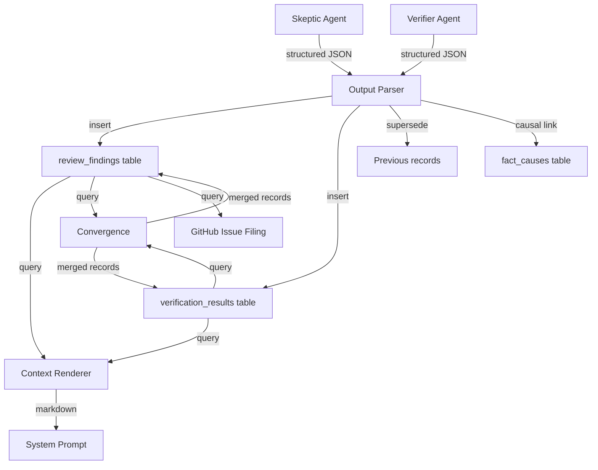
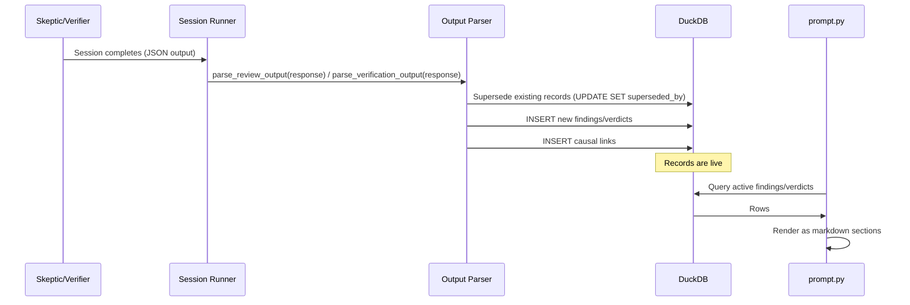

# Design Document: Structured Review Records

## Overview

This spec replaces the file-based Skeptic/Verifier output pipeline with
DuckDB-native structured records. Agent output is parsed as JSON after session
completion, ingested into dedicated tables, and rendered on-the-fly for Coder
context. Convergence and GitHub issue filing operate directly on DB records.

## Architecture





### Module Responsibilities

1. **`agent_fox/knowledge/review_store.py`** — CRUD operations for
   `review_findings` and `verification_results` tables. Supersession logic.
   Causal link insertion for superseded records.
2. **`agent_fox/knowledge/migrations.py`** — Schema migration v2: create
   `review_findings` and `verification_results` tables.
3. **`agent_fox/session/review_parser.py`** — Parse structured JSON from
   agent output into typed dataclasses. Validate against schema. Handle
   malformed output gracefully.
4. **`agent_fox/session/prompt.py`** — Updated `assemble_context()` to query
   DB for active findings/verdicts and render as markdown sections. Fallback
   to file-based reading if DB unavailable.
5. **`agent_fox/session/convergence.py`** — Updated to accept DB record lists
   instead of parsed markdown. Same algorithmic core.
6. **`agent_fox/session/github_issues.py`** — Updated `file_or_update_issue()`
   to accept structured findings instead of raw markdown body.
7. **`agent_fox/_templates/prompts/skeptic.md`** — Updated to instruct JSON
   output format.
8. **`agent_fox/_templates/prompts/verifier.md`** — Updated to instruct JSON
   output format.

## Components and Interfaces

### Data Types

```python
@dataclass(frozen=True)
class ReviewFinding:
    """A single Skeptic finding stored in DuckDB."""
    id: UUID
    severity: str          # "critical" | "major" | "minor" | "observation"
    description: str
    requirement_ref: str | None
    spec_name: str
    task_group: str
    session_id: str
    superseded_by: UUID | None = None
    created_at: datetime | None = None

@dataclass(frozen=True)
class VerificationResult:
    """A single Verifier verdict stored in DuckDB."""
    id: UUID
    requirement_id: str
    verdict: str           # "PASS" | "FAIL"
    evidence: str | None
    spec_name: str
    task_group: str
    session_id: str
    superseded_by: UUID | None = None
    created_at: datetime | None = None

VALID_SEVERITIES = {"critical", "major", "minor", "observation"}
VALID_VERDICTS = {"PASS", "FAIL"}
```

### review_store.py Interface

```python
def insert_findings(
    conn: duckdb.DuckDBPyConnection,
    findings: list[ReviewFinding],
) -> int:
    """Insert findings, superseding existing active records for the same
    (spec_name, task_group). Returns count of inserted records."""

def insert_verdicts(
    conn: duckdb.DuckDBPyConnection,
    verdicts: list[VerificationResult],
) -> int:
    """Insert verdicts, superseding existing active records for the same
    (spec_name, task_group). Returns count of inserted records."""

def query_active_findings(
    conn: duckdb.DuckDBPyConnection,
    spec_name: str,
    task_group: str | None = None,
) -> list[ReviewFinding]:
    """Query non-superseded findings for a spec (optionally filtered by
    task_group). Ordered by severity priority then description."""

def query_active_verdicts(
    conn: duckdb.DuckDBPyConnection,
    spec_name: str,
    task_group: str | None = None,
) -> list[VerificationResult]:
    """Query non-superseded verdicts for a spec (optionally filtered by
    task_group). Ordered by requirement_id."""

def query_findings_by_session(
    conn: duckdb.DuckDBPyConnection,
    session_id: str,
) -> list[ReviewFinding]:
    """Query all findings for a specific session (for convergence)."""

def query_verdicts_by_session(
    conn: duckdb.DuckDBPyConnection,
    session_id: str,
) -> list[VerificationResult]:
    """Query all verdicts for a specific session (for convergence)."""
```

### review_parser.py Interface

```python
def parse_review_output(
    response: str,
    spec_name: str,
    task_group: str,
    session_id: str,
) -> list[ReviewFinding]:
    """Extract ReviewFinding objects from agent response JSON.
    Returns empty list if no valid JSON found."""

def parse_verification_output(
    response: str,
    spec_name: str,
    task_group: str,
    session_id: str,
) -> list[VerificationResult]:
    """Extract VerificationResult objects from agent response JSON.
    Returns empty list if no valid JSON found."""
```

### Updated prompt.py Interface

```python
def render_review_context(
    conn: duckdb.DuckDBPyConnection,
    spec_name: str,
) -> str | None:
    """Render active findings as a markdown section.
    Returns None if no findings exist."""

def render_verification_context(
    conn: duckdb.DuckDBPyConnection,
    spec_name: str,
) -> str | None:
    """Render active verdicts as a markdown section.
    Returns None if no verdicts exist."""
```

### Updated convergence.py Interface

```python
def converge_skeptic_records(
    instance_findings: list[list[ReviewFinding]],
    block_threshold: int,
) -> tuple[list[ReviewFinding], bool]:
    """Same algorithm as converge_skeptic but operating on ReviewFinding
    records instead of Finding dataclasses."""

def converge_verifier_records(
    instance_verdicts: list[list[VerificationResult]],
) -> list[VerificationResult]:
    """Majority vote returning winning VerificationResult records."""
```

## Data Models

### review_findings Table

```sql
CREATE TABLE review_findings (
    id              UUID PRIMARY KEY,
    severity        TEXT NOT NULL,
    description     TEXT NOT NULL,
    requirement_ref TEXT,
    spec_name       TEXT NOT NULL,
    task_group      TEXT NOT NULL,
    session_id      TEXT NOT NULL,
    superseded_by   UUID,
    created_at      TIMESTAMP NOT NULL DEFAULT CURRENT_TIMESTAMP
);
```

### verification_results Table

```sql
CREATE TABLE verification_results (
    id              UUID PRIMARY KEY,
    requirement_id  TEXT NOT NULL,
    verdict         TEXT NOT NULL,
    evidence        TEXT,
    spec_name       TEXT NOT NULL,
    task_group      TEXT NOT NULL,
    session_id      TEXT NOT NULL,
    superseded_by   UUID,
    created_at      TIMESTAMP NOT NULL DEFAULT CURRENT_TIMESTAMP
);
```

### Agent JSON Output Schema

**Skeptic output:**
```json
{
  "findings": [
    {
      "severity": "critical",
      "description": "Requirement 05-REQ-1.1 contradicts 05-REQ-2.3",
      "requirement_ref": "05-REQ-1.1"
    }
  ]
}
```

**Verifier output:**
```json
{
  "verdicts": [
    {
      "requirement_id": "05-REQ-1.1",
      "verdict": "PASS",
      "evidence": "Test test_foo passes, implementation matches spec"
    }
  ]
}
```

### Rendered Markdown Format

**Review context (rendered from DB):**
```markdown
## Skeptic Review

### Critical Findings
- [severity: critical] Requirement 05-REQ-1.1 contradicts 05-REQ-2.3

### Major Findings
- [severity: major] Missing edge case for empty input

### Minor Findings
(none)

### Observations
- [severity: observation] Consider adding logging

Summary: 1 critical, 1 major, 0 minor, 1 observation.
```

**Verification context (rendered from DB):**
```markdown
## Verification Report

| Requirement | Status | Notes |
|-------------|--------|-------|
| 05-REQ-1.1 | PASS | Test test_foo passes |
| 05-REQ-2.1 | FAIL | Not implemented |

Verdict: FAIL
```

## Operational Readiness

### Observability

- Log at INFO level when records are ingested (count per category).
- Log at WARNING level when JSON parsing fails or unknown severities are
  encountered.
- Log at WARNING level when fallback to file-based reading is triggered.

### Migration

- Schema migration v2 adds both tables in a single transaction.
- Migration is forward-only; no rollback DDL needed (tables are additive).
- Existing `review.md` / `verification.md` files are migrated on first
  context assembly if DB records don't exist.

### Compatibility

- File-based fallback ensures zero downtime during migration.
- Existing `Finding` dataclass in `convergence.py` is preserved for internal
  use but the public interface shifts to `ReviewFinding`.

## Correctness Properties

### Property 1: Supersession Completeness

*For any* sequence of Skeptic runs for the same (spec_name, task_group),
the review_store SHALL ensure that only the latest run's findings have
`superseded_by IS NULL`, and all prior findings have `superseded_by` set.

**Validates: Requirements 4.1, 4.2, 4.3**

### Property 2: Parse-Roundtrip Fidelity

*For any* valid JSON output conforming to the finding/verdict schema,
`parse_review_output` / `parse_verification_output` SHALL produce
dataclass instances whose fields exactly match the JSON values (after
normalization).

**Validates: Requirements 3.1, 3.2, 3.3**

### Property 3: Context Rendering Determinism

*For any* set of active findings in the DB, `render_review_context` SHALL
produce identical markdown output when called multiple times with the same
DB state.

**Validates: Requirements 5.1, 5.3**

### Property 4: Convergence Equivalence

*For any* set of multi-instance findings, `converge_skeptic_records` SHALL
produce the same merged list and blocking decision as the existing
`converge_skeptic` when given equivalent input data.

**Validates: Requirements 6.1, 6.2**

### Property 5: Severity Normalization

*For any* finding with a severity string (including case variations and
unknown values), the parser SHALL produce a finding with a severity in
`VALID_SEVERITIES`, defaulting to "observation" for unrecognized values.

**Validates: Requirements 3.3, 3.E2**

### Property 6: Migration Idempotency

*For any* state of the `schema_version` table, running the migration
multiple times SHALL produce the same final schema state without error.

**Validates: Requirements 1.2, 2.2, 2.E1**

### Property 7: Fallback Correctness

*For any* spec directory containing a `review.md` file and no corresponding
DB records, the context assembly SHALL produce output containing the review
content (either from file fallback or from migration-then-query).

**Validates: Requirements 5.E1, 10.1**

## Error Handling

| Error Condition | Behavior | Requirement |
|----------------|----------|-------------|
| Schema migration fails | Log error, raise KnowledgeStoreError | 27-REQ-1.E1 |
| Migration already applied | Skip silently | 27-REQ-2.E1 |
| No valid JSON in agent output | Log warning, insert zero records | 27-REQ-3.E1 |
| Unknown severity value | Normalize to "observation", log warning | 27-REQ-3.E2 |
| No existing records to supersede | Insert new records only | 27-REQ-4.E1 |
| Knowledge store unavailable | Fall back to file-based reading | 27-REQ-5.E1 |
| No active findings/verdicts | Omit section from prompt | 27-REQ-5.E2 |
| Single instance (no convergence) | Use records directly | 27-REQ-6.E1 |
| Knowledge store unavailable for GH issue | Log warning, skip filing | 27-REQ-7.E1 |
| Legacy markdown parse failure | Log warning, skip file | 27-REQ-10.E1 |

## Technology Stack

- **DuckDB** — Structured record storage (existing dependency).
- **Python 3.12+** — Implementation language (existing).
- **JSON** — Agent output format (stdlib `json` module).
- **pytest + hypothesis** — Test framework (existing).

## Definition of Done

A task group is complete when ALL of the following are true:

1. All subtasks within the group are checked off (`[x]`)
2. All spec tests (`test_spec.md` entries) for the task group pass
3. All property tests for the task group pass
4. All previously passing tests still pass (no regressions)
5. No linter warnings or errors introduced
6. Code is committed on a feature branch and pushed to remote
7. Feature branch is merged back to `develop`
8. `tasks.md` checkboxes are updated to reflect completion

## Testing Strategy

- **Unit tests** for `review_store.py`: insert, query, supersession using
  in-memory DuckDB (`schema_conn` fixture).
- **Unit tests** for `review_parser.py`: valid JSON, malformed JSON, missing
  fields, unknown severities.
- **Property tests** for parse-roundtrip fidelity and supersession
  completeness using hypothesis-generated findings.
- **Unit tests** for `render_review_context` and `render_verification_context`:
  verify markdown output format matches expected structure.
- **Unit tests** for updated convergence: verify equivalence with existing
  `converge_skeptic` / `converge_verifier` given the same logical input.
- **Integration tests** for the full pipeline: agent output -> parse -> ingest
  -> render, using a temp DuckDB.
