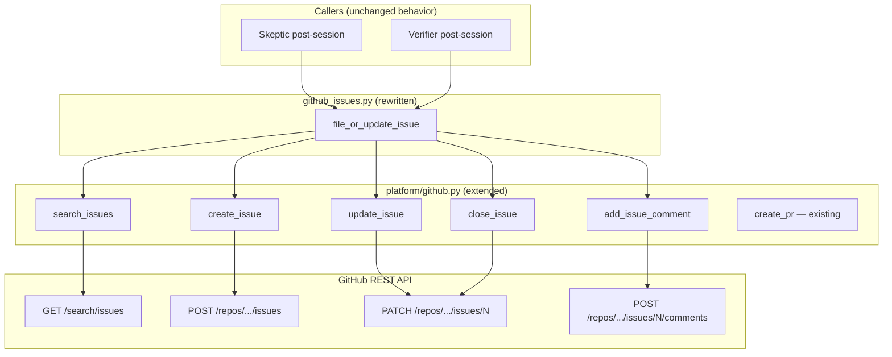

# Design Document: GitHub Issue REST API Migration

## Overview

This design extends the existing `GitHubPlatform` class with issue operations
(search, create, update, comment, close) using the same REST API + `httpx`
pattern established for PR creation. The `github_issues.py` module is rewritten
to accept a `GitHubPlatform` instance and delegate all GitHub interaction to it,
eliminating the `gh` CLI dependency.

## Architecture



### Module Responsibilities

1. **`agent_fox/platform/github.py`** — Extended with five new async methods
   for issue operations. All use the same `_auth_headers()` and `httpx`
   patterns as the existing `create_pr()`.
2. **`agent_fox/session/github_issues.py`** — Rewritten to accept a
   `GitHubPlatform | None` parameter. Delegates all GitHub interaction to the
   platform. No subprocess calls, no `gh` CLI references.

## Components and Interfaces

### GitHubPlatform Extensions

```python
# agent_fox/platform/github.py — new methods

@dataclass(frozen=True)
class IssueResult:
    number: int
    title: str
    html_url: str

class GitHubPlatform:
    # ... existing __init__, create_pr, _get_default_branch, _auth_headers ...

    async def search_issues(
        self,
        title_prefix: str,
        state: str = "open",
    ) -> list[IssueResult]:
        """Search for issues by title prefix.

        Uses GET /search/issues with query:
        repo:{owner}/{repo} in:title {title_prefix} state:{state} type:issue

        Returns list of IssueResult, empty if none found.
        Raises IntegrationError on API error.
        """

    async def create_issue(
        self,
        title: str,
        body: str,
    ) -> IssueResult:
        """Create a new issue.

        Uses POST /repos/{owner}/{repo}/issues.
        Returns IssueResult with the created issue's number, title, and URL.
        Raises IntegrationError on API error.
        """

    async def update_issue(
        self,
        issue_number: int,
        body: str,
    ) -> None:
        """Update an existing issue's body.

        Uses PATCH /repos/{owner}/{repo}/issues/{issue_number}.
        Raises IntegrationError on API error.
        """

    async def add_issue_comment(
        self,
        issue_number: int,
        comment: str,
    ) -> None:
        """Add a comment to an existing issue.

        Uses POST /repos/{owner}/{repo}/issues/{issue_number}/comments.
        Raises IntegrationError on API error.
        """

    async def close_issue(
        self,
        issue_number: int,
        comment: str | None = None,
    ) -> None:
        """Close an issue and optionally add a closing comment.

        Uses PATCH /repos/{owner}/{repo}/issues/{issue_number}
        with body {"state": "closed"}.
        If comment is provided, adds it before closing.
        Raises IntegrationError on API error.
        """
```

### Rewritten file_or_update_issue

```python
# agent_fox/session/github_issues.py — rewritten

from agent_fox.platform.github import GitHubPlatform

async def file_or_update_issue(
    title_prefix: str,
    body: str,
    *,
    platform: GitHubPlatform | None = None,
    close_if_empty: bool = False,
) -> str | None:
    """Search-before-create GitHub issue idempotency.

    Uses the GitHubPlatform REST API instead of the gh CLI.

    1. If platform is None: log warning, return None.
    2. Search for existing open issue with matching title prefix.
    3. If found and close_if_empty and body is empty: close issue.
    4. If found: update body, add comment noting re-run.
    5. If not found: create new issue.

    Returns issue URL or None on failure.
    Failures are logged but never raise.
    """
```

**Removed:** The `repo: str | None` parameter is replaced by the `platform`
parameter which already encapsulates owner/repo/token. The `_run_gh_command()`
and `_parse_issue_number()` helper functions are deleted.

### GitHub REST API Endpoints Used

| Operation | Method | Endpoint | Success Code |
|-----------|--------|----------|-------------|
| Search issues | GET | `/search/issues?q=...` | 200 |
| Create issue | POST | `/repos/{owner}/{repo}/issues` | 201 |
| Update issue | PATCH | `/repos/{owner}/{repo}/issues/{N}` | 200 |
| Add comment | POST | `/repos/{owner}/{repo}/issues/{N}/comments` | 201 |
| Close issue | PATCH | `/repos/{owner}/{repo}/issues/{N}` | 200 |

All requests include the same auth headers as `create_pr()`:
```
Authorization: Bearer {GITHUB_PAT}
Accept: application/vnd.github+json
X-GitHub-Api-Version: 2022-11-28
```

## Data Models

### IssueResult

```python
@dataclass(frozen=True)
class IssueResult:
    number: int       # GitHub issue number
    title: str        # Issue title
    html_url: str     # Full URL to the issue
```

This is a simple return type for `search_issues()` and `create_issue()`. It
parallels how `create_pr()` returns the PR URL, but with structured data.

## Operational Readiness

### Observability

- Issue search results logged at DEBUG level: count of matches found.
- Issue create/update/close logged at INFO level: issue number and URL.
- Platform-None fallback logged at WARNING level.
- API errors logged at WARNING level with status code and response excerpt.

### Rollout

- The migration is backward-compatible at the behavioral level: same
  search-before-create semantics, same fallback-on-failure behavior.
- Callers that previously relied on `gh` CLI availability now need
  `GITHUB_PAT` set instead — same requirement as PR creation.
- The `gh` CLI is no longer needed for any agent-fox operation.

### Rollback

- Revert the commit. The `gh` CLI implementation is restored.
- No config changes needed.

## Correctness Properties

### Property 1: No gh CLI References

*For any* import or function call in `agent_fox/session/github_issues.py`,
the module SHALL NOT import `asyncio.create_subprocess_exec` or reference the
`gh` CLI binary. All GitHub operations SHALL go through `GitHubPlatform`
methods.

**Validates: 28-REQ-5.4**

### Property 2: Search-Before-Create Idempotency

*For any* sequence of N calls to `file_or_update_issue()` with the same
`title_prefix` and a non-None platform, at most one `create_issue()` call
SHALL be made. Subsequent calls SHALL use `update_issue()` and
`add_issue_comment()` on the existing issue.

**Validates: 28-REQ-5.3**

### Property 3: Graceful Degradation

*For any* call to `file_or_update_issue()` where `platform` is None or where
any `GitHubPlatform` method raises `IntegrationError`, the function SHALL
return None and SHALL NOT raise an exception. A warning SHALL be logged.

**Validates: 28-REQ-5.E1, 28-REQ-5.E2**

### Property 4: API Authentication Consistency

*For any* REST API call made by the new `GitHubPlatform` issue methods, the
request SHALL include the same `Authorization`, `Accept`, and
`X-GitHub-Api-Version` headers as `create_pr()`.

**Validates: 28-REQ-1.1, 28-REQ-2.1, 28-REQ-3.1, 28-REQ-4.1**

### Property 5: Search Query Correctness

*For any* call to `search_issues(title_prefix, state)`, the query parameter
SHALL include `repo:{owner}/{repo}`, `in:title`, the title prefix, the state
filter, and `type:issue`. The query SHALL be URL-encoded correctly.

**Validates: 28-REQ-1.2**

## Error Handling

| Error Condition | Behavior | Requirement |
|----------------|----------|-------------|
| Platform is None | Log warning, return None | 28-REQ-5.E1 |
| Search API returns non-200 | Raise IntegrationError | 28-REQ-1.E1 |
| Search returns empty results | Return empty list | 28-REQ-1.E2 |
| Create API returns non-201 | Raise IntegrationError | 28-REQ-2.E1 |
| Update/comment API error | Raise IntegrationError | 28-REQ-3.E1 |
| Close API error | Raise IntegrationError | 28-REQ-4.E1 |
| Any IntegrationError in file_or_update_issue | Catch, log warning, return None | 28-REQ-5.E2 |

## Technology Stack

| Component | Technology | Notes |
|-----------|-----------|-------|
| HTTP client | `httpx` | Already a project dependency |
| Authentication | `GITHUB_PAT` env var | Same as PR creation |
| Error type | `IntegrationError` | Existing error from `agent_fox.core.errors` |
| Data model | `dataclasses` | Frozen `IssueResult` dataclass |
| Testing | `pytest`, `pytest-asyncio` | Mock `httpx.AsyncClient` |

## Definition of Done

A task group is complete when ALL of the following are true:

1. All subtasks within the group are checked off (`[x]`)
2. All spec tests (`test_spec.md` entries) for the task group pass
3. All property tests for the task group pass
4. All previously passing tests still pass (no regressions)
5. No linter warnings or errors introduced
6. Code is committed on a feature branch and pushed to remote
7. Feature branch is merged back to `develop`
8. `tasks.md` checkboxes are updated to reflect completion

## Testing Strategy

### Unit Tests

- **GitHubPlatform issue methods**: Mock `httpx.AsyncClient` responses for
  each endpoint. Test success paths (correct status codes) and error paths
  (4xx/5xx responses raising `IntegrationError`).
- **`file_or_update_issue()` rewrite**: Mock `GitHubPlatform` methods. Test
  search-before-create flow, update-on-rerun flow, close-if-empty flow,
  platform-None fallback, and IntegrationError catch-and-continue.
- **No gh CLI references**: Static check that `github_issues.py` does not
  import subprocess utilities or reference `gh`.

### Property Tests

- **Idempotency**: Simulate N calls with a stateful mock platform. Verify
  at most one `create_issue()` and N-1 `update_issue()` calls.
- **Graceful degradation**: For any combination of platform=None and API
  errors, verify `file_or_update_issue()` never raises.
