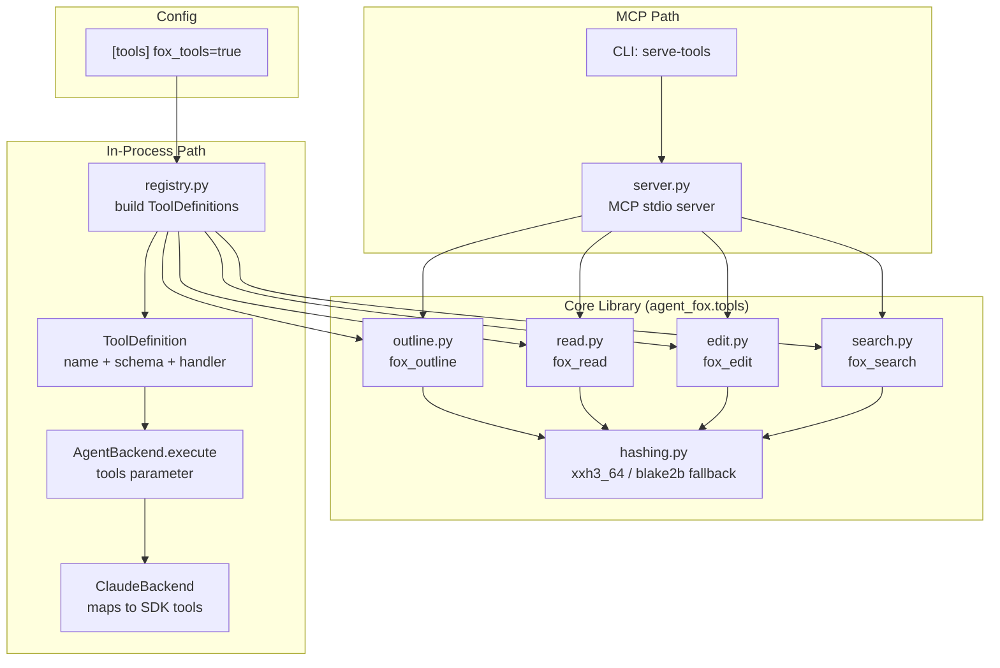

# Design Document: Token-Efficient File Tools & MCP Server

## Overview

This spec adds four token-efficient file tools to agent-fox, a backend
protocol extension for in-process custom tool registration, and an MCP server
for external consumption. The architecture has three layers:

1. **Core library** (`agent_fox.tools`) — pure Python functions implementing
   `fox_outline`, `fox_read`, `fox_edit`, and `fox_search`. No I/O protocol
   awareness. Tested in isolation.

2. **Backend integration** — `ToolDefinition` dataclass and protocol extension
   on `AgentBackend.execute()`. The session runner wraps core functions as
   `ToolDefinition` objects when config enables them. Each backend maps
   definitions to its SDK's native tool mechanism.

3. **MCP server** (`agent_fox.tools.server`) — thin adapter wrapping core
   functions as MCP tools over stdio. Only for external consumers.

## Architecture



### Module Responsibilities

1. **`agent_fox/tools/hashing.py`** — Content hash computation (xxh3_64 with
   blake2b fallback). Single `hash_line()` function.
2. **`agent_fox/tools/outline.py`** — Heuristic symbol detection and outline
   formatting.
3. **`agent_fox/tools/read.py`** — Line-range file reading with hash
   annotation.
4. **`agent_fox/tools/edit.py`** — Hash-verified atomic batch editing.
5. **`agent_fox/tools/search.py`** — Regex search with context and hashes.
6. **`agent_fox/tools/registry.py`** — Constructs `ToolDefinition` list from
   core functions. Maps each function's signature to a JSON Schema and wraps
   it as a handler.
7. **`agent_fox/tools/server.py`** — MCP server using `mcp` SDK. Registers
   core functions as MCP tools.
8. **`agent_fox/session/backends/protocol.py`** — Extended with
   `ToolDefinition` dataclass and optional `tools` parameter.
9. **`agent_fox/session/backends/claude.py`** — Maps `ToolDefinition` objects
   to Claude SDK's in-process MCP server (`McpSdkServerConfig`).
10. **`agent_fox/core/config.py`** — New `ToolsConfig` model.
11. **`agent_fox/cli/serve_tools.py`** — CLI command for launching MCP server.

## Components and Interfaces

### Core Data Types

```python
# agent_fox/tools/hashing.py

def hash_line(content: bytes) -> str:
    """Return 16-char lowercase hex xxh3_64 hash of content."""
    ...

# agent_fox/tools/types.py

@dataclass(frozen=True)
class HashedLine:
    """A single line with its number and content hash."""
    line_number: int   # 1-based
    content: str
    hash: str          # 16-char hex

@dataclass(frozen=True)
class Symbol:
    """A structural declaration found by the heuristic parser."""
    kind: str          # "function" | "class" | "method" | "constant" | "import_block"
    name: str          # declaration name, or "(N imports)" for import blocks
    start_line: int    # 1-based inclusive
    end_line: int      # 1-based inclusive

@dataclass(frozen=True)
class OutlineResult:
    """Result of fox_outline."""
    symbols: list[Symbol]
    total_lines: int

@dataclass(frozen=True)
class ReadResult:
    """Result of fox_read."""
    lines: list[HashedLine]
    warnings: list[str]    # e.g. "Range 50-100 truncated at line 75"

@dataclass(frozen=True)
class EditOperation:
    """A single edit within a batch."""
    start_line: int        # 1-based inclusive
    end_line: int          # 1-based inclusive
    hashes: list[str]      # one hash per line in [start, end]
    new_content: str       # replacement text (empty = delete)

@dataclass(frozen=True)
class EditResult:
    """Result of fox_edit."""
    success: bool
    lines_changed: int
    errors: list[str]      # hash mismatches, overlap errors, etc.

@dataclass(frozen=True)
class SearchMatch:
    """A search match with surrounding context."""
    lines: list[HashedLine]
    match_line_numbers: list[int]  # which lines in `lines` matched

@dataclass(frozen=True)
class SearchResult:
    """Result of fox_search."""
    matches: list[SearchMatch]
    total_matches: int
```

### Core Function Signatures

```python
# agent_fox/tools/outline.py
def fox_outline(file_path: str) -> OutlineResult | str:
    """Return structural outline. Returns error string on failure."""

# agent_fox/tools/read.py
def fox_read(file_path: str, ranges: list[tuple[int, int]]) -> ReadResult | str:
    """Read line ranges with hashes. Returns error string on failure."""

# agent_fox/tools/edit.py
def fox_edit(file_path: str, edits: list[EditOperation]) -> EditResult:
    """Apply hash-verified edits atomically."""

# agent_fox/tools/search.py
def fox_search(
    file_path: str, pattern: str, context: int = 0,
) -> SearchResult | str:
    """Regex search with context. Returns error string on failure."""
```

### Backend Protocol Extension

```python
# agent_fox/session/backends/protocol.py

from collections.abc import Callable

@dataclass(frozen=True)
class ToolDefinition:
    """A custom tool to be registered with the backend."""
    name: str                          # e.g. "fox_read"
    description: str                   # human-readable description
    input_schema: dict[str, Any]       # JSON Schema for tool input
    handler: Callable[..., Any]        # sync callable(tool_input) -> result

class AgentBackend(Protocol):
    async def execute(
        self,
        prompt: str,
        *,
        system_prompt: str,
        model: str,
        cwd: str,
        permission_callback: PermissionCallback | None = None,
        tools: list[ToolDefinition] | None = None,       # NEW
    ) -> AsyncIterator[AgentMessage]:
        ...
```

### Registry

```python
# agent_fox/tools/registry.py

def build_fox_tool_definitions() -> list[ToolDefinition]:
    """Build ToolDefinition list for all four fox tools.

    Each definition wraps a core function with its JSON Schema
    and a handler that deserializes tool_input and calls the function.
    """
```

### MCP Server

```python
# agent_fox/tools/server.py

def create_mcp_server(
    allowed_dirs: list[str] | None = None,
) -> mcp.Server:
    """Create an MCP server exposing fox tools.

    If allowed_dirs is set, all file paths are validated against
    the list before any operation.
    """

def run_server(allowed_dirs: list[str] | None = None) -> None:
    """Run the MCP server on stdio (blocking)."""
```

### Configuration

```python
# agent_fox/core/config.py

class ToolsConfig(BaseModel):
    model_config = ConfigDict(extra="ignore")
    fox_tools: bool = False
```

Added as a field on `AgentFoxConfig`:

```python
class AgentFoxConfig(BaseModel):
    ...
    tools: ToolsConfig = Field(default_factory=ToolsConfig)
```

### CLI Command

```python
# agent_fox/cli/serve_tools.py

@click.command("serve-tools")
@click.option(
    "--allowed-dirs", multiple=True,
    help="Restrict file operations to these directories.",
)
def serve_tools_cmd(allowed_dirs: tuple[str, ...]) -> None:
    """Launch the fox tools MCP server on stdio."""
```

## Data Models

### Heuristic Parser Language Patterns

The outline tool detects symbols using per-language regex patterns. Each
pattern targets the declaration line only (not the body):

| Language | Patterns |
|----------|----------|
| Python | `^(async\s+)?def\s+(\w+)`, `^class\s+(\w+)`, `^(import\|from\s+\S+\s+import)` |
| JavaScript/TypeScript | `^(export\s+)?(async\s+)?function\s+(\w+)`, `^(export\s+)?class\s+(\w+)`, `^(export\s+)?(const\|let\|var)\s+(\w+)`, `^import\s+` |
| Rust | `^(pub\s+)?(async\s+)?fn\s+(\w+)`, `^(pub\s+)?struct\s+(\w+)`, `^(pub\s+)?enum\s+(\w+)`, `^(pub\s+)?trait\s+(\w+)`, `^impl\s+`, `^(pub\s+)?mod\s+(\w+)`, `^use\s+` |
| Go | `^func\s+(\w+\|\\(\w+\s+\*?\w+\\)\s+\w+)`, `^type\s+(\w+)`, `^import\s+` |
| Java | `^(public\|private\|protected)?\s*(static\s+)?(class\|interface\|enum)\s+(\w+)`, method declarations |

Language is detected from the file extension. Unknown extensions fall back to
a minimal set of patterns (function/class only).

### Symbol End-Line Detection

End-line detection uses indentation-based heuristics:

- **Python:** Next line at same or lesser indentation, or end-of-file.
- **Brace languages (JS/TS/Rust/Go/Java):** Matching closing brace at same
  indentation, or next declaration at same level.
- **Fallback:** Next declaration start line minus 1, or end-of-file.

This is approximate and sufficient for navigation — the model handles semantic
understanding.

### Tool Input JSON Schemas

Each fox tool has a JSON Schema used for both `ToolDefinition.input_schema`
and MCP tool registration:

**fox_outline:**
```json
{
  "type": "object",
  "properties": {
    "file_path": {"type": "string", "description": "Absolute path to the file"}
  },
  "required": ["file_path"]
}
```

**fox_read:**
```json
{
  "type": "object",
  "properties": {
    "file_path": {"type": "string", "description": "Absolute path to the file"},
    "ranges": {
      "type": "array",
      "items": {
        "type": "array", "items": {"type": "integer"},
        "minItems": 2, "maxItems": 2
      },
      "description": "List of [start, end] line ranges (1-based, inclusive)"
    }
  },
  "required": ["file_path", "ranges"]
}
```

**fox_edit:**
```json
{
  "type": "object",
  "properties": {
    "file_path": {"type": "string", "description": "Absolute path to the file"},
    "edits": {
      "type": "array",
      "items": {
        "type": "object",
        "properties": {
          "start_line": {"type": "integer"},
          "end_line": {"type": "integer"},
          "hashes": {"type": "array", "items": {"type": "string"}},
          "new_content": {"type": "string"}
        },
        "required": ["start_line", "end_line", "hashes", "new_content"]
      }
    }
  },
  "required": ["file_path", "edits"]
}
```

**fox_search:**
```json
{
  "type": "object",
  "properties": {
    "file_path": {"type": "string", "description": "Absolute path to the file"},
    "pattern": {"type": "string", "description": "Regex pattern to search for"},
    "context": {"type": "integer", "default": 0, "description": "Context lines"}
  },
  "required": ["file_path", "pattern"]
}
```

## Operational Readiness

### Observability

- Tool invocations are visible in the session activity stream via existing
  `ToolUseMessage` → `ActivityEvent` mapping (no changes needed).
- Tool errors surface as tool error results in the agent conversation.
- MCP server logs to stderr (standard MCP convention).

### Rollout

- Fox tools are **opt-in** (`tools.fox_tools = false` by default).
- No migration needed — enabling the config flag is sufficient.
- Disabling the flag reverts to SDK-only tools with zero residual effect.

### Compatibility

- The `tools` parameter on `AgentBackend.execute()` defaults to `None`,
  preserving backward compatibility.
- Existing backends that don't implement custom tool support will ignore the
  parameter (duck typing / protocol compliance).

## Correctness Properties

### Property 1: Hash Determinism

*For any* byte string B, hashing B at time T1 and T2 SHALL produce the same
16-character hex string.

**Validates:** 29-REQ-5.1, 29-REQ-5.2

### Property 2: Hash Sensitivity

*For any* two byte strings A and B where A != B, `hash_line(A)` SHALL differ
from `hash_line(B)` with probability >= 1 - 2^-64.

**Validates:** 29-REQ-5.3

### Property 3: Read-Edit Round-Trip Integrity

*For any* file F, reading line range [S, E] with `fox_read` and then calling
`fox_edit` with the same start/end, the returned hashes, and new content N,
SHALL produce a file where lines [S, E] contain N and all other lines are
unchanged.

**Validates:** 29-REQ-2.1, 29-REQ-3.1, 29-REQ-3.2

### Property 4: Edit Atomicity

*For any* batch of N edit operations where at least one has a stale hash,
`fox_edit` SHALL leave the file byte-identical to its state before the call
(no partial writes).

**Validates:** 29-REQ-3.2, 29-REQ-3.E1

### Property 5: Stale Hash Rejection

*For any* file F, if line L is modified between a `fox_read` and a subsequent
`fox_edit` referencing L's hash, THE edit SHALL be rejected with an error.

**Validates:** 29-REQ-3.1, 29-REQ-3.E1

### Property 6: Outline Completeness (Python)

*For any* valid Python file F containing N top-level `def` and `class`
declarations, `fox_outline(F)` SHALL return at least N symbols with matching
names.

**Validates:** 29-REQ-1.1, 29-REQ-1.4

### Property 7: Search-Context Merge

*For any* file F, pattern P, and context C, if two matches at lines M1 and M2
have overlapping context ranges (|M1 - M2| <= 2*C), `fox_search` SHALL return
them as a single merged block with no duplicate lines.

**Validates:** 29-REQ-4.2, 29-REQ-4.3

### Property 8: Tool Registration Backward Compatibility

*For any* call to `AgentBackend.execute()` with `tools=None`, the behavior
SHALL be identical to the pre-extension implementation.

**Validates:** 29-REQ-6.E1, 29-REQ-8.3

### Property 9: MCP-InProcess Equivalence

*For any* tool call with identical inputs, the MCP server and the in-process
handler SHALL produce identical outputs (single source of truth).

**Validates:** 29-REQ-7.2

## Error Handling

| Error Condition | Behavior | Requirement |
|----------------|----------|-------------|
| File not found / not readable | Return error string with path and reason | 29-REQ-1.E1, 29-REQ-2.E1, 29-REQ-3.E2, 29-REQ-4.E1 |
| File is binary (null bytes) | Return error indicating not a text file | 29-REQ-1.E3 |
| Empty file | Return zero-symbol outline / empty read | 29-REQ-1.E2 |
| Range beyond EOF | Return available lines + truncation warning | 29-REQ-2.E2 |
| Invalid range (start > end) | Return error identifying the range | 29-REQ-2.E3 |
| Hash mismatch on edit | Reject entire batch, list mismatched lines | 29-REQ-3.E1 |
| Overlapping edit ranges | Return error identifying conflicting ranges | 29-REQ-3.E3 |
| Invalid regex pattern | Return error with pattern and parse failure | 29-REQ-4.E2 |
| No search matches | Return empty result set (not an error) | 29-REQ-4.E3 |
| xxhash unavailable | Fall back to blake2b, log warning | 29-REQ-5.E1 |
| No ToolDefinitions provided | Behave as current (no change) | 29-REQ-6.E1 |
| Handler raises exception | Return error to agent, continue session | 29-REQ-6.E2 |
| Path outside allowed-dirs | MCP server returns error, no file op | 29-REQ-7.E1 |
| MCP client disconnects | Server terminates cleanly | 29-REQ-7.E2 |
| Non-boolean fox_tools config | Raise ConfigError | 29-REQ-8.E1 |

## Technology Stack

| Component | Technology | Rationale |
|-----------|-----------|-----------|
| Content hashing | xxhash (xxh3_64) | Fast non-crypto hash; 16-char hex output. blake2b fallback if unavailable. |
| MCP server | `mcp` Python SDK v1.x | Already a transitive dependency (via claude-agent-sdk). Handles stdio framing. |
| CLI | Click | Existing CLI framework in agent-fox. |
| Config | Pydantic v2 | Existing config validation framework. |
| File I/O | Python stdlib (`pathlib`, `io`) | No external dependencies for file operations. |
| Regex | Python `re` module | Standard library, sufficient for heuristic parsing and search. |

## Definition of Done

A task group is complete when ALL of the following are true:

1. All subtasks within the group are checked off (`[x]`)
2. All spec tests (`test_spec.md` entries) for the task group pass
3. All property tests for the task group pass
4. All previously passing tests still pass (no regressions)
5. No linter warnings or errors introduced
6. Code is committed on a feature branch and pushed to remote
7. Feature branch is merged back to `develop`
8. `tasks.md` checkboxes are updated to reflect completion

## Testing Strategy

### Unit Tests

Each core tool function is tested in isolation with fixture files:

- **Hashing:** Determinism, sensitivity, fallback behavior.
- **Outline:** Known Python/JS/Rust/Go files with expected symbol lists.
  Binary detection. Empty file. Nonexistent file.
- **Read:** Single range, multiple ranges, range beyond EOF, invalid range.
  Hash correctness against known values.
- **Edit:** Single edit, batch edit, hash mismatch rejection, overlapping
  ranges, line deletion, empty file creation.
- **Search:** Pattern matching, context merging, invalid regex, no matches.

### Property Tests (Hypothesis)

- **Hash determinism:** Random byte strings hashed twice yield same result.
- **Read-edit round-trip:** Random file, random ranges, read → edit with
  identity content → file unchanged.
- **Edit atomicity:** Random file, inject one bad hash in batch → file
  unchanged.
- **Outline completeness:** Generated Python files with known declarations.
- **Context merge:** Random match positions and context values → no duplicate
  line numbers.

### Integration Tests

- **Backend integration:** Mock backend receives `ToolDefinition` objects,
  verifies handler is called for tool-use messages.
- **MCP server:** Spawn server subprocess, connect MCP client, call each tool,
  verify results match direct function calls.
- **Config round-trip:** Load `fox.toml` with `[tools]` section, verify
  `ToolsConfig` parsed correctly, verify session runner passes tools when
  enabled.
