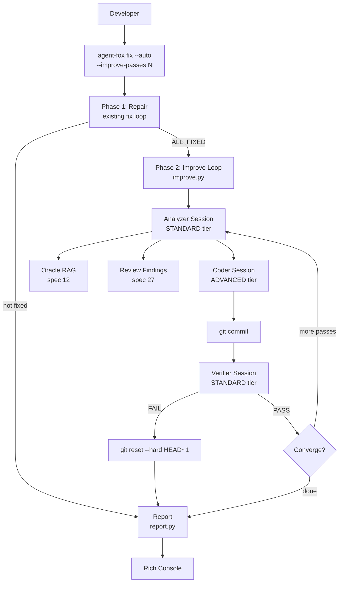

# Design Document: Auto-Improve

## Overview

This spec extends `agent-fox fix` with a `--auto` flag that adds an iterative
improvement phase after the existing repair loop. Phase 1 (repair) is unchanged.
Phase 2 (improve) uses three agent sessions per pass — analyzer, coder,
verifier — to audit the codebase, implement improvements, and verify them. It
builds on the session runner (spec 03), error auto-fix (spec 08), agent
archetypes (spec 26), fox ball oracle (spec 12), and structured review records
(spec 27).

## Architecture



### Module Responsibilities

1. **`agent_fox/fix/improve.py`** — Phase 2 improve loop: orchestrates
   analyzer, coder, verifier sessions per pass, manages termination conditions,
   cost tracking, and rollback.
2. **`agent_fox/fix/analyzer.py`** — Builds the analyzer prompt (project
   context, oracle facts, prior findings, Phase 1 diff), runs the analyzer
   session, parses the structured JSON response.
3. **`agent_fox/fix/improve_report.py`** — Phase 2 report data model and
   rendering. Combined report rendering for Phase 1 + Phase 2.
4. **`agent_fox/cli/fix.py`** — Extended with `--auto` and `--improve-passes`
   options. Wires Phase 2 after Phase 1.

Existing modules used without modification:
- `agent_fox/fix/fix.py` — Phase 1 fix loop (unchanged)
- `agent_fox/fix/checks.py` — Quality check detection and execution
- `agent_fox/session/session.py` — Session runner
- `agent_fox/knowledge/query.py` — Oracle RAG pipeline
- `agent_fox/knowledge/search.py` — Vector search
- `agent_fox/fix/report.py` — Phase 1 report rendering (unchanged)

## Components and Interfaces

### Improve Loop

```python
# agent_fox/fix/improve.py
from __future__ import annotations

from dataclasses import dataclass, field
from enum import StrEnum
from pathlib import Path

from agent_fox.core.config import AgentFoxConfig
from agent_fox.fix.analyzer import AnalyzerResult
from agent_fox.fix.checks import CheckDescriptor


class ImproveTermination(StrEnum):
    """Reason the improve loop terminated."""
    CONVERGED = "converged"
    PASS_LIMIT = "pass_limit"
    COST_LIMIT = "cost_limit"
    VERIFIER_FAIL = "verifier_fail"
    INTERRUPTED = "interrupted"
    ANALYZER_ERROR = "analyzer_error"
    CODER_ERROR = "coder_error"


@dataclass
class ImprovePassResult:
    """Result of a single improvement pass."""
    pass_number: int
    improvements_applied: int
    improvements_by_tier: dict[str, int]  # tier -> count
    verifier_verdict: str  # "PASS" or "FAIL"
    analyzer_cost: float
    coder_cost: float
    verifier_cost: float
    rolled_back: bool


@dataclass
class ImproveResult:
    """Result of the entire Phase 2 improve loop."""
    passes_completed: int
    max_passes: int
    total_improvements: int
    improvements_by_tier: dict[str, int]
    verifier_pass_count: int
    verifier_fail_count: int
    sessions_consumed: int  # total across all passes
    total_cost: float
    termination_reason: ImproveTermination
    pass_results: list[ImprovePassResult] = field(default_factory=list)


# Session runner callable types
ImproveSessionRunner = Callable[[str, str, str], Awaitable[tuple[float, str]]]
# (system_prompt, task_prompt, model_tier) -> (cost, session_status)


async def run_improve_loop(
    project_root: Path,
    config: AgentFoxConfig,
    checks: list[CheckDescriptor],
    max_passes: int = 3,
    remaining_budget: float | None = None,
    phase1_diff: str = "",
    session_runner: ImproveSessionRunner | None = None,
) -> ImproveResult:
    """Run the iterative improvement loop (Phase 2).

    Algorithm:
    1. For each pass (up to max_passes):
       a. Check cost budget for a full pass.
       b. Run the analyzer session (build context, query oracle, parse plan).
       c. If analyzer reports diminishing returns or zero actionable
          improvements, terminate with CONVERGED.
       d. Run the coder session with the filtered improvement plan.
       e. Create a git commit for the coder's changes.
       f. Run the verifier session.
       g. If verifier PASS: record pass, continue to next.
       h. If verifier FAIL: rollback commit, terminate with VERIFIER_FAIL.
    2. If all passes completed, terminate with PASS_LIMIT.
    3. Produce ImproveResult.

    Termination conditions:
    - Analyzer: diminishing_returns or zero improvements -> CONVERGED
    - Pass limit reached -> PASS_LIMIT
    - Cost limit exhausted -> COST_LIMIT
    - Verifier FAIL -> VERIFIER_FAIL (after rollback)
    - Analyzer/coder session failure -> ANALYZER_ERROR / CODER_ERROR
    - KeyboardInterrupt -> INTERRUPTED
    """
    ...
```

### Analyzer

```python
# agent_fox/fix/analyzer.py
from __future__ import annotations

from dataclasses import dataclass, field
from pathlib import Path

from agent_fox.core.config import AgentFoxConfig


@dataclass(frozen=True)
class Improvement:
    """A single improvement suggestion from the analyzer."""
    id: str
    tier: str         # "quick_win" | "structural" | "design_level"
    title: str
    description: str
    files: list[str]
    impact: str       # "low" | "medium" | "high"
    confidence: str   # "high" | "medium" | "low"


@dataclass
class AnalyzerResult:
    """Parsed output from the analyzer session."""
    improvements: list[Improvement]
    summary: str
    diminishing_returns: bool
    raw_response: str  # for debugging


def build_analyzer_prompt(
    project_root: Path,
    config: AgentFoxConfig,
    *,
    oracle_context: str = "",
    review_context: str = "",
    phase1_diff: str = "",
    previous_pass_result: str = "",
) -> tuple[str, str]:
    """Build the system prompt and task prompt for the analyzer.

    Returns (system_prompt, task_prompt).

    The system prompt includes:
    - Role: codebase improvement analyst
    - Project conventions (from CLAUDE.md / AGENTS.md / README.md)
    - Project file tree
    - Oracle context (## Project Knowledge section, if available)
    - Review findings from DuckDB (if any)
    - Simplifier guardrails (what NOT to change)

    The task prompt includes:
    - Analysis scope: entire repository
    - Phase 1 diff (if any changes were made during repair)
    - Previous pass results (if not the first pass)
    - Required output format (structured JSON)
    """
    ...


def parse_analyzer_response(response: str) -> AnalyzerResult:
    """Parse the analyzer's JSON response into an AnalyzerResult.

    Validates required fields and structure. Raises ValueError if the
    response cannot be parsed.
    """
    ...


def filter_improvements(
    improvements: list[Improvement],
) -> list[Improvement]:
    """Filter out low-confidence improvements and sort by tier priority.

    Returns improvements with confidence 'high' or 'medium', sorted:
    quick_win first, structural second, design_level third.
    """
    ...


def query_oracle_context(config: AgentFoxConfig) -> str:
    """Query the oracle for project knowledge context.

    Runs the oracle RAG pipeline with the seed question about patterns,
    conventions, and architectural decisions. Returns formatted context
    string, or empty string if the knowledge store is unavailable.
    """
    ...


def load_review_context(project_root: Path) -> str:
    """Load existing skeptic/verifier findings from DuckDB.

    Returns a formatted context string, or empty string if no findings
    exist or DuckDB is unavailable.
    """
    ...
```

### Improve Report

```python
# agent_fox/fix/improve_report.py
from rich.console import Console

from agent_fox.fix.fix import FixResult
from agent_fox.fix.improve import ImproveResult


def render_combined_report(
    fix_result: FixResult,
    improve_result: ImproveResult | None,
    total_cost: float,
    console: Console,
) -> None:
    """Render the combined Phase 1 + Phase 2 report.

    Phase 1 section: passes completed, clusters resolved/remaining,
    sessions consumed, termination reason.

    Phase 2 section (if present): passes completed (of max),
    improvements applied, improvements by tier, verifier verdicts,
    sessions consumed (by role), termination reason.

    Total cost line.
    """
    ...


def build_combined_json(
    fix_result: FixResult,
    improve_result: ImproveResult | None,
    total_cost: float,
) -> dict:
    """Build the JSONL-compatible dict for the combined report."""
    ...
```

### CLI Extension

```python
# agent_fox/cli/fix.py — modified

@click.command("fix")
@click.option(
    "--max-passes", type=int, default=3,
    help="Maximum number of repair passes (default: 3).",
)
@click.option(
    "--dry-run", is_flag=True, default=False,
    help="Generate fix specs only, do not run sessions.",
)
@click.option(
    "--auto", is_flag=True, default=False,
    help="After repair, run iterative improvement passes.",
)
@click.option(
    "--improve-passes", type=int, default=3,
    help="Maximum improvement passes (default: 3, requires --auto).",
)
@click.pass_context
def fix_cmd(
    ctx: click.Context,
    max_passes: int,
    dry_run: bool,
    auto: bool,
    improve_passes: int,
) -> None:
    """Detect and auto-fix quality check failures.

    With --auto: after all checks pass, iteratively analyze and improve
    the codebase using an analyzer-coder-verifier pipeline.
    """
    ...
```

## Analyzer Prompt Structure

The analyzer receives a structured prompt requesting JSON output.

### System Prompt

```
You are a senior software architect analyzing a codebase for improvement
opportunities. Your goal is to identify concrete, actionable improvements
that make the code simpler, clearer, and more maintainable.

## Guardrails

- NEVER refactor test code for DRYness — test readability trumps DRY
- NEVER change public APIs (function signatures, class interfaces, CLI options)
- NEVER remove "why" comments — only remove "what" comments that restate code
- NEVER remove or weaken error handling or logging
- NEVER introduce new dependencies
- Favor deletion over addition — removing dead code is always a win
- Preserve git-blame-ability — prefer surgical edits over wholesale rewrites

## Project Conventions

{conventions_from_claude_md_or_readme}

## Project Knowledge

{oracle_context — top-k facts from knowledge store with provenance}

## Prior Review Findings

{skeptic_verifier_findings_from_duckdb}
```

### Task Prompt

```
Analyze the following codebase for improvement opportunities.

## Scope

Analyze the entire repository. The project structure is:

{file_tree}

## Recent Changes

{phase1_diff or "No recent changes."}

## Previous Pass

{previous_pass_summary or "This is the first improvement pass."}

## Instructions

1. Examine the codebase for: redundancy, unnecessary complexity, dead code,
   stale patterns, consolidation opportunities, and readability issues.
2. Prioritize improvements by tier: quick_win (safe, mechanical), structural
   (module reorganization, consolidation), design_level (pattern changes).
3. For each improvement, assess confidence (high/medium/low) and impact
   (high/medium/low).
4. Set diminishing_returns to true if remaining opportunities are too minor
   or risky to justify a coding session.

Respond with ONLY valid JSON in this exact format:

{
  "improvements": [
    {
      "id": "IMP-1",
      "tier": "quick_win",
      "title": "Short title",
      "description": "What to change and why",
      "files": ["path/to/file.py"],
      "impact": "low",
      "confidence": "high"
    }
  ],
  "summary": "Human-readable summary",
  "diminishing_returns": false
}
```

## Coder Prompt Structure

### System Prompt

```
You are an auto-improve coding agent. Implement the improvement plan below.
Make minimal, targeted changes that simplify the codebase.

## Rules

- Implement improvements in the order listed (quick wins first)
- Never refactor test code for DRYness
- Preserve all public APIs
- Preserve "why" comments
- Maintain error handling and logging
- Favor deletion over addition
- Run quality checks after changes to verify correctness
```

### Task Prompt

```
Implement the following improvements:

{filtered_improvement_plan_as_formatted_list}

After implementing, verify that all quality checks pass.
```

## Verifier Prompt Structure

The verifier uses the standard verifier archetype template (spec 26) with
an additional improvement validation section appended to the task prompt.

### Task Prompt Extension

```
## Additional Verification: Improvement Validation

Beyond standard quality gate checks, verify the following for the changes
in the most recent commit:

1. No functionality was removed (only simplified or reorganized)
2. No public API signatures were changed
3. No test coverage was reduced
4. The code is measurably simpler or clearer (fewer lines, reduced
   complexity, better naming, consolidated logic)
5. Error handling and logging are preserved

Produce your verdict as JSON:

{
  "quality_gates": "PASS" or "FAIL",
  "improvement_valid": true or false,
  "verdict": "PASS" or "FAIL",
  "evidence": "Summary of findings"
}
```

## Data Models

### ImproveResult

| Field | Type | Description |
|-------|------|-------------|
| `passes_completed` | int | Number of improvement passes executed |
| `max_passes` | int | Maximum passes configured |
| `total_improvements` | int | Total improvements applied across all passes |
| `improvements_by_tier` | dict[str, int] | Count per tier |
| `verifier_pass_count` | int | Number of passes with PASS verdict |
| `verifier_fail_count` | int | Number of passes with FAIL verdict |
| `sessions_consumed` | int | Total sessions (analyzer + coder + verifier) |
| `total_cost` | float | Total Phase 2 cost in USD |
| `termination_reason` | ImproveTermination | Why Phase 2 stopped |
| `pass_results` | list[ImprovePassResult] | Per-pass detail |

### ImprovePassResult

| Field | Type | Description |
|-------|------|-------------|
| `pass_number` | int | 1-indexed pass number |
| `improvements_applied` | int | Count from analyzer plan (after filtering) |
| `improvements_by_tier` | dict[str, int] | Tier breakdown for this pass |
| `verifier_verdict` | str | "PASS" or "FAIL" |
| `analyzer_cost` | float | Analyzer session cost |
| `coder_cost` | float | Coder session cost |
| `verifier_cost` | float | Verifier session cost |
| `rolled_back` | bool | Whether this pass was rolled back |

### Combined Report (JSON mode)

```json
{
  "event": "complete",
  "summary": {
    "phase1": {
      "passes_completed": 2,
      "clusters_resolved": 3,
      "clusters_remaining": 0,
      "sessions_consumed": 3,
      "termination_reason": "all_fixed"
    },
    "phase2": {
      "passes_completed": 2,
      "max_passes": 3,
      "total_improvements": 7,
      "improvements_by_tier": {
        "quick_win": 4,
        "structural": 2,
        "design_level": 1
      },
      "verifier_pass_count": 2,
      "verifier_fail_count": 0,
      "sessions_consumed": 6,
      "termination_reason": "converged"
    },
    "total_cost": 4.82
  }
}
```

## Correctness Properties

### Property 1: Phase Ordering

*For any* invocation with `--auto`, Phase 2 SHALL begin only after Phase 1
terminates with `ALL_FIXED`. Phase 2 SHALL never run if Phase 1 terminates
with any other reason.

**Validates:** 31-REQ-1.4, 31-REQ-2.1

### Property 2: Improve Loop Termination

*For any* configuration with `max_passes >= 1`, the improve loop SHALL
terminate within `max_passes` iterations or when a termination condition is
met, whichever comes first. The loop SHALL never execute more than
`max_passes` complete cycles.

**Validates:** 31-REQ-8.1

### Property 3: Rollback Atomicity

*For any* improvement pass where the verifier returns FAIL, the git state
after rollback SHALL be identical to the git state before the pass began
(i.e., `HEAD` points to the same commit as before the coder's commit).

**Validates:** 31-REQ-7.1, 31-REQ-7.2

### Property 4: Cost Budget Monotonicity

*For any* sequence of sessions across Phase 1 and Phase 2, the cumulative
cost SHALL be monotonically non-decreasing and SHALL never exceed
`config.orchestrator.max_cost`. The improve loop SHALL check the budget
before each pass and terminate if insufficient.

**Validates:** 31-REQ-2.3, 31-REQ-8.3

### Property 5: Improvement Filtering Soundness

*For any* analyzer output, the filtered improvement list SHALL contain only
items with confidence `"high"` or `"medium"`. Items with confidence `"low"`
SHALL never reach the coder.

**Validates:** 31-REQ-3.4

### Property 6: Tier Priority Ordering

*For any* filtered improvement list, items SHALL be sorted such that all
`quick_win` items precede all `structural` items, which precede all
`design_level` items.

**Validates:** 31-REQ-3.5, 31-REQ-5.3

### Property 7: Report Completeness

*For any* `ImproveResult`, `passes_completed <= max_passes` AND
`verifier_pass_count + verifier_fail_count == passes_completed` AND
`sessions_consumed == passes_completed * 3` (analyzer + coder + verifier
per pass, except for early termination where partial pass sessions are
counted) AND `termination_reason` is a valid `ImproveTermination` value.

**Validates:** 31-REQ-9.1

### Property 8: Oracle Graceful Degradation

*For any* invocation where the knowledge store is unavailable, the analyzer
SHALL execute successfully without oracle context. The absence of oracle
context SHALL NOT cause an error or prevent Phase 2 from running.

**Validates:** 31-REQ-4.3, 31-REQ-4.E1

## Error Handling

| Error Condition | Behavior | Requirement |
|----------------|----------|-------------|
| `--improve-passes` without `--auto` | Error, exit 1 | 31-REQ-1.3 |
| `--improve-passes <= 0` | Clamp to 1, log warning | 31-REQ-1.E1 |
| `--dry-run` with `--auto` | Phase 2 skipped, log info | 31-REQ-1.E2 |
| Phase 1 not ALL_FIXED | Phase 2 skipped | 31-REQ-1.4 |
| Analyzer response invalid JSON | Treat as zero improvements, terminate | 31-REQ-3.E1 |
| Analyzer session failure | Terminate Phase 2 | 31-REQ-3.E2 |
| Oracle unavailable | Analyzer runs without knowledge context | 31-REQ-4.3 |
| Oracle returns zero results | Analyzer runs without knowledge context | 31-REQ-4.E1 |
| Coder session failure | Discard changes, terminate Phase 2 | 31-REQ-5.E1 |
| Verifier session failure | Treat as FAIL, rollback | 31-REQ-6.E1 |
| Verifier response invalid JSON | Treat as FAIL, rollback | 31-REQ-6.E2 |
| Git reset fails during rollback | Log error, terminate Phase 2, exit 1 | 31-REQ-7.E1 |
| Cost budget insufficient for pass | Terminate with COST_LIMIT | 31-REQ-8.3 |
| Ctrl+C during Phase 2 | Terminate with INTERRUPTED | 31-REQ-8.1 |

## Technology Stack

| Technology | Version | Purpose |
|-----------|---------|---------|
| Python | 3.12+ | Runtime |
| Click | 8.1+ | CLI option extension |
| Rich | 13.0+ | Combined report rendering |
| Anthropic SDK | 0.40+ | Analyzer (STANDARD), coder (ADVANCED), verifier (STANDARD) sessions |
| DuckDB | 1.0+ | Oracle vector search, review findings retrieval |
| subprocess | stdlib | Quality check execution (via existing checks.py), git commands |
| json | stdlib | Analyzer/verifier response parsing |

## Testing Strategy

### Unit Tests

- **Analyzer prompt building:** Verify prompt includes conventions, file tree,
  oracle context, review findings, Phase 1 diff, and previous pass results.
  Verify prompt omits oracle context gracefully when unavailable.
- **Analyzer response parsing:** Valid JSON, invalid JSON, missing fields,
  empty improvements list, diminishing_returns flag.
- **Improvement filtering:** Low-confidence exclusion, tier priority sorting,
  empty input, all-low-confidence input.
- **Verifier verdict parsing:** Valid PASS, valid FAIL, invalid JSON, missing
  fields.
- **Rollback logic:** Verify git reset command construction. Mock subprocess
  for success and failure cases.
- **Cost budget check:** Verify pass is skipped when budget insufficient.
- **Report rendering:** Combined Phase 1 + Phase 2 output, Phase 1 only,
  JSON mode output.
- **CLI validation:** `--improve-passes` without `--auto`, `--improve-passes`
  clamping, `--dry-run` with `--auto`.

### Property Tests (Hypothesis)

- **Property 2 (termination):** Generate random max_passes, verify loop
  terminates within limit.
- **Property 5 (filtering):** Generate random improvement lists with mixed
  confidence, verify output contains only high/medium.
- **Property 6 (tier ordering):** Generate random improvement lists, verify
  sorted output maintains tier priority.

### Integration Tests

- **Full Phase 2 loop (mocked sessions):** Verify analyzer -> coder -> verifier
  pipeline with mocked session runners. Verify commit creation and report.
- **Rollback integration:** Verify commit creation followed by verifier FAIL
  triggers git reset. Verify working tree state matches baseline.
- **Convergence:** Verify loop terminates when analyzer reports
  diminishing_returns on second pass.
- **Cost budget exhaustion:** Verify loop terminates when cost exceeds budget
  mid-loop.

### Test Directory

`tests/unit/fix/` (extend existing fix test directory)

### Test Command

`uv run pytest tests/unit/fix/ -q`

## Definition of Done

A task group is complete when ALL of the following are true:

1. All subtasks within the group are checked off (`[x]`)
2. All spec tests (`test_spec.md` entries) for the task group pass
3. All property tests for the task group pass
4. All previously passing tests still pass (no regressions)
5. No linter warnings or errors introduced
6. Code is committed on a feature branch and pushed to remote
7. Feature branch is merged back to `develop`
8. `tasks.md` checkboxes are updated to reflect completion
