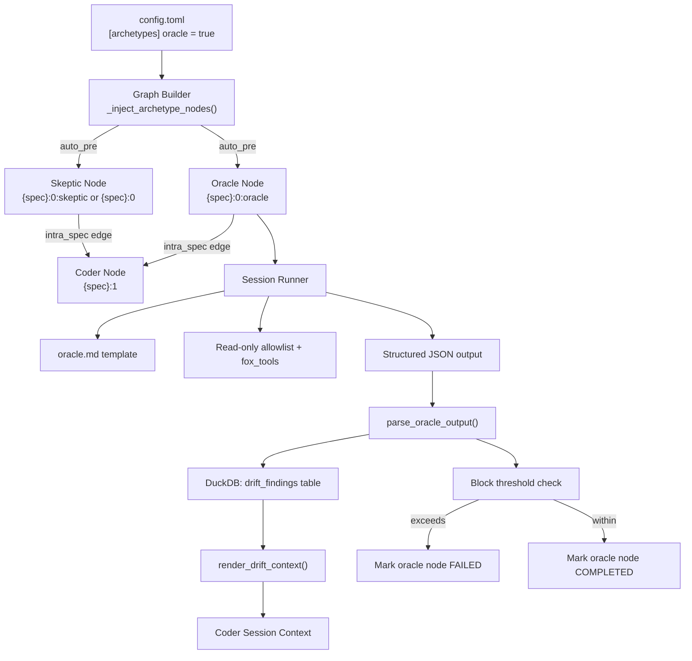
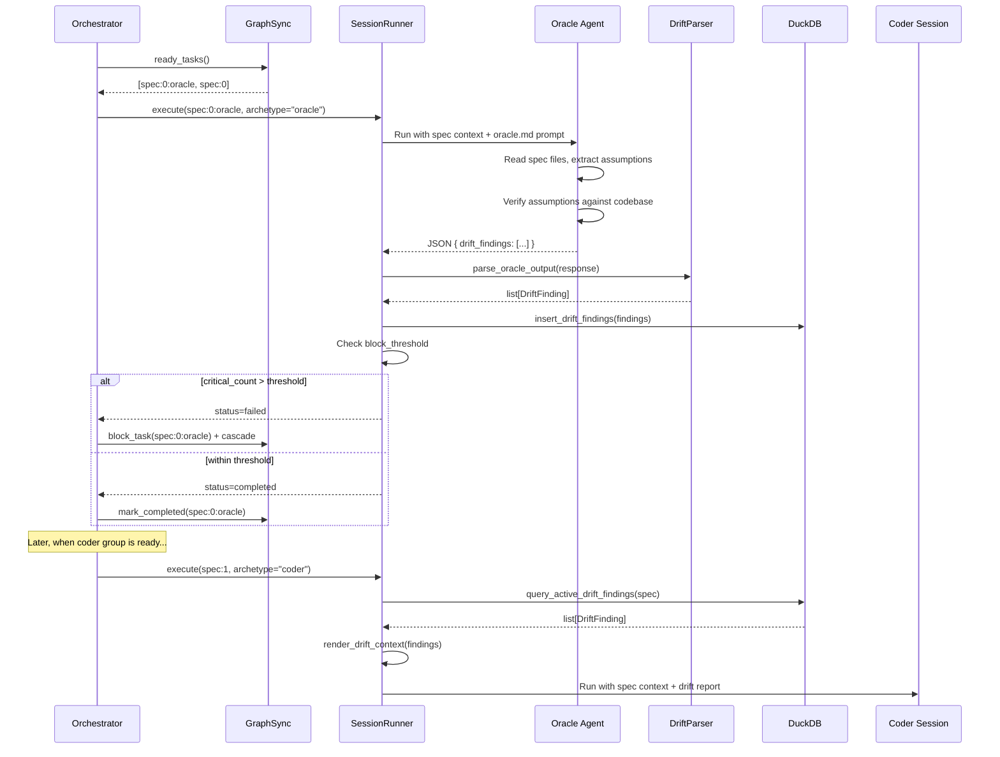

# Design Document: Oracle Agent Archetype

## Overview

The oracle is a new agent archetype that validates spec assumptions against the
current codebase before coding begins. It follows the same architectural
patterns as the skeptic (auto_pre injection, structured JSON output, DuckDB
persistence, context rendering) but targets a different concern: spec freshness
rather than spec quality.

The implementation requires modifications to the graph builder to support
multiple auto_pre archetypes, a new prompt template, a new data model and
parser for drift findings, a new DuckDB table with CRUD operations, context
rendering for coder sessions, and optional blocking logic.

## Architecture





### Module Responsibilities

1. **`agent_fox/session/archetypes.py`** — Oracle entry in `ARCHETYPE_REGISTRY`.
2. **`agent_fox/_templates/prompts/oracle.md`** — Prompt template for the
   oracle agent.
3. **`agent_fox/graph/builder.py`** — Modified `_inject_archetype_nodes()` to
   support multiple auto_pre archetypes with distinct node IDs.
4. **`agent_fox/engine/engine.py`** — Modified `_ensure_archetype_nodes()` for
   runtime injection of oracle nodes; blocking logic after oracle completion.
5. **`agent_fox/knowledge/review_store.py`** — New `DriftFinding` dataclass and
   CRUD functions for the `drift_findings` table.
6. **`agent_fox/session/review_parser.py`** — New `parse_oracle_output()`
   function.
7. **`agent_fox/session/prompt.py`** — New `render_drift_context()` function
   and integration into session context assembly.
8. **`agent_fox/knowledge/db.py`** — New migration adding the `drift_findings`
   table.
9. **`agent_fox/core/config.py`** — `oracle` field in `ArchetypesConfig`,
   `oracle_settings` with `block_threshold`.

## Components and Interfaces

### Archetype Registry Entry

```python
# In ARCHETYPE_REGISTRY
"oracle": ArchetypeEntry(
    name="oracle",
    templates=["oracle.md"],
    default_model_tier="STANDARD",
    injection="auto_pre",
    task_assignable=True,
    default_allowlist=[
        "ls", "cat", "git", "grep", "find", "head", "tail", "wc",
    ],
)
```

### DriftFinding Dataclass

```python
@dataclass(frozen=True)
class DriftFinding:
    id: str
    severity: str              # "critical" | "major" | "minor" | "observation"
    description: str
    spec_ref: str | None       # e.g. "design.md:## Architecture"
    artifact_ref: str | None   # e.g. "agent_fox/session/prompt.py:render_spec_context"
    spec_name: str
    task_group: str
    session_id: str
    superseded_by: str | None = None
    created_at: datetime | None = None
```

### Parser Interface

```python
def parse_oracle_output(
    response: str,
    spec_name: str,
    task_group: str,
    session_id: str,
) -> list[DriftFinding]:
    """Extract DriftFinding objects from oracle agent response JSON.

    Looks for a JSON object with a "drift_findings" array. Each entry
    must have "severity" and "description". Returns empty list if no
    valid JSON found.
    """
```

### Store Interface

```python
def insert_drift_findings(
    conn: duckdb.DuckDBPyConnection,
    findings: list[DriftFinding],
) -> int:
    """Insert drift findings with supersession. Returns count inserted."""

def query_active_drift_findings(
    conn: duckdb.DuckDBPyConnection,
    spec_name: str,
    task_group: str | None = None,
) -> list[DriftFinding]:
    """Query non-superseded drift findings for a spec."""
```

### Context Rendering Interface

```python
def render_drift_context(
    conn: duckdb.DuckDBPyConnection,
    spec_name: str,
) -> str | None:
    """Render active drift findings as a markdown section.

    Returns None if no findings exist.
    """
```

### Multi-auto_pre Node ID Format

When multiple auto_pre archetypes are enabled:

```
{spec_name}:0:{archetype_name}    # e.g. "05_feature:0:oracle"
```

When only one auto_pre archetype is enabled:

```
{spec_name}:0                     # backward compatible
```

### Graph Builder Changes

The `_inject_archetype_nodes()` function is modified to:

1. Collect all enabled auto_pre archetypes.
2. If count > 1, use `{spec}:0:{arch_name}` IDs for all auto_pre nodes.
3. If count == 1, use `{spec}:0` for backward compatibility.
4. Each auto_pre node gets an edge to the first coder group.
5. No edges between auto_pre nodes (they run in parallel).

### Oracle Prompt Template

The `oracle.md` template instructs the agent to:

1. Read all spec files for the current spec.
2. Extract every reference to a codebase artifact (file path, module,
   function, class, variable, data structure).
3. Extract design assumptions (module responsibilities, API contracts).
4. Extract behavioral assumptions (return formats, error handling).
5. For each assumption, verify it against the current codebase.
6. Output structured JSON with drift findings.

The template specifies read-only constraints and the output format.

### Config Changes

```python
# In ArchetypesConfig (Pydantic model)
oracle: bool = False

# In OracleSettings (new Pydantic model, similar to SkepticSettings)
class OracleSettings(BaseModel):
    block_threshold: int | None = None  # None = advisory only

    @field_validator("block_threshold")
    @classmethod
    def clamp_threshold(cls, v: int | None) -> int | None:
        if v is not None and v < 1:
            logger.warning("oracle block_threshold clamped to 1")
            return 1
        return v
```

## Data Models

### DuckDB Migration (v5)

```sql
CREATE TABLE IF NOT EXISTS drift_findings (
    id UUID PRIMARY KEY,
    severity VARCHAR NOT NULL,
    description VARCHAR NOT NULL,
    spec_ref VARCHAR,
    artifact_ref VARCHAR,
    spec_name VARCHAR NOT NULL,
    task_group VARCHAR NOT NULL,
    session_id VARCHAR NOT NULL,
    superseded_by UUID,
    created_at TIMESTAMP DEFAULT CURRENT_TIMESTAMP
);
```

### Oracle JSON Output Schema

```json
{
  "drift_findings": [
    {
      "severity": "critical",
      "description": "File `agent_fox/session/context.py` referenced in design.md no longer exists; it was merged into `agent_fox/session/prompt.py`.",
      "spec_ref": "design.md:## Components and Interfaces",
      "artifact_ref": "agent_fox/session/context.py"
    },
    {
      "severity": "major",
      "description": "Function `render_spec_context()` in design.md has a different signature than the current implementation; parameter `workspace` was renamed to `workspace_info`.",
      "spec_ref": "design.md:## Components and Interfaces",
      "artifact_ref": "agent_fox/session/prompt.py:render_spec_context"
    }
  ]
}
```

## Operational Readiness

- **Observability:** Oracle findings are logged at INFO level. Blocking events
  are logged at WARNING level. All findings are persisted in DuckDB for
  post-hoc querying.
- **Rollout:** Oracle is disabled by default (`oracle = false`). Enabling it
  adds one session per spec to the task graph. No behavioral change for
  existing users.
- **Rollback:** Disabling oracle in config.toml prevents injection. Existing
  drift_findings in DuckDB are harmless (never queried if oracle is disabled).
- **Migration:** The new DuckDB table is added via an idempotent migration.
  No existing tables are modified.

## Correctness Properties

### Property 1: Registry Completeness

*For any* archetype name `"oracle"` looked up in `ARCHETYPE_REGISTRY`, the
returned `ArchetypeEntry` SHALL have `injection="auto_pre"`,
`task_assignable=True`, and a non-empty `default_allowlist`.

**Validates: Requirements 1.1, 1.3**

### Property 2: Multi-auto_pre Distinctness

*For any* task graph built with both oracle and skeptic enabled, the set of
auto_pre node IDs for a spec SHALL contain exactly two distinct entries, and
both SHALL have intra-spec edges to the first coder group.

**Validates: Requirements 2.2, 3.1, 3.3**

### Property 3: Backward-compatible Node IDs

*For any* task graph built with exactly one auto_pre archetype enabled, the
auto_pre node ID for each spec SHALL use the format `{spec_name}:0` (no
archetype suffix).

**Validates: Requirements 3.2**

### Property 4: Drift Finding Roundtrip

*For any* valid oracle JSON output containing N drift findings with valid
severities and descriptions, `parse_oracle_output()` SHALL return exactly N
`DriftFinding` instances with matching fields.

**Validates: Requirements 6.1, 6.2, 6.3**

### Property 5: Supersession Integrity

*For any* sequence of `insert_drift_findings()` calls for the same
(spec_name, task_group) pair, only the findings from the most recent insertion
SHALL be returned by `query_active_drift_findings()`.

**Validates: Requirements 7.1, 7.3, 7.4**

### Property 6: Block Threshold Monotonicity

*For any* oracle execution with a configured `block_threshold` of T, the oracle
node SHALL be marked `"failed"` if and only if the count of critical-severity
drift findings strictly exceeds T.

**Validates: Requirements 9.1, 9.2, 9.E1**

### Property 7: Context Rendering Completeness

*For any* non-empty set of active drift findings for a spec, the rendered
markdown context SHALL contain all finding descriptions grouped by severity,
and SHALL return `None` when no findings exist.

**Validates: Requirements 8.1, 8.2, 8.E1**

### Property 8: Hot-load Injection

*For any* set of newly discovered specs at a sync barrier with oracle enabled,
the system SHALL inject oracle nodes for each new spec, and those nodes SHALL
appear in the execution state as `"pending"`.

**Validates: Requirements 4.1, 4.2**

## Error Handling

| Error Condition | Behavior | Requirement |
|----------------|----------|-------------|
| Oracle disabled in config | No oracle nodes injected | 32-REQ-1.E1 |
| Spec has no coder groups | Skip oracle injection | 32-REQ-2.E1 |
| Legacy plan.json with single :0 node | Add oracle with distinct ID | 32-REQ-3.E1 |
| Hot-load failure for a spec | Skip oracle for that spec, log warning | 32-REQ-4.E1 |
| Missing spec file (e.g., no test_spec.md) | Skip validation, report as minor | 32-REQ-5.E1 |
| Inconclusive assumption check | Report as observation, note "inconclusive" | 32-REQ-5.E2 |
| No valid JSON in oracle output | Return empty list, log warning | 32-REQ-6.E1 |
| Finding missing required fields | Skip entry, log warning | 32-REQ-6.E2 |
| DuckDB unavailable during insertion | Log warning, continue | 32-REQ-7.E1 |
| No drift findings for spec | Omit drift report section | 32-REQ-8.E1 |
| block_threshold not configured | Advisory only, always complete | 32-REQ-9.E1 |
| block_threshold < 1 | Clamp to 1, log warning | 32-REQ-10.E1 |

## Technology Stack

- **Language:** Python 3.11+
- **Storage:** DuckDB (existing knowledge store)
- **Agent backend:** Claude Agent SDK via `AgentBackend` protocol
- **Configuration:** Pydantic models in `agent_fox/core/config.py`
- **Templates:** Markdown with YAML frontmatter in
  `agent_fox/_templates/prompts/`
- **Testing:** pytest, Hypothesis (property-based tests)

## Definition of Done

A task group is complete when ALL of the following are true:

1. All subtasks within the group are checked off (`[x]`)
2. All spec tests (`test_spec.md` entries) for the task group pass
3. All property tests for the task group pass
4. All previously passing tests still pass (no regressions)
5. No linter warnings or errors introduced
6. Code is committed on a feature branch and pushed to remote
7. Feature branch is merged back to `develop`
8. `tasks.md` checkboxes are updated to reflect completion

## Testing Strategy

- **Unit tests:** Test each component in isolation — parser, store CRUD,
  context rendering, config validation, archetype registration, graph builder
  modifications.
- **Property-based tests:** Use Hypothesis to generate arbitrary drift finding
  payloads and verify roundtrip integrity, supersession correctness, and
  blocking threshold behavior.
- **Integration tests:** Test the full flow from oracle node injection through
  session execution to coder context rendering using a mock agent backend.
