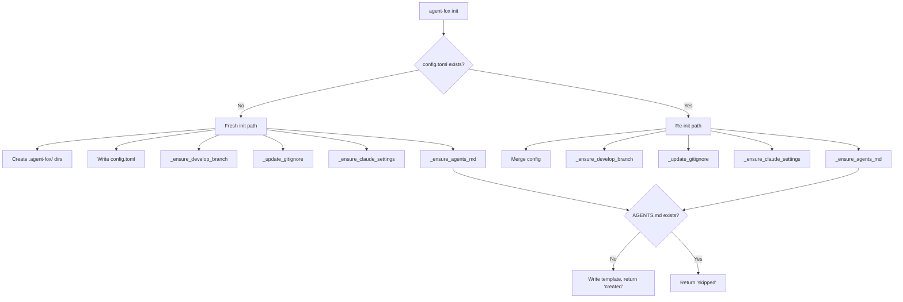

# Design Document: Init AGENTS.md Template

## Overview

This feature adds a single helper function `_ensure_agents_md()` to
`agent_fox/cli/init.py` and a static template file at
`agent_fox/_templates/agents_md.md`. The helper follows the same pattern as
`_ensure_claude_settings()`: check existence, write if absent, skip if
present. Both the fresh-init and re-init paths call this helper.

## Architecture



### Module Responsibilities

1. **`agent_fox/cli/init.py`** — Houses `_ensure_agents_md()` and wires it
   into the `init_cmd()` function on both fresh-init and re-init paths.
2. **`agent_fox/_templates/agents_md.md`** — Static template file with
   generalized project instructions and placeholder markers.

## Components and Interfaces

### `_ensure_agents_md(project_root: Path) -> str`

Internal helper function added to `agent_fox/cli/init.py`.

```python
def _ensure_agents_md(project_root: Path) -> str:
    """Create AGENTS.md from template if it does not exist.

    Args:
        project_root: The project root directory (Path.cwd()).

    Returns:
        "created" if the file was written, "skipped" if it already existed.

    Raises:
        FileNotFoundError: If the bundled template is missing.
    """
```

### Template Loading

The template is loaded via `Path(__file__)` relative resolution:

```python
_TEMPLATES_DIR = Path(__file__).resolve().parent.parent / "_templates"
_AGENTS_MD_TEMPLATE = _TEMPLATES_DIR / "agents_md.md"
```

This is consistent with how `agent_fox/session/prompt.py` loads prompt
templates from `_templates/prompts/`.

### `init_cmd` Modifications

Both the fresh-init path and re-init path call `_ensure_agents_md()` and
capture the return value. The return value is:
- Used for `click.echo("Created AGENTS.md.")` when the result is `"created"`
  (non-JSON mode only).
- Included as `"agents_md"` in the JSON output object.

## Data Models

### Template File Format

The template is a plain markdown file. No runtime processing or variable
substitution is performed — the file is copied byte-for-byte.

Placeholder markers use angle-bracket format:
- `<main_package>` — the primary source package directory
- `<test_directory>` — the test directory name

### JSON Output Extension

The existing `{"status": "ok"}` JSON output gains one field:

```json
{
  "status": "ok",
  "agents_md": "created"
}
```

Valid values for `agents_md`: `"created"`, `"skipped"`.

## Correctness Properties

### Property 1: Idempotent Creation

*For any* project root directory, calling `_ensure_agents_md` twice SHALL
produce the same file content as calling it once — the second call returns
`"skipped"` and does not modify the file.

**Validates: Requirements 44-REQ-2.1, 44-REQ-3.1**

### Property 2: Content Fidelity

*For any* project root without an existing `AGENTS.md`, the file written by
`_ensure_agents_md` SHALL have byte-identical content to the bundled template
at `agent_fox/_templates/agents_md.md`.

**Validates: Requirements 44-REQ-1.1, 44-REQ-2.1**

### Property 3: Existing File Preservation

*For any* project root containing an `AGENTS.md` with arbitrary content,
calling `_ensure_agents_md` SHALL leave the file content unchanged.

**Validates: Requirements 44-REQ-3.1, 44-REQ-3.E1**

### Property 4: CLAUDE.md Independence

*For any* project root, the behavior of `_ensure_agents_md` SHALL be
identical regardless of whether `CLAUDE.md` exists in the project root.

**Validates: Requirements 44-REQ-4.1, 44-REQ-4.2**

### Property 5: Return Value Correctness

*For any* project root, `_ensure_agents_md` SHALL return `"created"` if and
only if `AGENTS.md` did not exist before the call, and `"skipped"` if and
only if it did.

**Validates: Requirements 44-REQ-2.3, 44-REQ-3.3**

## Error Handling

| Error Condition | Behavior | Requirement |
|----------------|----------|-------------|
| Template file missing from package | Raise `FileNotFoundError` | 44-REQ-1.E1 |
| Project root is read-only | Propagate OS error from `Path.write_text` | 44-REQ-2.E1 |
| AGENTS.md exists but is empty | Skip (existence check only) | 44-REQ-3.E1 |

## Technology Stack

- **Language**: Python 3.12+
- **Package manager**: uv
- **CLI framework**: Click
- **File I/O**: `pathlib.Path`
- **Template loading**: `Path(__file__)` relative resolution
- **Testing**: pytest, Hypothesis

## Definition of Done

A task group is complete when ALL of the following are true:

1. All subtasks within the group are checked off (`[x]`)
2. All spec tests (`test_spec.md` entries) for the task group pass
3. All property tests for the task group pass
4. All previously passing tests still pass (no regressions)
5. No linter warnings or errors introduced
6. Code is committed on a feature branch and pushed to remote
7. Feature branch is merged back to `develop`
8. `tasks.md` checkboxes are updated to reflect completion

## Testing Strategy

- **Unit tests** verify `_ensure_agents_md()` in isolation using a temporary
  directory as project root. Tests cover creation, skip, content fidelity,
  return values, and edge cases (empty file, missing template).
- **Property tests** use Hypothesis to generate arbitrary file contents for
  existing `AGENTS.md` files and verify preservation, idempotency, and
  CLAUDE.md independence.
- **Integration tests** extend the existing `tests/integration/test_init.py`
  to verify that running `agent-fox init` end-to-end creates `AGENTS.md`
  with the expected content.
