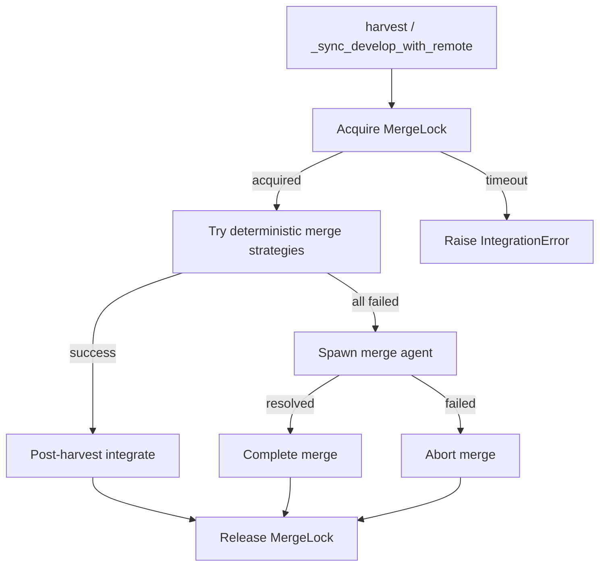
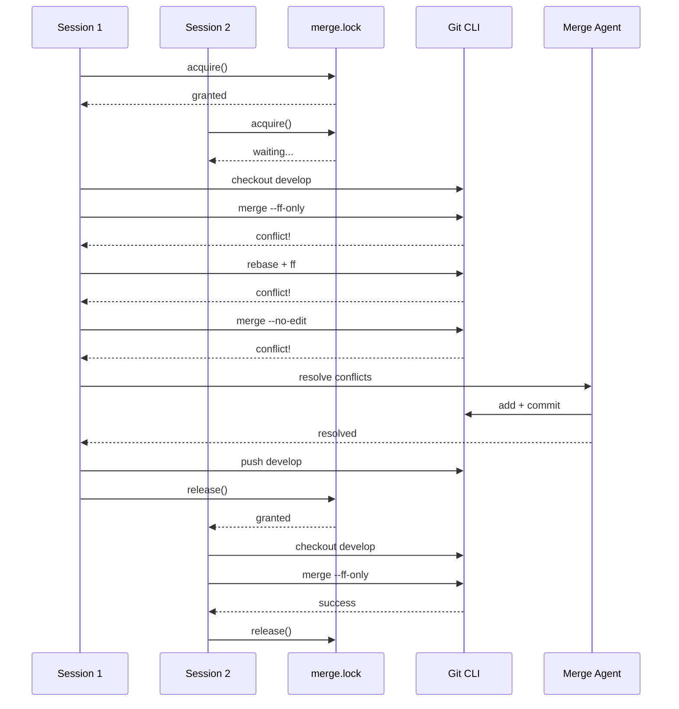

# Design Document: Robust Git Merging

## Overview

This design introduces two components: (1) a file-based merge lock that
serializes all merge operations on `develop` across asyncio tasks and OS
processes, and (2) a merge agent that resolves git conflicts when deterministic
strategies fail. Both components integrate into the existing harvest and
develop-sync flows in `agent_fox/workspace/harvest.py` and
`agent_fox/workspace/workspace.py`.

## Architecture





### Module Responsibilities

1. **`agent_fox/workspace/merge_lock.py`** (NEW) — File-based merge lock
   implementation. Provides `MergeLock` async context manager.
2. **`agent_fox/workspace/merge_agent.py`** (NEW) — Merge agent spawning and
   conflict resolution logic.
3. **`agent_fox/workspace/harvest.py`** (MODIFIED) — Wrap harvest in merge
   lock; replace `-X theirs` with merge agent fallback.
4. **`agent_fox/workspace/workspace.py`** (MODIFIED) — Wrap
   `_sync_develop_with_remote` in merge lock; replace `-X ours` with merge
   agent fallback.

## Components and Interfaces

### MergeLock

```python
class MergeLock:
    """File-based merge lock for serializing develop-branch operations.

    Works across asyncio tasks (via asyncio.Lock) and OS processes
    (via lock file with atomic creation).
    """

    def __init__(
        self,
        repo_root: Path,
        timeout: float = 300.0,       # 5 minutes
        stale_timeout: float = 300.0,  # 5 minutes
        poll_interval: float = 1.0,    # check every second
    ) -> None: ...

    async def acquire(self) -> None:
        """Acquire the merge lock. Blocks until acquired or timeout."""
        ...

    async def release(self) -> None:
        """Release the merge lock by removing the lock file."""
        ...

    async def __aenter__(self) -> "MergeLock": ...
    async def __aexit__(self, *exc: object) -> None: ...
```

**Lock file format**: The lock file at `<repo>/.agent-fox/merge.lock` contains
the PID and hostname of the holding process, for diagnostic purposes. The lock
is created atomically using `os.open` with `O_CREAT | O_EXCL` flags.

**Stale detection**: On each acquisition attempt, if the lock file exists and
its mtime is older than `stale_timeout`, the lock is considered stale. The
system removes it and retries. To prevent two processes from breaking the same
stale lock, the removal + re-creation is protected by attempting atomic
creation immediately after removal — if another process won the race, the
atomic create will fail and the caller retries.

**Asyncio coordination**: An internal `asyncio.Lock` serializes within-process
callers so they don't all race to the file lock simultaneously. The flow is:
acquire asyncio lock → acquire file lock → release file lock → release asyncio
lock.

### Merge Agent

```python
async def run_merge_agent(
    worktree_path: Path,
    conflict_output: str,
    model_id: str,
) -> bool:
    """Spawn a merge agent to resolve git conflicts.

    Args:
        worktree_path: Path to the git worktree with unresolved conflicts.
        conflict_output: Git conflict/diff output to include in the prompt.
        model_id: Model ID to use (resolved from ADVANCED tier).

    Returns:
        True if conflicts were resolved and committed, False otherwise.
    """
    ...
```

The merge agent:
1. Receives a system prompt instructing it to resolve merge conflicts only.
2. Receives the conflict output and worktree path as context.
3. Runs as a single coding session using `run_session` (or the claude-code-sdk
   directly).
4. On completion, checks if all conflicts are resolved (`git diff --check`).
5. If resolved, stages and commits the resolution. Returns True.
6. If unresolved or the session fails, returns False.

### Modified harvest() flow

```python
async def harvest(repo_root, workspace, dev_branch="develop"):
    lock = MergeLock(repo_root)
    async with lock:
        # ... existing flow up to merge_commit failure ...
        # Instead of merge_commit with -X theirs:
        conflict_output = await _get_conflict_output(repo_root, workspace.branch)
        model_id = resolve_model_id("ADVANCED")
        resolved = await run_merge_agent(workspace.path, conflict_output, model_id)
        if not resolved:
            raise IntegrationError(...)
        # complete the merge
```

### Modified _sync_develop_with_remote() flow

Same pattern: wrap in `MergeLock`, replace `-X ours` with
`run_merge_agent()`.

## Data Models

### Lock file content

```json
{
  "pid": 12345,
  "hostname": "machine-name",
  "acquired_at": "2026-03-12T10:00:00Z"
}
```

This is for diagnostics only — the lock mechanism relies on atomic file
creation, not file content parsing.

## Operational Readiness

- **Observability**: Lock acquisition, release, stale-lock breaking, and agent
  fallback invocations are logged at INFO level. Agent failures are logged at
  ERROR.
- **Rollback**: The merge lock is a new file; removing `merge_lock.py` and
  reverting harvest/workspace changes restores the old behavior.
- **Migration**: No data migration needed. The lock file is ephemeral.

## Correctness Properties

### Property 1: Mutual Exclusion

*For any* set of concurrent harvest or develop-sync operations on the same
repository, the merge lock SHALL ensure that at most one operation holds the
lock at any time.

**Validates: Requirements 45-REQ-1.1, 45-REQ-1.4**

### Property 2: Lock Release Guarantee

*For any* code path through a merge-lock-protected operation (including
exceptions), the merge lock SHALL be released when the operation exits the
`async with` block.

**Validates: Requirements 45-REQ-2.1, 45-REQ-2.2**

### Property 3: Stale Lock Recovery

*For any* lock file whose mtime exceeds the stale timeout, the system SHALL
successfully acquire the lock within `stale_timeout + poll_interval` seconds.

**Validates: Requirements 45-REQ-1.E1**

### Property 4: Agent-Only Conflict Resolution

*For any* merge conflict during harvest, the system SHALL invoke the merge
agent and SHALL NOT use `-X theirs` or `-X ours` strategy options.

**Validates: Requirements 45-REQ-4.1, 45-REQ-6.1, 45-REQ-6.2**

### Property 5: Agent Failure Propagation

*For any* merge agent invocation that fails, the system SHALL propagate the
failure as an `IntegrationError` (harvest) or a warning (develop-sync),
never silently succeed.

**Validates: Requirements 45-REQ-4.E1, 45-REQ-5.E1**

### Property 6: Timeout Enforcement

*For any* lock acquisition attempt that exceeds the configured timeout, the
system SHALL raise an `IntegrationError` within `timeout + poll_interval`
seconds.

**Validates: Requirements 45-REQ-1.2, 45-REQ-1.3**

## Error Handling

| Error Condition | Behavior | Requirement |
|----------------|----------|-------------|
| Lock acquisition timeout | Raise IntegrationError | 45-REQ-1.3 |
| Stale lock detected | Break lock and retry | 45-REQ-1.E1 |
| .agent-fox/ missing | Create directory | 45-REQ-1.E2 |
| Concurrent stale-lock break | Atomic retry | 45-REQ-1.E3 |
| Lock file already removed on release | Log warning | 45-REQ-2.E1 |
| Merge agent fails | Abort merge, raise IntegrationError | 45-REQ-4.E1 |
| Merge agent API error/timeout | Treat as agent failure | 45-REQ-4.E2 |
| Develop-sync agent fails | Log warning, use local as-is | 45-REQ-5.E1 |

## Technology Stack

- **Language**: Python 3.12+
- **Standard library**: `asyncio`, `os` (O_CREAT | O_EXCL), `pathlib`, `json`,
  `time`
- **Internal**: `agent_fox.core.models.resolve_model_id`,
  `agent_fox.session.runner.run_session`, `agent_fox.workspace.workspace.run_git`
- **Testing**: pytest, pytest-asyncio, Hypothesis

## Definition of Done

A task group is complete when ALL of the following are true:

1. All subtasks within the group are checked off (`[x]`)
2. All spec tests (`test_spec.md` entries) for the task group pass
3. All property tests for the task group pass
4. All previously passing tests still pass (no regressions)
5. No linter warnings or errors introduced
6. Code is committed on a feature branch and pushed to remote
7. Feature branch is merged back to `develop`
8. `tasks.md` checkboxes are updated to reflect completion

## Testing Strategy

- **Unit tests** mock git commands and verify lock acquisition/release
  semantics, stale detection, timeout behavior, and agent invocation flow.
- **Property tests** use Hypothesis to verify mutual exclusion invariants
  and lock release guarantees under various failure scenarios.
- **Integration tests** use real git operations in temporary repositories to
  verify the full harvest flow with locking and agent fallback.
