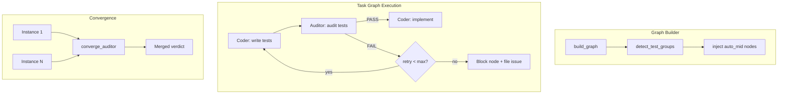

# Design Document: Test Auditor Archetype

## Overview

The test auditor is a new agent archetype that validates test code against
`test_spec.md` contracts. It introduces a new injection mode (`auto_mid`) to
the graph builder, a conservative convergence function, and a circuit-breaker-
guarded retry loop. The auditor is read-only: it reads test files and spec
documents, optionally runs pytest for collection/failure verification, and
produces a structured JSON verdict.

## Architecture



### Module Responsibilities

1. **`agent_fox/session/archetypes.py`** -- Add `auditor` entry to
   `ARCHETYPE_REGISTRY`.
2. **`agent_fox/core/config.py`** -- Add `AuditorConfig` model, `auditor`
   field to `ArchetypesConfig` and `ArchetypeInstancesConfig`.
3. **`agent_fox/graph/builder.py`** -- Add `auto_mid` injection logic,
   test-writing group detection function.
4. **`agent_fox/session/convergence.py`** -- Add `converge_auditor()`
   function.
5. **`agent_fox/_templates/prompts/auditor.md`** -- Prompt template.
6. **`agent_fox/engine/engine.py`** -- Wire circuit breaker logic into
   retry-predecessor handling, emit `auditor.retry` events.

## Components and Interfaces

### Test-Writing Group Detection

```python
# In agent_fox/graph/builder.py

_TEST_GROUP_PATTERNS: list[re.Pattern] = [
    re.compile(r"write failing spec tests", re.IGNORECASE),
    re.compile(r"write failing tests", re.IGNORECASE),
    re.compile(r"create unit test", re.IGNORECASE),
    re.compile(r"create test file", re.IGNORECASE),
    re.compile(r"spec tests", re.IGNORECASE),
]

def is_test_writing_group(title: str) -> bool:
    """Return True if the group title matches a test-writing pattern."""
    return any(p.search(title) for p in _TEST_GROUP_PATTERNS)
```

### Auto-Mid Injection

```python
# In agent_fox/graph/builder.py, inside _inject_archetype_nodes()

def _inject_auto_mid_nodes(
    nodes: list[Node],
    edges: list[Edge],
    specs: list[SpecInfo],
    task_groups: dict[str, list[TaskGroupDef]],
    archetypes_config: ArchetypesConfig,
) -> None:
    """Inject auditor nodes after detected test-writing groups."""
```

The function:
1. Checks `archetypes_config.auditor` is enabled.
2. For each spec, iterates task groups and calls `is_test_writing_group()`.
3. Counts TS entries in the spec's `test_spec.md`; skips if below threshold.
4. Creates an auditor node with a fractional group number (e.g., `1.5`)
   to place it between groups.
5. Adds edges: `test_group -> auditor` and `auditor -> next_group`.

### TS Entry Counting

```python
# In agent_fox/graph/builder.py

def count_ts_entries(spec_dir: Path) -> int:
    """Count TS-NN-N entries in a spec's test_spec.md."""
```

Counts lines matching `### TS-` in the spec's `test_spec.md` file. Returns 0
if the file does not exist.

### Auditor Registry Entry

```python
# In agent_fox/session/archetypes.py

"auditor": ArchetypeEntry(
    name="auditor",
    templates=["auditor.md"],
    default_model_tier="STANDARD",
    injection="auto_mid",
    task_assignable=True,
    retry_predecessor=True,
    default_allowlist=[
        "ls", "cat", "git", "grep", "find", "head", "tail", "wc", "uv",
    ],
),
```

### Configuration Model

```python
# In agent_fox/core/config.py

class AuditorConfig(BaseModel):
    min_ts_entries: int = 5
    max_retries: int = 2

    @field_validator("min_ts_entries")
    @classmethod
    def clamp_min_ts(cls, v: int) -> int:
        return max(1, v)

    @field_validator("max_retries")
    @classmethod
    def clamp_max_retries(cls, v: int) -> int:
        return max(0, v)
```

Added to `ArchetypesConfig`:
- `auditor: bool = False`
- `auditor_config: AuditorConfig = AuditorConfig()`

Added to `ArchetypeInstancesConfig`:
- `auditor: int = 1` (clamped 1-5)

### Convergence Function

```python
# In agent_fox/session/convergence.py

@dataclass(frozen=True)
class AuditEntry:
    ts_entry: str
    test_functions: list[str]
    verdict: str  # PASS | WEAK | MISSING | MISALIGNED
    notes: str | None = None

@dataclass(frozen=True)
class AuditResult:
    entries: list[AuditEntry]
    overall_verdict: str  # PASS | FAIL
    summary: str

def converge_auditor(
    instance_results: list[AuditResult],
) -> AuditResult:
    """Merge multiple auditor instance results using union semantics.

    A TS entry takes the worst verdict across instances.
    Overall verdict is FAIL if any instance verdict is FAIL.
    """
```

Verdict severity order for "worst wins": MISSING > MISALIGNED > WEAK > PASS.

### Circuit Breaker

The circuit breaker integrates with the existing retry-predecessor logic in
`engine.py`. The auditor's `retry_predecessor=True` flag triggers the
standard retry path. The circuit breaker adds a per-node retry counter
that checks against `auditor_config.max_retries`.

When the circuit breaker trips:
1. The auditor node state is set to `blocked`.
2. Downstream nodes are blocked by normal graph dependency resolution.
3. A GitHub issue is filed via `file_or_update_issue()`.
4. An `auditor.circuit_breaker` audit event is emitted.

### Audit Event Types

Two new audit event types:
- `auditor.retry` -- Emitted when the auditor triggers a coder retry.
  Payload: `{spec_name, group_number, attempt}`.
- `auditor.circuit_breaker` -- Emitted when the circuit breaker trips.
  Payload: `{spec_name, group_number, max_retries, last_findings_summary}`.

### Output Persistence

```python
# In engine.py or session_lifecycle.py (auditor post-session logic)

def _persist_auditor_results(
    spec_dir: Path,
    result: AuditResult,
) -> None:
    """Write audit findings to .specs/{spec_name}/audit.md."""
```

Format: markdown with a table of TS entries, their verdicts, test function
paths, and notes. Similar in structure to the skeptic's `review.md`.

## Data Models

### AuditResult JSON Schema

```json
{
  "audit": [
    {
      "ts_entry": "TS-05-1",
      "test_functions": ["tests/unit/test_foo.py::test_bar"],
      "verdict": "PASS",
      "notes": null
    }
  ],
  "overall_verdict": "PASS",
  "summary": "All 14 TS entries have adequate tests."
}
```

### audit.md Output Format

```markdown
# Audit Report: {spec_name}

**Overall Verdict:** PASS | FAIL
**Date:** {timestamp}
**Attempt:** {attempt_number}

## Per-Entry Results

| TS Entry | Verdict | Test Functions | Notes |
|----------|---------|----------------|-------|
| TS-05-1  | PASS    | test_foo::test_bar | - |
| TS-05-3  | WEAK    | test_foo::test_edge | Assertion only checks not None |

## Summary

{summary text}
```

## Operational Readiness

### Observability

- Audit events (`auditor.retry`, `auditor.circuit_breaker`) are emitted via
  the existing audit sink infrastructure (spec 40).
- Circuit breaker trips are logged at WARNING level.
- Normal audit completion is logged at INFO level.

### Rollout

- Disabled by default (`auditor = false`). Zero behavioral change unless
  explicitly enabled.
- Can be enabled per-project via `config.toml`.

### Rollback

- Disable by setting `auditor = false`. The auditor node is simply not
  injected; no other behavior changes.

## Correctness Properties

### Property 1: Detection Completeness

*For any* group title string that contains one of the defined test-writing
patterns as a substring, `is_test_writing_group(title)` SHALL return `True`.

**Validates: Requirements 46-REQ-3.1, 46-REQ-3.2, 46-REQ-3.E2**

### Property 2: Detection Specificity

*For any* group title string that does not contain any of the defined
test-writing patterns as a substring, `is_test_writing_group(title)` SHALL
return `False`.

**Validates: Requirements 46-REQ-3.1, 46-REQ-3.E1**

### Property 3: Injection Graph Integrity

*For any* task graph with an auditor-enabled config and at least one detected
test-writing group with sufficient TS entries, the injected auditor node SHALL
have exactly one incoming edge from the test-writing group and at most one
outgoing edge to the next group.

**Validates: Requirements 46-REQ-4.1, 46-REQ-4.2, 46-REQ-4.3, 46-REQ-4.E2**

### Property 4: Convergence Union Semantics

*For any* list of AuditResult instances, the merged result from
`converge_auditor()` SHALL flag a TS entry with the worst verdict across
all instances. The merged overall verdict SHALL be FAIL if any instance
overall verdict is FAIL.

**Validates: Requirements 46-REQ-6.1, 46-REQ-6.3**

### Property 5: Convergence Determinism

*For any* list of AuditResult instances, calling `converge_auditor()` twice
with the same input SHALL produce identical output.

**Validates: Requirements 46-REQ-6.4**

### Property 6: Circuit Breaker Bound

*For any* auditor node, the total number of coder retries triggered by the
auditor SHALL not exceed `auditor_config.max_retries`.

**Validates: Requirements 46-REQ-7.3, 46-REQ-7.4**

### Property 7: Config Clamping

*For any* integer value assigned to `AuditorConfig.min_ts_entries`, the
stored value SHALL be >= 1. *For any* integer value assigned to
`AuditorConfig.max_retries`, the stored value SHALL be >= 0.
*For any* integer value assigned to `ArchetypeInstancesConfig.auditor`,
the stored value SHALL be in range [1, 5].

**Validates: Requirements 46-REQ-2.2, 46-REQ-2.3**

## Error Handling

| Error Condition | Behavior | Requirement |
|----------------|----------|-------------|
| `auditor.md` template missing | Raise error during prompt construction | 46-REQ-5.E1 |
| `gh` CLI unavailable | Log warning, do not block | 46-REQ-8.E1 |
| `audit.md` write fails | Log error, do not block | 46-REQ-8.E2 |
| All auditor instances fail | Treat as PASS, log warning | 46-REQ-6.E2 |
| Config omits `[archetypes]` section | Default to auditor=False | 46-REQ-2.E1 |
| Circuit breaker trips | Block node, file issue, emit event | 46-REQ-7.4, 46-REQ-7.5, 46-REQ-7.6 |

## Technology Stack

- Python 3.12+
- Pydantic v2 (config models with field validators)
- `re` module (test-writing group pattern matching)
- Existing archetype infrastructure (spec 26)
- Existing audit event infrastructure (spec 40)
- Existing GitHub issue filing (spec 26, `file_or_update_issue()`)

## Definition of Done

A task group is complete when ALL of the following are true:

1. All subtasks within the group are checked off (`[x]`)
2. All spec tests (`test_spec.md` entries) for the task group pass
3. All property tests for the task group pass
4. All previously passing tests still pass (no regressions)
5. No linter warnings or errors introduced
6. Code is committed on a feature branch and pushed to remote
7. Feature branch is merged back to `develop`
8. `tasks.md` checkboxes are updated to reflect completion

## Testing Strategy

- **Unit tests** verify each component in isolation: registry entry,
  config validation, detection function, injection logic, convergence
  function, circuit breaker state tracking, output persistence.
- **Property tests** use Hypothesis to verify detection completeness/
  specificity, convergence union semantics and determinism, config
  clamping bounds, and circuit breaker retry limits.
- **Integration tests** are not required for this spec -- all components
  integrate via the existing archetype infrastructure which is already
  integration-tested in spec 26.
