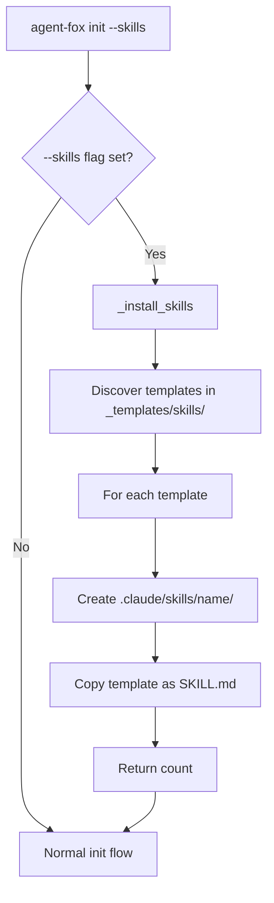

# Design Document: Install Claude Code Skills via `init --skills`

## Overview

Extends the `agent-fox init` CLI command with a `--skills` boolean flag. When
set, the command discovers bundled skill templates from
`agent_fox/_templates/skills/`, and copies each as a `SKILL.md` file into the
project's `.claude/skills/{name}/` directory. The bundled templates are updated
to include YAML frontmatter so they are valid, self-contained skill files.

## Architecture



### Module Responsibilities

1. **`agent_fox/cli/init.py`** — Owns the `--skills` flag, calls
   `_install_skills()`, includes result in output.
2. **`agent_fox/_templates/skills/`** — Bundled skill files (updated to include
   YAML frontmatter).

## Components and Interfaces

### CLI Interface

```
agent-fox init [--skills]
```

- `--skills`: Boolean flag (default: `False`). When set, installs bundled
  Claude Code skills into `.claude/skills/`.

### Internal Functions

```python
_SKILLS_DIR: Path
# Path to agent_fox/_templates/skills/ directory.

def _install_skills(project_root: Path) -> int:
    """Install bundled skill templates into .claude/skills/.

    Discovers all files in _SKILLS_DIR, creates
    {project_root}/.claude/skills/{name}/SKILL.md for each.
    Overwrites existing files.

    Args:
        project_root: The project root directory.

    Returns:
        Number of skills installed.
    """
```

### Bundled Template Format

Each file in `_templates/skills/` is a complete SKILL.md:

```markdown
---
name: af-spec
description: Requirements engineering and spec-driven development.
argument-hint: "[path-to-prd-or-prompt-or-github-issue-url]"
---

# Spec-Driven Development Skill
...
```

The filename (e.g., `af-spec`) determines the target directory name
(`.claude/skills/af-spec/SKILL.md`).

## Data Models

### Skill Template Discovery

Templates are discovered by listing files (not directories) in `_SKILLS_DIR`.
Each file's stem is used as the skill name. Hidden files (starting with `.`)
are skipped.

### JSON Output Extension

When `--skills` is provided:

```json
{
  "status": "ok",
  "skills_installed": 6,
  "agents_md": "created"
}
```

When `--skills` is not provided, the `skills_installed` key is absent (existing
behavior unchanged).

## Correctness Properties

### Property 1: Template Completeness

*For any* bundled skill template file in `_templates/skills/`, the file SHALL
contain valid YAML frontmatter with at least a `name` field whose value matches
the filename.

**Validates: Requirements 1.1, 1.2, 1.3**

### Property 2: Installation Bijection

*For any* set of bundled skill templates, `_install_skills()` SHALL produce
exactly one `SKILL.md` file per template, at the path
`.claude/skills/{template_filename}/SKILL.md`, and the file content SHALL be
byte-identical to the source template.

**Validates: Requirements 2.1, 2.3**

### Property 3: Flag Independence

*For any* invocation of `init` without `--skills`, the set of files under
`.claude/skills/` SHALL be unchanged.

**Validates: Requirement 2.2**

### Property 4: Overwrite Idempotency

*For any* sequence of `init --skills` invocations, the resulting skill files
SHALL be byte-identical to those produced by a single invocation.

**Validates: Requirement 2.4**

### Property 5: Count Accuracy

*For any* invocation of `_install_skills()`, the returned integer SHALL equal
the number of `SKILL.md` files written.

**Validates: Requirements 2.5, 3.1**

## Error Handling

| Error Condition | Behavior | Requirement |
|----------------|----------|-------------|
| Bundled template unreadable | Skip skill, log warning, continue | 47-REQ-1.E1 |
| `_templates/skills/` empty or missing | Log warning, return 0 | 47-REQ-2.E1 |
| Cannot create `.claude/skills/` | Log error, continue init | 47-REQ-2.E2 |

## Technology Stack

- Python 3.12+
- Click (CLI framework, already used by init command)
- pathlib (file operations)
- No new dependencies

## Definition of Done

A task group is complete when ALL of the following are true:

1. All subtasks within the group are checked off (`[x]`)
2. All spec tests (`test_spec.md` entries) for the task group pass
3. All property tests for the task group pass
4. All previously passing tests still pass (no regressions)
5. No linter warnings or errors introduced
6. Code is committed on a feature branch and pushed to remote
7. Feature branch is merged back to `develop`
8. `tasks.md` checkboxes are updated to reflect completion

## Testing Strategy

- **Unit tests** verify `_install_skills()` in isolation using `tmp_path`
  fixtures.
- **Property tests** verify template completeness (frontmatter validity) and
  installation bijection using the actual bundled templates.
- **Integration tests** verify the full `init --skills` CLI flow including
  JSON output, using `CliRunner` and `tmp_git_repo` fixtures.
