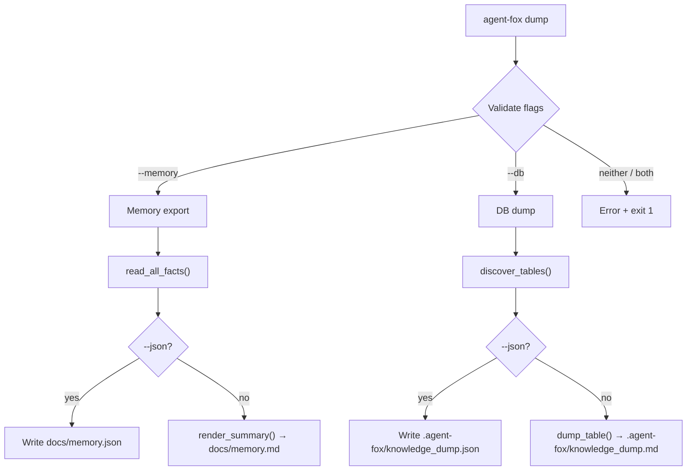

# Design Document: `dump` CLI Command

## Overview

The `dump` command adds a single Click subcommand to the existing CLI group
that exports knowledge store data in two modes: memory summary and full
database dump. It reuses existing infrastructure (`render_summary`,
`read_all_facts`, `KnowledgeDB`) and adds a thin orchestration layer for
JSON serialization and the database-dump path.

## Architecture



### Module Responsibilities

1. **`agent_fox/cli/dump.py`** — Click command definition, flag validation,
   dispatch to memory or DB export, JSON-mode branching.
2. **`agent_fox/knowledge/rendering.py`** — Existing `render_summary()`
   function (reused for `--memory` Markdown output).
3. **`agent_fox/knowledge/store.py`** — Existing `read_all_facts()` function
   (reused for `--memory` JSON output).
4. **`agent_fox/knowledge/dump.py`** — New module for DB-dump logic:
   `discover_tables()`, `dump_table()`, `dump_all_tables_md()`,
   `dump_all_tables_json()`.

## Components and Interfaces

### CLI Command

```python
# agent_fox/cli/dump.py

@click.command()
@click.option("--memory", is_flag=True, help="Export memory summary")
@click.option("--db", is_flag=True, help="Export full database dump")
@click.pass_context
def dump_cmd(ctx: click.Context, memory: bool, db: bool) -> None: ...
```

### Knowledge Dump Module

```python
# agent_fox/knowledge/dump.py

def discover_tables(conn: duckdb.DuckDBPyConnection) -> list[str]: ...
def dump_table_md(conn: duckdb.DuckDBPyConnection, table: str) -> str: ...
def dump_all_tables_md(conn: duckdb.DuckDBPyConnection, output: Path) -> int: ...
def dump_all_tables_json(conn: duckdb.DuckDBPyConnection, output: Path) -> int: ...
```

### Memory JSON Export

```python
# agent_fox/knowledge/rendering.py  (new function)

def render_summary_json(
    conn: duckdb.DuckDBPyConnection | None = None,
    output_path: Path = ...,
) -> int: ...
```

## Data Models

### Memory JSON Schema

```json
{
  "facts": [
    {
      "id": "string",
      "content": "string",
      "category": "gotcha | pattern | decision | convention | anti_pattern | fragile_area",
      "spec_name": "string",
      "confidence": 0.90
    }
  ],
  "generated": "ISO-8601 timestamp"
}
```

### DB Dump JSON Schema

```json
{
  "tables": {
    "<table_name>": [
      {"<column>": "<value>", ...}
    ]
  },
  "generated": "ISO-8601 timestamp"
}
```

## Correctness Properties

### Property 1: Mutual Exclusivity

*For any* invocation of `dump_cmd` with both `--memory` and `--db` set to
True, the command SHALL exit with code 1 without writing any file.

**Validates: Requirements 1.E1**

### Property 2: Flag Requirement

*For any* invocation of `dump_cmd` with both `--memory` and `--db` set to
False, the command SHALL exit with code 1 without writing any file.

**Validates: Requirements 1.2**

### Property 3: Memory Markdown Roundtrip

*For any* non-empty set of facts in the knowledge store, `--memory` (without
`--json`) SHALL produce a Markdown file whose category sections contain
exactly one bullet per active fact.

**Validates: Requirements 2.1**

### Property 4: Memory JSON Completeness

*For any* non-empty set of facts in the knowledge store, `--memory --json`
SHALL produce a JSON file whose `facts` array length equals the number of
active facts and every fact object contains `id`, `content`, `category`,
`spec_name`, and `confidence` keys.

**Validates: Requirements 2.2**

### Property 5: DB Dump Table Coverage

*For any* knowledge store with N tables, `--db` SHALL produce output
containing exactly N table sections (Markdown) or N keys in the `tables`
dict (JSON).

**Validates: Requirements 3.1, 3.2**

### Property 6: Read-Only Safety

*For any* invocation of `dump_cmd`, the knowledge store file SHALL not be
modified (byte-identical before and after).

**Validates: Requirements 5.1**

## Error Handling

| Error Condition | Behavior | Requirement |
|----------------|----------|-------------|
| Neither `--memory` nor `--db` provided | Print error, exit 1 | 49-REQ-1.2 |
| Both `--memory` and `--db` provided | Print error, exit 1 | 49-REQ-1.E1 |
| Knowledge DB file missing | Print error, exit 1 | 49-REQ-4.1 |
| No facts in DB (--memory) | Write empty-state file, warn | 49-REQ-2.E1 |
| No tables in DB (--db) | Print warning, exit 1 | 49-REQ-3.E1 |

## Technology Stack

- Python 3.12+
- Click (CLI framework, already in use)
- DuckDB (read-only access)
- Standard library `json` module

## Definition of Done

A task group is complete when ALL of the following are true:

1. All subtasks within the group are checked off (`[x]`)
2. All spec tests (`test_spec.md` entries) for the task group pass
3. All property tests for the task group pass
4. All previously passing tests still pass (no regressions)
5. No linter warnings or errors introduced
6. Code is committed on a feature branch and pushed to remote
7. Feature branch is merged back to `develop`
8. `tasks.md` checkboxes are updated to reflect completion

## Testing Strategy

- **Unit tests**: Test flag validation logic, JSON serialization, Markdown
  formatting, table discovery, and cell truncation in isolation using
  in-memory DuckDB connections.
- **Property-based tests**: Use Hypothesis to generate random fact sets and
  verify roundtrip properties (fact count preservation, key completeness,
  table coverage).
- **Integration tests**: Not needed — the command is a thin wrapper over
  tested infrastructure. Unit tests with in-memory DuckDB provide sufficient
  coverage.
