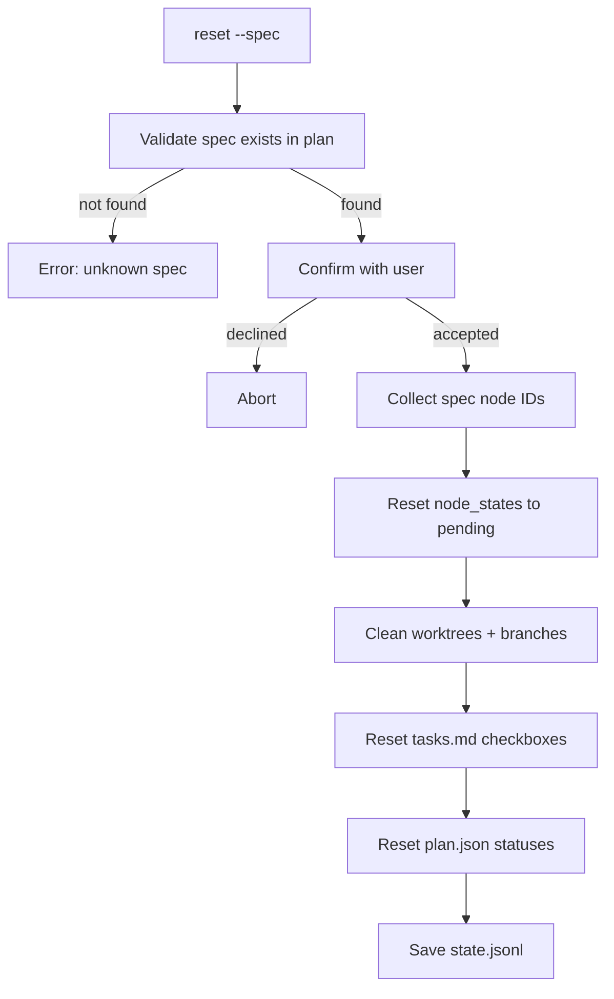

# Design Document: Spec-Scoped Reset

## Overview

Adds a `reset --spec <spec_name>` mode to the existing reset command. The
implementation extends `agent_fox/engine/reset.py` with a new `reset_spec()`
function and wires it into the CLI via a new `--spec` option on the existing
`reset` Click command.

## Architecture



### Module Responsibilities

1. **`agent_fox/cli/reset.py`** — CLI wiring: new `--spec` option, mutual
   exclusivity checks, confirmation prompt, output formatting.
2. **`agent_fox/engine/reset.py`** — New `reset_spec()` function implementing
   the spec-scoped reset logic.

## Components and Interfaces

### CLI Option

Add `--spec` option to the existing `reset_cmd`:

```python
@click.option("--spec", "filter_spec", default=None,
              help="Reset all tasks for a single spec")
```

### Core Function

```python
async def reset_spec(
    spec_name: str,
    state_path: Path,
    plan_path: Path,
    worktrees_dir: Path,
    repo_path: Path,
) -> ResetResult:
    """Reset all tasks belonging to a single spec to pending.

    Identifies all nodes (coder + archetype) whose spec_name matches,
    resets their state to pending, cleans worktrees/branches, and
    synchronizes tasks.md and plan.json.

    Does NOT perform git rollback or knowledge compaction.

    Args:
        spec_name: The spec folder name to reset.
        state_path: Path to .agent-fox/state.jsonl.
        plan_path: Path to .agent-fox/plan.json.
        worktrees_dir: Path to worktrees directory.
        repo_path: Path to the git repository root.

    Returns:
        ResetResult with reset_tasks, cleaned_worktrees, cleaned_branches.

    Raises:
        AgentFoxError: If spec_name not found in plan, or state/plan missing.
    """
```

### Node Collection

Collect node IDs by matching `spec_name` from the plan's node metadata:

```python
spec_node_ids = [
    nid for nid, node in graph.nodes.items()
    if node.spec_name == spec_name
]
```

This captures both coder nodes (e.g., `11_echo:2`) and archetype nodes
(e.g., `11_echo:0`, `11_echo:1:auditor`, `11_echo:4`).

## Data Models

No new data models. Reuses existing `ResetResult` from `agent_fox/engine/reset.py`.

## Operational Readiness

- **Observability**: Logs each reset node, cleaned worktree, and cleaned branch
  at INFO level.
- **Rollback**: Not applicable — the operation is itself a reset. State.jsonl
  is append-only so previous state snapshots are preserved.

## Correctness Properties

### Property 1: Spec Isolation

*For any* valid spec name S and plan with multiple specs, `reset_spec(S)` SHALL
modify only node_states entries whose spec_name equals S.

**Validates: Requirements 1.1, 1.3**

### Property 2: Complete Spec Coverage

*For any* valid spec name S, `reset_spec(S)` SHALL reset every node in the plan
whose spec_name equals S, regardless of archetype.

**Validates: Requirements 1.1, 1.2**

### Property 3: Pending State

*For any* valid spec name S, after `reset_spec(S)`, every node belonging to S
SHALL have status `pending`.

**Validates: Requirement 1.1**

### Property 4: Preservation

*For any* valid spec name S, `reset_spec(S)` SHALL not modify
`session_history`, `total_input_tokens`, `total_output_tokens`, `total_cost`,
or `total_sessions` in the execution state.

**Validates: Requirements 4.1, 4.2**

### Property 5: Artifact Synchronization

*For any* valid spec name S, after `reset_spec(S)`, the `tasks.md` checkboxes
and `plan.json` statuses for all task groups in S SHALL reflect `pending`/`[ ]`.

**Validates: Requirements 1.5, 1.6**

## Error Handling

| Error Condition | Behavior | Requirement |
|----------------|----------|-------------|
| Unknown spec name | Exit non-zero, list valid specs | 50-REQ-1.E1 |
| Plan file missing | Exit non-zero, instruct to run plan | 50-REQ-1.E2 |
| State file missing | Exit non-zero, error message | 50-REQ-1.E3 |
| All nodes already pending | Return empty reset_tasks | 50-REQ-1.E4 |
| --spec + --hard combined | Exit non-zero, mutual exclusivity error | 50-REQ-2.1 |
| --spec + task_id combined | Exit non-zero, mutual exclusivity error | 50-REQ-2.2 |

## Technology Stack

- Python 3.12+
- Click (CLI framework)
- Existing `agent_fox.engine.reset` infrastructure
- Existing `agent_fox.graph.persistence` for plan loading

## Definition of Done

A task group is complete when ALL of the following are true:

1. All subtasks within the group are checked off (`[x]`)
2. All spec tests (`test_spec.md` entries) for the task group pass
3. All property tests for the task group pass
4. All previously passing tests still pass (no regressions)
5. No linter warnings or errors introduced
6. Code is committed on a feature branch and pushed to remote
7. Feature branch is merged back to `develop`
8. `tasks.md` checkboxes are updated to reflect completion

## Testing Strategy

- **Unit tests**: Mock state/plan loading, verify node selection, state
  mutations, and artifact cleanup calls.
- **Property tests**: Use Hypothesis to generate random plan graphs with
  multiple specs and verify isolation, coverage, and preservation properties.
- **Integration tests**: Create a temporary git repo with state.jsonl and
  plan.json, run `reset_spec()`, and verify end-to-end behavior.
