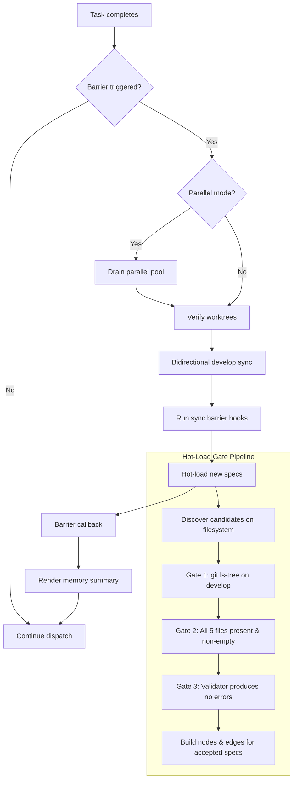

# Design Document: Sync Barrier Hardening

## Overview

This design hardens the sync barrier by adding a structured entry sequence
(parallel drain, worktree verification, bidirectional develop sync) and a
three-gate validation pipeline for spec hot-loading (git-tracked, complete,
lint-clean). All changes are confined to the orchestrator engine layer and
the hot-load module — no CLI or configuration changes are required.

## Architecture



### Module Responsibilities

1. **`engine/engine.py` — Orchestrator**: Owns the barrier trigger logic.
   Modified to drain the parallel pool and call the new barrier entry steps.
2. **`engine/barrier.py`** (new): Encapsulates barrier entry operations —
   worktree verification and bidirectional develop sync. Keeps engine.py thin.
3. **`engine/hot_load.py`**: Extended with the three-gate pipeline. The
   `discover_new_specs` function gains git-tracking, completeness, and lint
   filters.
4. **`workspace/develop.py`**: Reused as-is for pull sync. Push logic added
   as a new `push_develop_to_remote` function (extracted from harvest.py's
   `_push_develop_if_pushable` for reuse).

## Components and Interfaces

### `engine/barrier.py` (new module)

```python
async def verify_worktrees(repo_root: Path) -> list[Path]:
    """Scan .agent-fox/worktrees/ for orphaned directories.

    Returns list of orphaned paths (empty if none found).
    Logs a warning per orphaned path.
    """

async def sync_develop_bidirectional(repo_root: Path) -> None:
    """Pull remote into local develop, then push local to origin.

    Acquires MergeLock for the entire operation.
    Logs warnings on failure but does not raise.
    """
```

### `engine/hot_load.py` (modified functions)

```python
async def is_spec_tracked_on_develop(
    repo_root: Path,
    spec_name: str,
    specs_dir_rel: str = ".specs",
) -> bool:
    """Check if a spec folder is tracked by git on the develop branch.

    Uses `git ls-tree develop -- .specs/{spec_name}` and returns True
    if any entries are found.
    """

def is_spec_complete(spec_path: Path) -> tuple[bool, list[str]]:
    """Check if all 5 required files exist and are non-empty.

    Returns (passed, missing_or_empty_files).
    """

def lint_spec_gate(spec_name: str, spec_path: Path) -> tuple[bool, list[str]]:
    """Run the spec validator and check for error-severity findings.

    Returns (passed, error_messages).
    """

async def discover_new_specs_gated(
    specs_dir: Path,
    known_specs: set[str],
    repo_root: Path,
) -> list[SpecInfo]:
    """Discover new specs that pass all three gates.

    1. Filesystem discovery (existing behavior)
    2. Filter: git-tracked on develop
    3. Filter: all 5 files present and non-empty
    4. Filter: no lint errors

    Returns only specs that pass all gates.
    """
```

### `engine/engine.py` (modified methods)

```python
# Orchestrator._run_sync_barrier_if_needed becomes async
async def _run_sync_barrier_if_needed(self, state: ExecutionState) -> None:
    """Check and run sync barrier actions if triggered.

    New sequence:
    1. (Parallel drain handled by caller in _dispatch_parallel)
    2. Verify worktrees
    3. Bidirectional develop sync
    4. Run sync barrier hooks
    5. Hot-load new specs (with gated discovery)
    6. Barrier callback (knowledge ingestion)
    7. Regenerate memory summary
    """
```

### Parallel Drain in `_dispatch_parallel`

The parallel dispatch loop is modified so that when a barrier is triggered,
instead of running the barrier inline and then filling new pool slots, it:

1. Waits for all remaining tasks in `pool` via `asyncio.wait(pool)`.
2. Processes all results.
3. Runs the barrier.
4. Then resumes filling the pool.

## Data Models

No new data models, configuration keys, or persistent state. The gate pipeline
is stateless by design (51-REQ-7.2).

## Operational Readiness

### Observability

- Orphaned worktree warnings are logged at WARNING level.
- Develop sync failures are logged at WARNING level.
- Each gate skip is logged with spec name and reason:
  - Git-tracked gate: DEBUG level (common for WIP specs).
  - Completeness gate: INFO level (actionable — user should add missing files).
  - Lint gate: WARNING level (actionable — user should fix errors).
- Existing `sync.barrier` audit event payload is extended with new fields:
  `orphaned_worktrees`, `develop_sync_status`, `specs_skipped`.

### Rollout

No feature flag needed. The new gates are strictly additive — they can only
reject specs that would have been accepted before. The parallel drain and
develop sync are correctness improvements that should always be active.

### Migration

No migration required. No configuration changes. Existing `hot_load` config
flag (`orchestrator.hot_load`) still controls whether hot-loading runs at all.

## Correctness Properties

### Property 1: Parallel Drain Completeness

*For any* set of in-flight parallel tasks at barrier trigger time, the
orchestrator SHALL have an empty parallel pool and all session results
processed before any barrier operation begins.

**Validates: Requirements 51-REQ-1.1, 51-REQ-1.2, 51-REQ-1.3**

### Property 2: Worktree Verification Safety

*For any* state of the `.agent-fox/worktrees/` directory (including
non-existent), the worktree verification step SHALL complete without raising
an exception and SHALL return a (possibly empty) list of orphaned paths.

**Validates: Requirements 51-REQ-2.1, 51-REQ-2.2, 51-REQ-2.3, 51-REQ-2.E1**

### Property 3: Develop Sync Non-Blocking

*For any* combination of fetch/pull/push outcomes (success, network error,
merge conflict, missing remote), the bidirectional develop sync SHALL
complete without raising an exception and SHALL not block the barrier
sequence.

**Validates: Requirements 51-REQ-3.1, 51-REQ-3.2, 51-REQ-3.E1, 51-REQ-3.E2,
51-REQ-3.E3**

### Property 4: Gate Pipeline Monotonic Filtering

*For any* set of candidate specs discovered on the filesystem, the gated
discovery function SHALL return a subset (possibly empty) of those
candidates, where every returned spec satisfies all three gates
(git-tracked, complete, lint-clean).

**Validates: Requirements 51-REQ-4.1, 51-REQ-5.1, 51-REQ-6.1, 51-REQ-7.1**

### Property 5: Git-Tracked Gate Correctness

*For any* spec folder name, `is_spec_tracked_on_develop` SHALL return True
if and only if `git ls-tree develop -- .specs/{name}` produces at least one
entry, and False otherwise. On git command failure, it SHALL return True
(fallback to permissive).

**Validates: Requirements 51-REQ-4.1, 51-REQ-4.2, 51-REQ-4.E1**

### Property 6: Completeness Gate Correctness

*For any* spec folder path, `is_spec_complete` SHALL return `(True, [])`
if and only if all five required files exist and have size > 0. Otherwise
it SHALL return `(False, [list of missing or empty filenames])`.

**Validates: Requirements 51-REQ-5.1, 51-REQ-5.2, 51-REQ-5.E1**

### Property 7: Lint Gate Correctness

*For any* spec that passes completeness, `lint_spec_gate` SHALL return
`(True, [])` if and only if `validate_specs` produces zero findings with
severity `error` for that spec. On validator exception, it SHALL return
`(False, [error description])`.

**Validates: Requirements 51-REQ-6.1, 51-REQ-6.2, 51-REQ-6.3, 51-REQ-6.E1**

### Property 8: Stateless Re-evaluation

*For any* spec that was skipped at barrier N, the gate pipeline at
barrier N+1 SHALL evaluate it from scratch with no knowledge of the
prior skip — the outcome depends solely on the spec's current state on
disk and in git.

**Validates: Requirements 51-REQ-7.1, 51-REQ-7.2, 51-REQ-7.3**

## Error Handling

| Error Condition | Behavior | Requirement |
|----------------|----------|-------------|
| SIGINT during parallel drain | Cancel drain, proceed to shutdown | 51-REQ-1.E2 |
| `.agent-fox/worktrees/` missing | Treat as no orphans, proceed | 51-REQ-2.E1 |
| Fetch/pull sync fails | Log warning, skip push, proceed | 51-REQ-3.E1 |
| Push to origin fails | Log warning, proceed | 51-REQ-3.E2 |
| No `origin` remote | Skip develop sync entirely | 51-REQ-3.E3 |
| `git ls-tree` fails | Fall back to filesystem discovery | 51-REQ-4.E1 |
| Required spec file empty | Treat as incomplete, skip spec | 51-REQ-5.E1 |
| Validator exception | Skip spec with warning | 51-REQ-6.E1 |

## Technology Stack

- Python 3.12+, asyncio
- Git CLI (subprocess via `run_git`)
- Existing modules: `workspace/develop.py`, `workspace/merge_lock.py`,
  `spec/validator.py`, `spec/discovery.py`

## Definition of Done

A task group is complete when ALL of the following are true:

1. All subtasks within the group are checked off (`[x]`)
2. All spec tests (`test_spec.md` entries) for the task group pass
3. All property tests for the task group pass
4. All previously passing tests still pass (no regressions)
5. No linter warnings or errors introduced
6. Code is committed on a feature branch and pushed to remote
7. Feature branch is merged back to `develop`
8. `tasks.md` checkboxes are updated to reflect completion

## Testing Strategy

- **Unit tests**: Mock `run_git`, filesystem operations, and the validator to
  test each gate function in isolation.
- **Property tests**: Use Hypothesis to generate arbitrary combinations of
  spec states (tracked/untracked, complete/incomplete, lint-clean/errors) and
  verify the gate pipeline's monotonic filtering property.
- **Integration tests**: Not required — the barrier is tested end-to-end via
  orchestrator integration tests in the existing test suite. The new functions
  are pure enough to test at the unit level.
