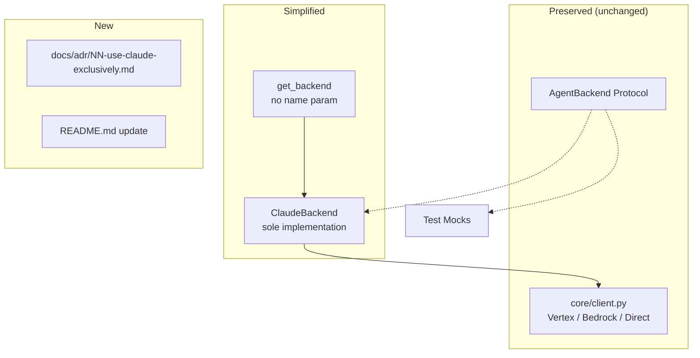

# Design Document: Claude-Only Commitment

## Overview

This spec removes dead extensibility from the backend layer, creates an ADR
documenting the Claude-only decision, and updates user-facing documentation.
The `AgentBackend` protocol is preserved for test mock injection. The
platform-aware client factory (Vertex/Bedrock/direct) is preserved — these
are Claude delivery channels, not alternative providers.

## Architecture



### Module Responsibilities

1. **`agent_fox/session/backends/__init__.py`** — Simplified `get_backend()`
   with no name parameter; returns `ClaudeBackend()` directly.
2. **`agent_fox/session/backends/protocol.py`** — Updated docstring on
   `AgentBackend` clarifying it exists for test injection only.
3. **`docs/adr/NN-use-claude-exclusively.md`** — New ADR.
4. **`README.md`** — Updated overview section.

## Components and Interfaces

### Backend Factory (simplified)

```python
def get_backend() -> AgentBackend:
    """Return the ClaudeBackend.

    Agent-fox uses Claude exclusively for all coding agent workloads.
    This function exists to centralise backend instantiation and support
    future configuration (e.g., connection pooling), not to dispatch
    between providers.

    The AgentBackend protocol is preserved for test mock injection.
    """
    from agent_fox.session.backends.claude import ClaudeBackend
    return ClaudeBackend()
```

### Call-Site Updates

All existing call sites pass `get_backend("claude")`. These must be updated
to `get_backend()` (no argument). Known call sites:

- `agent_fox/session/session.py:run_session()` — `get_backend("claude")`

### ADR Structure

```
docs/adr/NN-use-claude-exclusively.md

# NN. Use Claude Exclusively for Coding Agents

## Status
Accepted

## Context
...

## Decision
Agent-fox uses Claude (via Anthropic API, Vertex AI, or Bedrock) as the
exclusive LLM provider for all coding agent archetypes...

## Consequences
- Positive: Simplified codebase, no multi-provider maintenance burden...
- Negative: Cannot use cheaper/faster models from other providers...
- Future: Non-coding tasks (embeddings, summarisation) may use other
  providers under a separate decision...
```

## Data Models

No data model changes.

## Operational Readiness

- **Rollout:** No runtime behavior changes. Documentation and dead-code
  removal only.
- **Rollback:** Revert the commit.
- **Migration:** No data migration needed.

## Correctness Properties

### Property 1: Factory Return Type

*For any* invocation of `get_backend()`, the returned object SHALL be an
instance of `ClaudeBackend` and SHALL satisfy `isinstance(result, AgentBackend)`.

**Validates: Requirements 55-REQ-2.1, 55-REQ-3.1**

### Property 2: No Name Parameter

*For any* call to `get_backend()`, the function SHALL accept zero positional
arguments and zero keyword arguments (no `name` parameter exists).

**Validates: Requirements 55-REQ-2.1, 55-REQ-2.2**

### Property 3: Protocol Exportability

*For any* import of `AgentBackend` from `agent_fox.session.backends`, the
imported symbol SHALL be a runtime-checkable Protocol class.

**Validates: Requirements 55-REQ-3.1, 55-REQ-3.E1**

### Property 4: ADR Existence

*For any* listing of `docs/adr/`, there SHALL exist exactly one file matching
the pattern `*-use-claude-exclusively*.md`.

**Validates: Requirements 55-REQ-1.1, 55-REQ-1.2, 55-REQ-1.3**

## Error Handling

| Error Condition | Behavior | Requirement |
|----------------|----------|-------------|
| ADR number collision | Use next available number | 55-REQ-1.E1 |

## Technology Stack

- Python 3.12+
- `claude_code_sdk` (unchanged)
- Markdown (ADR, README)

## Definition of Done

A task group is complete when ALL of the following are true:

1. All subtasks within the group are checked off (`[x]`)
2. All spec tests (`test_spec.md` entries) for the task group pass
3. All property tests for the task group pass
4. All previously passing tests still pass (no regressions)
5. No linter warnings or errors introduced
6. Code is committed on a feature branch and pushed to remote
7. Feature branch is merged back to `develop`
8. `tasks.md` checkboxes are updated to reflect completion

## Testing Strategy

- **Unit tests:** Verify `get_backend()` returns `ClaudeBackend`, has no
  parameters, and result satisfies `AgentBackend` protocol.
- **Property tests:** Verify factory return type invariants.
- **Integration tests:** Verify no call site passes a name argument (static
  analysis via grep or AST inspection).
