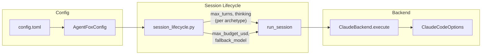
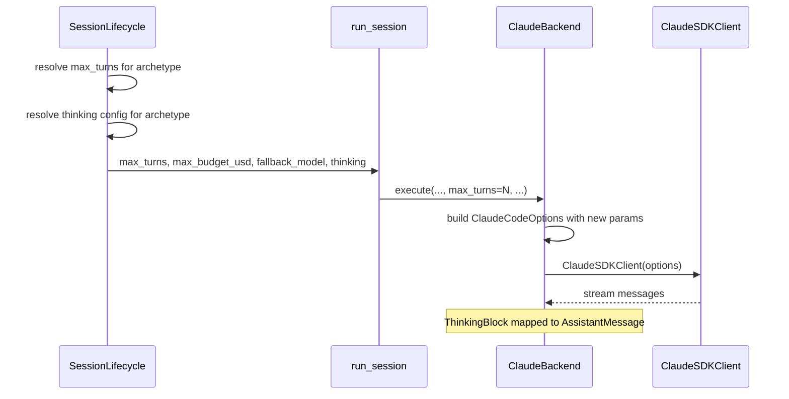

# Design Document: Claude SDK Feature Adoption

## Overview

This spec wires four `ClaudeCodeOptions` parameters through agent-fox's
configuration and session execution layers: `max_turns`, `max_budget_usd`,
`fallback_model`, and `thinking`. Each parameter is configurable via
`config.toml` with sensible defaults, and flows from config through the
session lifecycle into `ClaudeBackend.execute()`.

## Architecture





### Module Responsibilities

1. **`agent_fox/core/config.py`** — New config fields: `archetypes.max_turns`,
   `archetypes.thinking`, `orchestrator.max_budget_usd`, `models.fallback_model`.
2. **`agent_fox/session/archetypes.py`** — Default `max_turns` and `thinking`
   values per archetype in the registry.
3. **`agent_fox/session/backends/protocol.py`** — Extended `execute()` signature
   with optional `max_turns`, `max_budget_usd`, `fallback_model`, `thinking`.
4. **`agent_fox/session/backends/claude.py`** — Forward new parameters to
   `ClaudeCodeOptions`.
5. **`agent_fox/session/session.py`** — Pass resolved parameters from config
   through to `backend.execute()`.
6. **`agent_fox/engine/session_lifecycle.py`** — Resolve per-archetype
   `max_turns` and `thinking` from config, pass to `run_session()`.

## Components and Interfaces

### Config Schema Additions

```toml
# config.toml additions

[orchestrator]
max_budget_usd = 2.0          # USD per session, 0 = unlimited

[models]
fallback_model = "claude-sonnet-4-6"  # empty string = no fallback

[archetypes.max_turns]
coder = 200
oracle = 50
skeptic = 50
verifier = 75
auditor = 50
librarian = 100
cartographer = 100
coordinator = 30

[archetypes.thinking.coder]
mode = "adaptive"
budget_tokens = 10000

# All other archetypes default to mode = "disabled"
```

### Pydantic Config Model Extensions

```python
class ThinkingConfig(BaseModel):
    mode: Literal["enabled", "adaptive", "disabled"] = "disabled"
    budget_tokens: int = Field(default=10000, ge=0)

    @model_validator(mode="after")
    def validate_budget(self) -> Self:
        if self.mode == "enabled" and self.budget_tokens <= 0:
            raise ValueError("budget_tokens must be > 0 when mode is 'enabled'")
        return self

class ArchetypeConfig(BaseModel):
    # ... existing fields ...
    max_turns: dict[str, int] = Field(default_factory=dict)
    thinking: dict[str, ThinkingConfig] = Field(default_factory=dict)

class OrchestratorConfig(BaseModel):
    # ... existing fields ...
    max_budget_usd: float = Field(default=2.0, ge=0.0)

class ModelsConfig(BaseModel):
    # ... existing fields ...
    fallback_model: str = "claude-sonnet-4-6"
```

### ArchetypeEntry Defaults

```python
# In archetypes.py — new fields on ArchetypeEntry
@dataclass(frozen=True)
class ArchetypeEntry:
    # ... existing fields ...
    default_max_turns: int = 200
    default_thinking_mode: str = "disabled"
    default_thinking_budget: int = 10000
```

Default values per archetype:

| Archetype | max_turns | thinking_mode | thinking_budget |
|-----------|----------|---------------|-----------------|
| coder | 200 | adaptive | 10000 |
| oracle | 50 | disabled | 10000 |
| skeptic | 50 | disabled | 10000 |
| verifier | 75 | disabled | 10000 |
| auditor | 50 | disabled | 10000 |
| librarian | 100 | disabled | 10000 |
| cartographer | 100 | disabled | 10000 |
| coordinator | 30 | disabled | 10000 |

### Extended AgentBackend Protocol

```python
class AgentBackend(Protocol):
    async def execute(
        self,
        prompt: str,
        *,
        system_prompt: str,
        model: str,
        cwd: str,
        permission_callback: PermissionCallback | None = None,
        tools: list[ToolDefinition] | None = None,
        # New optional parameters
        max_turns: int | None = None,
        max_budget_usd: float | None = None,
        fallback_model: str | None = None,
        thinking: dict[str, Any] | None = None,
    ) -> AsyncIterator[AgentMessage]: ...
```

### ClaudeBackend Changes

```python
# In claude.py — updated execute() and _stream_messages()
options = ClaudeCodeOptions(
    cwd=cwd,
    model=model,
    system_prompt=system_prompt,
    permission_mode="bypassPermissions",
    can_use_tool=can_use_tool,
    mcp_servers=mcp_servers,
    # New parameters (only passed when not None)
    **({"max_turns": max_turns} if max_turns else {}),
    **({"max_budget_usd": max_budget_usd} if max_budget_usd else {}),
    **({"fallback_model": fallback_model} if fallback_model else {}),
    **({"thinking": thinking} if thinking else {}),
)
```

### ThinkingBlock Mapping

When extended thinking is enabled, the SDK returns `ThinkingBlock` objects
within `AssistantMessage.content`. The existing `_map_message()` already
handles non-tool-use blocks by emitting a generic `AssistantMessage(content="")`.

Enhancement: extract thinking text when available:

```python
# In _map_message(), when processing AssistantMessage content blocks:
from claude_code_sdk.types import ThinkingBlock

for block in message.content:
    if isinstance(block, ThinkingBlock):
        results.append(AssistantMessage(content=f"[thinking] {block.thinking}"))
    elif isinstance(block, ToolUseBlock):
        ...
```

### Resolution Flow in session_lifecycle.py

```python
def _resolve_max_turns(config: AgentFoxConfig, archetype: str) -> int | None:
    """Resolve max_turns: config override > archetype default."""
    configured = config.archetypes.max_turns.get(archetype)
    if configured is not None:
        return configured if configured > 0 else None  # 0 = unlimited
    entry = get_archetype(archetype)
    return entry.default_max_turns

def _resolve_thinking(config: AgentFoxConfig, archetype: str) -> dict | None:
    """Resolve thinking config: config override > archetype default."""
    configured = config.archetypes.thinking.get(archetype)
    if configured is not None:
        if configured.mode == "disabled":
            return None
        return {"type": configured.mode, "budget_tokens": configured.budget_tokens}
    entry = get_archetype(archetype)
    if entry.default_thinking_mode == "disabled":
        return None
    return {"type": entry.default_thinking_mode, "budget_tokens": entry.default_thinking_budget}
```

## Data Models

No persistent data model changes. All new configuration is in-memory via
Pydantic models loaded from `config.toml`.

## Operational Readiness

- **Observability:** `max_turns` and `max_budget_usd` are logged at session
  start. Thinking mode is included in session audit events.
- **Rollout:** Feature is additive. Defaults match current behavior except
  for `max_turns` (previously unlimited) and `max_budget_usd` (previously
  uncapped). The defaults are generous enough to not disrupt existing use.
- **Rollback:** Remove config entries; defaults restore current behavior
  (except `max_turns` defaults which are new safety nets).
- **Compatibility:** If the installed `claude_code_sdk` version does not
  support a parameter, a `TypeError` is caught and the parameter is
  omitted with a warning log.

## Correctness Properties

### Property 1: Turn Limit Passthrough

*For any* archetype with a configured `max_turns` > 0, the `ClaudeCodeOptions`
constructed for that session SHALL include `max_turns` equal to the configured
value.

**Validates: Requirements 56-REQ-1.1, 56-REQ-1.2**

### Property 2: Turn Limit Zero Means Unlimited

*For any* archetype with `max_turns` configured as 0, the `ClaudeCodeOptions`
constructed for that session SHALL NOT include the `max_turns` parameter.

**Validates: Requirement 56-REQ-1.4**

### Property 3: Budget Cap Passthrough

*For any* session with `max_budget_usd` > 0, the `ClaudeCodeOptions`
constructed SHALL include `max_budget_usd` equal to the configured value.

**Validates: Requirements 56-REQ-2.1, 56-REQ-2.2**

### Property 4: Fallback Model Passthrough

*For any* session with a non-empty `fallback_model`, the `ClaudeCodeOptions`
constructed SHALL include `fallback_model` equal to the configured value.

**Validates: Requirements 56-REQ-3.1, 56-REQ-3.2**

### Property 5: Thinking Config Passthrough

*For any* archetype with thinking `mode` != `disabled`, the
`ClaudeCodeOptions` constructed SHALL include a `thinking` dict with `type`
matching the configured mode and `budget_tokens` matching the configured
budget.

**Validates: Requirements 56-REQ-4.1, 56-REQ-4.2**

### Property 6: Default Resolution Precedence

*For any* archetype, the resolution order SHALL be: config.toml override >
archetype registry default > omit parameter. Config values always win over
archetype defaults.

**Validates: Requirement 56-REQ-5.1**

### Property 7: Validation Rejects Invalid Config

*For any* configuration with `max_turns` < 0, `max_budget_usd` < 0, or
`thinking.mode` not in `{enabled, adaptive, disabled}`, the system SHALL
raise a validation error before session execution begins.

**Validates: Requirements 56-REQ-1.E1, 56-REQ-2.E2, 56-REQ-4.E1, 56-REQ-4.E2**

### Property 8: SDK Compatibility Fallback

*For any* `TypeError` raised when constructing `ClaudeCodeOptions` with a
new parameter, the system SHALL retry construction without the unsupported
parameter and log a warning.

**Validates: Requirement 56-REQ-5.E1**

## Error Handling

| Error Condition | Behavior | Requirement |
|----------------|----------|-------------|
| Negative max_turns | Validation error at config load | 56-REQ-1.E1 |
| Zero max_budget_usd | Treat as unlimited | 56-REQ-2.E1 |
| Negative max_budget_usd | Validation error at config load | 56-REQ-2.E2 |
| Unknown fallback_model | Log warning, pass to SDK anyway | 56-REQ-3.E1 |
| Invalid thinking mode | Validation error at config load | 56-REQ-4.E1 |
| Zero budget_tokens with enabled | Validation error at config load | 56-REQ-4.E2 |
| SDK TypeError on new param | Omit param, log warning, retry | 56-REQ-5.E1 |

## Technology Stack

- Python 3.12+
- `claude_code_sdk` (existing dependency)
- Pydantic v2 (existing dependency for config models)
- TOML (existing config format)

## Definition of Done

A task group is complete when ALL of the following are true:

1. All subtasks within the group are checked off (`[x]`)
2. All spec tests (`test_spec.md` entries) for the task group pass
3. All property tests for the task group pass
4. All previously passing tests still pass (no regressions)
5. No linter warnings or errors introduced
6. Code is committed on a feature branch and pushed to remote
7. Feature branch is merged back to `develop`
8. `tasks.md` checkboxes are updated to reflect completion

## Testing Strategy

- **Unit tests:** Verify config parsing, default resolution, parameter
  passthrough to `ClaudeCodeOptions`, validation error cases.
- **Property tests:** Verify resolution precedence invariants, validation
  rejection invariants, passthrough equivalence.
- **Integration tests:** Verify end-to-end flow from config.toml through
  `run_session()` to `ClaudeBackend.execute()` using a mock backend.
