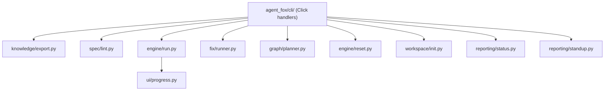

# Design Document: CLI Separation and Logging Improvements

## Overview

This spec refactors the CLI layer to enforce a strict boundary between Click
handlers (argument parsing, output formatting, exit codes) and backing modules
(business logic). It also renames two commands and improves progress logging
during orchestrated execution.

## Architecture



### Module Responsibilities

1. **`agent_fox/cli/*.py`** — Click command definitions. Parse arguments, call
   backing functions, format output, map results to exit codes. No business logic.
2. **`agent_fox/knowledge/export.py`** — Backing module for `export` command.
   Exports memory summaries and database dumps.
3. **`agent_fox/spec/lint.py`** — Backing module for `lint-specs` command.
   Orchestrates static + AI validation, applies fixes, returns structured results.
4. **`agent_fox/engine/run.py`** — Backing module for `code` command.
   Configures and runs the orchestrator, returns `ExecutionState`.
5. **`agent_fox/ui/progress.py`** — Progress display with archetype labels,
   retry/escalation event lines, and configurable truncation.

## Components and Interfaces

### Command Renames

```
agent-fox dump    → agent-fox export   (remove 'dump' entirely)
agent-fox lint-spec → agent-fox lint-specs (remove 'lint-spec' entirely)
```

In `app.py`:
```python
main.add_command(export_cmd, name="export")     # was "dump"
main.add_command(lint_specs_cmd, name="lint-specs")  # was "lint-spec"
```

### Backing Module Signatures

```python
# knowledge/export.py
def export_memory(
    conn: duckdb.DuckDBPyConnection,
    output_path: Path,
    *,
    json_mode: bool = False,
) -> ExportResult:
    """Export memory summary. Returns ExportResult(count, output_path)."""

def export_db(
    conn: duckdb.DuckDBPyConnection,
    output_path: Path,
    *,
    json_mode: bool = False,
) -> ExportResult:
    """Export all tables. Returns ExportResult(table_count, output_path)."""

@dataclass(frozen=True)
class ExportResult:
    count: int
    output_path: Path
```

```python
# spec/lint.py
def run_lint_specs(
    specs_dir: Path,
    *,
    ai: bool = False,
    fix: bool = False,
    lint_all: bool = False,
) -> LintResult:
    """Run spec linting. Returns findings, fix results, exit code."""

@dataclass(frozen=True)
class LintResult:
    findings: list[Finding]
    fix_results: list  # FixResult instances
    exit_code: int
```

```python
# engine/run.py
async def run_code(
    config: AgentFoxConfig,
    *,
    parallel: int | None = None,
    no_hooks: bool = False,
    max_cost: float | None = None,
    max_sessions: int | None = None,
    debug: bool = False,
    review_only: bool = False,
    specs_dir: Path | None = None,
    activity_callback: ActivityCallback | None = None,
    task_callback: TaskCallback | None = None,
) -> ExecutionState:
    """Configure and run the orchestrator. Returns final state."""
```

```python
# fix/runner.py (already mostly separated — formalize)
async def run_fix(
    config: AgentFoxConfig,
    issue_url: str,
    *,
    max_attempts: int = 3,
    auto_pr: bool = False,
) -> FixResult:
    """Run the fix loop for a GitHub issue."""
```

```python
# graph/planner.py (already mostly separated — formalize)
def run_plan(
    config: AgentFoxConfig,
    *,
    specs_dir: Path | None = None,
    force: bool = False,
) -> TaskGraph:
    """Build or rebuild the task graph."""
```

```python
# workspace/init_project.py (rename from init.py to avoid shadowing)
def init_project(
    path: Path,
    *,
    force: bool = False,
) -> InitResult:
    """Initialize agent-fox in a project directory."""
```

```python
# engine/reset.py (already exists — formalize)
def run_reset(
    target: str,
    config: AgentFoxConfig,
    *,
    soft: bool = False,
    specs_dir: Path | None = None,
) -> ResetResult:
    """Reset task state."""
```

```python
# reporting/status.py (already mostly separated)
def generate_status(config: AgentFoxConfig, ...) -> StatusReport: ...

# reporting/standup.py (already mostly separated)
def generate_standup(config: AgentFoxConfig, ...) -> StandupReport: ...
```

### Extended TaskEvent

```python
@dataclass(frozen=True, slots=True)
class TaskEvent:
    node_id: str
    status: str            # "completed" | "failed" | "blocked" |
                           # "retry" | "disagreed" | "escalated"
    duration_s: float
    error_message: str | None = None
    archetype: str | None = None          # NEW
    attempt: int | None = None            # NEW — retry attempt number
    escalated_from: str | None = None     # NEW — e.g. "STANDARD"
    escalated_to: str | None = None       # NEW — e.g. "ADVANCED"
    predecessor_node: str | None = None   # NEW — for disagreement lines
```

### Updated abbreviate_arg

```python
def abbreviate_arg(raw: str, max_len: int = 60) -> str:
    """Shorten a tool argument for display. Default limit: 60 chars."""
```

## Data Models

No new persistent data models. Changes are limited to in-memory event
dataclasses and function signatures.

## Operational Readiness

- **Observability**: All new task events are emitted through the existing
  `TaskCallback` interface, which feeds both the terminal display and audit
  events.
- **Rollout**: Breaking CLI rename. Users must update scripts that reference
  `dump` or `lint-spec`. Document in CHANGELOG.
- **Migration**: No data migration needed.

## Correctness Properties

### Property 1: Truncation Respects Limit

*For any* string input to `abbreviate_arg`, the returned string SHALL have
length ≤ `max_len` (default 60).

**Validates: 59-REQ-6.1, 59-REQ-6.2**

### Property 2: Archetype Always Present in Task Lines

*For any* `TaskEvent` with a non-None `archetype` field, the formatted task
line SHALL contain `[{archetype}]`.

**Validates: 59-REQ-7.1, 59-REQ-7.2, 59-REQ-7.3**

### Property 3: Event Line Format Correctness

*For any* `TaskEvent` with status `"retry"`, the formatted line SHALL contain
`retry #{attempt}`. If `escalated_from` is also set, the line SHALL also
contain `escalated:`.

**Validates: 59-REQ-8.1, 59-REQ-8.2, 59-REQ-8.3, 59-REQ-8.E1**

## Error Handling

| Error Condition | Behavior | Requirement |
|----------------|----------|-------------|
| Old command name used | Click "No such command" error | 59-REQ-1.E1, 59-REQ-1.E2 |
| Specs dir missing (from code) | `PlanError` raised | 59-REQ-3.E1 |
| KeyboardInterrupt during run_code | Return interrupted state | 59-REQ-4.E1 |
| No archetype in TaskEvent | Omit bracket label | 59-REQ-7.E1 |
| Retry without escalation | Omit escalation suffix | 59-REQ-8.E1 |

## Technology Stack

- Python 3.12+
- Click (CLI framework, already in use)
- Rich (terminal UI, already in use)
- Existing test infrastructure (pytest, hypothesis)

## Definition of Done

A task group is complete when ALL of the following are true:

1. All subtasks within the group are checked off (`[x]`)
2. All spec tests (`test_spec.md` entries) for the task group pass
3. All property tests for the task group pass
4. All previously passing tests still pass (no regressions)
5. No linter warnings or errors introduced
6. Code is committed on a feature branch and pushed to remote
7. Feature branch is merged back to `develop`
8. `tasks.md` checkboxes are updated to reflect completion

## Testing Strategy

- **Unit tests**: Verify each backing function returns correct results and
  raises correct errors for boundary inputs.
- **Property tests**: Verify truncation invariant (length ≤ max_len),
  archetype label presence, and event line format via hypothesis.
- **Integration tests**: Verify CLI commands produce expected output by
  invoking Click's test runner (`CliRunner`).
- **Regression**: The full test suite (`make check`) must pass after each
  task group.
