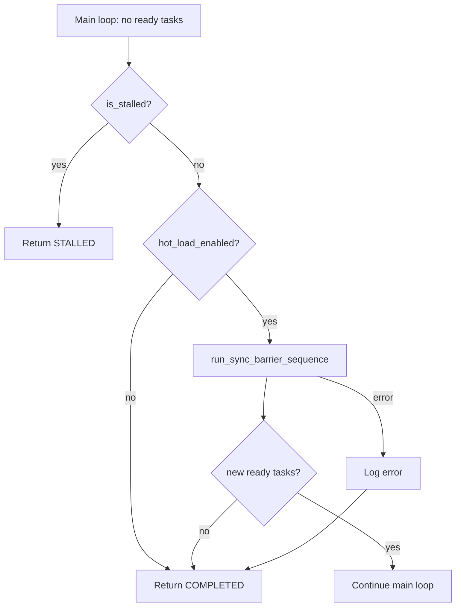

# Design Document: End-of-Run Spec Discovery

## Overview

This feature modifies the orchestrator's main loop termination logic so that,
before exiting with `RunStatus.COMPLETED`, it runs a full sync barrier sequence
to check for new specs. If new specs are discovered and hot-loaded, execution
continues. If not, the run terminates as before.

The change is minimal: a single new method on `Orchestrator` and a small
modification to the COMPLETED branch in `Orchestrator.run()`.

## Architecture



### Module Responsibilities

1. **`engine/engine.py` (`Orchestrator`)** — owns the main loop and the new
   end-of-run discovery method. This is the only module modified.
2. **`engine/barrier.py`** — provides `run_sync_barrier_sequence()`, reused
   as-is with no changes.
3. **`engine/hot_load.py`** — provides gated discovery and hot-load functions,
   reused as-is with no changes.
4. **`engine/state.py`** — provides `RunStatus` enum and `ExecutionState`,
   unchanged.

## Components and Interfaces

### New Method: `Orchestrator._try_end_of_run_discovery`

```python
async def _try_end_of_run_discovery(self, state: ExecutionState) -> bool:
    """Run a sync barrier at end-of-run to check for new specs.

    Returns True if new ready tasks were discovered (caller should
    continue the main loop). Returns False if no new work was found
    or if the barrier failed (caller should terminate).
    """
```

**Parameters:**
- `state` — the current `ExecutionState`, passed through to the barrier.

**Returns:**
- `True` — new tasks are ready; the main loop should continue.
- `False` — no new tasks; the run should terminate with COMPLETED.

**Behavior:**
1. Check `self._config.hot_load` — if `False`, return `False` immediately
   (60-REQ-1.E1).
2. Call `run_sync_barrier_sequence()` with the same parameters as
   `_run_sync_barrier_if_needed()` (60-REQ-3.1, 60-REQ-3.2, 60-REQ-3.3).
3. Wrap the barrier call in a try/except. On any exception, log the error
   and return `False` (60-REQ-1.E2).
4. After the barrier, call `self._graph_sync.ready_tasks()`.
5. If ready tasks exist, return `True` (60-REQ-1.2).
6. Otherwise, return `False` (60-REQ-1.3).

### Modified: `Orchestrator.run()` Main Loop

The COMPLETED branch (currently at lines 596-608) changes from:

```python
if not ready:
    if self._graph_sync.is_stalled():
        state.run_status = RunStatus.STALLED
        self._state_manager.save(state)
        return state

    state.run_status = RunStatus.COMPLETED
    self._state_manager.save(state)
    return state
```

To:

```python
if not ready:
    if self._graph_sync.is_stalled():
        state.run_status = RunStatus.STALLED
        self._state_manager.save(state)
        return state

    if await self._try_end_of_run_discovery(state):
        continue  # New specs found — re-enter the main loop

    state.run_status = RunStatus.COMPLETED
    self._state_manager.save(state)
    return state
```

The `continue` statement re-enters the `while True` loop, which will re-check
interruption, budget limits, and then call `ready_tasks()` again — picking up
any tasks added by the hot-loaded specs. This naturally satisfies 60-REQ-1.4
(repeat without limit) because the same code path executes each time tasks
complete.

### No Changes Required

- **STALLED, COST_LIMIT, SESSION_LIMIT, BLOCK_LIMIT, INTERRUPTED** — these
  terminal states all return before reaching the COMPLETED branch, so
  end-of-run discovery is never triggered for them (60-REQ-2.*).
- **`barrier.py`** — reused as-is. No interface changes.
- **`hot_load.py`** — reused as-is. No interface changes.
- **Configuration** — gated on existing `self._config.hot_load` flag. No new
  config fields.

## Data Models

No new data models. The feature reuses:
- `ExecutionState` from `engine/state.py`
- `RunStatus` enum from `engine/state.py`
- `OrchestratorConfig` from `engine/engine.py` (existing `hot_load: bool` field)

## Operational Readiness

### Observability

- End-of-run barrier execution emits the standard `SYNC_BARRIER` audit event
  via `run_sync_barrier_sequence()`.
- The new method logs at `info` level when attempting end-of-run discovery and
  when new specs are found.
- Barrier failures are logged at `error` level with the exception details.

### Rollout / Rollback

- Gated on existing `hot_load_enabled` config flag. Disabling hot-load
  disables end-of-run discovery — no separate rollback needed.
- No database migrations or schema changes.

## Correctness Properties

### Property 1: Discovery Only on COMPLETED

*For any* execution of the main loop, end-of-run discovery SHALL only be
attempted when no ready tasks remain AND the graph is not stalled.

**Validated by:** The `continue` / return structure in `run()`. STALLED returns
before the discovery check. COST_LIMIT, SESSION_LIMIT, BLOCK_LIMIT, and
INTERRUPTED all return at earlier points in the loop body.

**Linked requirements:** 60-REQ-2.1, 60-REQ-2.2, 60-REQ-2.3, 60-REQ-2.4

### Property 2: Hot-Load Gate Respected

*For any* end-of-run discovery attempt, if `hot_load_enabled` is `False`, the
system SHALL skip the barrier and return `False` without side effects.

**Validated by:** The guard clause at the top of `_try_end_of_run_discovery()`.

**Linked requirements:** 60-REQ-1.E1

### Property 3: Full Barrier Equivalence

*For any* end-of-run discovery invocation, the system SHALL execute the same
`run_sync_barrier_sequence()` function with the same parameters as mid-run
barriers.

**Validated by:** Code review — the barrier call in `_try_end_of_run_discovery()`
uses identical keyword arguments to `_run_sync_barrier_if_needed()`.

**Linked requirements:** 60-REQ-3.1, 60-REQ-3.2, 60-REQ-3.3

### Property 4: Graceful Failure

*For any* exception raised during the end-of-run barrier sequence, the system
SHALL log the error and terminate with COMPLETED status rather than crashing
or retrying.

**Validated by:** The try/except in `_try_end_of_run_discovery()` that catches
`Exception`, logs it, and returns `False`.

**Linked requirements:** 60-REQ-1.E2

### Property 5: Loop Continuation

*For any* end-of-run discovery that hot-loads new specs producing ready tasks,
the system SHALL re-enter the main loop and dispatch those tasks.

**Validated by:** The `continue` statement after `_try_end_of_run_discovery()`
returns `True`, which re-enters the `while True` loop.

**Linked requirements:** 60-REQ-1.2, 60-REQ-1.4

## Error Handling

| Error Condition | Behavior | Requirement |
|----------------|----------|-------------|
| `hot_load_enabled` is `False` | Skip discovery, return COMPLETED | 60-REQ-1.E1 |
| Barrier raises exception (git sync, I/O, etc.) | Log error, return COMPLETED | 60-REQ-1.E2 |
| Barrier succeeds but no new specs found | Return COMPLETED | 60-REQ-1.3 |
| Barrier succeeds, specs found but none pass gates | Return COMPLETED | 60-REQ-1.3 |

## Technology Stack

No new dependencies. Uses existing:
- Python 3.12+ with `asyncio`
- `run_sync_barrier_sequence()` from `engine/barrier.py`
- `logging` standard library module

## Definition of Done

A task group is complete when:

1. All tests from `test_spec.md` for the group's requirements pass.
2. `make check` passes (lint + all tests, no regressions).
3. Changes are committed with a conventional commit message.
4. The feature branch is pushed to `origin`.

## Testing Strategy

### Unit Tests

- Mock `run_sync_barrier_sequence` and `_graph_sync.ready_tasks()` to test
  the decision logic in `_try_end_of_run_discovery()`.
- Verify that `_try_end_of_run_discovery()` returns `True` when new tasks
  appear and `False` when they don't.
- Verify the hot-load gate (`hot_load_enabled=False` skips the barrier).
- Verify exception handling (barrier failure returns `False`, error is logged).

### Integration Tests

- Test the full main loop with a mock barrier that injects new specs on the
  first end-of-run discovery, then returns no specs on the second — verifying
  the loop continues once and then terminates.
- Verify that non-COMPLETED terminal states (STALLED, COST_LIMIT, etc.) do
  not trigger end-of-run discovery.

### Property Tests

- Property: For any sequence of barrier results (specs found / not found /
  error), the main loop always terminates (either by exhausting new specs or
  by encountering a non-COMPLETED state).
