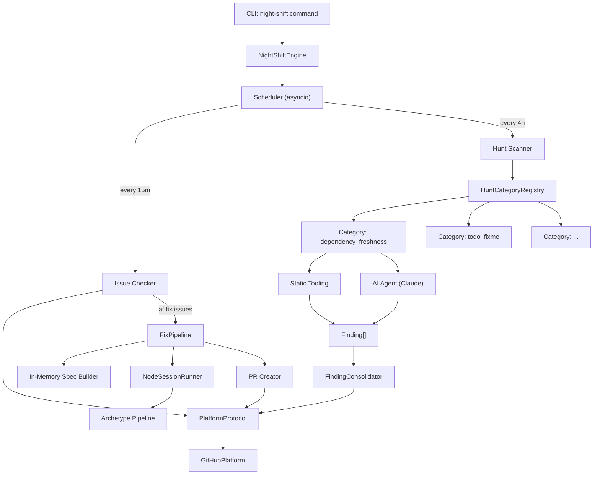
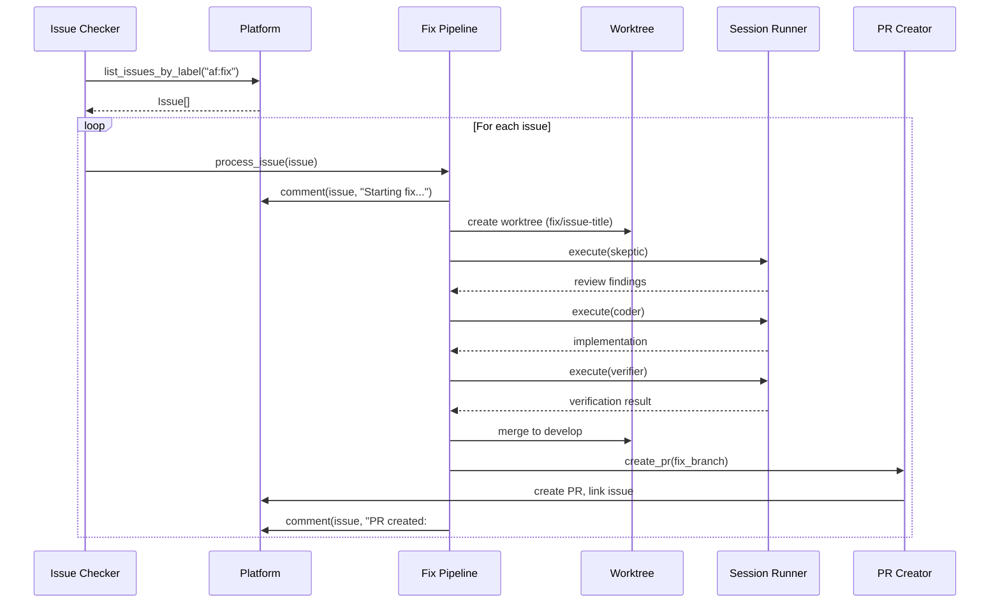

# Design Document: Night Shift -- Autonomous Maintenance Mode

## Overview

Night Shift adds a continuously-running maintenance daemon to agent-fox. It
orchestrates timed hunt scans and issue checks via an async event loop,
delegates detection to pluggable hunt category agents, reports findings as
platform issues, and drives fixes through the existing archetype pipeline.

The design introduces four new modules: the night-shift engine (daemon loop and
scheduling), the hunt system (category registry, finding format, detection
pipeline), a platform protocol (abstract forge operations), and configuration
extensions. It reuses the existing session lifecycle, archetype pipeline, and
knowledge store infrastructure.

## Architecture



### Data Flow: Fix Pipeline



### Module Responsibilities

1. **`agent_fox/nightshift/engine.py`** -- Daemon lifecycle: startup
   validation, async event loop, graceful shutdown, cost tracking.
2. **`agent_fox/nightshift/scheduler.py`** -- Timed task scheduling: issue
   check and hunt scan intervals, overlap prevention.
3. **`agent_fox/nightshift/hunt.py`** -- Hunt category registry, category
   interface, parallel dispatch, finding consolidation.
4. **`agent_fox/nightshift/categories/`** -- Built-in hunt category
   implementations (one module per category).
5. **`agent_fox/nightshift/finding.py`** -- Finding dataclass and
   standardised JSON format.
6. **`agent_fox/nightshift/fix_pipeline.py`** -- Issue-to-PR fix workflow:
   in-memory spec building, session dispatch, PR creation.
7. **`agent_fox/platform/protocol.py`** -- Platform protocol definition.
8. **`agent_fox/platform/github.py`** -- GitHub implementation (extended
   from existing).
9. **`agent_fox/core/config.py`** -- Configuration extensions for
   `[night_shift]` section.

## Components and Interfaces

### CLI Command

```python
@click.command("night-shift")
@click.option("--auto", is_flag=True, default=False,
              help="Auto-assign af:fix label to discovered issues")
@click.pass_context
def night_shift_cmd(ctx: click.Context, auto: bool) -> None: ...
```

### Core Data Types

```python
@dataclass(frozen=True)
class Finding:
    """Standardised output from a hunt category."""
    category: str          # Hunt category name
    title: str             # Short description
    description: str       # Detailed analysis
    severity: str          # "critical" | "major" | "minor" | "info"
    affected_files: list[str]
    suggested_fix: str     # Remediation approach
    evidence: str          # Static tool output or code snippets
    group_key: str         # Root-cause grouping key

@dataclass(frozen=True)
class FindingGroup:
    """A group of related findings for a single issue."""
    findings: list[Finding]
    title: str             # Issue title
    body: str              # Issue body (markdown)
    category: str          # Primary category

@dataclass
class NightShiftState:
    """Runtime state for the daemon."""
    total_cost: float = 0.0
    total_sessions: int = 0
    issues_created: int = 0
    issues_fixed: int = 0
    hunt_scans_completed: int = 0
    is_shutting_down: bool = False
```

### Hunt Category Interface

```python
class HuntCategory(Protocol):
    """Interface for pluggable hunt categories."""

    @property
    def name(self) -> str: ...

    @property
    def enabled_by_default(self) -> bool: ...

    async def detect(
        self,
        project_root: Path,
        config: AgentFoxConfig,
    ) -> list[Finding]: ...
```

### Platform Protocol

```python
@runtime_checkable
class PlatformProtocol(Protocol):
    """Abstract forge operations for issue and PR management."""

    async def create_issue(
        self, title: str, body: str, labels: list[str] | None = None,
    ) -> IssueResult: ...

    async def list_issues_by_label(
        self, label: str, state: str = "open",
    ) -> list[IssueResult]: ...

    async def add_issue_comment(
        self, issue_number: int, body: str,
    ) -> None: ...

    async def assign_label(
        self, issue_number: int, label: str,
    ) -> None: ...

    async def create_pr(
        self, branch: str, title: str, body: str,
    ) -> str: ...

    async def close(self) -> None: ...
```

### Night-Shift Engine

```python
class NightShiftEngine:
    def __init__(
        self,
        config: AgentFoxConfig,
        platform: PlatformProtocol,
        *,
        auto_fix: bool = False,
    ) -> None: ...

    async def run(self) -> NightShiftState:
        """Run the daemon loop until interrupted."""
        ...

    async def _run_issue_check(self) -> None: ...
    async def _run_hunt_scan(self) -> None: ...
    async def _process_fix(self, issue: IssueResult) -> None: ...
    def _check_cost_limit(self) -> bool: ...
```

### Fix Pipeline

```python
class FixPipeline:
    def __init__(
        self,
        config: AgentFoxConfig,
        platform: PlatformProtocol,
    ) -> None: ...

    async def process_issue(self, issue: IssueResult) -> FixResult: ...

    def build_in_memory_spec(
        self, issue: IssueResult, issue_body: str,
    ) -> InMemorySpec: ...
```

### Configuration Extension

```python
class NightShiftCategoryConfig(BaseModel):
    dependency_freshness: bool = True
    todo_fixme: bool = True
    test_coverage: bool = True
    deprecated_api: bool = True
    linter_debt: bool = True
    dead_code: bool = True
    documentation_drift: bool = True

class NightShiftConfig(BaseModel):
    issue_check_interval: int = Field(default=900, ge=60)
    hunt_scan_interval: int = Field(default=14400, ge=60)
    categories: NightShiftCategoryConfig = NightShiftCategoryConfig()
```

## Data Models

### Finding JSON Format

```json
{
  "category": "linter_debt",
  "title": "Unused imports in agent_fox/engine/",
  "description": "5 files contain unused imports ...",
  "severity": "minor",
  "affected_files": ["agent_fox/engine/engine.py", "..."],
  "suggested_fix": "Remove unused imports using ruff --fix",
  "evidence": "ruff output:\n...",
  "group_key": "unused-imports-engine"
}
```

### In-Memory Spec Structure

```python
@dataclass(frozen=True)
class InMemorySpec:
    """Lightweight spec for the fix engine."""
    issue_number: int
    title: str
    task_prompt: str       # Assembled prompt for session runner
    system_context: str    # Issue body + comments as context
    branch_name: str       # fix/{sanitised-title}
```

## Operational Readiness

### Observability

- All hunt scans, issue checks, and fix sessions emit audit events via the
  existing `SinkDispatcher`.
- New audit event types: `NIGHT_SHIFT_START`, `HUNT_SCAN_COMPLETE`,
  `ISSUE_CREATED`, `FIX_START`, `FIX_COMPLETE`, `FIX_FAILED`.
- Cost and session counts are tracked in `NightShiftState` and logged at each
  interval.

### Rollout Strategy

- Night-shift is an opt-in command; existing workflows are unaffected.
- Categories can be individually disabled via config.
- Cost control via existing `max_cost` / `max_sessions` limits.

### Migration/Compatibility

- The existing `GitHubPlatform` class is refactored to implement
  `PlatformProtocol`, adding `list_issues_by_label` and `assign_label`
  methods.
- The existing `fix` command remains functional but its quick-repair workflow
  is considered deprecated in favour of the investigation-based approach.

## Correctness Properties

### Property 1: Finding Format Universality

*For any* hunt category implementation and any valid project root, the
category's `detect()` method SHALL return a list where every element is a
valid `Finding` with all required fields populated.

**Validates: Requirements 3.3, 4.1, 4.2**

### Property 2: Schedule Interval Compliance

*For any* configured `issue_check_interval` and `hunt_scan_interval` >= 60
seconds, the scheduler SHALL invoke the corresponding callback at intervals
within 10% of the configured value (accounting for async scheduling jitter).

**Validates: Requirements 2.1, 2.2, 9.1**

### Property 3: Issue-Finding Bijection

*For any* set of findings produced by a hunt scan, the number of platform
issues created SHALL equal the number of finding groups after consolidation,
and every finding SHALL appear in exactly one group.

**Validates: Requirements 5.1, 5.2**

### Property 4: Fix Pipeline Completeness

*For any* issue processed by the fix pipeline that succeeds, the system SHALL
have created exactly one branch, executed at least one session, and created
exactly one PR referencing the issue number.

**Validates: Requirements 6.2, 7.1, 7.2**

### Property 5: Cost Monotonicity

*For any* sequence of operations during a night-shift run, the accumulated
cost in `NightShiftState.total_cost` SHALL be monotonically non-decreasing,
and the system SHALL stop dispatching new work once `total_cost >= max_cost`.

**Validates: Requirements 1.E2, 9.3**

### Property 6: Graceful Shutdown Completeness

*For any* SIGINT received during an active operation, the system SHALL
complete that operation before exiting, and the exit code SHALL be 0 for a
single SIGINT or 130 for a double SIGINT.

**Validates: Requirements 1.3, 1.4**

### Property 7: Category Isolation

*For any* hunt category that fails or times out during a scan, the remaining
categories SHALL still execute and produce their findings independently.

**Validates: Requirements 3.E1, 3.4**

### Property 8: Platform Protocol Substitutability

*For any* implementation of `PlatformProtocol`, the night-shift engine SHALL
function identically regardless of which concrete platform is used, provided
the implementation fulfils the protocol contract.

**Validates: Requirements 8.1, 8.2, 8.3**

## Error Handling

| Error Condition                         | Behavior                                              | Requirement  |
| --------------------------------------- | ----------------------------------------------------- | ------------ |
| Platform not configured                 | Abort with error message, exit code 1                 | 61-REQ-1.E1  |
| Access token missing                    | Abort with error message, exit code 1                 | 61-REQ-1.E1  |
| Cost limit reached                      | Log, stop dispatching, exit 0                         | 61-REQ-1.E2  |
| Platform API temporarily unavailable    | Log warning, retry next interval                      | 61-REQ-2.E1  |
| Hunt scan overlap                       | Skip overlapping scan, log info                       | 61-REQ-2.E2  |
| Hunt category agent failure/timeout     | Log, skip category, continue others                   | 61-REQ-3.E1  |
| No static tooling for category          | Proceed with AI-only analysis                         | 61-REQ-4.E1  |
| Issue creation API error                | Log failure with finding details, continue             | 61-REQ-5.E1  |
| Fix session failure after retries       | Comment on issue, move to next issue                  | 61-REQ-6.E1  |
| Issue body empty/insufficient           | Comment requesting detail, skip issue                 | 61-REQ-6.E2  |
| PR creation API error                   | Log, comment with branch name                         | 61-REQ-7.E1  |
| Unknown platform type                   | Abort with error listing supported types              | 61-REQ-8.E1  |
| Interval < 60 seconds                   | Clamp to 60, log warning                              | 61-REQ-9.E1  |

## Technology Stack

- **Language**: Python 3.12+
- **Async**: asyncio event loop for daemon scheduling
- **CLI**: Click (consistent with existing commands)
- **HTTP**: httpx (async) for platform REST API calls
- **AI Backend**: Claude SDK via existing `AgentBackend` protocol
- **Config**: Pydantic models, TOML parsing (existing infrastructure)
- **Storage**: DuckDB for audit events, existing knowledge store
- **Testing**: pytest, Hypothesis for property tests

## Definition of Done

A task group is complete when ALL of the following are true:

1. All subtasks within the group are checked off (`[x]`)
2. All spec tests (`test_spec.md` entries) for the task group pass
3. All property tests for the task group pass
4. All previously passing tests still pass (no regressions)
5. No linter warnings or errors introduced
6. Code is committed on a feature branch and pushed to remote
7. Feature branch is merged back to `develop`
8. `tasks.md` checkboxes are updated to reflect completion

## Testing Strategy

- **Unit tests**: Test each module in isolation -- finding format validation,
  config parsing, schedule timing, consolidation logic, in-memory spec
  building.
- **Property tests**: Validate correctness properties (finding format
  universality, cost monotonicity, issue-finding bijection, category
  isolation) using Hypothesis.
- **Integration tests**: Test the full pipeline with mocked platform and
  backend -- hunt scan to issue creation, issue check to PR creation.
