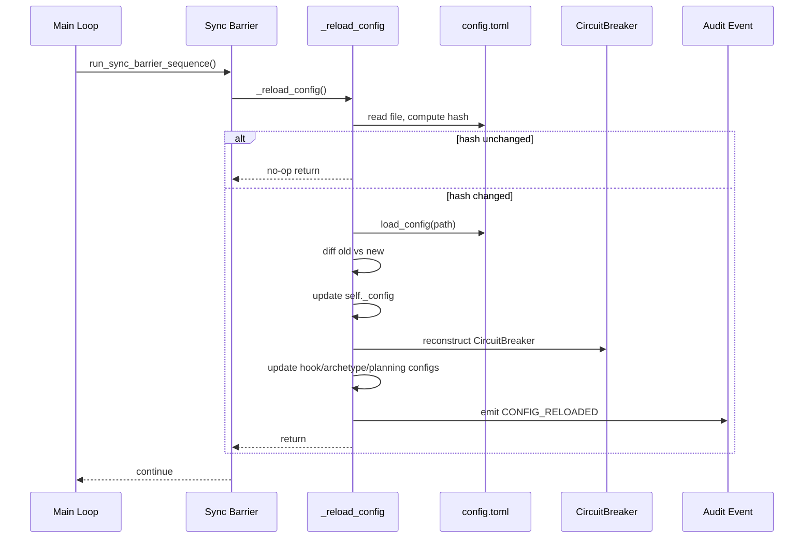

# Design Document: Configuration Hot-Reload at Sync Barriers

## Overview

Adds a `_reload_config` method to the `Orchestrator` that re-reads the
config file at each sync barrier, diffs against the current config,
applies safe changes, rebuilds the `CircuitBreaker`, warns about immutable
fields, and emits an audit event. A content hash avoids redundant parsing
when the file hasn't changed.

## Architecture



### Module Responsibilities

1. **`agent_fox/engine/engine.py`** — `Orchestrator._reload_config()`:
   core reload logic, config diffing, field updates, CircuitBreaker rebuild.
2. **`agent_fox/engine/barrier.py`** — `run_sync_barrier_sequence()`: calls
   the reload callback as a new step in the barrier sequence.
3. **`agent_fox/core/config.py`** — `load_config()`: unchanged, reused for
   reload.
4. **`agent_fox/knowledge/audit.py`** — `AuditEventType.CONFIG_RELOADED`:
   new event type.

## Components and Interfaces

### Orchestrator changes

```python
class Orchestrator:
    def __init__(
        self,
        config: OrchestratorConfig,
        ...,
        config_path: Path | None = None,     # NEW
        full_config: AgentFoxConfig | None = None,  # NEW — initial full config
    ) -> None:
        ...
        self._config_path = config_path
        self._config_hash: str = ""  # populated on first load
        self._full_config = full_config  # for diffing on reload

    def _reload_config(self) -> None:
        """Re-read config file and apply changes.

        Called at each sync barrier. No-op if file unchanged (hash match).
        On parse error, keeps current config and logs warning.
        """
        ...
```

### Barrier sequence change

```python
async def run_sync_barrier_sequence(
    ...,
    reload_config_fn: Callable[[], None] | None = None,  # NEW
) -> None:
    # ... existing steps 1-6 ...
    # Step 7: Reload configuration
    if reload_config_fn is not None:
        try:
            reload_config_fn()
        except Exception:
            logger.warning("Config reload failed at barrier", exc_info=True)
```

### Config diff utility

```python
def diff_configs(
    old: AgentFoxConfig,
    new: AgentFoxConfig,
) -> dict[str, dict[str, Any]]:
    """Compare two configs and return changed fields.

    Returns dict mapping "section.field" to {"old": ..., "new": ...}.
    Only includes fields whose values actually differ.
    """
```

### Audit event type

```python
class AuditEventType(str, Enum):
    ...
    CONFIG_RELOADED = "config.reloaded"
```

## Data Models

### CONFIG_RELOADED audit event payload

```json
{
  "changed_fields": {
    "orchestrator.max_cost": {"old": 50.0, "new": 100.0},
    "orchestrator.max_retries": {"old": 2, "new": 3},
    "hooks.post_session": {"old": [], "new": ["make lint"]}
  },
  "config_path": ".agent-fox/config.toml",
  "warnings": ["parallel changed from 2 to 4 — not applied mid-run"]
}
```

## Operational Readiness

- **Observability**: Config changes logged at INFO level. Immutable field
  warnings at WARNING. Parse errors at WARNING. Audit event for traceability.
- **Rollback**: Operator can revert config file edits at any time; the next
  barrier will pick up the reverted values.
- **Migration**: New `config_path` parameter on `Orchestrator.__init__` is
  optional (defaults to `None`, which disables reload). No breaking changes
  to existing callers.

## Correctness Properties

### Property 1: No-op on unchanged config

*For any* config file whose content hash matches the last loaded hash,
`_reload_config` SHALL not modify any orchestrator state and SHALL not
emit an audit event.

**Validates: Requirements 66-REQ-1.2, 66-REQ-6.E1**

### Property 2: All safe OrchestratorConfig fields are updated

*For any* valid config reload where at least one OrchestratorConfig field
changed, `_reload_config` SHALL update `self._config` such that all
mutable fields match the new config values.

**Validates: Requirements 66-REQ-2.1**

### Property 3: CircuitBreaker is reconstructed on reload

*For any* config reload where OrchestratorConfig changed,
`_reload_config` SHALL replace `self._circuit` with a new
`CircuitBreaker` constructed from the new `OrchestratorConfig`.

**Validates: Requirements 66-REQ-2.2**

### Property 4: Parallel is immutable mid-run

*For any* config reload where `parallel` differs, `_reload_config` SHALL
keep the original `parallel` value in `self._config` and
`self._is_parallel`, and SHALL log a warning.

**Validates: Requirements 66-REQ-3.1, 66-REQ-3.2**

### Property 5: Parse errors preserve current config

*For any* config file that fails to parse (invalid TOML, invalid field
types, I/O errors), `_reload_config` SHALL leave all orchestrator state
unchanged and SHALL log a warning.

**Validates: Requirements 66-REQ-5.1, 66-REQ-5.E1, 66-REQ-1.E1**

### Property 6: Audit event captures exact diff

*For any* config reload where at least one field changed, the emitted
`CONFIG_RELOADED` audit event payload SHALL contain exactly the set of
changed fields with their old and new values.

**Validates: Requirements 66-REQ-6.1, 66-REQ-6.2**

## Error Handling

| Error Condition | Behavior | Requirement |
|---|---|---|
| Config file missing at reload | Keep current config, log warning | 66-REQ-1.E1 |
| Invalid TOML in config file | Keep current config, log warning | 66-REQ-5.1 |
| Invalid field values | Keep current config, log warning | 66-REQ-5.1 |
| I/O error reading config | Keep current config, log warning | 66-REQ-5.E1 |
| Parallel value changed | Keep old value, log warning | 66-REQ-3.1 |
| sync_interval set to 0 | Stop future barriers (and reloads) | 66-REQ-2.E1 |

## Technology Stack

- Python 3.12+
- Pydantic v2 (config models, comparison)
- `hashlib` for content hashing
- Hypothesis for property tests
- pytest for unit tests

## Definition of Done

A task group is complete when ALL of the following are true:

1. All subtasks within the group are checked off (`[x]`)
2. All spec tests (`test_spec.md` entries) for the task group pass
3. All property tests for the task group pass
4. All previously passing tests still pass (no regressions)
5. No linter warnings or errors introduced
6. Code is committed on a feature branch and pushed to remote
7. Feature branch is merged back to `develop`
8. `tasks.md` checkboxes are updated to reflect completion

## Testing Strategy

- **Unit tests**: Mock `load_config` to return controlled configs, verify
  field updates, CircuitBreaker reconstruction, warning logs, audit events.
  Test no-op behavior with matching hashes.
- **Property tests**: Hypothesis-driven tests for config diffing correctness,
  immutable field preservation, error resilience, and audit event payload
  completeness.
- **Integration tests**: Not required — all changes are internal with mocked
  file I/O.
