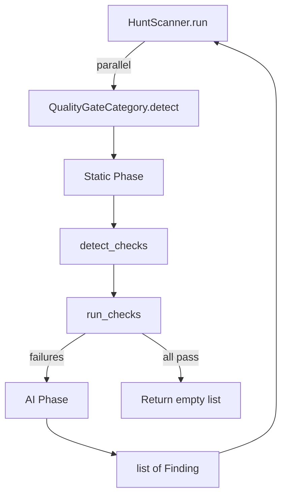

# Design Document: Quality Gate Hunt Category

## Overview

A new hunt category that discovers project quality checks from
configuration files, executes them, and uses AI analysis to produce
structured findings for each failing check. The category follows the
existing two-phase detection pattern (static tool + AI analysis) and
integrates into the hunt scanner as the eighth built-in category.

## Architecture



### Module Responsibilities

1. `agent_fox/nightshift/categories/quality_gate.py` -- `QualityGateCategory`
   class implementing the hunt category protocol.
2. `agent_fox/fix/checks.py` -- Reused as-is for `detect_checks()` and
   check execution logic. Not modified.
3. `agent_fox/nightshift/config.py` -- Extended with `quality_gate` toggle
   and `quality_gate_timeout` field.
4. `agent_fox/nightshift/categories/__init__.py` -- Extended to export
   `QualityGateCategory`.
5. `agent_fox/nightshift/hunt.py` -- Extended to register the new category.

## Components and Interfaces

### QualityGateCategory

```python
class QualityGateCategory(BaseHuntCategory):
    _name: str = "quality_gate"
    _prompt_template: str = QUALITY_GATE_PROMPT

    async def _run_static_tool(self, project_root: Path) -> str:
        """Detect and run quality checks, return formatted failure output."""
        ...

    async def _run_ai_analysis(
        self, project_root: Path, static_output: str,
    ) -> list[Finding]:
        """Analyse failure output with AI, return one Finding per check."""
        ...
```

### Static Phase Implementation

`_run_static_tool()`:
1. Call `detect_checks(project_root)` to discover checks.
2. If no checks found, return empty string (triggers zero findings).
3. Run each check using `subprocess.run()` with the configured timeout.
   This duplicates the run logic from `run_checks()` to support the
   configurable timeout (which differs from the fix module's hardcoded
   300s). The detection logic is reused as-is.
4. Collect `FailureRecord`-style results for failing checks.
5. Format failures into a structured string: one section per failing check
   with check name, category, exit code, and output (truncated to 8000
   chars per check to avoid token exhaustion).
6. Return empty string if all checks pass (triggers zero findings).

### AI Phase Implementation

`_run_ai_analysis()`:
1. If `static_output` is empty, return `[]` (all checks passed).
2. Send failure output to AI with a prompt requesting one structured
   finding per failing check.
3. Parse AI response as JSON array of finding objects.
4. Convert each to a `Finding` with:
   - `category`: `"quality_gate"`
   - `severity`: Mapped from `CheckCategory` (test/build -> critical,
     type -> major, lint -> minor)
   - `group_key`: `"quality_gate:{check_name}"`
   - `evidence`: Raw check output (truncated)
5. On AI failure, fall back to mechanical `Finding` generation.

### Severity Mapping

| CheckCategory | Finding Severity |
|---------------|-----------------|
| TEST          | critical        |
| BUILD         | critical        |
| TYPE          | major           |
| LINT          | minor           |

### AI Prompt

The prompt instructs the model to produce a JSON array with one object per
failing check:

```json
[
  {
    "check_name": "pytest",
    "title": "Short descriptive title",
    "description": "Root-cause analysis of the failure",
    "suggested_fix": "Actionable fix recommendation",
    "affected_files": ["path/to/file.py"]
  }
]
```

The category maps `check_name` back to the `CheckCategory` for severity
assignment. Fields not returned by the AI are filled with sensible defaults.

## Data Models

### Config Extensions

```python
class NightShiftCategoryConfig(BaseModel):
    # ... existing fields ...
    quality_gate: bool = True

class NightShiftConfig(BaseModel):
    # ... existing fields ...
    quality_gate_timeout: int = Field(
        default=600,
        description="Per-check timeout in seconds (minimum 60)",
    )
```

The `quality_gate_timeout` field uses the same clamping validator pattern
as the existing interval fields (minimum 60 seconds with warning log).

### Output Truncation

Check output included in the `evidence` field and sent to the AI prompt
is truncated to 8000 characters per check. This prevents token exhaustion
on verbose test output while preserving enough context for root-cause
analysis.

## Operational Readiness

- **Observability**: Logs at DEBUG level for check detection and execution,
  WARNING for failures and fallbacks. No new audit events required; the
  existing `night_shift.hunt_scan_complete` event covers findings from
  all categories including this one.
- **Rollout**: The category is enabled by default (`quality_gate: true`).
  Operators can disable it via config without restarting the daemon (via
  the existing config hot-reload mechanism).
- **Compatibility**: No changes to existing categories, Finding dataclass,
  or hunt scanner. The fix module's `checks.py` is imported but not
  modified.

## Correctness Properties

### Property 1: Silent on Green

*For any* project where all detected quality checks exit with code 0,
the quality_gate category SHALL return an empty findings list.

**Validates: Requirements 67-REQ-2.E2, 67-REQ-2.3**

### Property 2: One Finding per Failing Check

*For any* set of N failing checks (N >= 1), the quality_gate category
SHALL return exactly N findings, one per failing check.

**Validates: Requirements 67-REQ-3.2**

### Property 3: Severity Mapping Consistency

*For any* failing check with a known `CheckCategory`, the resulting
Finding's severity SHALL match the defined severity mapping (test/build
-> critical, type -> major, lint -> minor).

**Validates: Requirements 67-REQ-4.1, 67-REQ-4.2, 67-REQ-4.3, 67-REQ-4.4**

### Property 4: Graceful Degradation

*For any* AI backend failure during the analysis phase, the quality_gate
category SHALL still return one mechanically-generated Finding per
failing check (never zero findings when failures exist).

**Validates: Requirements 67-REQ-3.E1**

### Property 5: No Findings Without Checks

*For any* project where `detect_checks()` returns an empty list, the
quality_gate category SHALL return an empty findings list.

**Validates: Requirements 67-REQ-1.2**

### Property 6: Timeout Clamping

*For any* `quality_gate_timeout` value below 60, the config validator
SHALL clamp it to 60.

**Validates: Requirements 67-REQ-5.3**

## Error Handling

| Error Condition | Behavior | Requirement |
|----------------|----------|-------------|
| `detect_checks()` raises exception | Log warning, return [] | 67-REQ-1.E1 |
| Check subprocess times out | Record as failure with exit code -1 | 67-REQ-2.E1 |
| All checks pass | Return [] (silent) | 67-REQ-2.E2 |
| AI backend fails | Fall back to mechanical Finding | 67-REQ-3.E1 |
| AI returns unparseable JSON | Fall back to mechanical Finding | 67-REQ-3.E1 |
| Timeout config below 60 | Clamp to 60, log warning | 67-REQ-5.3 |

## Technology Stack

- Python 3.12+
- `subprocess` for check execution
- `agent_fox.fix.checks.detect_checks()` for check discovery
- Anthropic API (via `agent_fox.core.client`) for AI analysis
- `agent_fox.core.json_extraction.extract_json_array()` for response parsing
- Pydantic for config validation

## Definition of Done

A task group is complete when ALL of the following are true:

1. All subtasks within the group are checked off (`[x]`)
2. All spec tests (`test_spec.md` entries) for the task group pass
3. All property tests for the task group pass
4. All previously passing tests still pass (no regressions)
5. No linter warnings or errors introduced
6. Code is committed on a feature branch and pushed to remote
7. Feature branch is merged back to `develop`
8. `tasks.md` checkboxes are updated to reflect completion

## Testing Strategy

- **Unit tests**: Mock `detect_checks()`, `subprocess.run()`, and the AI
  client to test each phase in isolation. Verify Finding field values,
  severity mapping, and fallback behavior.
- **Property tests**: Use Hypothesis to generate random combinations of
  passing/failing checks and verify the one-finding-per-failure invariant,
  severity mapping consistency, and timeout clamping.
- **Integration tests**: None required; the category integrates via the
  existing `HuntCategory` protocol which is already integration-tested
  in spec 61.
