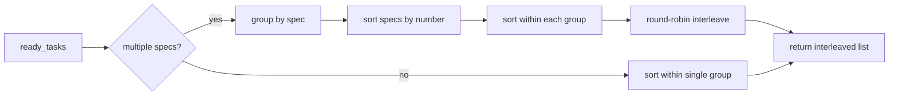

# Design Document: Spec-Fair Task Scheduling

## Overview

This spec modifies `GraphSync.ready_tasks()` to replace pure alphabetical (or
duration-descending) ordering with spec-fair round-robin interleaving. The
change is confined to a single method in `graph_sync.py` plus a new helper
function. No changes to dispatch logic, graph construction, or state management
are required.

## Architecture



### Module Responsibilities

1. **`graph_sync.py`** — `ready_tasks()` delegates to a new
   `_interleave_by_spec()` helper for the ordering step.
2. **`_interleave_by_spec()`** — Pure function: takes a list of node IDs and
   optional duration hints, returns a spec-fair-ordered list.

## Components and Interfaces

### Modified Interface

```python
# graph_sync.py — no signature change
class GraphSync:
    def ready_tasks(
        self,
        duration_hints: dict[str, int] | None = None,
    ) -> list[str]: ...
```

### New Helper Function

```python
def _interleave_by_spec(
    ready: list[str],
    duration_hints: dict[str, int] | None = None,
) -> list[str]:
    """Order ready tasks with spec-fair round-robin interleaving.

    1. Group tasks by spec name (everything before first ':' in node ID).
    2. Sort spec groups by spec number ascending (numeric prefix).
    3. Within each group, sort by duration descending (if hints), else
       alphabetically.
    4. Interleave across groups: take one from each spec per round.

    Args:
        ready: List of ready node IDs.
        duration_hints: Optional mapping of node_id → predicted duration ms.

    Returns:
        Spec-fair-ordered list of node IDs.
    """
```

### Spec Name Extraction

```python
def _spec_name(node_id: str) -> str:
    """Extract spec name from node ID (everything before first colon)."""
    idx = node_id.find(":")
    return node_id[:idx] if idx != -1 else node_id


def _spec_number(spec_name: str) -> tuple[int, str]:
    """Extract numeric prefix for sorting. Returns (number, name) tuple.

    Specs with numeric prefixes sort by number ascending.
    Specs without numeric prefixes sort after all numbered specs.
    """
    parts = spec_name.split("_", 1)
    try:
        return (int(parts[0]), spec_name)
    except (ValueError, IndexError):
        return (float('inf'), spec_name)  # type: ignore[return-value]
```

## Data Models

No new data models. The function operates on existing `list[str]` and
`dict[str, int]` types.

## Operational Readiness

- **Observability:** No new logging needed — the returned list is already
  logged by the dispatch methods.
- **Rollout:** The change is internal to `ready_tasks()` ordering. No
  configuration flag needed — the new behavior is strictly better than
  alphabetical.
- **Migration:** No state migration. The ordering change is stateless.

## Correctness Properties

### Property 1: Fairness Guarantee

*For any* set of ready tasks spanning N > 1 specs, `_interleave_by_spec()` SHALL
produce an ordering where, for every spec S with at least one ready task, the
first task from S appears within the first N positions of the result.

**Validates: Requirements 69-REQ-1.1, 69-REQ-1.2**

### Property 2: Single-Spec Identity

*For any* set of ready tasks all belonging to the same spec,
`_interleave_by_spec()` SHALL produce the same ordering as sorting
alphabetically (no hints) or by duration descending (with hints).

**Validates: Requirements 69-REQ-1.3, 69-REQ-1.E1**

### Property 3: Duration Within Spec

*For any* spec group with duration hints, the tasks from that spec SHALL appear
in duration-descending order when projected out of the interleaved result.

**Validates: Requirements 69-REQ-2.1, 69-REQ-2.2**

### Property 4: Completeness

*For any* input list of ready tasks, `_interleave_by_spec()` SHALL return a
list containing exactly the same elements (same length, same set).

**Validates: Requirements 69-REQ-1.1**

### Property 5: Spec Order Consistency

*For any* two specs A and B where A has a lower spec number than B, the first
task from A SHALL appear before the first task from B in the interleaved result.

**Validates: Requirements 69-REQ-1.2, 69-REQ-1.4**

### Property 6: Empty Stability

*For any* empty input list, `_interleave_by_spec()` SHALL return an empty list.

**Validates: Requirements 69-REQ-1.E2**

## Error Handling

| Error Condition | Behavior | Requirement |
|----------------|----------|-------------|
| Node ID has no colon | Use entire ID as spec name | 69-REQ-3.E1 |
| Spec name has no numeric prefix | Sort after all numbered specs | 69-REQ-1.4 |
| Empty ready list | Return empty list | 69-REQ-1.E2 |

## Technology Stack

- Python 3.12+
- No new dependencies — uses only stdlib (`itertools.zip_longest` or manual
  interleaving).

## Definition of Done

A task group is complete when ALL of the following are true:

1. All subtasks within the group are checked off (`[x]`)
2. All spec tests (`test_spec.md` entries) for the task group pass
3. All property tests for the task group pass
4. All previously passing tests still pass (no regressions)
5. No linter warnings or errors introduced
6. Code is committed on a feature branch and pushed to remote
7. Feature branch is merged back to `develop`
8. `tasks.md` checkboxes are updated to reflect completion

## Testing Strategy

- **Unit tests:** Directly test `_interleave_by_spec()` with known inputs
  covering single-spec, multi-spec, with/without duration hints, and edge
  cases (empty, no-colon IDs, non-numeric prefixes).
- **Property tests:** Use Hypothesis to generate arbitrary ready task sets
  across random spec names and verify fairness, completeness, and ordering
  invariants.
- **Existing test updates:** Tests in `test_sync.py` and
  `test_duration_ordering.py` that assert alphabetical ordering will need
  updates to account for the new interleaving behavior (only affects
  multi-spec test scenarios, if any exist).
