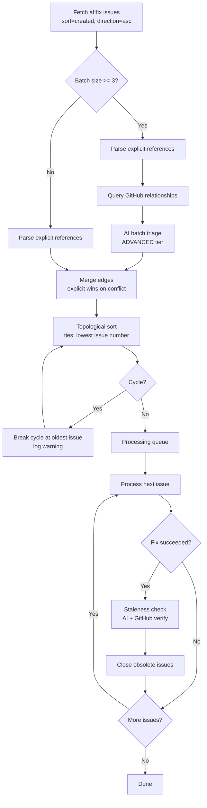
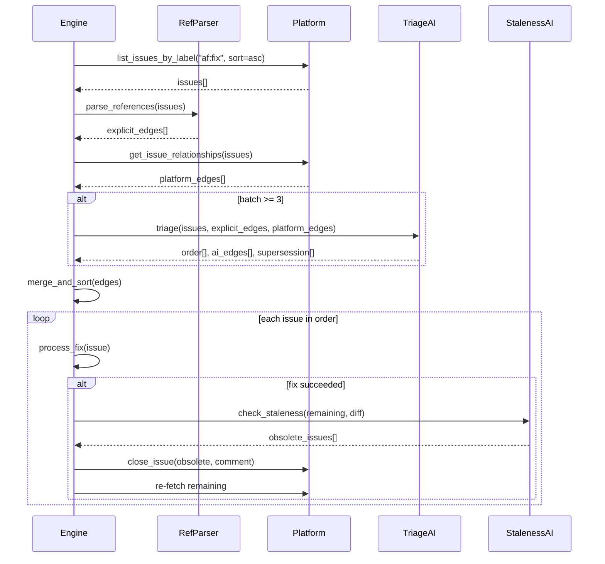

# Design Document: Fix Issue Ordering and Dependency Detection

## Overview

The fix pipeline gains a pre-processing triage phase and a post-fix staleness
phase. Before any fixes run, a dependency graph is built from three sources
(explicit references, GitHub metadata, AI analysis) and topologically sorted.
After each fix, remaining issues are re-evaluated for obsolescence. The design
uses a layered fallback chain: AI triage -> explicit references -> issue number.

## Architecture





### Module Responsibilities

1. **`nightshift/triage.py`** — AI batch triage: prompt construction, response
   parsing, processing order recommendation.
2. **`nightshift/reference_parser.py`** — Explicit dependency extraction from
   issue text and GitHub relationship metadata.
3. **`nightshift/staleness.py`** — Post-fix staleness evaluation via AI and
   GitHub API verification.
4. **`nightshift/dep_graph.py`** — Dependency graph construction, cycle
   detection, topological sort with tie-breaking.
5. **`nightshift/engine.py`** — Orchestrates the triage-process-staleness
   pipeline (modified `_run_issue_check()`).
6. **`platform/github.py`** — Extended with sort/direction params and
   relationship queries.

## Components and Interfaces

### Reference Parser

```python
# nightshift/reference_parser.py

@dataclass(frozen=True)
class DependencyEdge:
    """A directed dependency: `from_issue` must be fixed before `to_issue`."""
    from_issue: int  # prerequisite
    to_issue: int    # dependent
    source: str      # "explicit", "github", or "ai"
    rationale: str   # why this edge exists

def parse_text_references(issues: list[IssueResult]) -> list[DependencyEdge]:
    """Extract dependency edges from issue body text.
    
    Matches case-insensitive patterns: "depends on #N", "blocked by #N",
    "after #N", "requires #N". Only returns edges where both endpoints
    are in the batch.
    """

async def fetch_github_relationships(
    platform: PlatformProtocol,
    issues: list[IssueResult],
) -> list[DependencyEdge]:
    """Query GitHub for parent/blocks/is-blocked-by relationships."""
```

### AI Batch Triage

```python
# nightshift/triage.py

@dataclass(frozen=True)
class TriageResult:
    """Output of AI batch triage."""
    processing_order: list[int]          # recommended issue numbers in order
    edges: list[DependencyEdge]          # AI-detected dependencies
    supersession_pairs: list[tuple[int, int]]  # (keep, obsolete) pairs

async def run_batch_triage(
    issues: list[IssueResult],
    explicit_edges: list[DependencyEdge],
    config: object,
) -> TriageResult:
    """Run ADVANCED-tier AI analysis on the fix batch.
    
    Raises TriageError on failure (caller falls back to explicit refs).
    """
```

### Dependency Graph

```python
# nightshift/dep_graph.py

def build_graph(
    issues: list[IssueResult],
    edges: list[DependencyEdge],
) -> list[int]:
    """Build dependency graph, detect/break cycles, return topological order.
    
    Ties broken by ascending issue number. Cycles broken by removing the
    edge pointing to the oldest issue in the cycle.
    Returns list of issue numbers in processing order.
    """

def detect_cycles(edges: list[DependencyEdge]) -> list[list[int]]:
    """Find all cycles in the dependency graph."""
```

### Staleness Check

```python
# nightshift/staleness.py

@dataclass(frozen=True)
class StalenessResult:
    """Result of post-fix staleness evaluation."""
    obsolete_issues: list[int]   # issue numbers to close
    rationale: dict[int, str]    # issue_number -> why it's obsolete

async def check_staleness(
    fixed_issue: IssueResult,
    remaining_issues: list[IssueResult],
    fix_diff: str,
    config: object,
) -> StalenessResult:
    """Evaluate remaining issues for obsolescence after a fix.
    
    Uses AI analysis + GitHub API verification.
    """
```

### Platform Extensions

```python
# platform/github.py additions

async def list_issues_by_label(
    self,
    label: str,
    state: str = "open",
    *,
    sort: str = "created",
    direction: str = "asc",  # changed default from GitHub's "desc"
) -> list[IssueResult]: ...

async def get_issue_timeline(
    self,
    issue_number: int,
) -> list[dict]: ...
```

### Engine Modifications

```python
# nightshift/engine.py — modified _run_issue_check()

async def _run_issue_check(self) -> None:
    issues = await self._platform.list_issues_by_label(
        "af:fix", direction="asc"
    )
    if not issues:
        return

    # Build dependency graph
    explicit_edges = parse_text_references(issues)
    github_edges = await fetch_github_relationships(
        self._platform, issues
    )
    all_edges = explicit_edges + github_edges

    # AI triage for batches >= 3
    if len(issues) >= 3:
        try:
            triage = await run_batch_triage(issues, all_edges, self._config)
            all_edges = merge_edges(all_edges, triage.edges)
        except TriageError:
            logger.warning("AI triage failed, using explicit refs only")

    processing_order = build_graph(issues, all_edges)
    issue_map = {i.number: i for i in issues}
    remaining = list(processing_order)

    for issue_num in processing_order:
        if issue_num not in remaining:
            continue  # removed by staleness check
        issue = issue_map[issue_num]
        # ... existing shutdown/cost checks ...
        await self._process_fix(issue)

        # Post-fix staleness check
        remaining.remove(issue_num)
        if remaining:
            staleness = await check_staleness(
                issue, [issue_map[n] for n in remaining], ...)
            for obsolete in staleness.obsolete_issues:
                await self._platform.close_issue(
                    obsolete, f"Resolved by fix for #{issue_num}")
                remaining.remove(obsolete)
```

## Data Models

### DependencyEdge

| Field | Type | Description |
|-------|------|-------------|
| `from_issue` | `int` | Issue that must be fixed first |
| `to_issue` | `int` | Issue that depends on `from_issue` |
| `source` | `str` | One of: `"explicit"`, `"github"`, `"ai"` |
| `rationale` | `str` | Human-readable reason for the edge |

### TriageResult

| Field | Type | Description |
|-------|------|-------------|
| `processing_order` | `list[int]` | Recommended issue processing sequence |
| `edges` | `list[DependencyEdge]` | AI-detected dependency edges |
| `supersession_pairs` | `list[tuple[int, int]]` | (keep, obsolete) pairs |

### StalenessResult

| Field | Type | Description |
|-------|------|-------------|
| `obsolete_issues` | `list[int]` | Issues to close |
| `rationale` | `dict[int, str]` | Per-issue explanation |

### AI Triage Prompt Response Schema

```json
{
  "processing_order": [42, 37, 51],
  "dependencies": [
    {
      "from_issue": 42,
      "to_issue": 51,
      "rationale": "#42 adds the config field that #51's fix reads"
    }
  ],
  "supersession": [
    {
      "keep": 42,
      "obsolete": 37,
      "rationale": "#42 and #37 both address the same config validation bug"
    }
  ]
}
```

## Operational Readiness

- **Observability**: Resolved processing order logged at INFO. Cycle breaks
  logged at WARNING. Staleness closures emit audit events. AI triage
  failures logged at WARNING.
- **Rollback**: If the triage or staleness modules cause issues, the engine
  falls back to issue-number ordering automatically. No configuration
  change needed to disable — just remove the modules from the import chain.
- **Migration**: `list_issues_by_label()` gains new keyword-only parameters
  with backward-compatible defaults. Existing callers are unaffected.
- **Cost**: AI triage adds one ADVANCED-tier LLM call per batch (skipped for
  < 3 issues). Staleness adds one call per completed fix. Both are bounded
  by the existing `max_cost` circuit breaker.

## Correctness Properties

### Property 1: Base Ordering

*For any* fix batch with no dependency edges, the processing order SHALL be
ascending issue number.

**Validates: Requirements 1.2, 4.E1**

### Property 2: Dependency Respect

*For any* dependency edge (A -> B), issue A SHALL appear before issue B in
the processing order.

**Validates: Requirements 4.1**

### Property 3: Explicit Edge Precedence

*For any* conflict between an explicit edge and an AI-detected edge, the
explicit edge SHALL take precedence.

**Validates: Requirements 3.4**

### Property 4: Cycle Resolution

*For any* dependency graph containing a cycle, the system SHALL produce a
valid total order (no cycle) after breaking, and the cycle break point SHALL
be the edge pointing to the oldest issue in the cycle.

**Validates: Requirements 4.3, 2.E2**

### Property 5: Triage Fallback

*For any* AI triage failure, the system SHALL still produce a valid processing
order using explicit references and issue-number ordering.

**Validates: Requirements 3.E1**

### Property 6: Staleness Removal

*For any* issue closed by a staleness check, that issue SHALL not appear in
subsequent processing within the same batch.

**Validates: Requirements 5.4**

### Property 7: Batch Size Gate

*For any* fix batch with fewer than 3 issues, the AI triage step SHALL not
be invoked.

**Validates: Requirements 3.5**

## Error Handling

| Error Condition | Behavior | Requirement |
|----------------|----------|-------------|
| AI triage API error/timeout | Fall back to explicit refs + number order | 71-REQ-3.E1 |
| AI triage unparseable response | Fall back to explicit refs + number order | 71-REQ-3.E1 |
| AI order violates explicit edges | Use explicit edges to correct order | 71-REQ-3.E2 |
| Dependency cycle detected | Break at oldest issue, log warning | 71-REQ-4.3, 71-REQ-2.E2 |
| Explicit ref to issue not in batch | Ignore edge | 71-REQ-2.E1 |
| Staleness AI call fails | Verify via GitHub API only, continue | 71-REQ-5.E1 |
| Staleness GitHub re-fetch fails | Log warning, continue without removing | 71-REQ-5.E2 |
| Fix pipeline error | Skip staleness check, continue | 71-REQ-5.E3 |
| Platform sort not supported | Sort locally by issue number | 71-REQ-1.E1 |

## Technology Stack

- Python 3.12+, asyncio
- Claude SDK (ADVANCED tier for triage and staleness AI calls)
- httpx (GitHub REST API)
- Existing: `PlatformProtocol`, `IssueResult`, `NightShiftEngine`,
  `FixPipeline`

## Definition of Done

A task group is complete when ALL of the following are true:

1. All subtasks within the group are checked off (`[x]`)
2. All spec tests (`test_spec.md` entries) for the task group pass
3. All property tests for the task group pass
4. All previously passing tests still pass (no regressions)
5. No linter warnings or errors introduced
6. Code is committed on a feature branch and pushed to remote
7. Feature branch is merged back to `develop`
8. `tasks.md` checkboxes are updated to reflect completion

## Testing Strategy

- **Unit tests**: Test reference parsing, graph building, cycle detection,
  topological sort, edge merging, and staleness evaluation in isolation with
  mocked AI responses and GitHub API calls.
- **Property tests**: Verify ordering invariants (base ordering, dependency
  respect, cycle resolution, batch size gate) across generated issue batches
  and edge sets using Hypothesis.
- **Integration tests**: Test the full `_run_issue_check()` flow with mocked
  platform and AI calls, verifying end-to-end ordering and staleness behavior.
