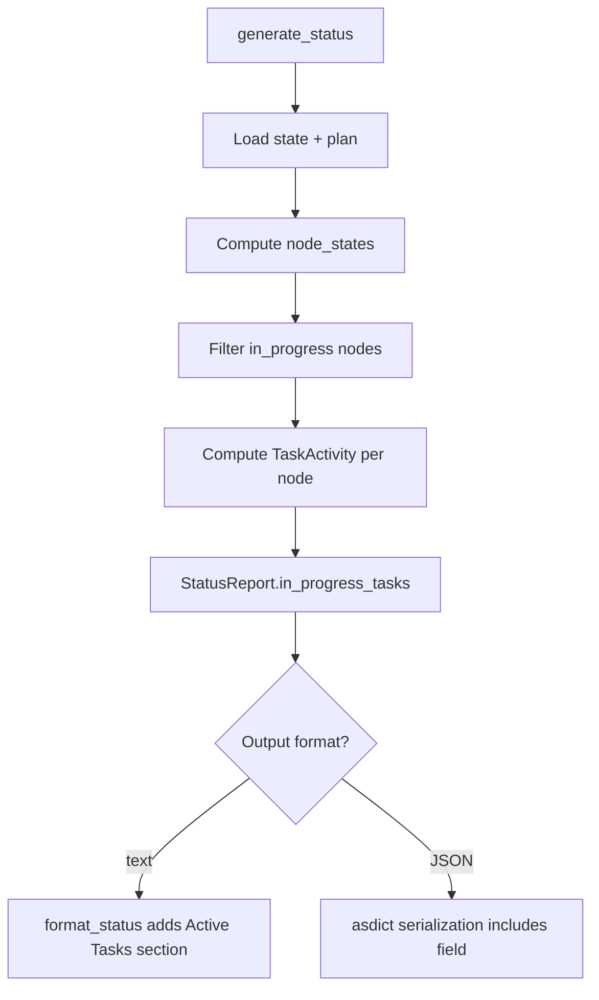

# Design Document: Show Active Tasks in Status Command

## Overview

The status command gains an "Active Tasks" section by adding an
`in_progress_tasks` field to `StatusReport` and rendering it in both text and
JSON formatters. The implementation reuses the existing `TaskActivity` dataclass
and `_compute_task_activities()` from `reporting/standup.py`, filtering to only
`in_progress` nodes.

## Architecture



### Module Responsibilities

1. **`reporting/status.py`** — Adds `in_progress_tasks` field to
   `StatusReport`, computes it in `generate_status()`.
2. **`reporting/formatters.py`** — Renders "Active Tasks" section in
   `TableFormatter.format_status()`.
3. **`reporting/standup.py`** — Unchanged; provides `TaskActivity` dataclass
   and `_compute_task_activities()` for reuse.

## Components and Interfaces

### StatusReport Extension

```python
# reporting/status.py — modified dataclass

from agent_fox.reporting.standup import TaskActivity

@dataclass(frozen=True)
class StatusReport:
    # ... existing fields ...
    active_agents: list[str] = field(default_factory=list)
    in_progress_tasks: list[TaskActivity] = field(default_factory=list)
```

### generate_status() Modification

```python
# reporting/status.py — inside generate_status()

from agent_fox.reporting.standup import TaskActivity, _compute_task_activities

def generate_status(...) -> StatusReport:
    # ... existing logic ...

    # Compute in-progress task activities
    in_progress_tasks: list[TaskActivity] = []
    if state is not None:
        all_sessions = state.session_history
        all_node_states = dict(node_states)
        all_activities = _compute_task_activities(all_sessions, all_node_states)
        in_progress_tasks = [
            ta for ta in all_activities if ta.current_status == "in_progress"
        ]

    return StatusReport(
        # ... existing fields ...
        in_progress_tasks=in_progress_tasks,
    )
```

### Text Formatter Extension

```python
# reporting/formatters.py — inside TableFormatter.format_status()

def format_status(self, report: StatusReport) -> str:
    # ... existing: Tasks line, Memory line, Tokens line ...

    # Active Tasks section (72-REQ-2.1 through 72-REQ-2.5)
    if report.in_progress_tasks:
        lines.append("")
        lines.append("Active Tasks")
        for ta in report.in_progress_tasks:
            display_id = _display_node_id(ta.task_id)
            if ta.total_sessions > 0:
                in_tok = format_tokens(ta.input_tokens)
                out_tok = format_tokens(ta.output_tokens)
                lines.append(
                    f"  {display_id}: {ta.current_status}. "
                    f"{ta.completed_sessions}/{ta.total_sessions} sessions. "
                    f"tokens {in_tok} in / {out_tok} out. "
                    f"${ta.cost:.2f}"
                )
            else:
                lines.append(f"  {display_id}: {ta.current_status}")

    # ... existing: Cost by Archetype, Cost by Spec, Problems ...
```

### JSON Output

No change needed. `JsonFormatter.format_status()` uses `asdict(report)` which
automatically includes `in_progress_tasks` as a list of dicts with all
`TaskActivity` fields.

## Data Models

### TaskActivity (reused from standup.py)

| Field | Type | Description |
|-------|------|-------------|
| `task_id` | `str` | Internal format `"spec:group"` |
| `current_status` | `str` | Node status (always `"in_progress"` here) |
| `completed_sessions` | `int` | Sessions with `"completed"` status |
| `total_sessions` | `int` | All sessions for this task |
| `input_tokens` | `int` | Total input tokens across all sessions |
| `output_tokens` | `int` | Total output tokens across all sessions |
| `cost` | `float` | Total cost in USD |

### StatusReport (extended)

New field added after `active_agents`:

| Field | Type | Description |
|-------|------|-------------|
| `in_progress_tasks` | `list[TaskActivity]` | Activities for in-progress nodes |

## Operational Readiness

- **Observability**: No new logging needed; the data is derived from existing
  session history already logged elsewhere.
- **Rollback**: The new field defaults to an empty list, so removing the
  computation is backward-compatible.
- **Migration**: `StatusReport` gains a new field with a default factory;
  existing callers are unaffected.
- **Cost**: No additional API calls or AI sessions. Pure computation over
  already-loaded state data.

## Correctness Properties

### Property 1: In-Progress Filter

*For any* set of node states, `in_progress_tasks` SHALL contain exactly the
`TaskActivity` entries whose `current_status` is `"in_progress"`.

**Validates: Requirements 72-REQ-1.1, 72-REQ-1.2**

### Property 2: Empty When No In-Progress

*For any* execution state where no node has `in_progress` status,
`in_progress_tasks` SHALL be an empty list.

**Validates: Requirements 72-REQ-1.E1**

### Property 3: Session Metrics Consistency

*For any* in-progress task with N sessions in the session history,
the `TaskActivity.total_sessions` SHALL equal N and
`TaskActivity.completed_sessions` SHALL equal the count of sessions with
`"completed"` status.

**Validates: Requirements 72-REQ-1.3**

### Property 4: Text Section Presence

*For any* `StatusReport` with non-empty `in_progress_tasks`, the text output
SHALL contain the string `"Active Tasks"`. *For any* `StatusReport` with empty
`in_progress_tasks`, the text output SHALL NOT contain `"Active Tasks"`.

**Validates: Requirements 72-REQ-2.1, 72-REQ-2.5**

### Property 5: JSON Field Completeness

*For any* `TaskActivity` in `in_progress_tasks`, the JSON serialization SHALL
contain all seven fields: `task_id`, `current_status`, `completed_sessions`,
`total_sessions`, `input_tokens`, `output_tokens`, `cost`.

**Validates: Requirements 72-REQ-3.1, 72-REQ-3.2**

## Error Handling

| Error Condition | Behavior | Requirement |
|----------------|----------|-------------|
| No execution state (state.jsonl missing) | `in_progress_tasks` is empty list | 72-REQ-1.E2 |
| No in-progress tasks | `in_progress_tasks` is empty list | 72-REQ-1.E1 |
| Task with zero sessions but in-progress status | TaskActivity with zero tokens/sessions | 72-REQ-2.4 |
| Task with zero tokens but non-zero sessions | Display `0 in / 0 out` | 72-REQ-2.E1 |

## Technology Stack

- Python 3.12+
- Existing: `StatusReport`, `TaskActivity`, `_compute_task_activities()`,
  `ExecutionState`, `SessionRecord`, `format_tokens()`, `_display_node_id()`

## Definition of Done

A task group is complete when ALL of the following are true:

1. All subtasks within the group are checked off (`[x]`)
2. All spec tests for the task group pass
3. All previously passing tests still pass (no regressions)
4. No linter warnings or errors introduced
5. Code is committed on a feature branch and pushed to remote
6. Feature branch is merged back to `develop`
7. `tasks.md` checkboxes are updated to reflect completion

## Testing Strategy

- **Unit tests**: Test `generate_status()` returns correct `in_progress_tasks`
  for various node state configurations. Test `format_status()` renders the
  "Active Tasks" section correctly. Test JSON output includes all fields.
- **Property tests**: Verify the in-progress filter invariant across generated
  node state configurations using Hypothesis.
- **Edge case tests**: No state file, no in-progress tasks, zero-session tasks,
  zero-token tasks.
