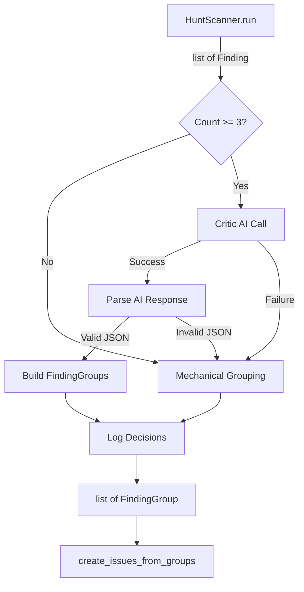

# Design Document: Cross-Category Finding Consolidation Critic

## Overview

The critic stage is a new module (`agent_fox/nightshift/critic.py`) that
replaces `consolidate_findings()` in the hunt-scan pipeline. It receives the
flat list of findings from all categories and uses a single AI call to
deduplicate, validate, calibrate severity, and synthesise coherent
FindingGroups for issue creation. A mechanical fallback handles small batches
(< 3 findings) and AI failures.

## Architecture



### Module Responsibilities

1. **`agent_fox/nightshift/critic.py`** — Critic stage entry point. Contains
   `consolidate_findings()` (async, replaces the old sync version),
   `_run_critic()`, `_mechanical_grouping()`, `_parse_critic_response()`,
   and `_log_decisions()`.
2. **`agent_fox/nightshift/finding.py`** — Retains `Finding` and
   `FindingGroup` dataclasses, `build_issue_body()`. The old
   `consolidate_findings()` function is removed.
3. **`agent_fox/nightshift/engine.py`** — Updated to call the new async
   `consolidate_findings()` from `critic.py` instead of `finding.py`.

## Components and Interfaces

### Public Interface

```python
# agent_fox/nightshift/critic.py

MINIMUM_FINDING_THRESHOLD: int = 3

async def consolidate_findings(
    findings: list[Finding],
) -> list[FindingGroup]:
    """Replace for the old consolidate_findings().

    If len(findings) < MINIMUM_FINDING_THRESHOLD, uses mechanical grouping.
    Otherwise, runs the AI critic stage with mechanical fallback on failure.

    Returns a list of FindingGroups ready for issue creation.
    """
```

### Internal Functions

```python
async def _run_critic(findings: list[Finding]) -> str:
    """Send findings to Claude for cross-category consolidation.

    Returns the raw AI response text.
    Raises on AI backend failure.
    """

def _mechanical_grouping(findings: list[Finding]) -> list[FindingGroup]:
    """Fallback: each finding becomes its own FindingGroup."""

def _parse_critic_response(
    response_text: str,
    findings: list[Finding],
) -> tuple[list[FindingGroup], list[CriticDecision]]:
    """Parse AI JSON response into FindingGroups and decisions.

    Raises ValueError on malformed JSON or invalid indices.
    """

def _log_decisions(decisions: list[CriticDecision], summary: CriticSummary) -> None:
    """Log all critic decisions at appropriate levels."""
```

### Critic Prompt Template

The critic receives a system prompt and user message. The user message contains
a JSON array of findings with numeric indices.

**System prompt** instructs the critic to:

- Analyse all findings holistically, ignoring category boundaries.
- Group findings that share a root cause or affect overlapping code.
- Validate each finding's `evidence` field for concrete proof. Drop findings
  whose evidence is empty or speculative.
- Assign final severity per group based on combined context.
- Return two JSON arrays: `groups` and `dropped`.

**Expected AI output format:**

```json
{
  "groups": [
    {
      "title": "Unused authentication helper and related dead imports",
      "description": "Synthesised description combining all merged findings...",
      "severity": "major",
      "finding_indices": [0, 3, 5],
      "merge_reason": "All three findings flag the same unused auth module"
    }
  ],
  "dropped": [
    {
      "finding_index": 2,
      "reason": "Evidence field is empty; finding is speculative"
    }
  ]
}
```

## Data Models

### CriticDecision

```python
@dataclass(frozen=True)
class CriticDecision:
    """A single decision made by the critic stage."""
    action: str          # "merged" | "dropped" | "severity_changed"
    finding_indices: list[int]  # Indices into the original findings list
    reason: str          # Human-readable justification
    original_severity: str | None  # For severity_changed actions
    new_severity: str | None       # For severity_changed actions
```

### CriticSummary

```python
@dataclass(frozen=True)
class CriticSummary:
    """Summary statistics for the critic run."""
    total_received: int
    total_dropped: int
    total_merged: int      # Findings that were merged (not groups produced)
    groups_produced: int
```

### Critic Prompt Template

Stored as a constant string in `critic.py` (not a separate template file).

## Operational Readiness

### Observability

- INFO logs for each merge, drop, and severity change decision.
- INFO log for the critic summary (received/dropped/merged/groups).
- DEBUG log for full AI prompt and response.
- WARNING log on AI failure or malformed response (before fallback).

### Rollout

- The critic replaces `consolidate_findings()` — no feature flag.
- Mechanical fallback ensures the pipeline never breaks even if the AI
  backend is down.
- Existing tests for the engine's hunt-scan flow will need updating to
  account for the async consolidation call.

## Correctness Properties

### Property 1: Finding Conservation

*For any* list of findings passed to `consolidate_findings()`, every finding
SHALL appear in exactly one of: (a) a FindingGroup's `findings` list, or
(b) the dropped findings log. No finding is silently lost.

**Validates: Requirements 73-REQ-1.1, 73-REQ-2.2, 73-REQ-5.3**

### Property 2: Mechanical Grouping Bijection

*For any* list of findings with length < MINIMUM_FINDING_THRESHOLD,
`consolidate_findings()` SHALL produce exactly `len(findings)` FindingGroups,
one per finding, with no AI call made.

**Validates: Requirements 73-REQ-4.1, 73-REQ-4.2**

### Property 3: Affected-Files Union

*For any* FindingGroup produced by merging N findings, the group's
`affected_files` SHALL be the sorted, deduplicated union of all N findings'
`affected_files` lists.

**Validates: Requirement 73-REQ-1.2**

### Property 4: Output Format Compatibility

*For any* input to `consolidate_findings()`, the return value SHALL be a
`list[FindingGroup]` where each element has non-empty `title`, `body`, and
`findings` fields.

**Validates: Requirements 73-REQ-5.1, 73-REQ-5.3**

### Property 5: Graceful Degradation

*For any* AI backend failure or malformed AI response,
`consolidate_findings()` SHALL return the same result as mechanical grouping
applied to the full input list — never raise an exception.

**Validates: Requirements 73-REQ-5.E1, 73-REQ-7.E1**

### Property 6: Empty Input Invariant

*For any* empty list of findings, `consolidate_findings()` SHALL return an
empty list without invoking the critic or mechanical grouping.

**Validates: Requirement 73-REQ-4.E1**

### Property 7: Decision Completeness

*For any* critic run that processes N findings, the total count of findings
referenced across all logged decisions (merged + dropped + passed-through)
SHALL equal N.

**Validates: Requirements 73-REQ-6.1, 73-REQ-6.2, 73-REQ-6.3**

## Error Handling

| Error Condition | Behavior | Requirement |
|----------------|----------|-------------|
| AI backend unavailable | Fall back to mechanical grouping, log warning | 73-REQ-7.E1 |
| AI response is malformed JSON | Fall back to mechanical grouping, log warning | 73-REQ-5.E1 |
| AI response references invalid finding indices | Ignore invalid refs, log warning | 73-REQ-5.E2 |
| All findings dropped by critic | Return empty list, log summary | 73-REQ-2.E1 |
| Zero findings input | Return empty list immediately | 73-REQ-4.E1 |
| Logging failure | Swallow exception, continue pipeline | 73-REQ-6.E1 |

## Technology Stack

- Python 3.12+
- Claude API via existing backend abstraction (`agent_fox` AI client)
- `json` stdlib for response parsing, `json.JSONDecoder.raw_decode()` for
  extraction from markdown-fenced responses
- `logging` stdlib
- Hypothesis for property-based testing

## Definition of Done

A task group is complete when ALL of the following are true:

1. All subtasks within the group are checked off (`[x]`)
2. All spec tests (`test_spec.md` entries) for the task group pass
3. All property tests for the task group pass
4. All previously passing tests still pass (no regressions)
5. No linter warnings or errors introduced
6. Code is committed on a feature branch and pushed to remote
7. Feature branch is merged back to `develop`
8. `tasks.md` checkboxes are updated to reflect completion

## Testing Strategy

- **Unit tests**: Test `_mechanical_grouping()`, `_parse_critic_response()`,
  `_log_decisions()` in isolation with constructed inputs.
- **Property tests**: Validate conservation, bijection, union, and format
  properties using Hypothesis-generated Finding lists.
- **Integration tests**: Test `consolidate_findings()` end-to-end with mocked
  AI backend, verifying the full flow including fallback paths.
