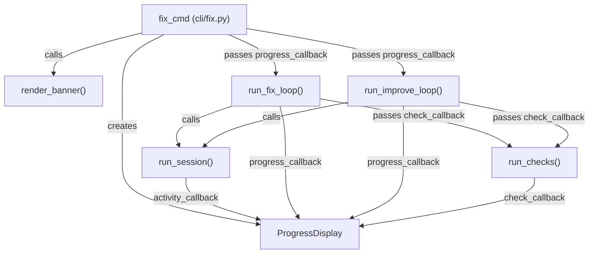

# Design Document: Fix Command Progress Display

## Overview

This spec wires the existing `ProgressDisplay` infrastructure (spinner, milestone
lines, activity callbacks) into the `fix` command so that it produces the same
real-time output style as the `code` command. The changes are primarily plumbing:
adding callback parameters to `run_fix_loop`, `run_improve_loop`, and
`run_checks`, then connecting them in `fix_cmd` via a `ProgressDisplay` instance.

No new UI components are introduced — the existing `ProgressDisplay`,
`ActivityEvent`, and Rich Live spinner are reused as-is.

## Architecture



### Module Responsibilities

1. **`cli/fix.py`** — Creates `ProgressDisplay`, renders banner, wires
   callbacks, manages display lifecycle (start/stop).
2. **`fix/fix.py`** — Accepts `progress_callback`, emits pass-level milestone
   events during the fix loop.
3. **`fix/improve.py`** — Accepts `progress_callback`, emits pass-level and
   session-role milestone events during the improve loop.
4. **`fix/checks.py`** — Accepts `check_callback`, calls it before/after each
   check execution.
5. **`ui/progress.py`** — Existing `ProgressDisplay` class (unchanged).
6. **`ui/display.py`** — Existing `render_banner()` function (unchanged).

## Components and Interfaces

### Callback Types

```python
# New dataclass for fix-specific progress events
@dataclass(frozen=True, slots=True)
class FixProgressEvent:
    """Progress event from the fix or improve loop."""
    phase: str          # "repair" or "improve"
    pass_number: int    # current pass (1-indexed)
    max_passes: int     # configured max passes
    stage: str          # "checks_start", "checks_done", "clusters_found",
                        #  "session_start", "session_done", "all_passed",
                        #  "cost_limit", "session_error",
                        #  "analyzer_start", "analyzer_done",
                        #  "coder_start", "coder_done",
                        #  "verifier_start", "verifier_done",
                        #  "verifier_pass", "verifier_fail", "converged"
    detail: str = ""    # human-readable detail (cluster label, check count, etc.)

FixProgressCallback = Callable[[FixProgressEvent], None]


@dataclass(frozen=True, slots=True)
class CheckEvent:
    """Progress event from a quality check execution."""
    check_name: str     # e.g. "ruff", "pytest"
    stage: str          # "start" or "done"
    passed: bool = True # only meaningful when stage == "done"
    exit_code: int = 0  # only meaningful when stage == "done"

CheckCallback = Callable[[CheckEvent], None]
```

### Modified Function Signatures

```python
# fix/fix.py
async def run_fix_loop(
    project_root: Path,
    config: AgentFoxConfig,
    max_passes: int = 3,
    session_runner: FixSessionRunner | None = None,
    progress_callback: FixProgressCallback | None = None,  # NEW
    check_callback: CheckCallback | None = None,            # NEW
) -> FixResult: ...

# fix/improve.py
async def run_improve_loop(
    project_root: Path,
    config: AgentFoxConfig,
    checks: list[CheckDescriptor] | None = None,
    max_passes: int = 3,
    remaining_budget: float | None = None,
    phase1_diff: str = "",
    session_runner: ... | None = None,
    progress_callback: FixProgressCallback | None = None,  # NEW
) -> ImproveResult: ...

# fix/checks.py
def run_checks(
    checks: list[CheckDescriptor],
    project_root: Path,
    check_callback: CheckCallback | None = None,            # NEW
) -> tuple[list[FailureRecord], list[CheckDescriptor]]: ...
```

### CLI Layer Integration (cli/fix.py)

```python
def fix_cmd(...):
    theme = create_theme(config.theme)
    progress = ProgressDisplay(theme, quiet=quiet or json_mode)

    if not (quiet or json_mode):
        render_banner(theme)

    def on_fix_progress(event: FixProgressEvent) -> None:
        """Convert FixProgressEvent to permanent milestone line."""
        line = _format_fix_milestone(event)
        progress.on_task_event(...)  # or direct console.print via progress

    def on_check(event: CheckEvent) -> None:
        """Update spinner for check start, print milestone for check done."""
        if event.stage == "start":
            # Update spinner text
            ...
        else:
            # Print permanent pass/fail line
            ...

    progress.start()
    try:
        result = asyncio.run(run_fix_loop(
            ...,
            progress_callback=on_fix_progress,
            check_callback=on_check,
        ))
        ...
    finally:
        progress.stop()
```

### Session Runner Changes

The `_build_fix_session_runner` and `_build_improve_session_runner` functions
in `cli/fix.py` need to accept and forward an `activity_callback` to
`run_session()`:

```python
def _build_fix_session_runner(
    config: AgentFoxConfig,
    project_root: Path,
    activity_callback: ActivityCallback | None = None,  # NEW
) -> FixSessionRunner:
    async def _run(fix_spec: FixSpec) -> float:
        outcome = await run_session(
            ...,
            activity_callback=activity_callback,  # NEW
        )
        ...
    return _run
```

## Data Models

No new persistent data models. All new types (`FixProgressEvent`,
`CheckEvent`) are transient in-memory event objects used only during execution.

## Operational Readiness

- **Observability**: Progress events are purely display-side; they do not
  affect logging, metrics, or audit trails.
- **Rollout**: Fully backward compatible. All new parameters default to `None`.
  Existing callers (tests, scripts) continue to work without changes.
- **Migration**: None required.

## Correctness Properties

### Property 1: Quiet Suppression

*For any* invocation of `fix_cmd` with `quiet=True` or `json_mode=True`, the
`ProgressDisplay` SHALL be created with `quiet=True`, producing zero display
output.

**Validates: Requirements 76-REQ-1.2, 76-REQ-1.3, 76-REQ-2.3**

### Property 2: Display Lifecycle Completeness

*For any* execution of `fix_cmd` that creates a `ProgressDisplay`, the display
SHALL be stopped exactly once in a finally block, regardless of whether
execution completes normally, raises an exception, or is interrupted.

**Validates: Requirements 76-REQ-2.2, 76-REQ-2.E1**

### Property 3: Activity Callback Wiring

*For any* coding session created by the fix session runner or improve session
runner, the `activity_callback` argument to `run_session()` SHALL be non-None
when a `ProgressDisplay` is active.

**Validates: Requirements 76-REQ-3.1, 76-REQ-3.2**

### Property 4: Callback Backward Compatibility

*For any* call to `run_fix_loop`, `run_improve_loop`, or `run_checks` where the
new callback parameters are omitted or set to `None`, the function SHALL
execute identically to its behavior before this spec (no errors, no display
output, same return value).

**Validates: Requirements 76-REQ-6.E1, 76-REQ-6.E2**

### Property 5: Progress Event Completeness

*For any* pass in the fix loop, the `progress_callback` SHALL be called at
least once at pass start and once at pass end (checks done, all passed, or
error), so the user always sees the outcome of every pass.

**Validates: Requirements 76-REQ-4.1, 76-REQ-4.2, 76-REQ-4.3**

### Property 6: Check Event Pairing

*For any* quality check executed via `run_checks` with a non-None
`check_callback`, the callback SHALL be called exactly twice: once with
`stage="start"` before execution and once with `stage="done"` after execution,
even if the check times out or fails.

**Validates: Requirements 76-REQ-5.1, 76-REQ-5.2**

## Error Handling

| Error Condition | Behavior | Requirement |
|----------------|----------|-------------|
| KeyboardInterrupt during fix loop | Stop ProgressDisplay in finally block | 76-REQ-2.E1 |
| Fix session raises exception | Emit session_error progress event, continue loop | 76-REQ-4.E2 |
| Cost limit reached | Emit cost_limit progress event | 76-REQ-4.E1 |
| Check subprocess times out | Emit check done event with passed=False | 76-REQ-5.2 |
| progress_callback is None | Skip all callback invocations | 76-REQ-6.E1 |
| check_callback is None | Skip all callback invocations | 76-REQ-6.E2 |

## Technology Stack

- **Python 3.12+**
- **Rich** — existing dependency for `Live`, `Spinner`, `Console`, `Text`
- **Click** — existing CLI framework
- **asyncio** — existing async runtime

## Definition of Done

A task group is complete when ALL of the following are true:

1. All subtasks within the group are checked off (`[x]`)
2. All spec tests (`test_spec.md` entries) for the task group pass
3. All property tests for the task group pass
4. All previously passing tests still pass (no regressions)
5. No linter warnings or errors introduced
6. Code is committed on a feature branch and pushed to remote
7. Feature branch is merged back to `develop`
8. `tasks.md` checkboxes are updated to reflect completion

## Testing Strategy

- **Unit tests** verify callback wiring: mock `ProgressDisplay` and assert that
  `activity_callback` is forwarded to `run_session`, that `progress_callback`
  is invoked at correct points in the loop, and that `check_callback` fires
  for each check.
- **Property tests** verify backward compatibility (None callbacks produce no
  errors), quiet suppression (quiet=True means zero output), and check event
  pairing (every start has a matching done).
- **Integration tests** run the full `fix_cmd` with a minimal project and
  capture console output to verify banner presence and milestone line format.
