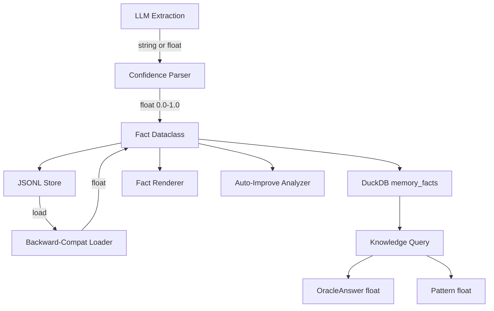

# Design Document: Confidence Normalization

## Overview

This spec normalizes all confidence values in agent-fox from a mixed
string/float representation to a unified `float [0.0, 1.0]` system. The change
touches the memory/knowledge subsystem (facts, queries, patterns), the
auto-improve analyzer, and the DuckDB schema. The routing/assessment subsystem
already uses floats and requires no changes.

## Architecture

The change is a horizontal refactor across the memory and knowledge layers.
No new modules are introduced — existing modules are updated in place.



### Module Responsibilities

1. **`memory/types.py`** — Defines `Fact` dataclass with `confidence: float`.
   Provides `parse_confidence()` conversion function. Removes or deprecates
   `ConfidenceLevel` enum.
2. **`memory/extraction.py`** — Parses LLM output, converts string confidence
   to float via `parse_confidence()`.
3. **`memory/render.py`** — Formats confidence as `f"{confidence:.2f}"` in
   rendered output.
4. **`memory/memory.py`** — Handles JSONL serialization (always writes float)
   and deserialization (accepts both string and float).
5. **`knowledge/db.py`** — Updated CREATE TABLE uses FLOAT for confidence.
6. **`knowledge/migrations.py`** — New migration converts TEXT → FLOAT with
   canonical mapping.
7. **`knowledge/query.py`** — Updates `OracleAnswer` and `Pattern` dataclasses,
   `_determine_confidence()` and `_assign_confidence()` functions.
8. **`fix/analyzer.py`** — Updates `Improvement` dataclass, confidence
   filtering threshold.
9. **`engine/knowledge_harvest.py`** — Updates DuckDB fact sync to write float.

## Components and Interfaces

### Confidence Parser

New function in `memory/types.py`:

```python
# Canonical string-to-float mapping
CONFIDENCE_MAP: dict[str, float] = {
    "high": 0.9,
    "medium": 0.6,
    "low": 0.3,
}

DEFAULT_CONFIDENCE: float = 0.6

def parse_confidence(value: str | float | int | None) -> float:
    """Convert any confidence representation to float [0.0, 1.0].

    - str: look up in CONFIDENCE_MAP, default to 0.6 if unknown
    - float/int: clamp to [0.0, 1.0]
    - None: return DEFAULT_CONFIDENCE
    """
```

### Updated Fact Dataclass

```python
@dataclass
class Fact:
    id: str
    content: str
    category: str
    spec_name: str
    keywords: list[str]
    confidence: float  # [0.0, 1.0], was: str
    created_at: str
    supersedes: str | None
    session_id: str | None
    commit_sha: str | None
```

### Updated Knowledge Types

```python
# In knowledge/query.py
@dataclass
class OracleAnswer:
    answer: str
    confidence: float  # was: str
    sources: list[str]

@dataclass
class Pattern:
    description: str
    confidence: float  # was: str
    occurrences: int
```

### Updated Improvement Type

```python
# In fix/analyzer.py
@dataclass
class Improvement:
    title: str
    description: str
    confidence: float  # was: str
    category: str
```

## Data Models

### DuckDB Migration (v6)

```sql
-- Step 1: Add new FLOAT column
ALTER TABLE memory_facts ADD COLUMN confidence_new FLOAT DEFAULT 0.6;

-- Step 2: Convert existing values
UPDATE memory_facts SET confidence_new = CASE
    WHEN confidence = 'high' THEN 0.9
    WHEN confidence = 'medium' THEN 0.6
    WHEN confidence = 'low' THEN 0.3
    WHEN confidence IS NULL THEN 0.6
    ELSE 0.6
END;

-- Step 3: Drop old column, rename new
ALTER TABLE memory_facts DROP COLUMN confidence;
ALTER TABLE memory_facts RENAME COLUMN confidence_new TO confidence;
```

### JSONL Format

Before:
```json
{"id": "abc", "content": "...", "confidence": "high", ...}
```

After:
```json
{"id": "abc", "content": "...", "confidence": 0.9, ...}
```

Deserialization accepts both formats for backward compatibility.

## Correctness Properties

### Property 1: Confidence Range Invariant

*For any* confidence value produced by `parse_confidence()` with any input
(string, float, int, None, or unknown string), the result SHALL be a float
in `[0.0, 1.0]`.

**Validates: Requirements 37-REQ-1.1, 37-REQ-1.3, 37-REQ-1.E1, 37-REQ-1.E2**

### Property 2: Canonical Mapping Consistency

*For any* string in `{"high", "medium", "low"}`, `parse_confidence()` SHALL
return the corresponding canonical float (`0.9`, `0.6`, `0.3` respectively),
and this mapping SHALL be the same everywhere it is applied (extraction,
migration, JSONL loading).

**Validates: Requirements 37-REQ-1.2, 37-REQ-2.2, 37-REQ-3.2**

### Property 3: Migration Data Preservation

*For any* set of rows in the `memory_facts` table before migration, the
migration SHALL produce exactly the same number of rows after, with all
non-confidence columns unchanged.

**Validates: Requirements 37-REQ-2.1, 37-REQ-2.3, 37-REQ-2.E1**

### Property 4: JSONL Round-Trip Fidelity

*For any* `Fact` with a float confidence in `[0.0, 1.0]`, serializing to
JSONL and deserializing back SHALL produce an identical confidence value
(within floating-point precision).

**Validates: Requirements 37-REQ-3.1, 37-REQ-3.3**

### Property 5: Backward-Compatible Loading

*For any* JSONL entry with a string confidence value from the old format,
loading it SHALL produce a `Fact` with the corresponding canonical float
confidence.

**Validates: Requirements 37-REQ-3.1, 37-REQ-3.2**

### Property 6: Threshold Filtering Correctness

*For any* list of `Improvement` objects with float confidences, filtering
with threshold `< 0.5` SHALL exclude exactly those items whose confidence
is strictly less than `0.5`.

**Validates: Requirement 37-REQ-5.3**

## Error Handling

| Error Condition | Behavior | Requirement |
|----------------|----------|-------------|
| Unknown confidence string from LLM | Default to `0.6`, log warning | 37-REQ-1.E1 |
| Confidence value > 1.0 or < 0.0 | Clamp to nearest bound | 37-REQ-1.E2 |
| NULL confidence in DuckDB during migration | Set to `0.6` | 37-REQ-2.E1 |
| Non-numeric, non-string confidence in JSONL | Default to `0.6`, log warning | 37-REQ-1.E1 |

## Technology Stack

- **Language:** Python 3.12
- **Database:** DuckDB (schema migration)
- **Serialization:** JSON (JSONL files)
- **Testing:** pytest, Hypothesis (property-based tests)

## Definition of Done

A task group is complete when ALL of the following are true:

1. All subtasks within the group are checked off (`[x]`)
2. All spec tests (`test_spec.md` entries) for the task group pass
3. All property tests for the task group pass
4. All previously passing tests still pass (no regressions)
5. No linter warnings or errors introduced
6. Code is committed on a feature branch and pushed to remote
7. Feature branch is merged back to `develop`
8. `tasks.md` checkboxes are updated to reflect completion

## Testing Strategy

- **Unit tests** verify `parse_confidence()` with all input types, the DuckDB
  migration on a test database, and JSONL round-trip serialization.
- **Property-based tests** (Hypothesis) verify the confidence range invariant
  and JSONL round-trip fidelity across randomly generated inputs.
- **Integration tests** verify that fact extraction, knowledge queries, and
  auto-improve analyzer produce float confidences end-to-end.
