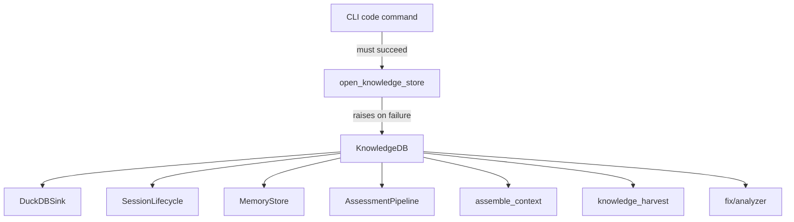

# Design Document: DuckDB Hardening

## Overview

This spec removes all optional DuckDB patterns from the agent-fox codebase,
making the knowledge store a hard requirement. The primary change is at the
initialization boundary (`open_knowledge_store()`), which currently returns
`None` on failure. Making it raise instead propagates through all consumers,
requiring them to accept non-optional connections. Silent try/except blocks
that swallow DuckDB errors are removed so failures surface immediately.

## Architecture

The change flows top-down from initialization:



### Module Responsibilities

1. **`knowledge/db.py`** — `open_knowledge_store()` raises on failure. No more
   `None` return. `KnowledgeDB` is always valid once constructed.
2. **`cli/code.py`** — Initializes knowledge store at startup. Removes all
   `if knowledge_db is not None` guards. Passes `KnowledgeDB` to all consumers.
3. **`engine/session_lifecycle.py`** — `NodeSessionRunner` requires
   `knowledge_db: KnowledgeDB` (non-optional).
4. **`engine/knowledge_harvest.py`** — All functions require `KnowledgeDB`.
   Remove `if knowledge_db is None: return` guards.
5. **`memory/memory.py`** — `MemoryStore` requires `db_conn`. Dual-write
   errors propagate.
6. **`session/prompt.py`** — `assemble_context()` requires `conn`. Remove
   file-based fallback for review/verification/drift context.
7. **`routing/assessor.py`** — `AssessmentPipeline` requires `db`. Remove
   `_get_outcome_count()` None fallback.
8. **`knowledge/duckdb_sink.py`** — Remove try/except in record methods.
9. **`fix/analyzer.py`** — Remove try/except around DuckDB queries.

## Components and Interfaces

### Updated `open_knowledge_store()`

```python
def open_knowledge_store(config: KnowledgeConfig) -> KnowledgeDB:
    """Open the knowledge store. Raises on failure.

    Raises:
        RuntimeError: If the knowledge store cannot be opened,
            with message containing "Knowledge store initialization failed".
    """
    try:
        db = KnowledgeDB(config)
        db.open()
        return db
    except Exception as exc:
        raise RuntimeError(
            f"Knowledge store initialization failed: {exc}"
        ) from exc
```

### Updated Function Signatures

| Module | Before | After |
|--------|--------|-------|
| `session_lifecycle.py` | `knowledge_db: KnowledgeDB \| None = None` | `knowledge_db: KnowledgeDB` |
| `knowledge_harvest.py` | `knowledge_db: KnowledgeDB \| None = None` | `knowledge_db: KnowledgeDB` |
| `memory/memory.py` | `db_conn: duckdb.DuckDBPyConnection \| None = None` | `db_conn: duckdb.DuckDBPyConnection` |
| `session/prompt.py` | `conn: duckdb.DuckDBPyConnection \| None = None` | `conn: duckdb.DuckDBPyConnection` |
| `routing/assessor.py` | `db: duckdb.DuckDBPyConnection \| None` | `db: duckdb.DuckDBPyConnection` |

### Test Fixture

```python
# tests/conftest.py or tests/fixtures/duckdb.py
@pytest.fixture
def knowledge_conn() -> Generator[duckdb.DuckDBPyConnection, None, None]:
    """Provide a fresh in-memory DuckDB with all migrations applied."""
    conn = duckdb.connect(":memory:")
    apply_pending_migrations(conn)
    yield conn
    conn.close()

@pytest.fixture
def knowledge_db(knowledge_conn) -> Generator[KnowledgeDB, None, None]:
    """Provide a KnowledgeDB wrapper around in-memory DuckDB."""
    db = KnowledgeDB.__new__(KnowledgeDB)
    db._conn = knowledge_conn
    yield db
```

## Data Models

No schema changes. This spec only changes how connections are managed and
error handling behavior.

## Correctness Properties

### Property 1: Initialization Always Succeeds or Raises

*For any* configuration input to `open_knowledge_store()`, the function SHALL
either return a valid `KnowledgeDB` instance or raise `RuntimeError`. It SHALL
never return `None`.

**Validates: Requirements 38-REQ-1.1, 38-REQ-1.2**

### Property 2: No Optional Connection Parameters

*For any* function in the modules listed in the design (session_lifecycle,
knowledge_harvest, memory, prompt, assessor), the connection/knowledge_db
parameter SHALL NOT accept `None` as a valid value.

**Validates: Requirements 38-REQ-2.1, 38-REQ-2.2**

### Property 3: No Silent Error Swallowing

*For any* DuckDB write operation in `DuckDBSink`, `MemoryStore`, or
`knowledge_harvest`, if the operation raises a `duckdb.Error`, the exception
SHALL propagate to the caller (not be caught and logged).

**Validates: Requirements 38-REQ-3.1, 38-REQ-3.2, 38-REQ-3.3, 38-REQ-3.4**

### Property 4: Test Isolation

*For any* two tests using the DuckDB fixture, data written by one test SHALL
NOT be visible to the other test.

**Validates: Requirements 38-REQ-5.1, 38-REQ-5.2**

## Error Handling

| Error Condition | Behavior | Requirement |
|----------------|----------|-------------|
| DuckDB file cannot be opened | Raise RuntimeError with path and cause | 38-REQ-1.1, 38-REQ-1.E1 |
| DuckDB write fails in DuckDBSink | Exception propagates to caller | 38-REQ-3.1 |
| DuckDB write fails in MemoryStore | Exception propagates to caller | 38-REQ-3.2 |
| Causal link storage fails | Exception propagates to caller | 38-REQ-3.3 |
| Fact sync to DuckDB fails | Exception propagates to caller | 38-REQ-3.4 |
| Context assembly DB query fails | Exception propagates to caller | 38-REQ-3.E1 |

## Technology Stack

- **Language:** Python 3.12
- **Database:** DuckDB (in-process, required)
- **Testing:** pytest (fixtures for in-memory DuckDB)

## Definition of Done

A task group is complete when ALL of the following are true:

1. All subtasks within the group are checked off (`[x]`)
2. All spec tests (`test_spec.md` entries) for the task group pass
3. All property tests for the task group pass
4. All previously passing tests still pass (no regressions)
5. No linter warnings or errors introduced
6. Code is committed on a feature branch and pushed to remote
7. Feature branch is merged back to `develop`
8. `tasks.md` checkboxes are updated to reflect completion

## Testing Strategy

- **Unit tests** verify that `open_knowledge_store()` raises on failure,
  that connection parameters are non-optional (type checks), and that
  DuckDB errors propagate from sink/store/harvest operations.
- **Property tests** verify test fixture isolation across randomly ordered
  test sequences.
- **Integration tests** verify end-to-end initialization and teardown.
