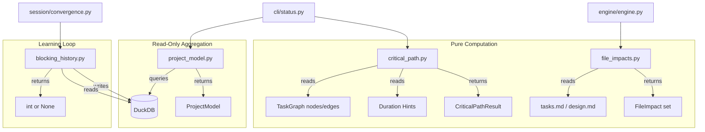

# Design Document: Project Model

## Overview

This spec formalizes four predictive planning components that were previously
part of spec 39. Each component is a self-contained module with clear inputs,
outputs, and DuckDB dependencies. The project model and blocking history live
in `agent_fox/knowledge/`; critical path and file impacts live in
`agent_fox/graph/`.

All four components are read-heavy and write-light. The project model is
entirely read-only. Critical path and file impacts are pure computations with
no persistence. Blocking history writes decision records and reads them back
for threshold learning.

## Architecture



### Module Responsibilities

1. **`agent_fox/knowledge/project_model.py`** -- Queries `execution_outcomes`,
   `complexity_assessments`, `review_findings`, and `drift_findings` tables
   to build a `ProjectModel` aggregate. Pure read-only; no mutations.

2. **`agent_fox/graph/critical_path.py`** -- Computes the longest-duration
   path through a DAG using a forward pass in topological order (Kahn's
   algorithm). Reports all tied paths. No DuckDB dependency; operates on
   in-memory graph data.

3. **`agent_fox/graph/file_impacts.py`** -- Extracts predicted file
   modification sets from spec documents using regex heuristics on
   backtick-quoted paths. Detects conflicts between parallel tasks and
   filters dispatch lists accordingly.

4. **`agent_fox/knowledge/blocking_history.py`** -- Records blocking
   decisions to DuckDB, computes optimal thresholds from history using a
   sweep over candidate thresholds, and stores/retrieves learned thresholds.

## Components and Interfaces

### Project Model

```python
@dataclass
class SpecMetrics:
    spec_name: str
    avg_cost: float
    avg_duration_ms: int
    failure_rate: float
    session_count: int

@dataclass
class ProjectModel:
    spec_outcomes: dict[str, SpecMetrics]
    module_stability: dict[str, float]
    archetype_effectiveness: dict[str, float]
    knowledge_staleness: dict[str, int]
    active_drift_areas: list[str]

def build_project_model(conn: duckdb.DuckDBPyConnection) -> ProjectModel: ...
def format_project_model(model: ProjectModel) -> str: ...
```

### Critical Path

```python
@dataclass
class CriticalPathResult:
    path: list[str]
    total_duration_ms: int
    tied_paths: list[list[str]]

def compute_critical_path(
    nodes: dict[str, str],
    edges: dict[str, list[str]],
    duration_hints: dict[str, int],
) -> CriticalPathResult: ...

def format_critical_path(result: CriticalPathResult) -> str: ...
```

The `edges` parameter maps each node_id to its list of predecessor node_ids.
Nodes with no predecessors are sources. The algorithm:

1. Build in-degree map and successor adjacency from edges.
2. Topological sort via Kahn's algorithm (sorted for determinism).
3. Forward pass: `earliest_finish[n] = duration[n] + max(earliest_finish[pred])`.
4. Find sink nodes achieving `max(earliest_finish)`.
5. Backtrack from sinks to reconstruct all critical paths.

### File Impacts

```python
@dataclass
class FileImpact:
    node_id: str
    predicted_files: set[str]

def extract_file_impacts(spec_dir: Path, task_group: int) -> set[str]: ...
def detect_conflicts(impacts: list[FileImpact]) -> list[tuple[str, str, set[str]]]: ...
def filter_conflicts_from_dispatch(
    ready: list[str], impacts: list[FileImpact]
) -> list[str]: ...
```

File path extraction uses two regex patterns:
- Backtick-quoted: `` `path/to/file.py` ``
- Extension filter: only matches with known source file extensions (py, js,
  ts, rs, go, java, md, toml, yaml, yml, json, sql, sh, etc.)

Task group sections in tasks.md are identified by the pattern
`- [.] N.` where N is the task group number.

### Blocking History

```python
@dataclass
class BlockingDecision:
    spec_name: str
    archetype: str
    critical_count: int
    threshold: int
    blocked: bool
    outcome: str  # correct_block | false_positive | correct_pass | missed_block

def ensure_blocking_tables(conn: duckdb.DuckDBPyConnection) -> None: ...
def record_blocking_decision(conn, decision: BlockingDecision) -> None: ...
def compute_optimal_threshold(
    conn, archetype: str, min_decisions: int = 20,
    max_false_negative_rate: float = 0.1,
) -> int | None: ...
def store_learned_threshold(
    conn, archetype: str, threshold: int,
    confidence: float, sample_count: int,
) -> None: ...
def get_learned_threshold(conn, archetype: str) -> int | None: ...
def format_learned_thresholds(conn) -> str: ...
```

Threshold optimization algorithm:
1. Fetch all decisions with outcomes for the archetype.
2. If fewer than `min_decisions`, return None.
3. For each candidate threshold `t` in `1..max_critical_count+1`:
   - Count false negatives (should_block but critical_count <= t).
   - Count false positives (should_not_block but critical_count > t).
   - If FNR <= max_false_negative_rate and FP < best_fp, update best.
4. Return the best threshold.

## Data Models

### DuckDB Tables

```sql
-- Predicted file modifications per task (persisted for conflict detection)
CREATE TABLE IF NOT EXISTS task_file_impacts (
    node_id VARCHAR NOT NULL,
    file_path VARCHAR NOT NULL,
    source VARCHAR NOT NULL,  -- 'tasks_md' or 'design_md'
    PRIMARY KEY (node_id, file_path)
);

-- Blocking decision log
CREATE TABLE IF NOT EXISTS blocking_history (
    id VARCHAR PRIMARY KEY,
    spec_name VARCHAR NOT NULL,
    archetype VARCHAR NOT NULL,
    critical_count INTEGER NOT NULL,
    threshold INTEGER NOT NULL,
    blocked BOOLEAN NOT NULL,
    outcome VARCHAR,
    created_at TIMESTAMP DEFAULT current_timestamp
);

-- Computed optimal thresholds (upserted)
CREATE TABLE IF NOT EXISTS learned_thresholds (
    archetype VARCHAR PRIMARY KEY,
    threshold INTEGER NOT NULL,
    confidence FLOAT NOT NULL,
    sample_count INTEGER NOT NULL,
    updated_at TIMESTAMP DEFAULT current_timestamp
);
```

### Config Additions

```python
# In PlanningConfig:
file_conflict_detection: bool = Field(
    default=False,
    description="Detect file conflicts between parallel tasks",
)

# BlockingConfig (already exists):
class BlockingConfig(BaseModel):
    learn_thresholds: bool = Field(default=False)
    min_decisions_for_learning: int = Field(default=20)
    max_false_negative_rate: float = Field(default=0.1)
```

## Correctness Properties

### Property 1: Project Model Consistency

*For any* DuckDB database with execution_outcomes and complexity_assessments,
`build_project_model()` SHALL produce SpecMetrics where `failure_rate` is in
`[0.0, 1.0]` and `session_count >= 1` for every entry.

**Validates:** 43-REQ-1.1

### Property 2: Critical Path Optimality

*For any* DAG with duration hints, the `total_duration_ms` of the computed
critical path SHALL equal the maximum earliest finish time across all nodes.
No alternative path through the graph shall have a greater total duration.

**Validates:** 43-REQ-2.1

### Property 3: Critical Path Determinism

*For any* DAG, calling `compute_critical_path()` twice with the same inputs
SHALL produce identical results (same path, same tied_paths, same duration).

**Validates:** 43-REQ-2.1, 43-REQ-2.3

### Property 4: Conflict Detection Symmetry

*For any* list of FileImpact objects, if `detect_conflicts()` reports a
conflict between (A, B), it SHALL NOT also report (B, A). Each conflict
pair appears exactly once with the lower node_id first.

**Validates:** 43-REQ-3.2

### Property 5: Dispatch Safety

*For any* output of `filter_conflicts_from_dispatch()`, no two tasks in the
returned list SHALL have overlapping predicted file sets.

**Validates:** 43-REQ-3.3

### Property 6: Threshold Learning Monotonicity

*For any* archetype with sufficient decisions, the optimal threshold SHALL
be a positive integer. Adding more "correct_block" decisions with high
critical counts SHALL NOT increase the optimal threshold.

**Validates:** 43-REQ-4.2

## Error Handling

| Error Condition | Behavior | Requirement |
|----------------|----------|-------------|
| DuckDB query fails in build_project_model | Log warning, return empty sub-component | 43-REQ-1.E1 |
| Empty node set in compute_critical_path | Return empty path, duration 0 | 43-REQ-2.E1 |
| Missing duration hint for a node | Treat as 0ms | 43-REQ-2.E2 |
| Missing tasks.md or design.md | Return empty file set | 43-REQ-3.E2 |
| Task with no file impacts | Non-conflicting, always dispatchable | 43-REQ-3.E1 |
| Insufficient blocking decisions | Return None from compute_optimal_threshold | 43-REQ-4.3 |
| Missing blocking_history table | Return None (not raise) | 43-REQ-4.E1 |

## Technology Stack

- **Language:** Python 3.12
- **Database:** DuckDB (in-process, required per spec 38)
- **Testing:** pytest, Hypothesis (property tests)
- **Config:** Pydantic v2 (BaseModel with Field validators)

## Definition of Done

A task group is complete when ALL of the following are true:

1. All subtasks within the group are checked off (`[x]`)
2. All spec tests (`test_spec.md` entries) for the task group pass
3. All property tests for the task group pass
4. All previously passing tests still pass (no regressions)
5. No linter warnings or errors introduced
6. Code is committed on a feature branch and pushed to remote
7. Feature branch is merged back to `develop`
8. `tasks.md` checkboxes are updated to reflect completion

## Testing Strategy

- **Unit tests** verify each function in isolation: build_project_model with
  test data, compute_critical_path with known graphs, extract_file_impacts
  with fixture spec dirs, record/compute/store blocking decisions.
- **Property tests** verify invariants: failure_rate bounds, critical path
  determinism, conflict symmetry, dispatch safety, threshold positivity.
- **Integration tests** verify CLI status output includes project model and
  critical path sections, and engine dispatch respects file conflict config.
