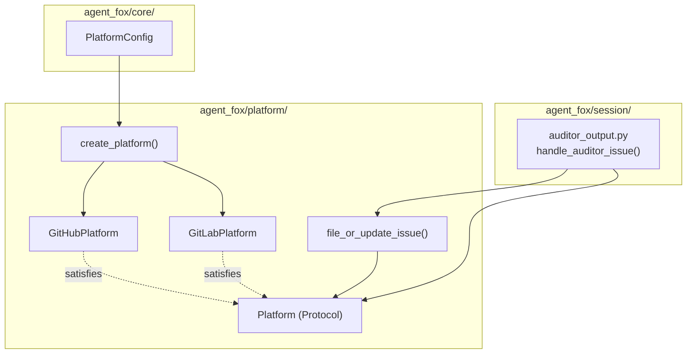

# Design Document: Platform Issue Abstraction

## Overview

Introduce a `Platform` protocol for issue operations and move issue
orchestration logic from the session module to the platform module. The
`GitHubPlatform` already implements the required methods; a new
`GitLabPlatform` validates the abstraction. A factory function creates the
correct platform instance from configuration.

## Architecture



### Module Responsibilities

1. **`agent_fox/platform/__init__.py`** — Exports `Platform` protocol,
   `IssueResult`, `create_platform`, `file_or_update_issue`.
2. **`agent_fox/platform/protocol.py`** — Defines the `Platform` protocol
   with five async issue methods and a `name` property.
3. **`agent_fox/platform/github.py`** — `GitHubPlatform` class (existing);
   add `name` property returning `"github"`.
4. **`agent_fox/platform/gitlab.py`** — `GitLabPlatform` class implementing
   the protocol via GitLab REST API v4.
5. **`agent_fox/platform/issues.py`** — Platform-agnostic
   `file_or_update_issue()` function (moved from session).
6. **`agent_fox/platform/factory.py`** — `create_platform()` factory function.
7. **`agent_fox/session/auditor_output.py`** — Rename
   `handle_auditor_github_issue` to `handle_auditor_issue`, accept `Platform`
   protocol.

## Components and Interfaces

### Platform Protocol

```python
# agent_fox/platform/protocol.py

from typing import Protocol, runtime_checkable
from agent_fox.platform.github import IssueResult

@runtime_checkable
class Platform(Protocol):
    @property
    def name(self) -> str: ...

    async def search_issues(
        self,
        title_prefix: str,
        state: str = "open",
    ) -> list[IssueResult]: ...

    async def create_issue(
        self,
        title: str,
        body: str,
    ) -> IssueResult: ...

    async def update_issue(
        self,
        issue_number: int,
        body: str,
    ) -> None: ...

    async def add_issue_comment(
        self,
        issue_number: int,
        comment: str,
    ) -> None: ...

    async def close_issue(
        self,
        issue_number: int,
        comment: str | None = None,
    ) -> None: ...
```

### GitLabPlatform

```python
# agent_fox/platform/gitlab.py

class GitLabPlatform:
    def __init__(self, project_id: str | int, token: str) -> None: ...

    @property
    def name(self) -> str:
        return "gitlab"

    async def search_issues(self, title_prefix: str, state: str = "open") -> list[IssueResult]: ...
    async def create_issue(self, title: str, body: str) -> IssueResult: ...
    async def update_issue(self, issue_number: int, body: str) -> None: ...
    async def add_issue_comment(self, issue_number: int, comment: str) -> None: ...
    async def close_issue(self, issue_number: int, comment: str | None = None) -> None: ...
```

GitLab REST API v4 endpoints used:
- `GET /projects/:id/issues?search=:title_prefix&state=opened`
- `POST /projects/:id/issues`
- `PUT /projects/:id/issues/:iid`
- `POST /projects/:id/issues/:iid/notes`

### Factory Function

```python
# agent_fox/platform/factory.py

from pathlib import Path
from agent_fox.core.config import PlatformConfig
from agent_fox.platform.protocol import Platform

async def create_platform(
    config: PlatformConfig,
    repo_root: Path,
) -> Platform | None:
    """Create a Platform instance from configuration.

    Returns None for type="none", missing tokens, or unparseable remotes.
    """
```

### Moved file_or_update_issue

```python
# agent_fox/platform/issues.py

from agent_fox.platform.protocol import Platform

async def file_or_update_issue(
    title_prefix: str,
    body: str,
    *,
    platform: Platform | None = None,
    close_if_empty: bool = False,
) -> str | None:
    """Search-before-create issue idempotency (platform-agnostic)."""
```

Signature is unchanged except `platform` type widens from `GitHubPlatform`
to `Platform`.

## Data Models

### IssueResult (unchanged)

```python
@dataclass(frozen=True)
class IssueResult:
    number: int      # GitHub issue number or GitLab IID
    title: str
    html_url: str    # GitHub html_url or GitLab web_url
```

`IssueResult` stays in `agent_fox/platform/github.py` and is re-exported
from `agent_fox/platform/__init__.py`. It is platform-agnostic already.

### PlatformConfig (extended)

```python
class PlatformConfig(BaseModel):
    type: str = Field(default="none")  # "none", "github", "gitlab"
    auto_merge: bool = Field(default=False)
```

No schema change needed — `type` is already a free `str`. The config
generator help text is updated to list `"gitlab"` as a valid option.

### GitLab Remote Parsing

A `parse_gitlab_remote()` function extracts `project_id` or
`namespace/project` from a GitLab remote URL. Supports:
- `https://gitlab.com/namespace/project.git`
- `git@gitlab.com:namespace/project.git`

Since GitLab API uses project IDs or URL-encoded paths, the function returns
the URL-encoded `namespace/project` string.

## Operational Readiness

- **Observability**: All platform operations already log at INFO/WARNING level.
  GitLabPlatform follows the same logging pattern.
- **Rollout**: No migration needed. Existing `type="github"` configs work
  unchanged. `type="gitlab"` is opt-in.
- **Compatibility**: `IssueResult` stays in `github.py` and is re-exported.
  Existing imports of `IssueResult` from `agent_fox.platform.github` continue
  to work. `parse_github_remote` stays in `github.py`.

## Correctness Properties

### Property 1: Protocol Structural Conformance

*For any* class that implements all five async methods (`search_issues`,
`create_issue`, `update_issue`, `add_issue_comment`, `close_issue`) and the
`name` property with matching signatures, the class SHALL satisfy the
`Platform` protocol at runtime (`isinstance` check).

**Validates: Requirements 48-REQ-1.1, 48-REQ-1.2, 48-REQ-2.1, 48-REQ-3.1**

### Property 2: Factory Determinism

*For any* valid `PlatformConfig` with `type` in `{"github", "gitlab", "none"}`,
the `create_platform()` function SHALL return a `Platform` instance of the
expected concrete type (or `None` for `"none"`), and the result SHALL be
deterministic for the same config and environment.

**Validates: Requirements 48-REQ-4.1, 48-REQ-4.2, 48-REQ-4.3**

### Property 3: Factory Graceful Degradation

*For any* `PlatformConfig` where the required environment variable is missing
or the remote URL is unparseable, the `create_platform()` function SHALL
return `None` without raising.

**Validates: Requirements 48-REQ-4.E1, 48-REQ-4.E2, 48-REQ-4.E3**

### Property 4: file_or_update_issue Idempotency

*For any* sequence of N calls to `file_or_update_issue()` with the same
`title_prefix` and varying `body`, the function SHALL create at most one
issue (on the first call) and update it on subsequent calls.

**Validates: Requirements 48-REQ-5.3**

### Property 5: file_or_update_issue Never Raises

*For any* combination of `platform` (None, raising mock, working mock),
`file_or_update_issue()` SHALL return `str | None` and never raise an
exception.

**Validates: Requirements 48-REQ-5.E1, 48-REQ-5.E2**

### Property 6: GitLabPlatform API Error Handling

*For any* GitLab API response with a non-success status code,
`GitLabPlatform` methods SHALL raise `IntegrationError` containing the
status code.

**Validates: Requirements 48-REQ-3.E1**

### Property 7: Auditor Issue Handling Never Raises

*For any* combination of `platform` (None, raising, working) and
`AuditResult` verdict, `handle_auditor_issue()` SHALL never raise an
exception.

**Validates: Requirements 48-REQ-6.E1**

## Error Handling

| Error Condition | Behavior | Requirement |
|----------------|----------|-------------|
| Platform env var missing | Factory returns None, logs warning | 48-REQ-4.E1 |
| Remote URL unparseable | Factory returns None, logs warning | 48-REQ-4.E2 |
| Unknown platform type | Factory returns None, logs warning | 48-REQ-4.E3 |
| GitLab API non-success | GitLabPlatform raises IntegrationError | 48-REQ-3.E1 |
| platform is None in file_or_update_issue | Log warning, return None | 48-REQ-5.E1 |
| Platform operation raises in file_or_update_issue | Catch, log warning, return None | 48-REQ-5.E2 |
| platform is None in handle_auditor_issue | Log warning, return | 48-REQ-6.E1 |

## Technology Stack

- **Language**: Python 3.12+
- **HTTP client**: httpx (already used by GitHubPlatform)
- **Type system**: `typing.Protocol` with `@runtime_checkable`
- **Config**: pydantic `BaseModel` (existing `PlatformConfig`)
- **Testing**: pytest, hypothesis (property tests)

## Definition of Done

A task group is complete when ALL of the following are true:

1. All subtasks within the group are checked off (`[x]`)
2. All spec tests (`test_spec.md` entries) for the task group pass
3. All property tests for the task group pass
4. All previously passing tests still pass (no regressions)
5. No linter warnings or errors introduced
6. Code is committed on a feature branch and pushed to remote
7. Feature branch is merged back to `develop`
8. `tasks.md` checkboxes are updated to reflect completion

## Testing Strategy

- **Unit tests**: Mock httpx responses for GitLabPlatform methods. Mock
  Platform protocol for `file_or_update_issue()` and `handle_auditor_issue()`.
  Test factory with patched environment and git remote.
- **Property tests**: Use Hypothesis to generate arbitrary title/body strings
  and verify idempotency and never-raises properties. Test protocol
  conformance with mock classes.
- **Integration tests**: None required — all external API calls are mocked.
  Real API calls are out of scope for this spec.
