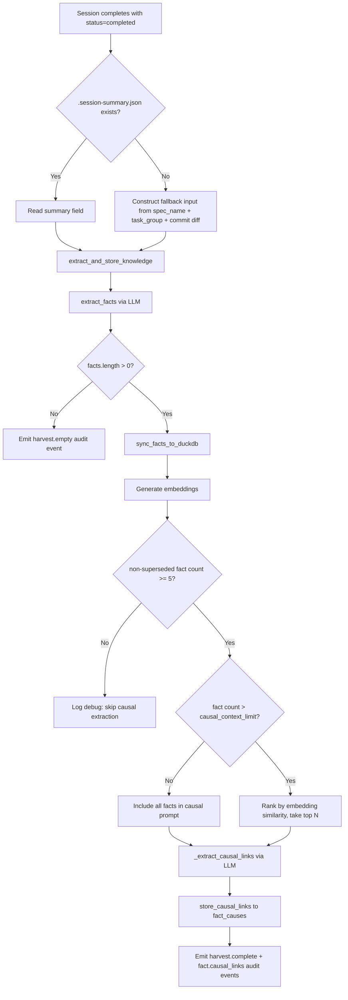

# Design Document: Knowledge Harvest & Causal Graph

## Overview

This spec fixes the knowledge harvest pipeline so that session-derived facts
and causal links flow into DuckDB after every successful coder session. The
existing code in `engine/knowledge_harvest.py` and `knowledge/causal.py` is
largely correct — the primary failure is that the calling code in
`session_lifecycle.py` silently skips extraction when `.session-summary.json`
is absent. The fix adds a fallback input path and tightens the causal
extraction trigger conditions.

## Architecture



### Module Responsibilities

1. **`engine/session_lifecycle.py`** — Orchestrates post-session steps: reads
   summary, constructs fallback, calls `extract_and_store_knowledge()`.
2. **`engine/knowledge_harvest.py`** — Coordinates fact extraction, storage,
   embedding generation, and causal link extraction.
3. **`knowledge/extraction.py`** — LLM-based fact extraction from text.
4. **`knowledge/store.py`** — DuckDB read/write for `memory_facts`.
5. **`knowledge/causal.py`** — Causal link storage and traversal.
6. **`knowledge/embeddings.py`** — Embedding generation via SentenceTransformer.
7. **`knowledge/search.py`** — Vector similarity search for causal context
   ranking.
8. **`knowledge/audit.py`** — Audit event types and data model.

## Components and Interfaces

### Modified: `SessionLifecycle._post_session_integrate()`

The existing method at `session_lifecycle.py:555-575` reads the summary and
calls `extract_and_store_knowledge()`. Changes:

```python
# Current (broken): silently skips when summary is empty
transcript = (summary or {}).get("summary", "")
if transcript:
    await extract_and_store_knowledge(...)

# Fixed: constructs fallback when summary is empty
summary = self._read_session_artifacts(workspace)
transcript = (summary or {}).get("summary", "")
if not transcript:
    transcript = self._build_fallback_input(workspace, node_id)
if transcript:
    await extract_and_store_knowledge(...)
```

### New: `SessionLifecycle._build_fallback_input()`

```python
def _build_fallback_input(
    self,
    workspace: WorkspaceInfo,
    node_id: str,
) -> str:
    """Construct fallback extraction input from session metadata.

    Returns a structured text block with spec name, task group,
    node ID, and commit diff. Returns empty string if no commits
    were made.
    """
```

### Modified: `extract_and_store_knowledge()`

Add the minimum fact threshold check before calling `_extract_causal_links()`,
embedding generation after `sync_facts_to_duckdb()`, and the `harvest.empty`
/ `harvest.complete` audit events.

### Modified: `_extract_causal_links()`

Add similarity-ranked context window when fact count exceeds
`causal_context_limit`. Add `fact.causal_links` audit event after link
storage.

### New: `OrchestratorConfig.causal_context_limit`

```python
causal_context_limit: int = Field(
    default=200,
    description="Maximum prior facts in causal extraction prompt",
)
```

## Data Models

### Existing (unchanged)

- **`memory_facts`** table: `id UUID, content TEXT, category TEXT, spec_name TEXT, session_id TEXT, commit_sha TEXT, confidence FLOAT, created_at TIMESTAMP, superseded_by UUID`
- **`memory_embeddings`** table: `id UUID, embedding FLOAT[N]`
- **`fact_causes`** table: `cause_id UUID, effect_id UUID`
- **`Fact`** dataclass in `knowledge/facts.py`
- **`CausalLink`** dataclass in `knowledge/causal.py`

### Fallback input format

```
# Session Knowledge Extraction

Spec: {spec_name}
Task Group: {task_group}
Node ID: {node_id}

## Changes

{git diff output}
```

## Operational Readiness

- **Observability**: `harvest.complete`, `harvest.empty`, and
  `fact.causal_links` audit events provide full visibility into the harvest
  pipeline.
- **Rollback**: No schema changes. The fix is purely in calling code. Reverting
  the code restores previous (broken) behavior — no data migration needed.
- **Compatibility**: The `causal_context_limit` config field has a default
  value (200), so existing configs work unchanged.

## Correctness Properties

### Property 1: Harvest Always Attempts Extraction

*For any* successful coder session (status = "completed"), the engine SHALL
invoke `extract_and_store_knowledge()` with a non-empty string, regardless
of whether `.session-summary.json` exists.

**Validates: Requirements 52-REQ-1.1, 52-REQ-1.2**

### Property 2: Fact Provenance Completeness

*For any* fact inserted into `memory_facts`, the fields `category`,
`confidence`, `spec_name`, `session_id`, and `commit_sha` SHALL all be
non-NULL. Only `supersedes` may be NULL.

**Validates: Requirements 52-REQ-2.1**

### Property 3: Embedding Failure Isolation

*For any* embedding generation failure, the corresponding fact SHALL still
exist in `memory_facts`. The failure SHALL not cause the fact to be removed
or the harvest to abort.

**Validates: Requirements 52-REQ-3.1, 52-REQ-3.2**

### Property 4: Causal Extraction Minimum Threshold

*For any* invocation of the causal extraction pipeline, the total
non-superseded fact count in `memory_facts` SHALL be >= 5. If the count is
< 5, `_extract_causal_links()` SHALL not be called.

**Validates: Requirements 52-REQ-5.1, 52-REQ-5.2**

### Property 5: Causal Context Window Bound

*For any* causal extraction prompt, the number of prior facts included SHALL
be <= `causal_context_limit`. When total facts exceed the limit, the included
facts SHALL be the top N by embedding similarity to the new facts.

**Validates: Requirements 52-REQ-6.1, 52-REQ-6.2**

### Property 6: Causal Link Idempotency

*For any* pair `(cause_id, effect_id)`, inserting the same link twice SHALL
result in exactly one row in `fact_causes`. The second insert SHALL be
silently ignored.

**Validates: Requirements 52-REQ-7.1**

### Property 7: Causal Link Referential Integrity

*For any* causal link `(cause_id, effect_id)`, both `cause_id` and
`effect_id` SHALL exist in `memory_facts`. Links referencing non-existent
facts SHALL be skipped.

**Validates: Requirements 52-REQ-7.E1**

### Property 8: Audit Event Emission on Success

*For any* successful harvest that produces >= 1 fact, a `harvest.complete`
audit event SHALL be emitted with `fact_count > 0`.

**Validates: Requirements 52-REQ-4.1**

### Property 9: Audit Event Emission on Empty Harvest

*For any* harvest that receives non-empty input but produces zero facts, a
`harvest.empty` audit event SHALL be emitted with warning severity.

**Validates: Requirements 52-REQ-4.2**

## Error Handling

| Error Condition | Behavior | Requirement |
|----------------|----------|-------------|
| `.session-summary.json` absent | Construct fallback input | 52-REQ-1.2 |
| Fallback input has no commits | Omit diff section, include metadata only | 52-REQ-1.E1 |
| `extract_and_store_knowledge()` raises | Log warning, continue | 52-REQ-1.3 |
| LLM returns invalid category | Skip that fact, log warning | 52-REQ-2.E1 |
| Embedding model unavailable | Log warning, skip embeddings for batch | 52-REQ-3.E1 |
| Sink dispatcher is None | Skip audit emission silently | 52-REQ-4.E1 |
| Fact count < 5 | Skip causal extraction, log debug | 52-REQ-5.2 |
| Prior facts lack embeddings | Append after ranked facts, up to limit | 52-REQ-6.E1 |
| Causal link references missing fact | Skip link, log warning | 52-REQ-7.E1 |

## Technology Stack

- **Python 3.12+** — async/await for LLM calls
- **DuckDB** — fact and causal link storage
- **Anthropic API** — LLM-based fact and causal extraction
- **SentenceTransformers** — embedding generation
- **pytest + Hypothesis** — testing

## Definition of Done

A task group is complete when ALL of the following are true:

1. All subtasks within the group are checked off (`[x]`)
2. All spec tests (`test_spec.md` entries) for the task group pass
3. All property tests for the task group pass
4. All previously passing tests still pass (no regressions)
5. No linter warnings or errors introduced
6. Code is committed on a feature branch and pushed to remote
7. Feature branch is merged back to `develop`
8. `tasks.md` checkboxes are updated to reflect completion

## Testing Strategy

- **Unit tests**: Mock the LLM client and DuckDB connection to test
  `extract_and_store_knowledge()`, `_extract_causal_links()`,
  `_build_fallback_input()`, and audit event emission in isolation.
- **Property tests**: Use Hypothesis to generate random facts, causal links,
  and session states to verify provenance completeness, idempotency,
  referential integrity, and context window bounds.
- **Integration tests**: Use a real in-memory DuckDB instance to verify
  end-to-end fact insertion, embedding storage, causal link creation, and
  audit event persistence.
