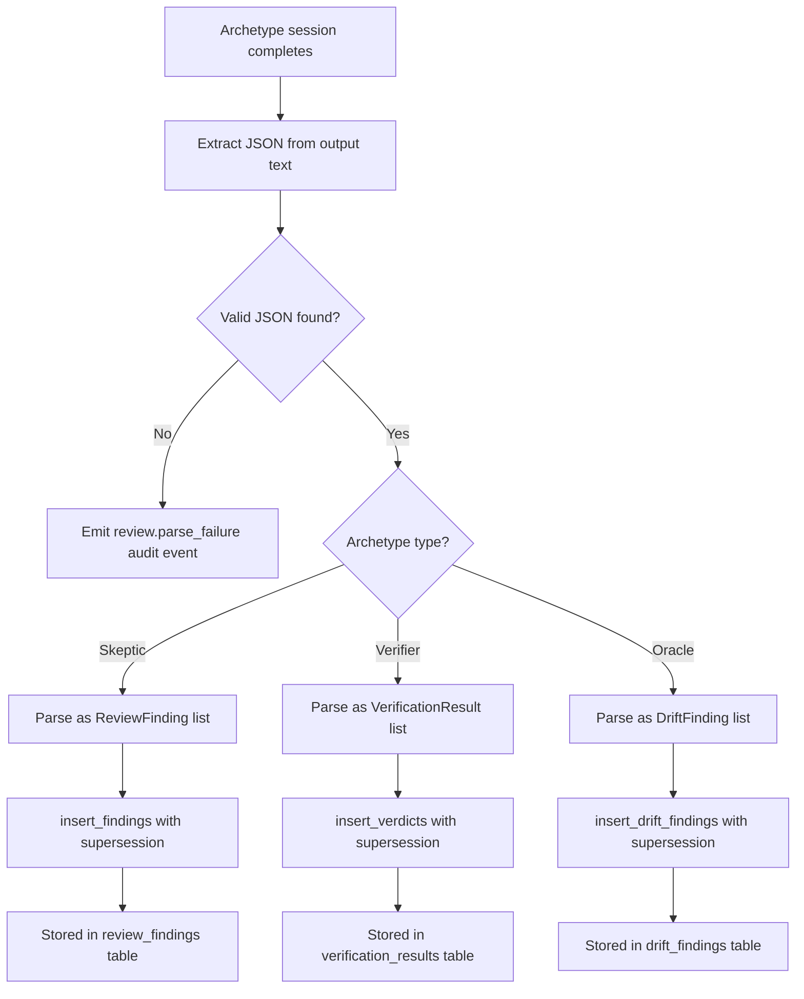
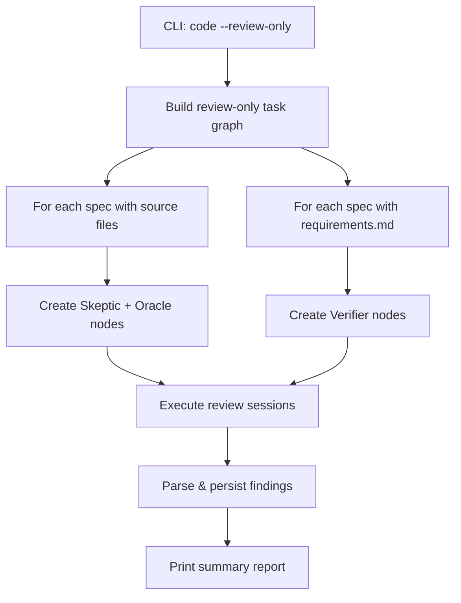

# Design Document: Review Archetype Persistence & Review-Only Mode

## Overview

This spec wires the review archetype output (Skeptic, Verifier, Oracle) into
the existing persistence layer (`knowledge/review_store.py`) and adds a
`--review-only` CLI mode that runs only review archetypes against an existing
codebase. The persistence functions (`insert_findings()`, `insert_verdicts()`,
`insert_drift_findings()`) already exist — the gap is that archetype session
output is not being parsed and fed into them.

## Architecture





### Module Responsibilities

1. **`engine/session_lifecycle.py`** — Calls `_persist_review_findings()` after
   archetype sessions; modified to parse structured JSON and route to the
   correct insert function.
2. **`knowledge/review_store.py`** — Existing CRUD for review_findings,
   verification_results, drift_findings with supersession logic.
3. **`engine/review_parser.py`** (new) — JSON extraction from archetype output
   text. Handles markdown fences, bare arrays, and validation.
4. **`graph/injection.py`** — Modified to support review-only graph
   construction (archetype-only nodes, no coder nodes).
5. **`cli/code.py`** — Adds `--review-only` flag to the `code` command.
6. **`engine/engine.py`** — Passes `review_only` flag to graph builder and
   session lifecycle.

## Components and Interfaces

### New: `engine/review_parser.py`

```python
def extract_json_array(output_text: str) -> list[dict] | None:
    """Extract a JSON array from archetype output text.

    Tries bracket-matching first ([...]), then markdown fences.
    Returns None if no valid JSON array found.
    """

def parse_review_findings(
    json_objects: list[dict],
    spec_name: str,
    task_group: int,
    session_id: str,
) -> list[ReviewFinding]:
    """Parse dicts into ReviewFinding instances, skipping invalid entries."""

def parse_verification_results(
    json_objects: list[dict],
    spec_name: str,
    task_group: int,
    session_id: str,
) -> list[VerificationResult]:
    """Parse dicts into VerificationResult instances, skipping invalid entries."""

def parse_drift_findings(
    json_objects: list[dict],
    spec_name: str,
    task_group: int,
    session_id: str,
) -> list[DriftFinding]:
    """Parse dicts into DriftFinding instances, skipping invalid entries."""
```

### Modified: `SessionLifecycle._persist_review_findings()`

Currently exists at `session_lifecycle.py:577-583` but may not be fully wired.
Changes:

```python
def _persist_review_findings(
    self,
    output_text: str,
    node_id: str,
    attempt: int,
) -> None:
    """Parse archetype output and persist findings/verdicts/drift."""
    json_objects = extract_json_array(output_text)
    if json_objects is None:
        self._emit_audit(
            AuditEventType.REVIEW_PARSE_FAILURE,
            node_id=node_id,
            severity=AuditSeverity.WARNING,
            payload={"raw_output": output_text[:2000]},
        )
        return

    if self._archetype == "skeptic":
        findings = parse_review_findings(json_objects, ...)
        insert_findings(self._knowledge_db.connection, findings)
    elif self._archetype == "verifier":
        verdicts = parse_verification_results(json_objects, ...)
        insert_verdicts(self._knowledge_db.connection, verdicts)
    elif self._archetype == "oracle":
        drift = parse_drift_findings(json_objects, ...)
        insert_drift_findings(self._knowledge_db.connection, drift)
```

### Modified: `graph/injection.py` — Review-Only Graph

```python
def build_review_only_graph(
    specs_dir: Path,
    archetypes_config: dict,
) -> TaskGraph:
    """Build a task graph containing only review archetype nodes.

    Creates Skeptic + Oracle nodes for specs with source files,
    Verifier nodes for specs with requirements.md.
    """
```

### Modified: `cli/code.py`

```python
@click.option("--review-only", is_flag=True, default=False,
              help="Run only review archetypes, skip coder sessions")
```

### New: `AuditEventType.REVIEW_PARSE_FAILURE`

```python
REVIEW_PARSE_FAILURE = "review.parse_failure"
```

### Review Context in Retries

```python
def _build_retry_context(
    self,
    spec_name: str,
) -> str:
    """Query active critical/major findings for the spec and format them."""
    findings = query_active_findings(
        self._knowledge_db.connection,
        spec_name,
    )
    critical_major = [f for f in findings if f.severity in ("critical", "major")]
    if not critical_major:
        return ""
    # Format as structured block for coder prompt
```

## Data Models

### Existing (unchanged)

- **`review_findings`** table: `id UUID, severity TEXT, description TEXT, requirement_ref TEXT, spec_name TEXT, task_group INT, session_id TEXT, superseded_by UUID, created_at TIMESTAMP`
- **`verification_results`** table: `id UUID, requirement_id TEXT, verdict TEXT, evidence TEXT, spec_name TEXT, task_group INT, session_id TEXT, superseded_by UUID, created_at TIMESTAMP`
- **`drift_findings`** table: `id UUID, severity TEXT, description TEXT, spec_ref TEXT, artifact_ref TEXT, spec_name TEXT, task_group INT, session_id TEXT, superseded_by UUID, created_at TIMESTAMP`
- **`ReviewFinding`**, **`VerificationResult`**, **`DriftFinding`** dataclasses in `review_store.py`

### Review-Only Summary Output Format

```
Review-Only Run Summary
=======================
Findings:  3 critical, 5 major, 12 minor, 8 observation
Verdicts:  45 PASS, 7 FAIL
Drift:     2 critical, 4 major, 1 minor
```

## Operational Readiness

- **Observability**: `review.parse_failure` audit events surface archetype
  output that couldn't be parsed. Run-level audit events include
  `mode: "review_only"` when applicable.
- **Rollback**: No schema changes. Reverting code removes the persistence
  wiring and `--review-only` flag.
- **Compatibility**: Existing runs are unaffected. The `--review-only` flag
  is opt-in. Archetype output format is unchanged.

## Correctness Properties

### Property 1: Parse or Warn

*For any* archetype session output, the engine SHALL either successfully parse
JSON findings and store them, OR emit a `review.parse_failure` audit event.
No archetype output SHALL be silently discarded.

**Validates: Requirements 53-REQ-1.E1, 53-REQ-2.E1, 53-REQ-3.E1**

### Property 2: Supersession Consistency

*For any* sequence of findings for the same `spec_name` + `task_group`, only
the most recently inserted findings SHALL have `superseded_by = NULL`. All
prior findings SHALL have `superseded_by` set to a non-NULL value.

**Validates: Requirements 53-REQ-1.2, 53-REQ-2.2, 53-REQ-3.2**

### Property 3: Archetype Routing

*For any* completed archetype session, the engine SHALL route its output to
the correct insert function based on archetype type: Skeptic → `insert_findings()`,
Verifier → `insert_verdicts()`, Oracle → `insert_drift_findings()`.

**Validates: Requirements 53-REQ-1.1, 53-REQ-2.1, 53-REQ-3.1**

### Property 4: JSON Extraction Robustness

*For any* text containing a valid JSON array (possibly surrounded by prose or
markdown), `extract_json_array()` SHALL return a non-None list.

**Validates: Requirements 53-REQ-4.1**

### Property 5: Review-Only Graph Completeness

*For any* set of specs, the review-only task graph SHALL contain Skeptic and
Oracle nodes for every spec with source files, and Verifier nodes for every
spec with `requirements.md`.

**Validates: Requirements 53-REQ-6.2**

### Property 6: Review-Only Read-Only Enforcement

*For any* review-only run, no archetype session SHALL execute commands outside
its `default_allowlist`. No source files SHALL be modified.

**Validates: Requirements 53-REQ-6.4**

### Property 7: Retry Context Includes Active Findings

*For any* coder retry session where active critical/major findings exist for
the spec, the coder prompt SHALL contain those findings.

**Validates: Requirements 53-REQ-5.1, 53-REQ-5.2**

## Error Handling

| Error Condition | Behavior | Requirement |
|----------------|----------|-------------|
| No valid JSON in archetype output | Emit review.parse_failure, continue | 53-REQ-1.E1 |
| JSON object missing required fields | Skip that object, log warning | 53-REQ-4.2 |
| No specs eligible for review | Print message, exit 0 | 53-REQ-6.E1 |
| No active findings for retry context | Omit findings block from prompt | 53-REQ-5.E1 |
| Multiple JSON arrays in output | Use first valid array | 53-REQ-4.E1 |

## Technology Stack

- **Python 3.12+** — async/await for session lifecycle
- **DuckDB** — finding/verdict/drift storage
- **Click** — CLI framework for `--review-only` flag
- **pytest + Hypothesis** — testing

## Definition of Done

A task group is complete when ALL of the following are true:

1. All subtasks within the group are checked off (`[x]`)
2. All spec tests (`test_spec.md` entries) for the task group pass
3. All property tests for the task group pass
4. All previously passing tests still pass (no regressions)
5. No linter warnings or errors introduced
6. Code is committed on a feature branch and pushed to remote
7. Feature branch is merged back to `develop`
8. `tasks.md` checkboxes are updated to reflect completion

## Testing Strategy

- **Unit tests**: Mock DuckDB and archetype output to test JSON extraction,
  parsing, routing, and persistence. Test `_build_retry_context()` with
  mock query results.
- **Property tests**: Use Hypothesis to generate random JSON payloads,
  archetype types, and finding sequences to verify parse-or-warn,
  supersession consistency, and routing correctness.
- **Integration tests**: Use real in-memory DuckDB to verify end-to-end
  finding persistence, supersession, review-only graph construction, and
  summary output formatting.
