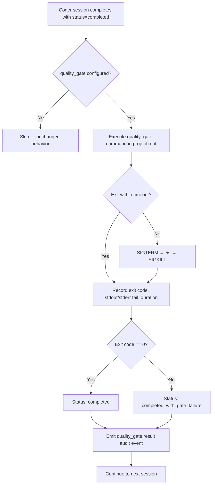
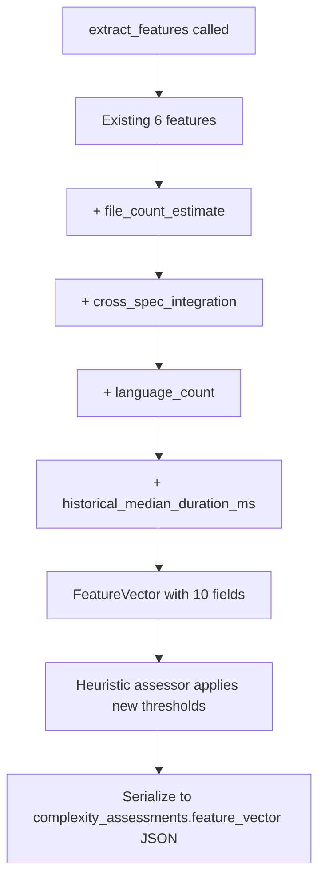

# Design Document: Post-Session Quality Gate & Complexity Enrichment

## Overview

This spec adds two independent capabilities: (1) a configurable post-session
quality gate that runs a shell command after each coder session and records the
result, and (2) four new fields in the complexity feature vector to improve
tier prediction. Both integrate into existing infrastructure — the quality gate
hooks into `session_lifecycle.py` and the feature vector extends
`routing/core.py` and `routing/features.py`.

## Architecture





### Module Responsibilities

1. **`core/config.py`** — Adds `quality_gate` and `quality_gate_timeout` to
   `OrchestratorConfig`.
2. **`engine/session_lifecycle.py`** — Runs the quality gate command after
   successful coder sessions, records result.
3. **`knowledge/audit.py`** — Adds `QUALITY_GATE_RESULT` audit event type.
4. **`routing/core.py`** — Extends `FeatureVector` with 4 new fields.
5. **`routing/features.py`** — Extends `extract_features()` with 4 new
   extraction functions.
6. **`routing/assessor.py`** — Updates heuristic thresholds.

## Components and Interfaces

### Modified: `OrchestratorConfig`

```python
class OrchestratorConfig(BaseModel):
    # ... existing fields ...
    quality_gate: str = Field(
        default="",
        description="Shell command to run after each coder session",
    )
    quality_gate_timeout: int = Field(
        default=300,
        description="Quality gate timeout in seconds",
    )
```

### New: `SessionLifecycle._run_quality_gate()`

```python
def _run_quality_gate(
    self,
    workspace: WorkspaceInfo,
    node_id: str,
) -> QualityGateResult | None:
    """Execute the quality gate command and return the result.

    Returns None if quality_gate is not configured.
    On timeout: SIGTERM, wait 5s, SIGKILL, record as failure.
    """

@dataclass(frozen=True)
class QualityGateResult:
    exit_code: int       # -1 for timeout, -2 for command not found
    stdout_tail: str     # last 50 lines
    stderr_tail: str     # last 50 lines
    duration_ms: int
    passed: bool
```

### Modified: `FeatureVector`

```python
@dataclass(frozen=True)
class FeatureVector:
    subtask_count: int
    spec_word_count: int
    has_property_tests: bool
    edge_case_count: int
    dependency_count: int
    archetype: str
    # New fields
    file_count_estimate: int = 0
    cross_spec_integration: bool = False
    language_count: int = 1
    historical_median_duration_ms: int | None = None
```

### Modified: `extract_features()`

```python
def extract_features(
    spec_dir: Path,
    task_group: int,
    archetype: str,
    *,
    conn: duckdb.DuckDBPyConnection | None = None,
    spec_name: str = "",
) -> FeatureVector:
    """Extract feature vector with new fields."""
```

New helper functions:

```python
def _count_file_paths(spec_dir: Path, task_group: int) -> int:
    """Count distinct file paths in the task group's section of tasks.md."""

def _detect_cross_spec(spec_dir: Path, task_group: int, own_spec: str) -> bool:
    """Check if task group references other spec names."""

def _count_languages(spec_dir: Path, task_group: int) -> int:
    """Count distinct language extensions in task group."""

def _get_historical_median_duration(
    conn: duckdb.DuckDBPyConnection | None,
    spec_name: str,
) -> int | None:
    """Query median duration_ms of successful outcomes for this spec."""
```

### New: `AuditEventType.QUALITY_GATE_RESULT`

```python
QUALITY_GATE_RESULT = "quality_gate.result"
```

## Data Models

### Quality Gate Audit Event Payload

```json
{
    "exit_code": 0,
    "stdout_tail": "...",
    "stderr_tail": "...",
    "duration_ms": 12345,
    "passed": true,
    "command": "make check"
}
```

### Extended Feature Vector JSON (in complexity_assessments)

```json
{
    "subtask_count": 5,
    "spec_word_count": 1200,
    "has_property_tests": true,
    "edge_case_count": 3,
    "dependency_count": 1,
    "archetype": "coder",
    "file_count_estimate": 4,
    "cross_spec_integration": false,
    "language_count": 2,
    "historical_median_duration_ms": 245000
}
```

## Operational Readiness

- **Observability**: `quality_gate.result` audit events provide pass/fail
  trends. Feature vector serialization in `complexity_assessments` enables
  offline analysis of prediction accuracy.
- **Rollback**: New config fields have defaults (empty string, 300s). Removing
  the code reverts to no quality gate and original 6-field feature vector.
  Existing `complexity_assessments` rows with the new fields are harmless
  (JSON is schemaless).
- **Compatibility**: `FeatureVector` new fields have defaults, so existing
  code that constructs `FeatureVector` with only the original 6 fields
  continues to work.

## Correctness Properties

### Property 1: Quality Gate Only on Configured

*For any* session where `quality_gate` is empty or unset, no subprocess SHALL
be spawned for the quality gate. Behavior SHALL be identical to baseline.

**Validates: Requirements 54-REQ-1.3**

### Property 2: Quality Gate Timeout Enforcement

*For any* quality gate execution that exceeds `quality_gate_timeout`, the
process SHALL receive SIGTERM followed by SIGKILL, and the result SHALL be
recorded as a failure with `exit_code == -1`.

**Validates: Requirements 54-REQ-1.2**

### Property 3: Gate Failure Does Not Block

*For any* quality gate failure, the engine SHALL proceed to the next session.
The run SHALL NOT abort or skip subsequent task groups.

**Validates: Requirements 54-REQ-2.3**

### Property 4: Feature Vector Serialization Completeness

*For any* `FeatureVector` instance, its JSON serialization SHALL include all
10 fields (6 existing + 4 new).

**Validates: Requirements 54-REQ-7.2**

### Property 5: File Count Estimate Accuracy

*For any* task group section in `tasks.md`, `file_count_estimate` SHALL equal
the count of distinct file path patterns matching `[a-zA-Z_/]+\.\w{1,5}`.

**Validates: Requirements 54-REQ-3.1, 54-REQ-3.2**

### Property 6: Cross-Spec Detection

*For any* task group section mentioning spec names matching `\d{2}_[a-z_]+`
that differ from its own spec name, `cross_spec_integration` SHALL be True.

**Validates: Requirements 54-REQ-4.1, 54-REQ-4.2**

### Property 7: Historical Median Correctness

*For any* spec with N prior successful outcomes, `historical_median_duration_ms`
SHALL equal the statistical median of their `duration_ms` values. For N=0,
the field SHALL be None.

**Validates: Requirements 54-REQ-6.1, 54-REQ-6.2, 54-REQ-6.E1**

### Property 8: Heuristic ADVANCED Threshold

*For any* feature vector where `cross_spec_integration=True` OR
`file_count_estimate >= 8`, the heuristic assessor SHALL predict ADVANCED
with confidence 0.7.

**Validates: Requirements 54-REQ-7.1**

## Error Handling

| Error Condition | Behavior | Requirement |
|----------------|----------|-------------|
| quality_gate not configured | Skip entirely | 54-REQ-1.3 |
| Command not found | Record failure with exit_code=-2 | 54-REQ-1.E1 |
| Command timeout | SIGTERM → SIGKILL, exit_code=-1 | 54-REQ-1.2 |
| Excessive stdout/stderr | Capture last 50 lines | 54-REQ-1.E2 |
| Sink dispatcher None | Log result, skip audit event | 54-REQ-2.E1 |
| No prior outcomes for spec | historical_median = None | 54-REQ-6.2 |

## Technology Stack

- **Python 3.12+** — subprocess management for quality gate
- **DuckDB** — execution_outcomes query for historical median
- **Pydantic** — config model extension
- **pytest + Hypothesis** — testing

## Definition of Done

A task group is complete when ALL of the following are true:

1. All subtasks within the group are checked off (`[x]`)
2. All spec tests (`test_spec.md` entries) for the task group pass
3. All property tests for the task group pass
4. All previously passing tests still pass (no regressions)
5. No linter warnings or errors introduced
6. Code is committed on a feature branch and pushed to remote
7. Feature branch is merged back to `develop`
8. `tasks.md` checkboxes are updated to reflect completion

## Testing Strategy

- **Unit tests**: Test quality gate subprocess handling with mocked
  `subprocess.run`, timeout behavior, and result recording. Test feature
  extraction functions with synthetic `tasks.md` content.
- **Property tests**: Use Hypothesis to generate random task descriptions,
  file paths, spec names, and execution outcome histories to verify feature
  vector correctness, serialization completeness, and heuristic thresholds.
- **Integration tests**: Use real subprocess calls to verify quality gate
  execution. Use real DuckDB for historical median queries.
