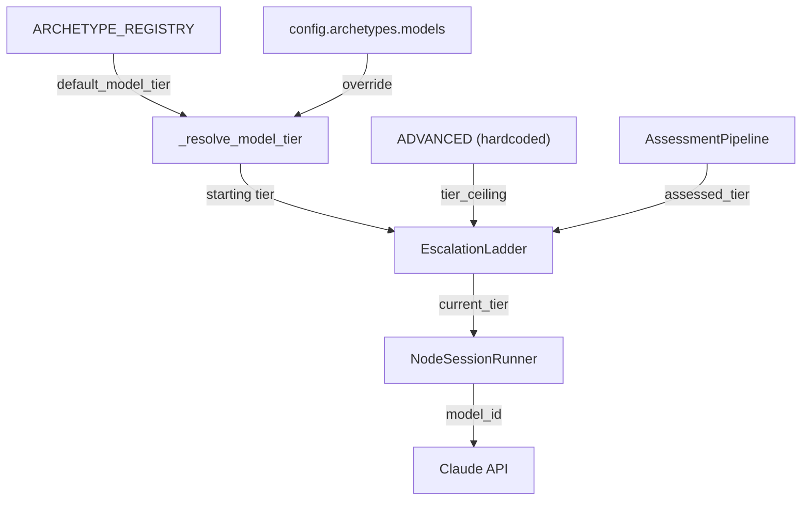

# Design Document: Archetype Model Tier Defaults

## Overview

This spec changes three things: (1) the `default_model_tier` field in the
`ARCHETYPE_REGISTRY` for Coder, Skeptic, Oracle, and Verifier, (2) the
`tier_ceiling` derivation in `Orchestrator._assess_node()` to always use
`ADVANCED`, and (3) documentation of the new defaults. The config override
mechanism (`archetypes.models`) is unchanged.

## Architecture

The change touches the archetype registry (data), the orchestrator's assessment
path (one line of ceiling logic), and documentation. No new modules, no new
config fields, no migration needed.



### Module Responsibilities

1. **`session/archetypes.py`** — Archetype registry with updated `default_model_tier` values.
2. **`engine/engine.py`** — Orchestrator assessment path; ceiling changed to always `ADVANCED`.
3. **`engine/session_lifecycle.py`** — `_resolve_model_tier()` unchanged (already correct priority chain).
4. **`routing/escalation.py`** — `EscalationLadder` unchanged (already supports arbitrary start/ceiling pairs).
5. **`docs/archetypes.md`** — Documentation of new defaults and escalation behavior.

## Components and Interfaces

### Registry Change (`session/archetypes.py`)

```python
ARCHETYPE_REGISTRY = {
    "coder": ArchetypeEntry(name="coder", default_model_tier="STANDARD", ...),   # was ADVANCED
    "skeptic": ArchetypeEntry(name="skeptic", default_model_tier="ADVANCED", ...), # was STANDARD
    "oracle": ArchetypeEntry(name="oracle", default_model_tier="ADVANCED", ...),   # was STANDARD
    "verifier": ArchetypeEntry(name="verifier", default_model_tier="ADVANCED", ...), # was STANDARD
    # auditor, librarian, cartographer, coordinator: unchanged at STANDARD
}
```

### Ceiling Change (`engine/engine.py:_assess_node`)

Before:
```python
tier_ceiling = ModelTier(entry.default_model_tier)
```

After:
```python
tier_ceiling = ModelTier.ADVANCED
```

### Model Tier Resolution (`engine/session_lifecycle.py`)

No change. Priority chain remains:
1. `assessed_tier` (from adaptive routing / escalation ladder)
2. `config.archetypes.models[archetype]` (config override)
3. `entry.default_model_tier` (registry default)

## Data Models

No new data models. No config schema changes. The `archetypes.models`
dictionary continues to accept `dict[str, str]` mapping archetype names to
tier names.

## Operational Readiness

- **Rollout**: The registry change takes effect immediately for all new runs.
  Existing cached plans are unaffected (model tier is resolved at session
  dispatch time, not plan build time).
- **Rollback**: Revert the registry defaults. Or override via config:
  `models = {"coder": "ADVANCED", "skeptic": "STANDARD", ...}`.
- **Cost impact**: Review archetypes (Skeptic, Oracle, Verifier) will use Opus
  instead of Sonnet, increasing per-review cost. Coder sessions will use Sonnet
  instead of Opus, decreasing per-session cost. Net effect depends on the ratio
  of coder to review sessions (typically 3:1 or higher, so net cost decreases).

## Correctness Properties

### Property 1: Registry Defaults Match Spec

*For any* archetype name in `{skeptic, oracle, verifier}`,
`ARCHETYPE_REGISTRY[name].default_model_tier` SHALL equal `"ADVANCED"`.
*For any* archetype name in `{coder, auditor, librarian, cartographer, coordinator}`,
`ARCHETYPE_REGISTRY[name].default_model_tier` SHALL equal `"STANDARD"`.

**Validates: Requirements 57-REQ-1.1, 57-REQ-1.2, 57-REQ-1.3, 57-REQ-1.4, 57-REQ-1.5**

### Property 2: Tier Ceiling Is Always ADVANCED

*For any* node assessment performed by the orchestrator, the escalation
ladder's `tier_ceiling` SHALL equal `ModelTier.ADVANCED`.

**Validates: Requirements 57-REQ-2.1, 57-REQ-2.E1**

### Property 3: STANDARD Agents Can Escalate to ADVANCED

*For any* archetype with `default_model_tier = "STANDARD"` and
`retries_before_escalation = N`, after `N + 1` consecutive failures,
the escalation ladder's `current_tier` SHALL equal `ModelTier.ADVANCED`.

**Validates: Requirements 57-REQ-2.2**

### Property 4: ADVANCED Agents Block After Exhaustion

*For any* archetype with `default_model_tier = "ADVANCED"` and
`retries_before_escalation = N`, after `N + 1` consecutive failures,
the escalation ladder SHALL be exhausted (`is_exhausted == True`).

**Validates: Requirements 57-REQ-2.3**

### Property 5: Config Override Takes Precedence

*For any* archetype name where `config.archetypes.models[name]` is set,
`_resolve_model_tier()` SHALL return the config value, not the registry
default.

**Validates: Requirements 57-REQ-3.1, 57-REQ-3.2**

## Error Handling

| Error Condition | Behavior | Requirement |
|----------------|----------|-------------|
| Unknown archetype name | Fall back to Coder entry | 57-REQ-1.E1 |
| Assessment pipeline failure | Use archetype default as starting tier, ADVANCED ceiling | 57-REQ-2.E1 |
| Invalid tier name in config | Raise ConfigError | 57-REQ-3.E1 |

## Technology Stack

No new dependencies. Changes are confined to Python source and Markdown docs.

## Definition of Done

A task group is complete when ALL of the following are true:

1. All subtasks within the group are checked off (`[x]`)
2. All spec tests (`test_spec.md` entries) for the task group pass
3. All property tests for the task group pass
4. All previously passing tests still pass (no regressions)
5. No linter warnings or errors introduced
6. Code is committed on a feature branch and pushed to remote
7. Feature branch is merged back to `develop`
8. `tasks.md` checkboxes are updated to reflect completion

## Testing Strategy

- **Unit tests**: Verify registry values directly; verify `_resolve_model_tier`
  priority chain with mock configs.
- **Property tests**: Use Hypothesis to generate arbitrary archetype names and
  config overrides, verifying the priority chain invariant and escalation
  ceiling invariant.
- **Integration tests**: Verify end-to-end that a Coder node starts at
  STANDARD and can escalate to ADVANCED after failures; verify Skeptic starts
  at ADVANCED and blocks after exhaustion.
