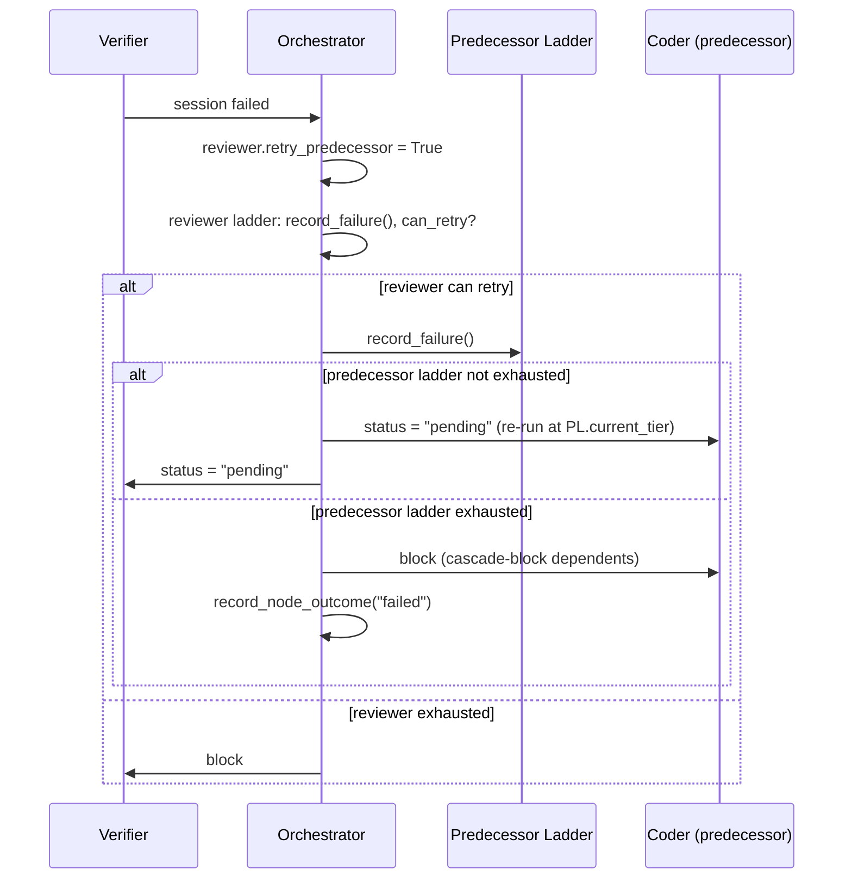

# Design Document: Predecessor Escalation

## Overview

A single change to the `retry_predecessor` branch in
`Orchestrator._process_session_result()`. Before resetting the predecessor to
`pending`, record a failure on the predecessor's escalation ladder. If the
ladder is exhausted, block the predecessor instead of resetting it.

No new modules, no new config fields, no new data models.

## Architecture

The change is confined to one method in `engine/engine.py`. The existing
`EscalationLadder` class handles all escalation and counter-reset logic.



### Module Responsibilities

1. **`engine/engine.py`** — `_process_session_result()`: adds predecessor
   ladder failure recording and exhaustion handling to the `retry_predecessor`
   branch.

## Components and Interfaces

### Change in `_process_session_result` (`engine/engine.py`)

The `retry_predecessor` block (lines ~1263-1279) changes from:

```python
if archetype_entry.retry_predecessor and can_retry:
    predecessors = self._get_predecessors(node_id)
    if predecessors:
        pred_id = predecessors[0]
        self._graph_sync.node_states[pred_id] = "pending"
        error_tracker[pred_id] = record.error_message
        self._graph_sync.node_states[node_id] = "pending"
        self._state_manager.save(state)
        return
```

To:

```python
if archetype_entry.retry_predecessor and can_retry:
    predecessors = self._get_predecessors(node_id)
    if predecessors:
        pred_id = predecessors[0]

        # 58-REQ-1.1: Record failure on predecessor's ladder
        pred_ladder = self._routing.ladders.get(pred_id)
        if pred_ladder is None:
            # 58-REQ-1.E1: Create ladder if missing
            pred_archetype = self._get_node_archetype(pred_id)
            pred_entry = get_archetype(pred_archetype)
            pred_starting = ModelTier(pred_entry.default_model_tier)
            pred_ladder = EscalationLadder(
                starting_tier=pred_starting,
                tier_ceiling=ModelTier.ADVANCED,
                retries_before_escalation=self._routing.retries_before_escalation,
            )
            self._routing.ladders[pred_id] = pred_ladder

        pred_ladder.record_failure()

        # 58-REQ-2.1: Block predecessor if ladder exhausted
        if pred_ladder.is_exhausted:
            self._record_node_outcome(pred_id, state, "failed")
            self._block_task(pred_id, state,
                f"Predecessor {pred_id} exhausted all tiers after "
                f"reviewer {node_id} failures")
            self._check_block_budget(state)
            self._state_manager.save(state)
            return

        # 58-REQ-1.2: Reset predecessor to pending at (possibly escalated) tier
        self._graph_sync.node_states[pred_id] = "pending"
        error_tracker[pred_id] = record.error_message
        self._graph_sync.node_states[node_id] = "pending"
        self._state_manager.save(state)
        return
```

### Key invariants preserved

- The reviewer's own ladder still tracks its own failures (line 1254).
- The reviewer's `can_retry` decision is still based on the reviewer's ladder.
- The predecessor's next dispatch will pick up `pred_ladder.current_tier` via
  the existing `_assess_node` → `ladder.current_tier` flow.
- Multiple reviewers calling this code path accumulate on the same
  `self._routing.ladders[pred_id]` entry.

## Data Models

No new data models. No config changes. The existing `EscalationLadder` and
`_routing.ladders` dict are reused.

## Operational Readiness

- **Rollout**: Immediate. No migration needed.
- **Rollback**: Revert the single code change.
- **Observability**: Existing audit events (`TASK_STATUS_CHANGE`,
  `MODEL_ESCALATION`) will fire when the predecessor escalates or blocks.
- **Cost impact**: Predecessors may now escalate to ADVANCED, increasing cost
  for tasks that previously would have been stuck at STANDARD until the
  reviewer blocked. This is intentional — the alternative was wasted retries.

## Correctness Properties

### Property 1: Reviewer-Triggered Resets Accumulate on Predecessor Ladder

*For any* predecessor node and any number of reviewer-triggered resets, the
predecessor's `ladder.attempt_count` SHALL equal 1 plus the total number of
`record_failure()` calls (from both direct failures and reviewer-triggered
resets).

**Validates: Requirements 58-REQ-1.1, 58-REQ-3.1, 58-REQ-3.2**

### Property 2: Predecessor Escalates After Budget Exhaustion at Current Tier

*For any* predecessor starting at tier T with `retries_before_escalation = N`,
after `N + 1` reviewer-triggered resets, the predecessor's
`ladder.current_tier` SHALL be the next tier above T (if available).

**Validates: Requirements 58-REQ-1.3**

### Property 3: Predecessor Blocks When All Tiers Exhausted

*For any* predecessor whose escalation ladder is exhausted after a
reviewer-triggered reset, the predecessor's status SHALL be `"blocked"` and
the predecessor SHALL NOT be reset to `"pending"`.

**Validates: Requirements 58-REQ-2.1, 58-REQ-2.3**

### Property 4: Missing Ladder Is Created Defensively

*For any* predecessor that lacks an escalation ladder when
`retry_predecessor` fires, the system SHALL create a ladder with the
predecessor's archetype default tier as starting tier and `ADVANCED` as
ceiling.

**Validates: Requirements 58-REQ-1.E1**

## Error Handling

| Error Condition | Behavior | Requirement |
|----------------|----------|-------------|
| Predecessor has no escalation ladder | Create one with archetype defaults | 58-REQ-1.E1 |
| Predecessor at ADVANCED, retries exhausted | Block predecessor | 58-REQ-2.E1 |

## Technology Stack

No new dependencies. Change is confined to `engine/engine.py`.

## Definition of Done

A task group is complete when ALL of the following are true:

1. All subtasks within the group are checked off (`[x]`)
2. All spec tests (`test_spec.md` entries) for the task group pass
3. All property tests for the task group pass
4. All previously passing tests still pass (no regressions)
5. No linter warnings or errors introduced
6. Code is committed on a feature branch and pushed to remote
7. Feature branch is merged back to `develop`
8. `tasks.md` checkboxes are updated to reflect completion

## Testing Strategy

- **Unit tests**: Mock the orchestrator's routing state and call
  `_process_session_result` with a failed reviewer record. Verify the
  predecessor's ladder records failures, escalates, and eventually exhausts.
- **Property tests**: Use Hypothesis to generate sequences of reviewer
  failures with varying `retries_before_escalation` values. Verify the
  predecessor's escalation behavior matches the ladder's guarantees.
- **Integration tests**: Simulate the full Coder → Verifier → retry cycle
  and verify escalation and blocking end states.
