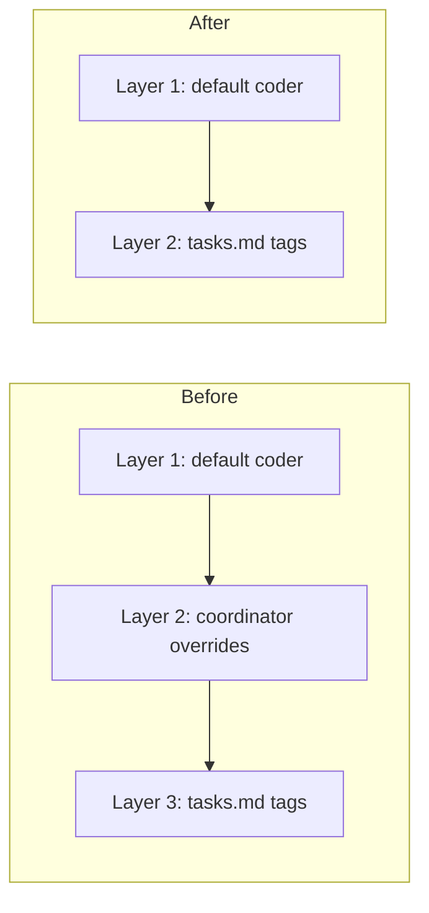

# Design Document: Remove Coordinator Archetype

## Overview

Pure removal spec. The coordinator archetype, its template, graph builder
integration, prompt mapping, parser reference, and model config field are all
deleted. The three-layer archetype assignment in the graph builder collapses to
two layers. No new code is introduced.

## Architecture



### Module Responsibilities (Changes Only)

1. **`agent_fox/session/archetypes.py`** — Remove `"coordinator"` entry from
   `ARCHETYPE_REGISTRY`.
2. **`agent_fox/_templates/prompts/coordinator.md`** — Delete file.
3. **`agent_fox/graph/builder.py`** — Remove `_apply_coordinator_overrides()`,
   remove `coordinator_overrides` parameter from `build_graph()`, update Layer
   comment from "Layer 3" to "Layer 2" for tasks.md overrides.
4. **`agent_fox/session/prompt.py`** — Remove `"coordinator"` from role mapping
   dict.
5. **`agent_fox/spec/parser.py`** — Remove `"coordinator"` from known
   archetypes set.
6. **`agent_fox/core/config.py`** — Remove `coordinator` field from
   `ModelConfig`.
7. **`agent_fox/core/config_gen.py`** — Remove coordinator description tuple.

## Components and Interfaces

### Removed Interfaces

```python
# REMOVED from graph/builder.py
def _apply_coordinator_overrides(
    nodes: dict[str, Node],
    coordinator_overrides: list[Any] | None,
    archetypes_config: ArchetypesConfig,
) -> None: ...

# REMOVED parameter from build_graph()
def build_graph(
    ...,
    coordinator_overrides: list[Any] | None = None,  # REMOVED
) -> TaskGraph: ...
```

### Modified Interfaces

```python
# agent_fox/graph/builder.py — updated signature
def build_graph(
    specs: list[SpecInfo],
    task_groups: dict[str, list[TaskGroupDef]],
    cross_deps: list[CrossSpecDep],
    *,
    archetypes_config: ArchetypesConfig | None = None,
) -> TaskGraph: ...

# agent_fox/core/config.py — ModelConfig without coordinator
class ModelConfig(BaseModel):
    coding: str = "ADVANCED"
    memory_extraction: str = "SIMPLE"
    fallback_model: str = "claude-sonnet-4-6"
```

## Data Models

No data model changes. The `ArchetypeEntry` dataclass is unchanged; only the
registry dict loses one entry.

## Operational Readiness

### Migration/Compatibility

- Existing `config.toml` files with `coordinator = "STANDARD"` or
  `coordinator = "ADVANCED"` under `[models]` will be silently ignored by
  Pydantic's `extra="ignore"` setting on `ModelConfig`. No migration needed.
- Archived spec documents in `.specs/archive/` are not modified. They reference
  the coordinator historically and are retained as decision records.

### Rollout

Single commit. No feature flags or phased rollout needed.

## Correctness Properties

### Property 1: Registry Completeness

*For any* archetype name that exists in `ARCHETYPE_REGISTRY`, the archetype
SHALL have `task_assignable=True` OR be a non-coordinator archetype. The
string `"coordinator"` SHALL NOT appear as a key.

**Validates: 62-REQ-1.1**

### Property 2: build_graph Signature

*For any* valid call to `build_graph()`, the function SHALL NOT accept a
keyword argument named `coordinator_overrides`.

**Validates: 62-REQ-3.1, 62-REQ-3.2**

### Property 3: Prompt Role Mapping

*For any* role string in the prompt role mapping, the string SHALL NOT be
`"coordinator"`.

**Validates: 62-REQ-4.1**

### Property 4: Known Archetypes in Parser

*For any* archetype name in the spec parser's known archetypes set, the name
SHALL NOT be `"coordinator"`.

**Validates: 62-REQ-5.1**

### Property 5: ModelConfig Fields

*For any* field in `ModelConfig`, the field name SHALL NOT be `"coordinator"`.

**Validates: 62-REQ-6.1**

### Property 6: Config Tolerance

*For any* TOML config containing a `coordinator` key under `[models]`, loading
the config SHALL succeed without error.

**Validates: 62-REQ-6.E1**

## Error Handling

| Error Condition | Behavior | Requirement |
|----------------|----------|-------------|
| `get_archetype("coordinator")` called | Returns coder fallback with warning | 62-REQ-1.2 |
| Config file has `coordinator` under `[models]` | Silently ignored | 62-REQ-6.E1 |

## Technology Stack

- Python 3.12+
- Pydantic v2 (config models)
- pytest (test updates)
- ruff (linting)

## Definition of Done

A task group is complete when ALL of the following are true:

1. All subtasks within the group are checked off (`[x]`)
2. All spec tests (`test_spec.md` entries) for the task group pass
3. All property tests for the task group pass
4. All previously passing tests still pass (no regressions)
5. No linter warnings or errors introduced
6. Code is committed on a feature branch and pushed to remote
7. Feature branch is merged back to `develop`
8. `tasks.md` checkboxes are updated to reflect completion

## Testing Strategy

- **Unit tests** verify absence of coordinator from registry, prompt mapping,
  parser, config, and builder signature.
- **Property tests** verify invariants (no coordinator in any archetype
  collection, config tolerance).
- **Integration**: `make check` passes with no regressions.
