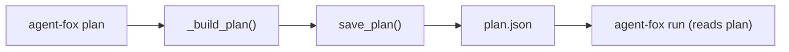

# Design Document: Plan Always Rebuild

## Overview

Remove the plan cache layer from the `plan` CLI command so it always rebuilds
the task graph from `.specs/`. Remove the `--reanalyze` flag and all supporting
dead code. Plan persistence to `plan.json` is retained (the engine reads it).

## Architecture



The cache-hit path (load existing plan.json, validate hashes, skip rebuild) is
removed entirely. The flow is now linear: build, save, display.

### Module Responsibilities

1. `agent_fox/cli/plan.py` — CLI command; always calls `_build_plan()`, saves,
   displays.
2. `agent_fox/graph/types.py` — `PlanMetadata` dataclass (fields `specs_hash`
   and `config_hash` removed).
3. `agent_fox/graph/persistence.py` — Plan serialization/deserialization
   (updated to handle old plans that contain the removed fields).
4. `docs/cli-reference.md` — CLI documentation (updated).

## Components and Interfaces

### CLI Changes

```python
# Before
@click.option("--reanalyze", is_flag=True, help="Discard cached plan")

# After: option removed entirely
```

### PlanMetadata Changes

```python
# Before
@dataclass
class PlanMetadata:
    created_at: str
    fast_mode: bool = False
    filtered_spec: str | None = None
    version: str = ""
    specs_hash: str = ""     # REMOVED
    config_hash: str = ""    # REMOVED

# After
@dataclass
class PlanMetadata:
    created_at: str
    fast_mode: bool = False
    filtered_spec: str | None = None
    version: str = ""
```

### Removed Functions

The following are removed from `agent_fox/cli/plan.py`:

- `_compute_specs_hash(specs_dir: Path) -> str`
- `_compute_config_hash(config: AgentFoxConfig) -> str`
- `_cache_matches_request(graph, *, fast, filter_spec, specs_hash, config_hash) -> bool`

### Persistence Backward Compatibility

`_metadata_from_dict` in `persistence.py` already uses `.get()` with defaults,
so old `plan.json` files containing `specs_hash` and `config_hash` keys will
load without error — the extra keys are simply not mapped to any field.

## Correctness Properties

### Property 1: Always Fresh

*For any* invocation of `agent-fox plan`, the system SHALL build the task
graph from the current `.specs/` directory content, never from a cached
`plan.json`.

**Validates: Requirements 63-REQ-1.1**

### Property 2: Plan Persisted

*For any* successful `plan` invocation, the resulting task graph SHALL be
written to `plan.json`.

**Validates: Requirements 63-REQ-1.2**

### Property 3: Status Derivation

*For any* task group in `.specs/` with all subtask checkboxes marked `[x]`,
the corresponding node in the built plan SHALL have status COMPLETED.
*For any* task group with at least one unchecked subtask, the node SHALL have
status PENDING.

**Validates: Requirements 63-REQ-1.3**

### Property 4: No Dead Code

*For any* version of the codebase after this change, the functions
`_compute_specs_hash`, `_compute_config_hash`, and `_cache_matches_request`
SHALL NOT exist in `agent_fox/cli/plan.py`, and the fields `specs_hash` and
`config_hash` SHALL NOT exist on `PlanMetadata`.

**Validates: Requirements 63-REQ-3.1, 63-REQ-3.2**

## Error Handling

| Error Condition | Behavior | Requirement |
|----------------|----------|-------------|
| Old `plan.json` with `specs_hash`/`config_hash` fields | Ignored on load | 63-REQ-3.E1 |
| `--reanalyze` passed by user | Click rejects as unrecognized option | 63-REQ-2.2 |

## Technology Stack

- Python 3.12+
- Click (CLI framework)
- Existing plan persistence layer (`save_plan` / `load_plan`)

## Definition of Done

A task group is complete when ALL of the following are true:

1. All subtasks within the group are checked off (`[x]`)
2. All spec tests (`test_spec.md` entries) for the task group pass
3. All property tests for the task group pass
4. All previously passing tests still pass (no regressions)
5. No linter warnings or errors introduced
6. Code is committed on a feature branch and pushed to remote
7. Feature branch is merged back to `develop`
8. `tasks.md` checkboxes are updated to reflect completion

## Testing Strategy

- **Unit tests** verify that the `--reanalyze` option no longer exists, that
  `PlanMetadata` lacks the removed fields, and that the removed functions do
  not exist.
- **Integration tests** verify that `plan` always rebuilds (by modifying specs
  between invocations and confirming the plan reflects changes without needing
  a flag).
- **Property tests** are not needed — the changes are structural removals
  with no algorithmic behavior to fuzz.
