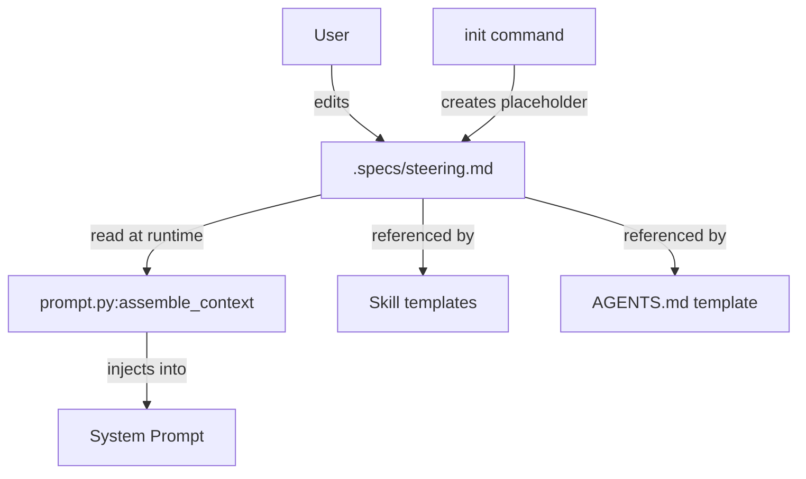

# Design Document: Steering Document

## Overview

Adds a static steering document (`.specs/steering.md`) that is created by
`init`, injected into runtime prompts by `prompt.py`, and referenced by skill
templates and AGENTS.md. The implementation touches four areas: init command,
context assembly, skill templates, and the AGENTS.md template.

## Architecture



### Module Responsibilities

1. **`agent_fox/cli/init.py`** — Creates `.specs/steering.md` placeholder
   during project initialization (idempotent).
2. **`agent_fox/session/prompt.py`** — Reads and injects steering content
   into assembled context, positioned after spec files and before memory facts.
3. **Skill templates** (`agent_fox/_templates/skills/*`) — Static instruction
   to read `.specs/steering.md`.
4. **AGENTS.md template** (`agent_fox/_templates/agents_md.md`) — Static
   reference to `.specs/steering.md`.

## Components and Interfaces

### Steering module (`agent_fox/session/prompt.py`)

```python
# Sentinel that marks placeholder-only content
STEERING_PLACEHOLDER_SENTINEL: str = "<!-- steering:placeholder -->"

# Path constant
STEERING_PATH: str = ".specs/steering.md"

def load_steering(project_root: Path) -> str | None:
    """Load steering content from .specs/steering.md.

    Returns None if:
    - File does not exist
    - File cannot be read
    - File contains only placeholder content

    Returns the file content (stripped) otherwise.
    """
```

### Init integration (`agent_fox/cli/init.py`)

```python
_STEERING_PLACEHOLDER: str  # Multi-line placeholder with sentinel

def _ensure_steering_md(project_root: Path) -> str:
    """Create .specs/steering.md if absent. Returns 'created' or 'skipped'."""
```

### Context assembly changes

`assemble_context()` gains an optional `project_root` parameter. When
provided, it calls `load_steering(project_root)` and inserts the result
as a `## Steering Directives` section between spec files and memory facts.

## Data Models

### Placeholder content

```markdown
<!-- steering:placeholder -->
<!--
  Steering Directives
  ===================
  This file is read by every agent and skill working on this repository.
  Add your directives below to influence agent behavior across all sessions.

  Examples:
    - "Always prefer composition over inheritance."
    - "Never modify files under legacy/ without approval."
    - "Use pytest parametrize for all new test cases."

  Remove this comment block and the placeholder marker above when you add
  your first directive. Or simply add content below — the system ignores
  this file when it contains only the placeholder marker and comments.
-->
```

### Sentinel detection logic

A file is considered placeholder-only when:
1. It contains the sentinel string `<!-- steering:placeholder -->`
2. After removing all HTML comments and the sentinel, the remaining content
   is empty or whitespace-only.

## Operational Readiness

- **Observability:** `load_steering()` logs at DEBUG level whether steering
  was loaded, skipped (missing/placeholder), or failed (permission error).
- **Rollout:** No migration needed. Existing projects get the file on next
  `init` run. Prompt assembly gracefully handles missing files.
- **Compatibility:** No breaking changes. `assemble_context()` adds an
  optional parameter with a default of `None` (no steering).

## Correctness Properties

### Property 1: Idempotent Initialization

*For any* project root where `.specs/steering.md` already exists,
`_ensure_steering_md()` SHALL return `"skipped"` and leave the file unchanged.

**Validates: Requirements 1.1, 1.2**

### Property 2: Placeholder Detection Accuracy

*For any* string containing the sentinel marker and only HTML comments /
whitespace, `load_steering()` SHALL return `None`. *For any* string containing
the sentinel marker plus non-comment, non-whitespace content,
`load_steering()` SHALL return the content.

**Validates: Requirements 5.1, 5.2, 2.4**

### Property 3: Context Ordering

*For any* assembled context that includes steering content, the steering
section SHALL appear after all spec file sections and before the memory
facts section.

**Validates: Requirement 2.2**

### Property 4: Graceful Absence

*For any* project root where `.specs/steering.md` does not exist,
`assemble_context()` SHALL produce output identical to its current behavior
(no steering section, no error).

**Validates: Requirements 2.3, 2.E1**

### Property 5: Non-Empty Gating

*For any* project root where `.specs/steering.md` contains only the
placeholder template, `assemble_context()` SHALL produce output with
no steering section.

**Validates: Requirement 2.4**

## Error Handling

| Error Condition | Behavior | Requirement |
|----------------|----------|-------------|
| `.specs/` directory creation fails | Log warning, skip steering file creation | 64-REQ-1.E1 |
| steering.md unreadable at runtime | Log warning, skip steering inclusion | 64-REQ-2.E1 |
| steering.md missing at runtime | Skip silently | 64-REQ-2.3 |
| steering.md contains only placeholder | Skip silently | 64-REQ-2.4 |

## Technology Stack

- Python 3.12+
- pathlib for file operations
- re module for HTML comment stripping in sentinel detection
- Existing prompt.py infrastructure

## Definition of Done

A task group is complete when ALL of the following are true:

1. All subtasks within the group are checked off (`[x]`)
2. All spec tests (`test_spec.md` entries) for the task group pass
3. All property tests for the task group pass
4. All previously passing tests still pass (no regressions)
5. No linter warnings or errors introduced
6. Code is committed on a feature branch and pushed to remote
7. Feature branch is merged back to `develop`
8. `tasks.md` checkboxes are updated to reflect completion

## Testing Strategy

- **Unit tests** verify `load_steering()` and `_ensure_steering_md()` in
  isolation with tmp_path fixtures.
- **Property tests** verify placeholder detection across generated inputs
  (arbitrary whitespace, nested comments, mixed content).
- **Integration test** verifies that `assemble_context()` includes/excludes
  steering content based on file state.
