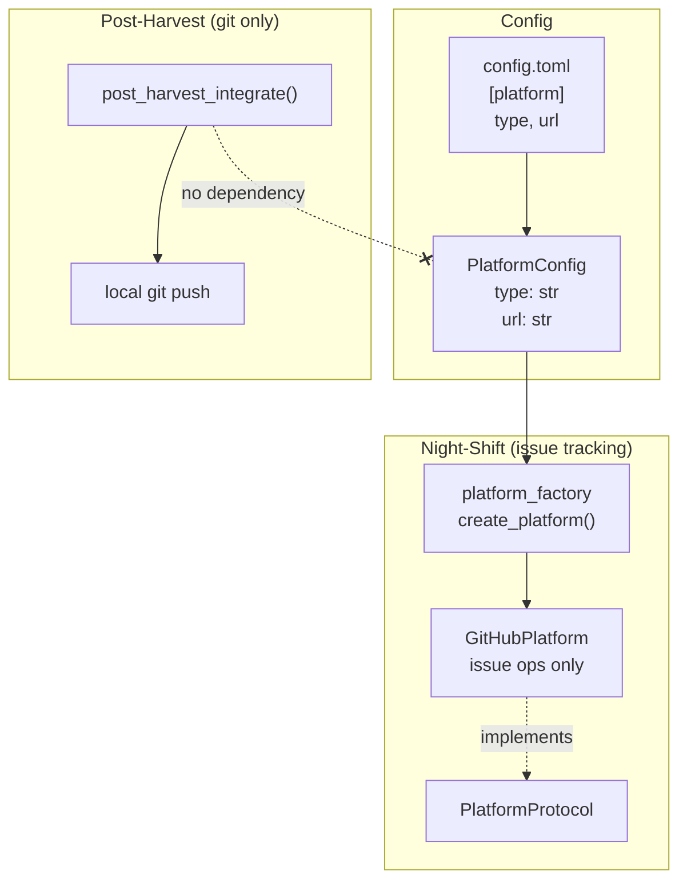

# Design Document: Platform Config Overhaul

## Overview

This spec narrows the `[platform]` config to issue-tracking only, removes
`auto_merge` and PR-creation code, simplifies post-harvest to pure local-git
pushes, and adds a configurable `url` field for GitHub Enterprise support.
The changes touch four areas: config model, post-harvest integration,
platform layer (protocol + GitHub implementation), and config generation.

## Architecture



### Module Responsibilities

1. **`agent_fox/core/config.py`** — `PlatformConfig` model: `type`, `url`
   fields; silently ignores unknown keys.
2. **`agent_fox/workspace/harvest.py`** — `post_harvest_integrate()`: pushes
   feature branch + develop via local git. No platform config parameter.
3. **`agent_fox/platform/protocol.py`** — `PlatformProtocol`: issue-only
   operations (no `create_pr`).
4. **`agent_fox/platform/github.py`** — `GitHubPlatform`: GitHub REST API
   for issues, with configurable API base URL.
5. **`agent_fox/nightshift/platform_factory.py`** — `create_platform()`:
   reads config, wires `url` into `GitHubPlatform`.
6. **`agent_fox/core/config_gen.py`** — Template generation: `type` + `url`
   fields, no `auto_merge`.

## Components and Interfaces

### PlatformConfig (modified)

```python
class PlatformConfig(BaseModel):
    model_config = ConfigDict(extra="ignore")

    type: str = Field(default="none")
    url: str = Field(default="")
```

The `url` default is `""`. Consumers resolve the effective URL:
- If `url` is empty and `type == "github"`, use `"github.com"`.
- If `url` is non-empty, use the provided value.

### post_harvest_integrate (simplified)

```python
async def post_harvest_integrate(
    repo_root: Path,
    workspace: WorkspaceInfo,
) -> None:
    """Push feature branch + develop to origin via local git."""
```

No `platform_config` parameter. Always pushes both branches best-effort.

### GitHubPlatform (modified)

```python
class GitHubPlatform:
    def __init__(self, owner: str, repo: str, token: str, url: str = "github.com") -> None:
        ...

    # Removed: create_pr(), _get_default_branch()
    # Retained: all issue operations (create_issue, search_issues,
    #           update_issue, add_issue_comment, list_issues_by_label,
    #           assign_label, close_issue, close)
```

API base URL resolution:
- `url == "github.com"` → `https://api.github.com`
- Otherwise → `https://{url}/api/v3`

### PlatformProtocol (modified)

```python
@runtime_checkable
class PlatformProtocol(Protocol):
    async def create_issue(self, title: str, body: str, labels: list[str] | None = None) -> IssueResult: ...
    async def list_issues_by_label(self, label: str, state: str = "open") -> list[IssueResult]: ...
    async def add_issue_comment(self, issue_number: int, body: str) -> None: ...
    async def assign_label(self, issue_number: int, label: str) -> None: ...
    async def close(self) -> None: ...
    # Removed: create_pr()
```

### create_platform (modified)

```python
def create_platform(config: object, project_root: Path) -> object:
    ...
    url = getattr(platform_cfg, "url", "") or "github.com"
    return GitHubPlatform(owner=owner, repo=repo, token=token, url=url)
```

## Data Models

### Config file schema (after)

```toml
[platform]
## Platform type (none or github) (default: "none")
type = "github"
## Issue tracker URL — overrides default for type (default: "" → "github.com" for github)
# url = "github.example.com"
```

### API base URL resolution table

| `url` value | Resolved API base |
|---|---|
| `""` (default) + `type="github"` | `https://api.github.com` |
| `"github.com"` | `https://api.github.com` |
| `"github.example.com"` | `https://github.example.com/api/v3` |

## Operational Readiness

- **Observability**: All git push operations log at INFO (success) or WARNING
  (failure) level. No new log categories introduced.
- **Rollback**: If users have `auto_merge = true` in their config, it is
  silently ignored. Post-harvest behavior changes from "push + maybe PR" to
  "always push both branches" — a safe default.
- **Migration**: No config migration needed. The `extra = "ignore"` policy
  handles old `auto_merge` keys. New `url` field defaults to empty string
  and resolves to `github.com` for GitHub type.

## Correctness Properties

### Property 1: Post-harvest always pushes both branches

*For any* invocation of `post_harvest_integrate` with a valid `repo_root` and
`workspace`, the system SHALL attempt to push both the feature branch and
`develop` to origin (subject to the feature branch existing locally).

**Validates: Requirements 65-REQ-3.1, 65-REQ-3.2**

### Property 2: Post-harvest never calls GitHub API

*For any* invocation of `post_harvest_integrate`, the system SHALL NOT
import, instantiate, or call any method on `GitHubPlatform` or make any
HTTP request.

**Validates: Requirements 65-REQ-3.3, 65-REQ-3.4**

### Property 3: API base URL resolution is deterministic

*For any* valid `url` string, `GitHubPlatform` SHALL resolve to
`https://api.github.com` if and only if `url` is `"github.com"` or empty;
otherwise it SHALL resolve to `https://{url}/api/v3`.

**Validates: Requirements 65-REQ-2.4, 65-REQ-2.5, 65-REQ-5.1, 65-REQ-5.2,
65-REQ-5.3, 65-REQ-5.E1**

### Property 4: Unknown config keys are silently ignored

*For any* `PlatformConfig` constructed with arbitrary extra keys (including
`auto_merge`), the model SHALL load without error and SHALL NOT expose
those keys as attributes.

**Validates: Requirements 65-REQ-1.1, 65-REQ-1.2, 65-REQ-1.E1**

### Property 5: Platform factory wires url from config

*For any* config with `type = "github"` and any `url` value, `create_platform`
SHALL pass the resolved URL to the `GitHubPlatform` constructor.

**Validates: Requirements 65-REQ-6.1**

### Property 6: Config template reflects current schema

*For any* generated config template, the `[platform]` section SHALL contain
`type` and `url` fields and SHALL NOT contain `auto_merge`.

**Validates: Requirements 65-REQ-7.1, 65-REQ-7.2, 65-REQ-7.3**

## Error Handling

| Error Condition | Behavior | Requirement |
|---|---|---|
| Old config has `auto_merge` key | Silently ignored | 65-REQ-1.2 |
| Old config has other unknown keys | Silently ignored | 65-REQ-1.E1 |
| Feature branch deleted before push | Skip push, log warning, continue | 65-REQ-3.E1 |
| Push to origin fails | Log warning, continue | 65-REQ-3.5 |
| Remote develop ahead of local | Attempt reconciliation, then push | 65-REQ-3.E2 |
| `GITHUB_PAT` not set (night-shift) | Log error, exit code 1 | 65-REQ-6.E1 |
| Empty `url` with `type="github"` | Default to `github.com` | 65-REQ-5.E1 |

## Technology Stack

- Python 3.12+, managed with `uv`
- Pydantic v2 for config models
- `httpx` for GitHub REST API calls
- `asyncio` subprocess for local git operations
- Hypothesis for property-based tests
- pytest for unit and integration tests
- ruff for linting and formatting

## Definition of Done

A task group is complete when ALL of the following are true:

1. All subtasks within the group are checked off (`[x]`)
2. All spec tests (`test_spec.md` entries) for the task group pass
3. All property tests for the task group pass
4. All previously passing tests still pass (no regressions)
5. No linter warnings or errors introduced
6. Code is committed on a feature branch and pushed to remote
7. Feature branch is merged back to `develop`
8. `tasks.md` checkboxes are updated to reflect completion

## Testing Strategy

- **Unit tests**: Verify `PlatformConfig` field changes, API URL resolution,
  post-harvest push logic (mocked git subprocess), config template output.
- **Property tests**: Hypothesis-driven tests for URL resolution
  determinism, config backward compatibility, post-harvest invariants
  (always pushes both branches, never calls GitHub API), template schema
  correctness.
- **Integration tests**: Not required — all changes are internal refactors
  with mocked external boundaries (git subprocess, HTTP API).
